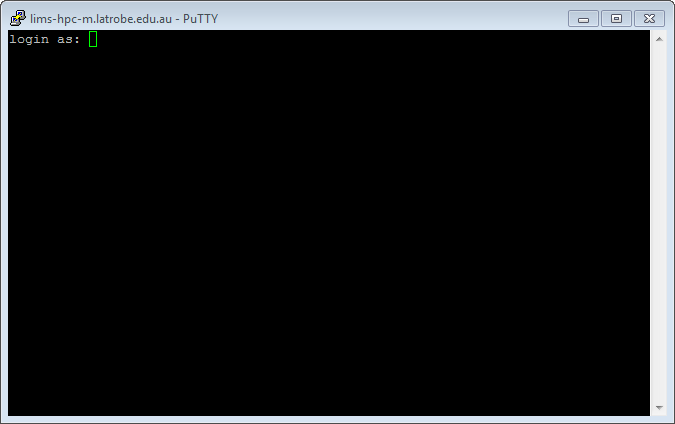

\showable{Mac OS X / Linux}{indent}

Both Mac OS X and Linux come with a version of ssh (called OpenSSH) that can be used from the command line.  To use OpenSSH you must 
first start a terminal program on your computer.  On OS X the standard terminal is called Terminal, and it is installed by default. 
On Linux there are many popular terminal programs including: xterm, gnome-terminal, konsole (if you aren't sure, then xterm is a good 
default).  When you've started the terminal you should see a command prompt.  To log into LIMS-HPC, for example, type this command at 
the prompt and press return (where the word username is replaced with your LIMS-HPC username):

```sh
ssh -p 6022 username@lims-hpc-m.latrobe.edu.au
```

The same procedure works for any other machine where you have an account except most other HPCs will not need the *-p 6022* 
(which is telling ssh to connect on a non-standard port number).

You may be presented with a message along the lines of:

```text
The authenticity of host 'lims-hpc-m.latrobe.edu.au (131.172.36.150)' can't be  established.
...
Are you sure you want to continue connecting (yes/no)?
```

Although you should never ignore a warning, this particular one is nothing to be concerned about; type **yes** and then **press enter**. 
If all goes well you will be asked to enter your password.  Assuming you type the correct username and password the system should 
then display a welcome message, and then present you with a Unix prompt.  If you get this far then you are ready to start entering 
Unix commands and thus begin using the remote computer.

\endshowable

\showable{Windows}{indent}

On Microsoft Windows (Vista, 7, 8) we recommend that you use the PuTTY ssh client.  PuTTY (putty.exe) can be downloaded 
from this web page:

[http://www.chiark.greenend.org.uk/~sgtatham/putty/download.html](http://www.chiark.greenend.org.uk/~sgtatham/putty/download.html)

Documentation for using PuTTY is here:

[http://www.chiark.greenend.org.uk/~sgtatham/putty/docs.html](http://www.chiark.greenend.org.uk/~sgtatham/putty/docs.html)

When you start PuTTY you should see a window which looks something like this:


To connect to LIMS-HPC you should enter its hostname into the box entitled "Host Name (or IP address)" and *6022* in the port, 
then click on the Open button. All of the settings should remain the same as they were when PuTTY started (which should be the 
same as they are in the picture above).

In some circumstances you will be presented with a window entitled PuTTY Security Alert. It will say something along the lines 
of *"The server's host key is not cached in the registry"*. This is nothing to worry about, and you should agree to continue (by 
clicking on Yes). You usually see this message the first time you try to connect to a particular remote computer.

If all goes well, a terminal window will open, showing a prompt with the text *"login as:"*. An example terminal window is shown 
below. You should type your LIMS-HPC username and press enter. After entering your username you will be prompted for your 
password. Assuming you type the correct username and password the system should then display a welcome message, and then 
present you with a Unix prompt. If you get this far then you are ready to start entering Unix commands and thus begin using 
the remote computer.



\endshowable

