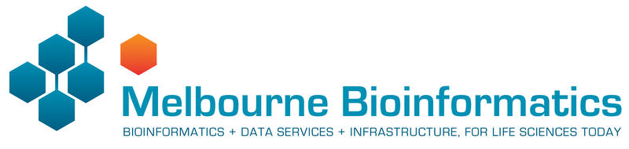

 

# Introduction to Genome Browsers

Anticipated workshop duration when delivered to a group of participants is **3 hours**.  

For queries relating to this workshop, contact Melbourne Bioinformatics (bioinformatics-training@unimelb.edu.au).

## Overview
This tutorial will introduce you to the genome browser format and illustrate how some freely available genome browsers can be used to interrogate a variety of data types, such as gene expression, genomic variation, methylation and many more.

### Topic

* [x] Genomics
* [x] Transcriptomics
* [ ] Proteomics
* [ ] Metabolomics
* [ ] Statistics and visualisation
* [ ] Structural Modelling
* [x] Basic skills

### Skill level

* [x] Beginner  
* [ ] Intermediate  
* [ ] Advanced  

This workshop is designed for participants with no previous experience of using Genome Browsers and no programming experience.

### Description

*learn how to make the most of Genome Browsers !*

Genome browsers are invaluable for viewing and interpreting any data that can be anchored to a position on a genome. These include gene location, genomic variation, transcription, and the many types of regulatory data such as methylation sites and transcription factor binding sites. By enabling the viewing of one type of data in the context of other data types the use of genome browsers can reveal important information about genomic variation, and conservation, in gene expression in development and disease.

This tutorial is in three parts. 

  * Section 1 Introduction to the general features of genome browsers.  
  * Section 2 Hands on tutorial of the [UCSC Genome Browser](https://genome.ucsc.edu/)
  * Section 3 Hands on tutorials of the [Integrative Genomics Viewer](https://software.broadinstitute.org/software/igv/home)

This tutorial was developed for use as part a series of workshops for neuroscience researchers, hence the example data and example genes are drawn from neuroscience field. However, the skills taught in this tutorial are applicable to all areas of research.

**Data:** [GTEX](https://gtexportal.org/home/) data as represented in the UCSC Genome Browser 
**Tools:** [UCSC genome Browser](https://genome.ucsc.edu/), [Integrative Genomics Viewer](https://software.broadinstitute.org/software/igv/home)

-------------------------------
## Learning Objectives

At the end of this introductory workshop, you will :

* Understand the how different types of genomics and expression data are represented in Genome browsers
* know how to import and view your own data in a genome browser
* Know the main file types used for storing expression data BAM file type and
* Know how to index and sort BAM files using IGV tools
* Create, save and share custom views data in Genome browsers
*

-------------------------------
## Requirements and preparation

**Attendees are required to provide their own laptop computers.**  

If delivered as a workshop, participants should install the software and data files below prior to the workshop.  Ensure that you provide sufficient time to liaise with your own IT support should they encounter any IT problems with installing software.  

Unless stated otherwise, recommended browsers are Firefox or Chrome.

Create a user account in UCSC genome browser
    Download and install [IGV](https://software.broadinstitute.org/software/igv/home) (free) on your laptop.

### Preparing your laptop prior to starting this workshop
1. Required software:
 * Ensure that ([Chrome](https://www.google.com/chrome/) or [FireFox](https://www.mozilla.org/en-US/) are installed and upto date) 
 * Download and install [IGV](https://software.broadinstitute.org/software/igv/download) (free) on your laptop. 
 * Check that the IGV software and data are correctly installed by executing this test(test)
3. Required data is downloaded as part of the tutorial exercises.

### Required Software
* [IGV](https://software.broadinstitute.org/software/igv/download)

### Required Data
* No additional data needs to be downloaded prior to this workshop.

-------------------------------
### Author(s) and review date
Written by: Victoria Perreau  
Melbourne Bioinformatics, University of Melbourne

Created/Reviewed: October 2020

-------------------------------
## Background

Genome browsers are invaluable for viewing and interpreting the many different types of data that can be anchored to genomic positions.  These include variation, transcription, the many types regulatory data such as methylation and transcription factor binding, and disease associations. The larger genome browsers serve as data archives for valuable public datasets facilitating visualisation and analysis of different data types. It is also possible to load your own data into some of the public genome browsers.

By enabling viewing of one type of data in the context of another, the use of Genome browsers can reveal important information about gene regulation in both normal development and disease, assist hypothesis development relating to genotype phenotype relationships.

All researchers are therefore encouraged to become familiar with the use of some of the main browsers such as:

* [The UCSC Genome Browser](https://genome.ucsc.edu/), (RRID:SCR_005780)
* [ESEMBL Genome Browser](https://www.ensembl.org/index.html), (RRID:SCR_013367)
* [Epigenome browser at WashU](https://epigenomegateway.wustl.edu/browser/), RRID:SCR_006208)
* [Integrative Genomics Viewer (IGV)](http://software.broadinstitute.org/software/igv/), RRID:SCR_011793).

They are designed for use by researchers without programming experience and the developers often provide extensive tutorials and cases studies demonstrating the myriad of ways in which data can be loaded and interpreted to assist in develop and supporting your research hypothesis.

Many large genomic projects also incorporate genome browsers into their web portals to enable users to easily search and view the data. These include:

* [GTEx](https://gtexportal.org/home/)
* [gnomAD](https://gnomad.broadinstitute.org/)

-------------------------------

## Section 1: Introduction to Genome Browsers

Genome browsers rely on a common reference genome for each species in order to map data from different sources to the correct location. A consortium agreed on a common numbering for each position on the genome,

The sequence for human reference genome was accumulated up over many years from sequence data from many different sources and does not represent the sequence of one single person. Instead it is a composite of fragments of the genome from many different people.  Also, unlike the human genome which is diploid, the human genome is haploid.  That is there is only one copy of each chromosome. It therefore does not reflect the variation on the population, or even the most common variants in the human genome.

Most genomes also have repetitive sequence which can be very difficult to accurately sequence and may also include gaps where the

### Genome Build version number
The Genome reference consortium
https://www.ncbi.nlm.nih.gov/grc 
How does the nomenclature mean?
https://genome.ucsc.edu/FAQ/FAQreleases.html

For further info on Human Genome version updates I recommend you look at the updates and [blog pages on the UCSC genome browser](https://genome.ucsc.edu/goldenPath/newsarch.html#2019).

## File types

-------------------------------
## Section 2: UCSC genome Browser

In this section we will become familiar with the web interface of the UCSC genome browser and explore some of the tools and public datasets available.

    * Explore features of particular chromosomal regions
    * Investigate specific genes as well as collections of genes
    * Search for locations of sequences and markers
    * Retrieve annotation information for specific regions or genome-wide
    * View your own data in context of other annotations
    * Compare a region of one genome to genomes of other species

Weekly maintenance of the browser is at 5-6 pm Thursdays Pacific time, which is equivalent to 11am-12pm AEST time. During this time the browser may be down for a few minutes. To ensure uninterrupted browser services for your research during UCSC server maintenance and power outages, bookmark one of the mirror sites that replicates the UCSC genome browser.

**Accessing the tools**:
Many of the tools that we will explore can be select via multiple different routes within the browser interface. One way to access tools is via from the top tool bar on a pull down list.  In the following instructions a forward slash '/ ' is used to indicate lower levels from this the pull down menu on this main tool bar.  For example, the notation below indicates that you should select 'Genome Browser' from the top tool bar and then click on 'Reset all user settings'.

* Toolbar / Genome Browser / Reset all user settings

**Accessing help and training**:
This workshop the UCSC genome browser is supported by rich training resource [youtube channel](https://www.youtube.com/channel/UCQnUJepyNOw0p8s2otX4RYQ/videos) . To access training to further develop your skills and go to:
Toolbar / Help / Training /

### Getting started
1. **Open the Browser interface:**
    * Navigate to the [UCSC genome Browser](https://genome.ucsc.edu/) and sign in if you have an account. 

2. **First reset the browser, so that we all see the same screen:**
    * Toolbar / Genome Browser / Reset all user settings
3. **Select and open the human Genome Hg38 at the default position, there are a few different ways to do this**
    * Toolbar / Genomes (this takes you to the Genome gateway page)
        *  Ensure that GRCh38 is selected in 'human assembly' box and click on the blue "GO" box
    * Toolbar / Genomes / Human GRCh38hg38 (takes you directly to the genome)

    You should see this screen, opening at a position on the X chromosome of Human genome version GRCh38 showing the gene model for the ACE2 gene.

4. **Familiarise yourself with the main areas of the interface and locate:**
    * The main Toolbar
    * Blue bar track collections (data of similar types are collected together under the same 'Blue bar' heading). Scroll down to see additional data selections and which ones are turned on as default.
    * Genome species and version number
    * Position box
    * Navigation tool buttons
    * Chromosome ideogram
    * Genome view window
    * Pre loaded tracks, track titles, and the grey bars on the left of the genome view for selecting and moving the tracks.

5. **Customise your view by using the 'Configure' tool to change the font size to 12.** Use either method below to open the Configure tool.
    * Toolbar / View / Configure browser / text size 12 / submit
    * Click on white 'configure' button below the genome view window
    * Select white 'resize' button to fit the genome view window to your screen
6. **The top preloaded track in the genome view is the genome patches to the genome sequence.**  
    * The importance of patches is explained in the [UCSC browser blog](http://genome.ucsc.edu/blog/patches/)
7. **Find data in the 'Alternate haplotype track'** Since only one haplotype can be represented in the reference genome, highly variable regions of the genome with sets of variants that tend to segregate together are made available as a track aligned with the reference genome.   
    * The region of the genome that opens as default view does not contain any data on the haplotype track. We are going to zoom out until you can see some data on this track and then zoom in to that region. But first we must turn off all the other tracks as the more data you are trying to view in the window the busier the view gets and the slower it will run.
    * Turn off individual tracks by right clicking on the grey bar for the track, or the track title in the genome view, and selecting 'hide'. If you accidentally hide the 'Alt haplotype' track you can turn it on again from the 'Mapping and Sequencing' Blue bar collection. (Don't forget to click on 'refresh' when turning on tracks)
    * As you are zooming out note the change in the red line in the chromosome ideogram and how many bp are covered in the genome view.
    * if you zoom out so that you are viewing the whole chromosome X in the genome view, how many alternate haplotypes are included in the datatrack. Hint: switch between the 'dense' and 'full' view of the track.

    * Zoom in one one of these haplotypes by selecting the region in the number track at the top. then find out what the different colours signify in the colouring scheme by viewing the configuration page specific to this track.  The configuration page gives you a lot of information about the data track and its colouring. You can open the configuration page for a track by:
        * clicking on the grey bar for the track or,
        * clicking on the track title in the Blue bar collection.
    * More information and options is usually available by selecting the configuration page for a track via the title in the Blue Bar collections.
8. **Change location in the genome to by typing in the position box.** You can navigate to a different region of the genome by typing in the position box.
    * If you know the specific location you are interested in type in the location using the format "chr#:1234-1234".
    * If you have a gene of interest you can type in the gene name (eg: HERC2, OCA2). Note the autocompleted suggestions that appear when  you start typing.  You can select from one of the suggestions or click 'go' and select from a wider range of options.
        * Which chromosome are these two genes on?
        * Are they close together?
        * What strand are they encoded on? (use the white 'reverse' button under the genome view to change the orientation of the gene)

9. **Loading different tracks for comparison**
    * Turn on the OMIM Alleles track (full) in the phenotype and Literature blue bar collection.
        * Are there any SNPs that affect phenotype located in intronic regions?
    * Turn on the 'Conservation' track in 'Comparative Genomics' Blue bar collection. Note that the most conserved regions correspond with coding regions. Zoom into a coding region until you can see the amino acid sequence and the nucleotide bases.  
        * Is the amino acid sequence conserved between vertebrates?
        * Is the conservation level constant across all 3 bases in the codon?
    * Type the SNP id 'rs3769955' into the location box.
           * What gene is this snp in?
           * Is it associated with disease?

###Understanding the gene models
1.  **Navigate to the NTRK2 gene position in GRCh38 and view the gene models**
    * 'Hide all' tracks by selecting the white button below the genome view.
    * Turn on only the Genecode v32 Genemodels in 'Full' viewing mode by selecting from the blue bar group labeled 'Genes and Gene predictions'. (Dont forget to click 'refresh')
    * Type NTRK2 in the position box.
    * navigate to the NTRK2 gene, zoom out until you can view all of the 5' UTRs and 3' UTRs for all transcript variants for this gene. Then drag the view left and right to center (like in Google maps) or select the region to center the gene in the Genome view.

    * Which strand is the gene encoded on / transcribed from? (+ or - strand)
    * Identify the exons, introns and UTRs
    * How many different transcripts variants are there for this gene? How do they differ?
    * Select a coding region (full height boxes) towrds the 3'UTR of the gene
        * zoom in until you can see the letters of the amino acid sequence.
        * Zoom in again until you can see each aminoacid number.  Why do

    * Note that one of the transcript names is in white text with a black background, this is the transcript you selected from the autocompleted list or the search results.
    * Change the view settings (dense / squish / pack / full) to see how it changes the representation of the models.
    * Go to the configuration  page for the Gencode v32 track and change the gene names to also reveal the 'Gencode transcript ID' in the label.
    * The transcript names are now too long to fit on the screen. Go to the genome view configuration page and change the number of characters in the label so that you can see the entire transcript label.  

###Gene expression data
1. **GTEX**
    * default version,
    V8 (948) donors open from Blue bar title for more detailed configuration page.
    coverage plots
2. **Tabular Muris**
Viewing external data setlinnarson lab

###Blat tool
The [Blat tool](https://genome.ucsc.edu/FAQ/FAQblat.html) is a sequence similarity tool similar to Blast. It can quickly identify region(s) of homology between a genome and a sequence of interest. Due to the presence of [orthologs and paralogs](https://en.wikipedia.org/wiki/Sequence_homology) a target sequence may have similarity to more than one region in the genome. In this exercise you will use Blat to map the sequences of two different expression probes to their target regions and determine which gene transcripts the probes are likely to detect in an expression study.

Below are sequences of two hybridisation probes that were use in a microarray used to detect expression of the gene NTRK2. The study was [the Human Brain gene expression atlas](http://human.brain-map.org/) generated by the [Allen Institute](https://alleninstitute.org/about/).  These two probes result in very different hybridisation and expression patterns across different regions of the brain. As we observed in the exercise above NTRK2 has a number of different transcript variants.  The question is whether these probe sets are detecting different transcripts of NTRK2, and if so which ones?

***NTRK2 Probe A_23_P216779 sequence:*** 
**TTCTATACTCTAATCAGCACTGAATTCAGAGGGTTTGACTTTTTCATCTATAACACAGTG** 
Z score of expression level in Human brain (blue = low expression, red = high expression)

***NTRK2 Probe A_24_P343559 sequence*** 
**AAGCTGCTCTCCTTCACTCTGACAGTATTAACATCAAAGACTCCGAGAAGCTCTCGAGGG** 
Z score of expression level in Human brain (blue = low expression, red = high expression)

***The images above are of one of the six donors included in the atlas, and typical of the expression pattern for NTRK2. These images are taken from the [NTRK2 gene page of Human Brain Atlas](http://human.brain-map.org/microarray/gene/show/4884).***

Most obvious in the images above is the high level of expression signal using Probe A_23_P216779 and low level for A_24_P343559 in the corpus callosum (CC) which is a region of white matter in the brain with relatively few neurons. This expression profile is reversed in the the cortical regions, eg. frontal lobe (FL) and parietal lobe (PL), which have a relatively high density of neuronal cells.

1. **Use Blat tool to find region of homology**
    * Select: Toolbar / tools/ blat
    * Copy the sequence of the first probe above and paste into the search box
    * Select the human GRCh38  for 'Assembly' and click 'Submit'
        * A_23_P216779 returns 2 hits for different chromosomes.  One of these has 100% homology over the whole 60 base sequence, the other has 87% homology over a 24 base region.
    * Copy and paste the probe name as the label for the Custom track name and description and select 'Build a custom track with these options'. It's not necessary to build a custom track, you could simply click on the 'browser' link to view the results, but creating a custom track from the blat result enables you to give it a unique name.  This is important if you are doing multiple blat searches.
    * Select ‘browser’ option for the hit with the highest homology to view the result.
    *  repeat for the other probe sequence.

2. **Use 'highlight' tool to keep track of region of interest in the Genome view** It is easy to loose track of a region you are investigating when zooming out or scrolling down.  
    * Select only the region of homology for each probe within the NTRK2 gene and use a different highlight for each region. Then zoom out to view the whole gene again.
    * Do the probes detect coding regions of the NTRK2 gene?
    * Do the probes detect different transcripts?

3. **Use 'Multiregion view to make it easier to compare coding regions of different transcripts**
    * Toolbar / View / Configure Multiregion View / Show exons using Gencode v32. Use padding of 6 bases.

**I have created a 'public session' of the Blat NTRK2 exercise you can view it from the link in the sessions** 
    * Tool bar / My data / Public session / search for "hg38_NTRK2_blat_probes"

## Section 3: IGV

In this section we will ...

**1. Subheadding.**

* From the tool panel, click on **Text Manipulation -> Remove beginning** and set the following:
* "Remove First": *1*

### Example 2: Convert Fastq to Fasta

This shows how to convert a fastq file to a fasta file. The tool creates a new file with the converted data.

**Converter tool**

* From the tool panel, click on **Convert Formats -> FASTQ to FASTA** and set the following:
* "FASTQ file to convert": *Typical Fastq File*
* Click **Execute**

This will have created a new Fasta file called FASTQ to FASTA on data 2.

### Example 3: Find Ribosomal RNA Features in a DNA Sequence

-------------------------------
## Additional reading
Links to additional recommended reading and suggestions for related tutorials.
