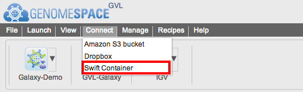
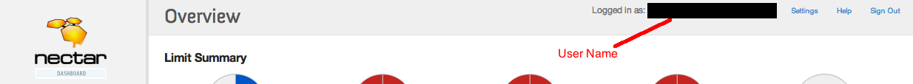
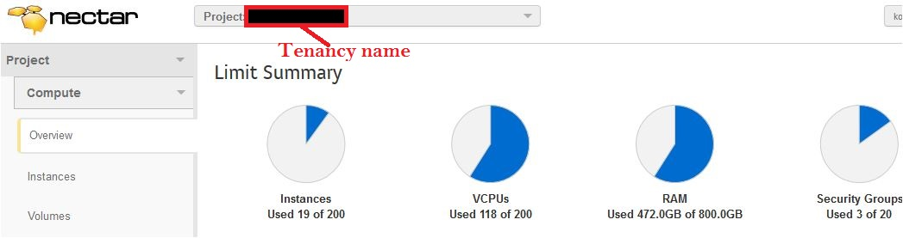
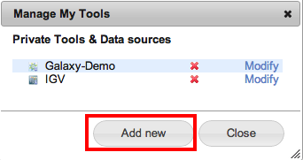
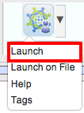
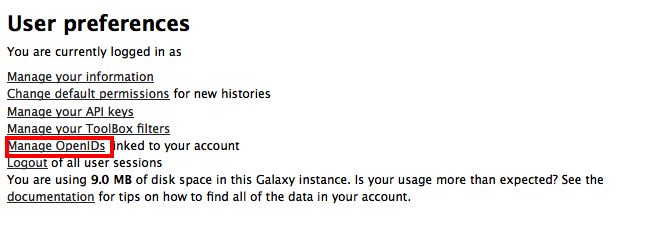
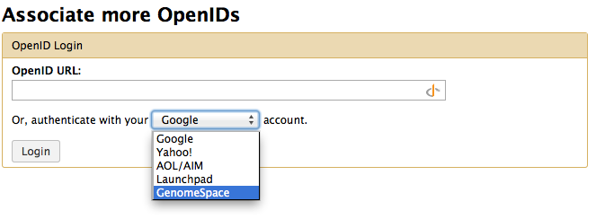

## What is GenomeSpace?

GenomeSpace is a cloud-based interoperability framework to support integrative genomics analysis through an easy-to-use Web interface. GenomeSpace provides access to a diverse range of bioinformatics tools, and bridges the gaps between the tools, making it easy to leverage the available analyses and visualizations in each of them. The tools retain their native look and feel, with GenomeSpace providing frictionless conduits between them through a lightweight interoperability layer.

GenomeSpace does not perform any analyses itself; these are done within the member tools wherever they live – desktop, Web service, cloud, in-house server, etc. Rather, GenomeSpace provides tool selection and launch capabilities, and acts as a data highway automatically reformatting data as required when results move from the output of one tool to input for the next.

The GVL GenomeSpace can be found at [https://genomespace.genome.edu.au](https://genomespace.genome.edu.au).

## Prerequisites

GenomeSpace uses a few dialogue boxes to communicate with the NeCTAR cloud. If you have an AdBlocker installed, the dialogues will not be shown properly. If you have an AdBlocker on your system please disable it for the GenomeSpace.genome.edu.au domain.

## Registering a GenomeSpace account

To register a GenomeSpace account you need to have a valid email address and do the following:

*   Go to [https://genomespace.genome.edu.au/](https://genomespace.genome.edu.au/) and click on the "Register new GenomeSpace user" link:
    

*   Enter your preferred username, password and the valid email address and click the Sign up button.

    _**Note:** You will receive an error if the username has already been taken._
    
    If everything goes right you will see the following page.
    

*   Activate your account by following the link in the email from GenomeSpace titled “GenomeSpace user registration”. Your account is now active.

*   Go to [https://genomespace.genome.edu.au](https://genomespace.genome.edu.au/) and enter the username and password you created in the previous steps. You will be logged in into GenomeSpace.

    In a few seconds you will be redirected to your Home page.

    
    On this page you can find the following items:

    1. Your username in the top right corner
    2. The menu bar
    3. The application bar
    4. Your home directory
    5. The directory under the name _Shared to “your username”_ contains any folders that have been shared to you through the GenomeSpace website.
    6. The public directory is the directory which contains anything that has been made public to the cloud through the GenomeSpace website.

## Making a swift container

_(These instructions are for the NeCTAR Australian Research Cloud. For any other OpenStack-based cloud storage please change the parameters as necessary.)_

NeCTAR object storage is a place that people with NeCTAR credentials can store their data reliably.

If you haven't used the NeCTAR cloud before, follow the steps in sections 1 and 2 of this tutorial: [http://melbournebioinformatics.github.io/MelBioInf_docs/gvl_launch/gvl_launch/](http://melbournebioinformatics.github.io/MelBioInf_docs/gvl_launch/gvl_launch/).

Go to the NeCTAR dashboard at [https://dashboard.rc.nectar.org.au](https://dashboard.rc.nectar.org.au).

- On the left hand side of the dashboard click on "Object Store" and then "Containers".

- To make a container, click "Create Container".

## Mounting a swift container

Containers can be found under the Object Store link in NeCTAR’s dashboard.

To mount an available container go to Connect menu bar in GenomeSpace and select Swift Container.

You will see a new page as follows:

To fill out this form you need the following parameters:

1. **OpenStack EndPoint:** The default value should be correct for NeCTAR: _https://keystone.rc.nectar.org.au:5000/v2.0/tokens_
  1. **User Name:** This is your NeCTAR user name. Your user name can be found at the top right corner of the NeCTAR dashboard as shown below:
  
  2. **Password:** This is your NeCTAR API key. The API key is the key that applications can use to connect to NeCTAR on your behalf. To find your API key:
    * Login to your NeCTAR dashboard account.
    * On the top right hand side of your Home click on the setting link
        
    * Press the Reset Password button. (Warning: This process will reset your API key. If you have already done this process for any other application you can instead just use your old key.)
        
2. **Tenancy name:** Your NeCTAR Tenancy name (project name). The tenancy name has been assigned to your project by the NeCTAR administration process. 
3. **Container name:** The name of the container that you want to connect to. 

## Basic file manipulation

Under the containers directory you can perform basic file manipulation as follows:

*   **Creating a directory:** To create a directory under another directory, right click on the source directory and select "Create Subdirectory". You will be asked for a name and in a few seconds your target directory will be created.
*   **Uploading a file into a directory:** Uploading a file can be done using drag and drop. Go to the directory you want to upload the file into and drag and drop the file you want to upload into the open area on the right-hand side of the Home directory. The effective area will turn green.
*   **Deleting a file:** To delete a file, right click on the selected file and select the “Delete”. The file will be deleted in a few seconds.
*   **Previewing a file:** Under the right click menu you will find the "preview" option, which will show the first 5000 bytes of a file.
*   **Downloading a file:** To download a file simply right click on the file and select download. Your download will be started in a few seconds.
*   **Creating a public link:** Right click on the file you want to get the public link for and select the public link. The public link will be shown to you in a few seconds. (Warning: The public link is available for 4 days.)
*   **Creating a private link:** Right click on the file and select the "view file".

## Adding a Galaxy service to your account:

**PREREQUISITE: Please make sure you have an account on the Galaxy server you want to add to GenomeSpace. If you have launched a GVL instance, this is a new instance of Galaxy and you will need to register a Galaxy account in your new Galaxy server first.**

The latest GVL image is fully compatible with GenomeSpace. Galaxy launched as part of GVL instances can be connected to GenomeSpace as follows:

1.  From the Menu bar go to the manage menu and select Private Tool.
    

2.  From the opened window press the "Add new" button.        
    

3.  In the new window fill out the form as follows:
    *   Give a name to your Galaxy
    *   Give a description (Optional)
    *   Tool provider GVL (Optional)
    *   Base URL: http://[Glaxy-ip or DNS]/galaxy/tool_runner?tool_id=genomespace_importer
    *   Parameter name: URL
    *   Required: Ticked
    *   Allow multiple files: Ticked
    *   Multiple file Delimiter: ,
    *   Select the files’ types that you want your galaxy to work on
    *   Upload an image as an Icon for Galaxy (Optional)
    *   Press the save button. In a few seconds your Galaxy instance will be added to the Application bar.

    A sample page can be seen in the following image:
    

4.  Launching the added Galaxy from GenomeSpace: From GenomeSpace click on the Arrow on the right side of your Galaxy application in the Application bar and select launch.

    Galaxy will be opened in a new window.

    

    (Note: Your browser may block the pop-up. Allow the pop-up accordingly).

5.  From the opened Galaxy login and under your username go to the preferences options
    

    and select the Manage OpenIDs links:
    

6.  From the associate more OpenID select GenomeSpace and press login. GenomeSpace will be appear as link on the top as a URL.

    

From now on your Galaxy can talk to GenomeSpace under your UserName.

## File transfer to/from Galaxy

**PREREQUISITE: Please make sure you have connected your Galaxy to GenomeSpace first ([How to](#galaxy)).**

*   **Sending a file:**
    *   _From your Galaxy instance:_ Go to Get Data and select GenomeSpace Importer (Please make sure you are logged into GenomeSpace). You will see your GenomeSpace home page in a few seconds. Select the file you want to send to Galaxy and press the Send to Galaxy button. A new job will be created in Galaxy and when it completes, your file will be in Galaxy.
    *   _From GenomeSpace:_ You can also send a file into Galaxy from the GenomeSpace home page. Simply drag and drop the file into Galaxy (Please make sure you have [connected Galaxy and GenomeSpace](#galaxy)).    

*   **Receiving a file:**

    Under each file click on the store icon and choose "Send to GenomeSpace". A dialog will be opened. Choose the directory to store the file and enter the name of the file to store. If you do not provide the file name the file will be stored as “display”. By clicking the Send button the file will be sent to GenomeSpace. The dialog box will close on success.
