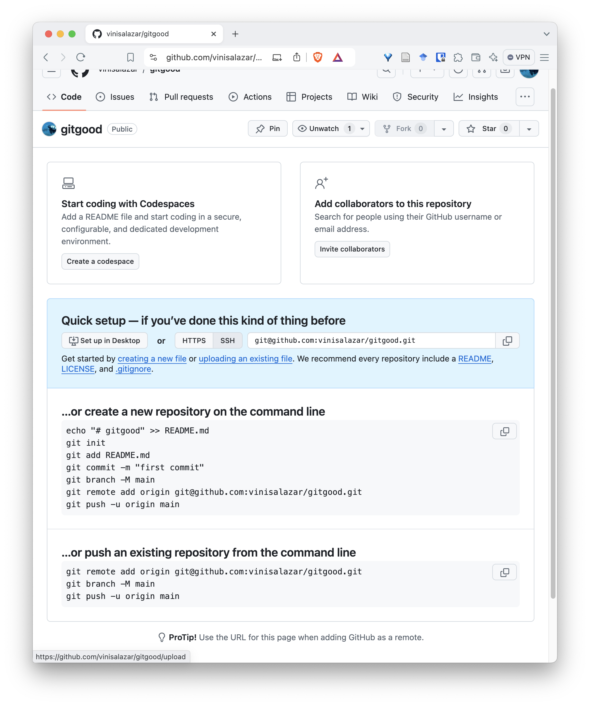
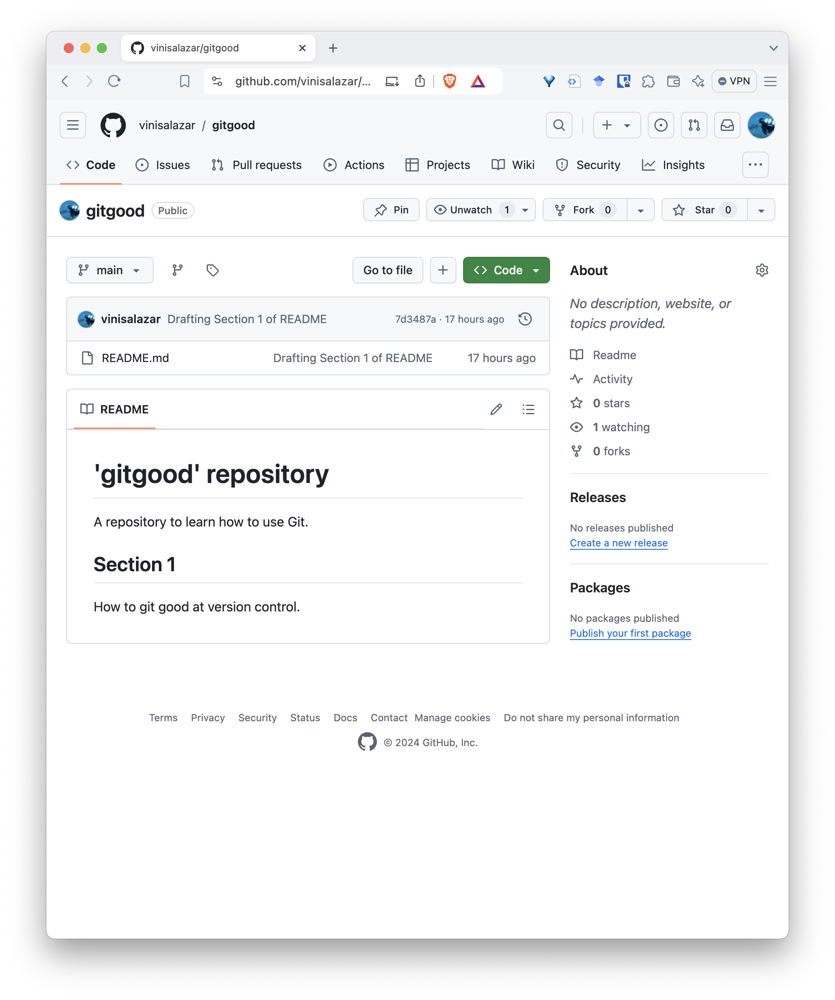
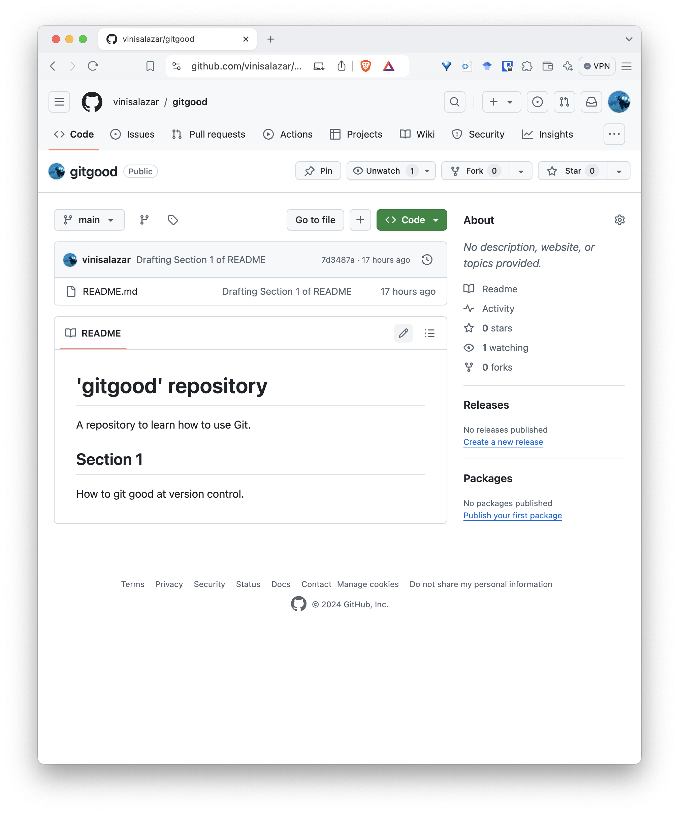
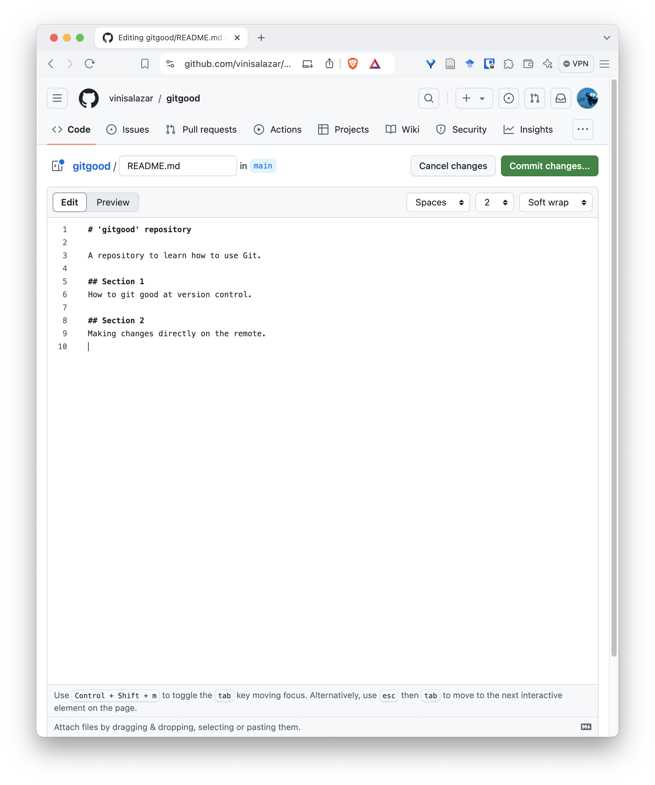
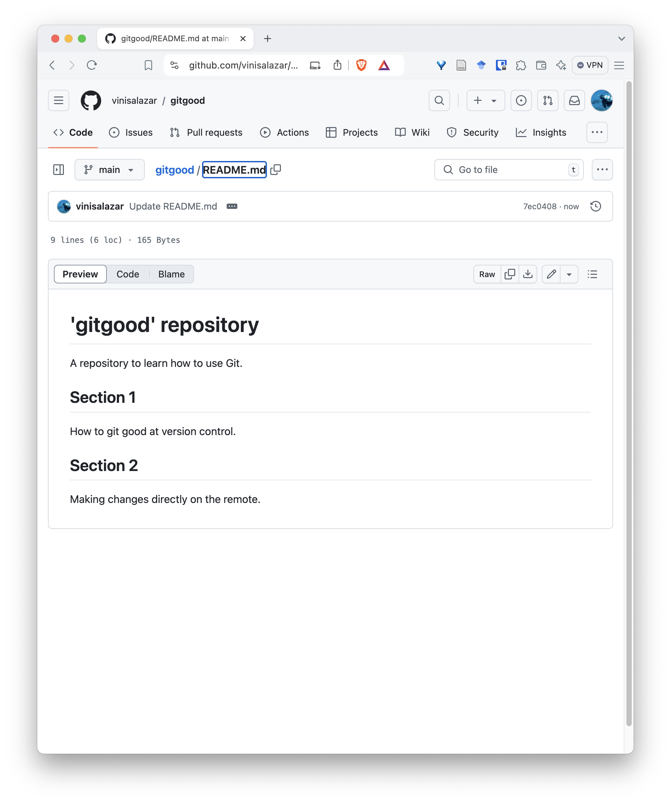
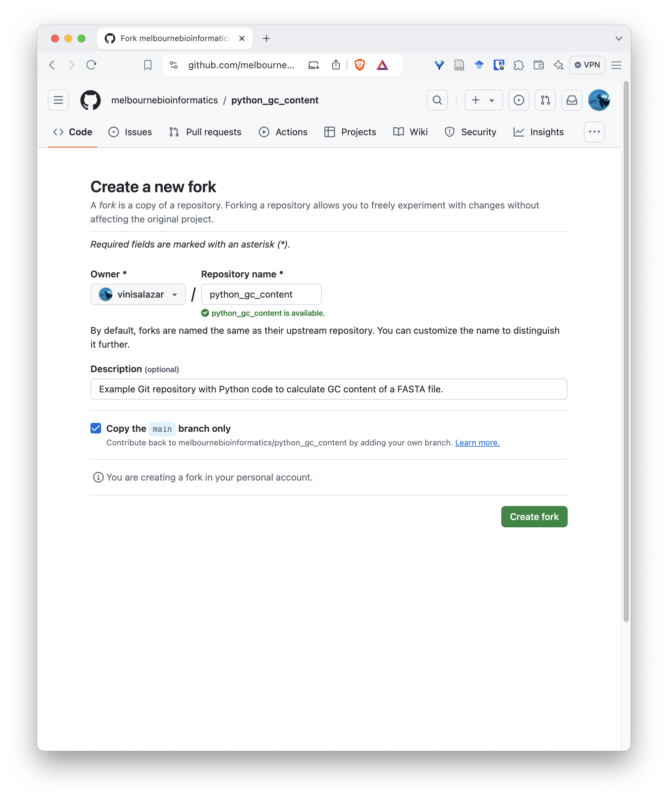
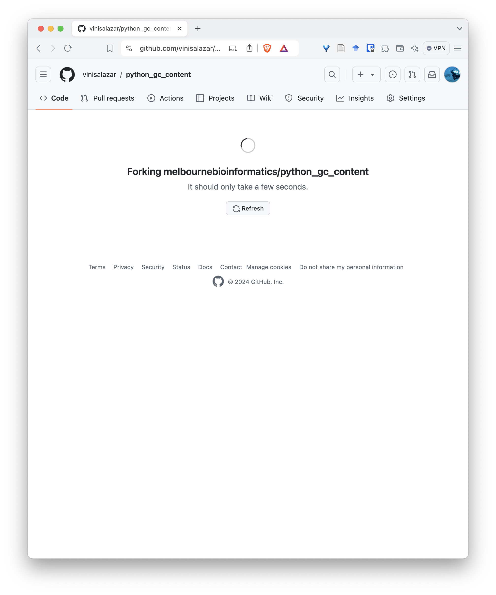
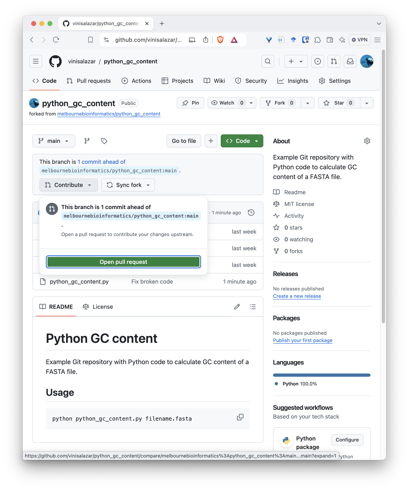
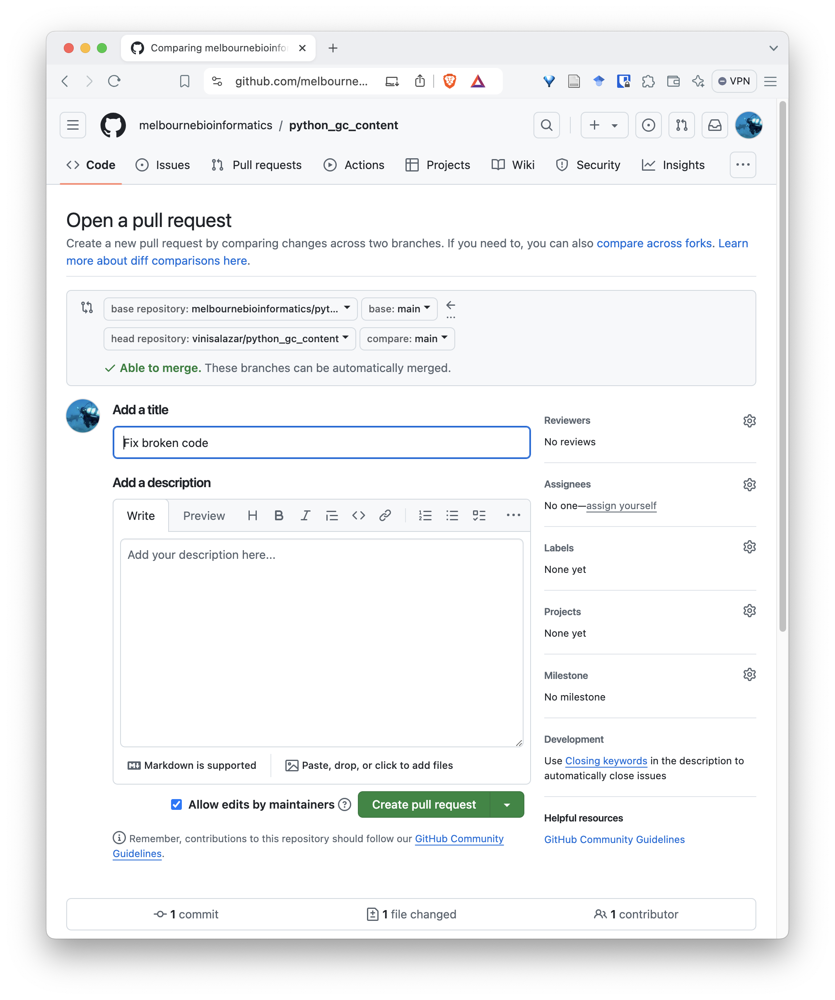
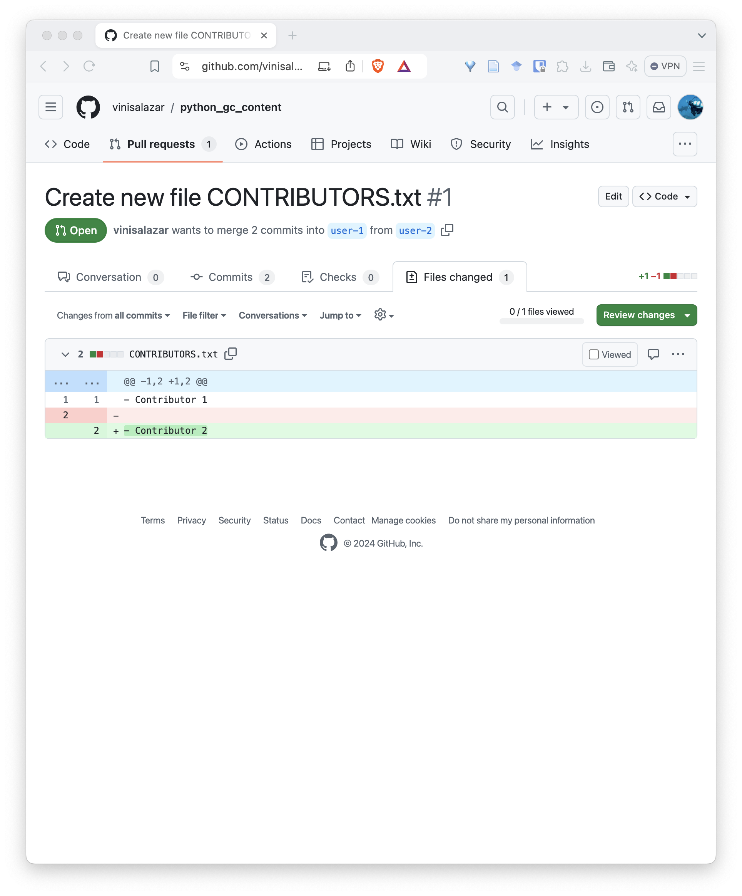

# Version Control with Git

**Author:** Vini Salazar, Melbourne Bioinformatics. Last updated October 2024.

<!-- 
TO-DOs:
  - Add more graphics to explain remotes and such
  - Add directed exercises
  - Add GitFlow section
  - Improve "Do's and Dont's" and "What we haven't covered".
  - Write Keypoints for "Tips and Best practices"
  - Write summary of lesson
-->

## Overview

**Topic**

* [ ] Genomics
* [ ] Transcriptomics
* [ ] Proteomics
* [ ] Metabolomics
* [ ] Statistics and visualisation
* [ ] Structural Modelling
* [x] Basic skills


**Skill level**

* [x] Beginner  
* [ ] Intermediate  
* [ ] Advanced  

**Data:** None required, we will create our own code repository.

**Tools:** Git `>=2.40`, a text editor (VS Code, Notepad, nano, Vim)

**Pipeline:**  
*Section 1:* Introduction  
*Section 2:* Your first Git repository  
*Section 3:* Collaborating with Git  
*Section 4:* Tips and best practices  

**Learning objectives:** learn the basics of version control, how to track changes in a repository and how to collaborate using Git.

!!! warning "Disclaimer"
    This tutorial is partially based on the [Software Carpentry's Git Novice lesson](https://swcarpentry.github.io/git-novice/). Some portions have been directly copied from that lesson, while others have been fully rewritten.
    The lesson is under a [CC-BY 4.0 license](https://swcarpentry.github.io/git-novice/LICENSE.html).

---

## Setup

**Make sure you go through the setup instructions *before* the workshop.**

**Install Git**  

**Windows:** If using a Windows machine, install [Git for Windows.](https://gitforwindows.org)

**Mac:** Open the Terminal (Command + Spacebar and type "Terminal"), and type `git --version`. Follow the on-screen prompts to install XCode.

**Linux:** for Debian-based distributions, you can run `sudo apt install git-all`. For other options, [see here.](https://git-scm.com/download/linux)

**Create a GitHub account**  

The next step will be to create a GitHub account. If you already have one, skip this step. Otherwise, head
over to [GitHub](https://github.com/) and click the "Sign Up" button at the top right. Make sure you [verify
your email address.](https://docs.github.com/en/account-and-profile/setting-up-and-managing-your-personal-account-on-github/managing-email-preferences/verifying-your-email-address#troubleshooting-email-verification)

**SSH access**

You must [configure SSH access to your GitHub account.](https://docs.github.com/en/authentication/connecting-to-github-with-ssh/adding-a-new-ssh-key-to-your-github-account)
Otherwise, it will ask for your password every time you try to interact with GitHub. This is OK, but can 
be annoying after some time. See below on how to connect with SSH.

??? info "Configuring SSH access for GitHub"
    Follow the steps by clicking on the links. **Use the tabs to select the appropriate instructions for your operating system.**

    1. [Check for existing SSH keys.](https://docs.github.com/en/authentication/connecting-to-github-with-ssh/checking-for-existing-ssh-keys)
    2. [If you don't have any keys, create one and add it to the SSH agent.](https://docs.github.com/en/authentication/connecting-to-github-with-ssh/generating-a-new-ssh-key-and-adding-it-to-the-ssh-agent)
    3. [Add a new SSH key to GitHub.](https://docs.github.com/en/authentication/connecting-to-github-with-ssh/adding-a-new-ssh-key-to-your-github-account)
    4. [Test your SSH connection.](https://docs.github.com/en/authentication/connecting-to-github-with-ssh/testing-your-ssh-connection)

**Configuring Git**  

The final step in setting up Git is adding your user name and email to the Git configuration. This is required
because Git documents our work, that is, who did what. It is also a requirement for your GitHub authentication,
especially if you haven't set up SSH access.

!!! warning "Important"
    Use the same email that you used to sign up to GitHub.

    If you prefer to keep your email private, you can [set up a noreply address with GitHub](https://docs.github.com/en/account-and-profile/setting-up-and-managing-your-personal-account-on-github/managing-email-preferences/setting-your-commit-email-address).

Go to your Terminal and type:

``` bash
git config --global user.name "FirstName LastName"
git config --global user.email "your@email.com"
```

**VS Code (optional)**

You may optionally install [Visual Studio Code](https://code.visualstudio.com) to have a text editor to work with. This is also available from the University's Self-Service software.
  
  - **If you are using VS Code on a Windows machine,** you will need to set your default shell as "GitBash". [Follow the instructions here to do so.](https://www.youtube.com/watch?v=PzJCwfYfIzY)

!!! success "Well done!"
    To ensure that everything works, run the two following commands:
    
    1. `ssh -T git@github.com`. It should print a message like this: `Hi <USERNAME>! You've successfully authenticated, but GitHub does not provide shell access`.
    2. `git --version`. It should print something like `git version 2.40.0`

    Congratulations! You are ready to start using Git.

---

## 1. Introduction

**Expected time:** 40 minutes.

### What is Git?
A concise definition is that Git is a **version control system**. It was developed in the early 2000s by 
Linus Torvalds, the person behind the Linux kernel, and other members of the Linux community. In fact, the initial purpose of
Git was to support the development and updates of the Linux kernel.

Git is attractive because of several things:

* It is **fully distributed**. What this means is that several (hundreds, thousands) of users can work on the same project in a streamlined way.
* It is **blazing fast**. Because (nearly) every operation that Git performs is local, everything works almost instantaneously.
* It has **integrity**. Git checksums data before storing it, so it's impossible to change the content of files without knowing about it.

This is all well and good, but let's try to understand what version control means for us as researchers.


“notFinal.doc” by Jorge Cham, [https://www.phdcomics.com](http://www.phdcomics.com/comics/archive/phd101212s.gif)

---

We've all been in this situation before: it seems unnecessary to have
multiple nearly-identical versions of the same document. Some word
processors let us deal with this a little better, such as Microsoft
Word's
[Track Changes](https://support.office.com/en-us/article/Track-changes-in-Word-197ba630-0f5f-4a8e-9a77-3712475e806a),
Google Docs' [version history](https://support.google.com/docs/answer/190843?hl=en), or
LibreOffice's [Recording and Displaying Changes](https://help.libreoffice.org/Common/Recording_and_Displaying_Changes).

Version control systems start with a base version of the document and
then record changes you make each step of the way. You can
think of it as a recording of your progress: you can rewind to start at the base
document and play back each change you made, eventually arriving at your
more recent version.

{alt='A diagram demonstrating how a single document grows as the result of sequential changes'}

Once you think of changes as separate from the document itself, you
can then think about "playing back" different sets of changes on the base document, ultimately
resulting in different versions of that document. For example, two users can make independent
sets of changes on the same document.

{alt='A diagram with one source document that has been modified in two different ways to produce two different versions of the document'}

Unless multiple users make changes to the same section of the document - a 
[conflict](#glossary) - you can
incorporate two sets of changes into the same base document.

{alt='A diagram that shows the merging of two different document versions into one document that contains all of the changes from both versions'}

A version control system is a tool that keeps track of these changes for us,
effectively creating different versions of our files. It allows us to decide
which changes will be made to the next version (each record of these changes is
called a [commit](#glossary), and keeps useful metadata
about them. The complete history of commits for a particular project and their
metadata make up a [repository](#glossary).
Repositories can be kept in sync across different computers, facilitating
collaboration among different people.

??? quote "The Long History of Version Control Systems"

    Automated version control systems are nothing new.
    Tools like [RCS](https://en.wikipedia.org/wiki/Revision_Control_System), [CVS](https://en.wikipedia.org/wiki/Concurrent_Versions_System), or [Subversion](https://en.wikipedia.org/wiki/Apache_Subversion) have been around since the early 1980s and are used by
    many large companies.
    However, many of these are now considered legacy systems (i.e., outdated) due to various
    limitations in their capabilities.
    More modern systems, such as Git and [Mercurial](https://swcarpentry.github.io/hg-novice/),
    are *distributed*, meaning that they do not need a centralized server to host the repository.
    These modern systems also include powerful merging tools that make it possible for
    multiple authors to work on
    the same files concurrently.

!!! question "Paper Writing"

    - Imagine you drafted an excellent paragraph for a paper you are writing, but later ruin it. How would you retrieve the *excellent* version of your conclusion? Is it even possible?

    - Imagine you have 5 co-authors. How would you manage the changes and comments they make to your paper? If you use LibreOffice Writer or Microsoft Word, what happens if you accept changes made using the `Track Changes` option? Do you have a history of those changes?

    ??? example "Solution"

        - Recovering the excellent version is only possible if you created a copy
        of the old version of the paper. The danger of losing good versions
        often leads to the problematic workflow illustrated in the PhD Comics
        cartoon at the top of this page.
        
        - Collaborative writing with traditional word processors is cumbersome.
        Either every collaborator has to work on a document sequentially
        (slowing down the process of writing), or you have to send out a
        version to all collaborators and manually merge their comments into
        your document. The 'track changes' or 'record changes' option can
        highlight changes for you and simplifies merging, but as soon as you
        accept changes you will lose their history. You will then no longer
        know who suggested that change, why it was suggested, or when it was
        merged into the rest of the document. Even online word processors like
        Google Docs or Microsoft Office Online do not fully resolve these
        problems.

!!! note "Keypoints"

    - Version control is like an unlimited ‘undo’.
    - Version control also allows many people to work in parallel.

### Why use version control?

Now that we've learned what version control **is**, let's understand why we should use it as researchers.

There are a number of reasons to argue that using version control will make us better researchers. That is because 
version control systems can be used for:

- **Backing up your code**  
The most fundamental idea of version control is that you can use it to safely back up your code. That means not only
having a copy of it, but having a copy of each version as your code evolves throughout time. If you use version control
effectively, it will be very difficult for your code to be permanently lost, deleted or erased.

- **Sharing your code**  
Although Git is already explicitly designed to work in a distributed manner, modern version control platforms
make sharing code with others even easier. If our repository is public, anyone can easily access it, copy, and modify the code as they please.
You can make your GitHub profile a portfolio of your coding and analysis projects, with a user-friendly interface.

    !!! example "Packaging and distribution"

        Platforms such as GitHub provide a number of features that facilitate **packaging** our code. One thing is to have a bunch of scripts in
        a repository, but if we want to distribute our code effectively, to make it easier for users to acquire and install our code, we can bundle
        it as a **software package** and upload it to platforms such as [PyPI](https://pypi.python.org/) (for Python) or [CRAN](https://cran.r-project.org/) (for R).

- **Collaborating**  
Sharing code with others is one thing, but Git also enables researchers to work *together* on the same project. You can review other users' commits,
and selectively apply or reject changes that they propose. This is further enabled by GitHub, which makes it easy to do it through the web interface.
Moreover, you can create organisations to host multiple projects, give collaborators write and admin access to projects, and give access to private repositories.

    !!! tip "The 'Lingua Franca' of software engineering"
        
        Because of the way Git enables collaboration, it has essentially become the way that programmers interact on a technical basis.
        If you want to make a contribution to a large code base or project, most likely you will have to submit your changes through Git.
        GitHub also allows the creation of **issues**, where you can report problems or create discussions about the code. Knowing Git will
        probably be required if you want to work in coding projects with other people (including past and future you!)

- **Documenting your work**  
Because changes in Git are structured through commits, it is very straightforward to document our work as we go. Whenever we create a commit,
we must write a message that's attached to it (we'll learn more about that), which almost mandates that we document what we are doing. This will
create a [history](#glossary) of our work which can effectively be used as a **digital research notebook** if done correctly. The way Git works also allows the creation of [branches](#glossary) and [tags](#glossary), which can be used to keep track of different parts of the development. This is especially useful for large projects where many people may be working on different things in parallel.

!!! note "Keypoints"
    **Why Git will make you a better researcher:**
    
    - You know you can always go back to a working version of your code
    - You will have a way of showcasing your projects
    - You will be able to distribute your code to others
    - You will be able to modify other peoples' code and make contributions to it
    - You will have a digital lab notebook 

### Fundamental concepts
Before we get started with hands-on work, let's understand some basic concepts about Git. We've already learned that Git tracks different versions of a project by using **commits**, which are like **snapshots of a project**. But let's take a closer look on how this works in practice, by learning about [remotes](#glossary) and [the staging area:](#glossary)

**Remotes**  
Think of remotes as "cloud copies" of your Git repository. While you have your project on your local computer, a remote is a version stored on platforms like GitHub or GitLab. Remotes allow multiple people to work on the same project, sharing updates by pushing changes to the remote and pulling others' changes from it. For example, you can push your work to a remote to back it up or collaborate with teammates by pulling their changes into your local project.

**Staging area**  
The staging area in Git is like a "waiting room" for changes you want to commit. When you modify files, those changes don’t go directly into a commit. Instead, you first add them to the staging area, where you can review and decide what will be included in your next commit. It gives you control to commit only specific changes rather than everything at once. Think of it as preparing ingredients on the counter before putting them into a recipe—you only add what you need.


!!! note "Keypoints"
    - **Commits** are snapshots of a repository.
    - We can have a copy of our repository in a different location, called a **remote**. We can send ("push") and receive ("pull") changes from the remote to interact with others' work, and also to back up or update our local copy.
    - The **staging area** is where we keep track of the changes that we are going to commit, that is, which are going to be written in the repository history.

---

## 2. Your first Git repository

Now that we've learned the basics of version control, and reasons to use it, let's get some hands-on experience on how to create our first Git repository.

Let's start navigating to the Documents folder and creating a new directory there.

```bash
cd
cd Documents
mkdir gitgood
cd gitgood
```

Now that you're in the new `gitgood` directory, we can start a new repository with the following command:

```bash
git init
```

You should see a message like this:

```output
Initialized empty Git repository in /home/username/Documents/gitgood/.git/
```

If we try to list the files in the repository, we can't see anything. Try again with the `-a` option:

```bash
# This doesn't show anything
ls

# This shows the following
ls -a
```

```output
. .. .git
```

We can see that we have created the `.git` directory. This hidden directory (hidden files and directories start with `.` character) will contain the Git repository, with all of the data that will be read and written by Git. If we delete this directory, we will lose all of the version control data stored by Git.

!!! question "Hidden Files"

    Based on your previous knowledge of UNIX command line, try answering the following:  
        1. Why did the first `ls` command did not show anything?  
        2. What does the `-a` mean when we run `ls`?  
        3. If we don't know what the `-a`, or any other command flags mean, how can we find out?  
        4. What do the `.` and `..` files mean?

    ??? example "Solution"
        1. By default, `ls` does not display hidden files (starting with a `.` character). The `.git` directory hidden by default when we create it.  
        2. `-a` shows **all** of the files and directories, including hidden ones.  
        3. If we don't know what a command-line flag means, we can try looking for the command in the man pages, for example by typing `man ls`.  
        4. The `.` and `..` files respectively refer to the current directory and the directory one level above (the `Documents`, in this case).

We can now try one of the most important Git commands, which tells us the current state of our repository:

```bash
git status
```

```output
On branch main

No commits yet

nothing to commit (create/copy files and use "git add" to track)
```

We can use `git status` as much as we want to check the state of the repository. In this case, there isn't anything very interesting, but once we start accumulating changes, it will become very useful.

!!! warning "Nested directories"

    Once we have run `git init` on a directory, there is no need to run it again in subdirectories of the original directory. That's why we should run the command on the **parent directory** of the project, and we can include additional subdirectories as needed.

!!! note "Keypoints"
    
    - `git init` initializes a repository.
    - Git stores all of its repository data in the `.git` directory.

### Tracking changes

We have successfully created a repository (yay!) so let's start making some changes so we understand how version control works. At the moment, our repository is completely empty (with exception of the `.git` directory), so can create a few files to get started.

Any code project should have a **README** file, which, at the very least, should provide a brief overview of the contents of that project directory. Even though our directory is empty, we can get started with a README file:

```bash
touch README.md
```

The `touch` command creates an empty file. We will be formatting our README file in [Markdown](https://www.markdownguide.org/). If you haven't heard of Markdown, basically it's a simple, easy-to-use language [markup language](https://en.wikipedia.org/wiki/Markup_language) which GitHub fully supports.

???+ note "Markdown Primer"
    Markdown files are plain text files. Even though Markdown has a range of features (such as acting as an extension of HTML), we can stick to the basics:  

    - `#` creates Level 1 Headings (usually the page title).
    - `##` creates Level 2 Headings (usually the different sections in the page).
    - Subsequent Heading levels can be created with `###`, `####`, etc.
    - Backticks (\`\`) create  `mono-spaced text, useful for formatting code.`
    - ** **Bold text is written with double-asterisks.** **
    - *\*Italics is written with a single-asterisk.\**

Now open `README.md` on your favourite text editor, such as VS Code, nano, Vim, or good old Notepad, and let's
add some content (we recommend that you use VS Code):

```bash
nano README.md
```

Add the following content:

```output
# 'gitgood' repository

A repository to learn how to use Git.
```

If you type in `git status` and see what it shows:

```bash
git status
```

```output
On branch main

No commits yet

Untracked files:
  (use "git add <file>..." to include in what will be committed)
        README.md

nothing added to commit but untracked files present (use "git add" to track)
```

It's similar to what we had the first time, but we can see that it showed an **untracked file**. Git has detected that a new file has been created, but it's not performing any version control for it. We must first **commit** this file to our repository. Let's do so by using two fundamental Git commands:

```bash
git add README.md
```

The `git add <FILENAME>` command **adds a file to the staging area.** We learned in the previous section that the **staging area** is where we store the changes that we intend to **commit** to the repository. We can see the effect that this has on the repository by typing `git status` again:

```bash
git status
```

```output
On branch main

No commits yet

Changes to be committed:
  (use "git rm --cached <file>..." to unstage)
        new file:   README.md
```

Depending on the version of Git you have, the output may be slightly different. But the main things is that this change, that is, of creating a new file, has **been staged, and is now ready to be committed**. Therefore, the `git add` command is used to **add files to the staging area**. Now that these changes area ready to be committed, we can move on with the next command:

```bash
git commit -m "Add repository README"
```
```output
[main (root-commit) 62a9ebb] Add repository README
 1 file changed, 4 insertions(+)
 create mode 100644 README.md
```

The `git commit` command effectively records the changes that we made and added to the staging area **into the repository history.** Now, we've created another snapshot of the repository, one that has the changes that we've made, compared to the previous one where the repository was empty.

!!! tip "Commit Messages"

    The `-m` in the `git commit` command means `--message`, that is, the message associated with that particular commit. **You should always write descriptive messages** of what has been done in a particular commit. 
    
    After all, one of the reasons of why Git is so powerful and adopted is that it allows you to document your work as you go, and this is largely done by writing (good) commit messages. This may seem a bit excessive at first, such as having to write something everytime you press "Save" on a Word document, but as your project grows and you add more and more code to it, it's important to be able to see what has been done in each commit. You can also just type `git commit` without the `-m`, in this case a text editor will pop up in the Terminal prompting you to write a commit message. 
    
    We will learn **how to write good commit messages** later on in this lesson. But basically we want to describe **what** we changed and **why** we changed it.

Now that we have made our first commit, let's check the `git status` again:

```bash
git status
```

```output
On branch main
nothing to commit, working tree clean
```

The message is a bit different than before. Now, we don't see `No commits yet`, but rather, that we don't have anything to commit. That is because we haven't changed anything in the repository since our last commit.


???+ tip "Repository History"
    Now that we have a commit, we can learn a new command:

    ```bash
    git log
    ```

    ```output
    commit 62a9ebbef3d7a9e0e07f2344a86f10fa58e7479c (HEAD -> main)
    Author: Vini Salazar <17276653+vinisalazar@users.noreply.github.com>
    Date:   Mon Sep 9 14:58:43 2024 +1000

        Add repository README
    ```

    The `git log` command shows a list of our commits. We can see the commit **checksum** (the long code after the word `commit`), the associated author and email, **which is the same user name and email that we set up with `git config` earlier**, the timestamp of the commit, and the commit message. The `git log` command is useful to get an understanding of recent activity in the repository.

Let's modify the `README.md` file again and add some new lines:

```output hl_lines="5 6"
# 'gitgood' repository                                                                              
                                                                                                    
A repository to learn how to use Git.

## Section 1
How to git good at version control.
```

We've added the `## Section 1` which will represent a new section of text in our Markdown document, and added a little bit of normal text underneath it.

Let's see how this affects our repository by running `git status` again:

```bash
git status
```
```output
On branch main
Changes not staged for commit:
  (use "git add <file>..." to update what will be committed)
  (use "git restore <file>..." to discard changes in working directory)
        modified:   README.md

no changes added to commit (use "git add" and/or "git commit -a")
```

Now that Git is keeping track of `README.md`, any changes that we make to the file will be tracked, so Git knows that we modified the file and added some lines to it. The same goes for when we delete lines from a file. 

!!! warning "Untracked Files"
    Git will only detect differences in files which have been previously committed to the history. If the file is **untracked**, like `README.md` was before our first commit, Git will not record any changes. Be mindful of this, because if you make changes to untracked files, you may not be able to revert them to a previous version!

The `git status` command shows that `README.md` was modified, but let's have a look at **what specific changes happened**. We can do this by running a new command:

```bash
git diff
```

```output hl_lines="9 10"
diff --git a/README.md b/README.md
index 24e122d..e96d76a 100644
--- a/README.md
+++ b/README.md
@@ -2,3 +2,5 @@
 
 A repository to learn how to use Git.
 
+## Section 1
+How to git good at version control.
```

The `git diff` command shows the specific lines that have been changed. Lines that were added will have a `+` next to them and will be highlighted in green, and lines that were removed will have a `-` and will be highlighted in red. `git diff` is very useful in combination with `git status`, so we can see the current state of the repository and what has been changed.

Let's add and commit that change, and check out log again:

```bash
git add README.md
git status  # (1)!
git diff  # (2)!
git commit -m "Drafting Section 1 of README"
git log
```

1. Check that `README.md` has been moved to the staging area.
2. `git diff` doesn't show the change anymore. Why do you think that is?

We can see another commit has been added to the history.

```output
commit 7d3487ad746e2cd6e0beaab3271de9e300a267ca (HEAD -> main)
Author: Vini Salazar <17276653+vinisalazar@users.noreply.github.com>
Date:   Mon Sep 9 15:32:45 2024 +1000

    Drafting Section 1 of README

commit 62a9ebbef3d7a9e0e07f2344a86f10fa58e7479c
Author: Vini Salazar <17276653+vinisalazar@users.noreply.github.com>
Date:   Mon Sep 9 14:58:43 2024 +1000

    Add repository README
```

!!! success "Tracking Changes"
    Well done! You've learned 6 new commands, and the fundamentals of version control. With this alone, you can start tracking changes in your local repository. Next, we are going to learn how to interact with GitHub, based on what we've done so far.

!!! note "Keypoints"
    We learned several new commands. Let's take note of them:

    - `git init` initialises a Git repository, which is contained within the hidden `.git` directory.
    - `git status` shows the current state of the repository, such as *which files have been changed.*
    - `git add` adds a file to the **staging area**, where we gather all of the changes that will be committed.
    - `git commit` writes the changes to history, permanently recording them to the repository.
    - `git log` shows the list of commits in the repository.
    - `git diff` shows the changes between the last commit and the current repository, showing *how files have been changed*.

### Remotes: pushing and pulling

Now that we've learned how to set up a *local* repository, let's **push** that to GitHub. Before we do that, let's have another look at the concept of [remotes](#glossary). We learned that remotes are a cloud copy of our repository. In order to push our repository to GitHub, we'll have to **set the remote** of our local repository to GitHub. 

??? example "Creating a new repository"

    1. Open GitHub, and click on the `+` button in the top right corner, and select "New repository"

    

    2. Select a name for the repository. Usually we use the same name of the repository's parent directory.
    
    

    3. On the following screen, you will have the commands to set the remote and push the repository from the command line.

    

    Follow the commands on that screen and you will have succesfully pushed your repository to GitHub! On your repository, you can run `git remote -v` to see the URL of your new remote.

    ??? tip "SSH and HTTPS authentication"

        Notice that this page has two options for authentication: "SSH" or "HTTPS". If you followed the [SSH access step on the Setup section](#setup), you should be able to use the SSH option, which is the default and the recommended one. However, if that doesn't work, you can switch your remote to HTTPS by using `git remote set-url origin <HTTPS-URL-HERE>`.

Your new repository should look somewhat like this:



Notice how the `README.md` file that we wrote makes up the landing page of our repository. This is one of the reasons of why having a README is so important, especially for GitHub projects: it will be the "front page" of your project. You can (and should) write any important information here. 

We have successfully **pushed** our local repository from our local machine to the remote. Now, let's make a change directly on our remote and **pull** our changes locally.

??? example "Pulling changes"

    1. On your new repository page, click on the pencil icon on the top-right side of the README.

    

    2. Add a new section with level 2 headings (`##`) and write something. Click on "Commit changes" on the top right".

    

    3. Write a descriptive commit message.

    

    4. Your file should reflect the update you've just made. Notice the commit stamp on the top.

    

    5. On your Terminal, navigate to your repository and run `git pull`.

    

    !!! question "Syncing changes"

        What do you think happens if you make a remote change, and then a local change, and you try to push the local changes **before** pulling the remote changes?

!!! note "Keypoints"

    - The `git push` command **pushes** local changes to the GitHub remote. Before running it, we must **set our remote** to the correct URL.
    - The `git pull` command **pulls** remote changes to our local repository. We need to run it to sync our local repository to the newest updates on the remote.
    - The `git remote` command is used to manage remotes, such as setting the GitHub URL, to view the configured remotes, and other actions.

## 3. Collaborating with Git

So far, we've learned how to set up a local repository, how to track changes, and how to sync our local repository with the remote by pushing and pulling. Now, let's see how collaborating with Git and GitHub works in practice. In this section, you will [clone](#glossary) an existing repository, make changes to it, and submit those changes as a [pull request.](#glossary)

### Cloning a repository

To start, we have two repositories to choose from, one in **Python** and one in **R**. Both repositories contain the same thing: a script that calculates the GC content of the sequences in a given FASTA file. Pick the language that you're most comfortable with to proceed:

- [**Python repository**](https://github.com/melbournebioinformatics/python_gc_content)
- [**R repository**](https://github.com/melbournebioinformatics/R_gc_content)

Take a note of the contents of each repository:
- A README file
- The script with the code
- An example data file
- A LICENSE file

Clone your chosen repository locally using the `git clone` command.

??? example "Cloning a repository"

    1. Click the `< > Code` button on the top right of the repository's contents.

    

    This copies the remote's URL to your clipboard.

    2. Navigate to a suitable directory (**not** inside our previous `gitgood` repository), such as the Documents directory, and run `git clone <URL>`

    

Well done! You now have a local copy of the code. Cloning is a powerful feature that allows us to effortlessly create a copy of an existing repository. If you make your code available on GitHub, people can clone it and customise it.

### Undoing changes

Now, let's try running the code in the repository:

=== "Python"

    ```bash
    python python_gc_content.py example.fasta
    ```

=== "R"

    ```bash
    Rscript R_gc_content.R example.fasta
    ```

You most likely got an error message like this one:

=== "Python"

    ```output
      File "/path/to/python_gc_content/python_gc_content.py", line 45
        print(f"Overall GC Content: {gc_content:.2f}%"
             ^
    SyntaxError: '(' was never closed
    ```

=== "R"

    ```output
    Error: unexpected '}' in:
    "  cat(sprintf("Overall GC Content: %.2f%%\n", gc_content)
    }"
    Execution halted
    ```

Let's explore the log on the repository. Run `git log`:


Apparently, the last commit purposefully breaks the code so that we can fix it ourselves! We wouldn't know that if it weren't for a descriptive commit message.

Now, there are two things we could do:

1. Revert back to the previous commit. After all, version control would not be useful if we could not go back to a previous, working version of our code.
2. Fix the code ourselves and commit the changes.

There are multiple ways to revert changes in Git. Here, we will use the `git reset` command:

```bash
git reset --soft HEAD~1
```

There's a lot to unpack here. First is the `git reset` command itself. What it does is that it resets the **current state** of the repository, also called `HEAD`, to a specified state. In this case, we are resetting to one commit before the current state, hence `HEAD~1`. The `--soft` flag tells the command to undo the commit, but keep the changes in the staged area. Let's run `git status` to see what it shows:

```bash
git status
```

```
On branch main
Your branch is behind 'origin/main' by 1 commit, and can be fast-forwarded.
  (use "git pull" to update your local branch)

Changes to be committed:
  (use "git restore --staged <file>..." to unstage)
        modified:   python_gc_content.py
```

The changes from the commit that we reset are staged, but the commit itself was undone (you can see with `git log`). We can see exactly what that change was by running `git diff --staged`, which is just like `git diff` that we learned before, but highlights only the changes that are already staged.

```bash
git diff --staged
```

=== "Python"

    ```output
    diff --git a/python_gc_content.py b/python_gc_content.py
    index 81aa457..8ec3fc4 100644
    --- a/python_gc_content.py
    +++ b/python_gc_content.py
    @@ -42,7 +42,7 @@ def main():
        fasta_file = sys.argv[1]
        full_sequence = read_fasta(fasta_file)
        gc_content = calculate_gc_content(full_sequence)
    -    print(f"Overall GC Content: {gc_content:.2f}%")
    +    print(f"Overall GC Content: {gc_content:.2f}%"
    
    if __name__ == "__main__":
        main()
    ```

=== "R"

    ```output
    diff --git a/R_gc_content.R b/R_gc_content.R
    index abb31f4..e6fe7f0 100644
    --- a/R_gc_content.R
    +++ b/R_gc_content.R
    @@ -26,7 +26,7 @@ main <- function() {
       full_sequence <- read_fasta(fasta_file)
       gc_content <- calculate_gc_content(full_sequence)
    
    -  cat(sprintf("Overall GC Content: %.2f%%\n", gc_content))
    +  cat(sprintf("Overall GC Content: %.2f%%\n", gc_content)
     }
    
     # Call main function if script is run
    ```

We can see that the code broke because, in the previous commit, a parenthesis was removed from a line. However, because that change is staged, the code remains broken. We can undo the staged change by running:

```bash
git restore --staged <file>
```

This removes the file from the staging area, but the change is still there (you can check it using `git status`).

To fully restore the file to its previous state, you can run:

```bash
git restore <file>
```

??? example "Git reset alternatives"
    Running these two commands, that is, to unstage and restore the changes after `git reset`, would be the equivalent of running:

    ```bash
    git reset --hard HEAD~1
    ```

    In this case, using the `--hard` flag undoes all of the changes from the current state (the `HEAD`) to the specified state (in this case, one commit previous to the `HEAD`). The reason we may want to use `--soft` instead of `--hard` is that sometimes we may not want to lose all of our uncommitted changes, but rather review them on a case-by-base basis.

    Another thing we could do is:

    ```bash
    git checkout HEAD~1
    ```

    The `git checkout` command is use to transition between **branches**. We haven't gone into the concept of branches yet so we will leave this one alone for now. But basically, by using `git checkout`, we can navigate between the repository at different points in time (that is, at each commit).

Now that we have fully restored the breaking changes, let's try running the code again:

=== "Python"

    ```bash
    python python_gc_content.py example.fasta
    ```

=== "R"

    ```bash
    Rscript R_gc_content.R example.fasta
    ```

```output
Overall GC Content: 57.98%
```

This was the first way that we could fix what wrong with the code, by reverting to a previous version that we know that worked. Let's try the second approach, of fixing the change ourselves in a new commit. First, let's undo what we did by running `git reset`. By doing that, we moved to a previous commit in time. That means that our local copy is **one commit behind the remote**. So, we can go back to the broken version simply by running:

```bash
git pull
```

This will sync the remote with the local.

Now, try perfoming the fix yourself. Once you make sure that the new code works, run `git add`, `git commit`. Raise your hand or put up a green post-it when you are done.

??? question "Solution"

    In order to fix the broken code, add a parenthesis that is missing at the end of the line causing the error:

    === "Python"

        ```python linenums="45"
            print(f"Overall GC Content: {gc_content:.2f}%")
        ```

    === "R"

        ```r linenums="29"
          cat(sprintf("Overall GC Content: %.2f%%\n", gc_content))
        ```

    To add and commit the file, run:

    ```bash
    git add python_gc_content.py  # or R
    git commit -m "Fix broken code"
    ```

!!! success "Well done!"
    You fixed a broken a script and committed the result using Git. That is no easy feat! It will pave your way to making more contributions in the future.

After making sure that the code works, push your changes using `git push`. What happens then?

Because the repository that we cloned is under Melbourne Bioinformatics, we don't have write access to it. In order to push the code to GitHub, we need our own copy of the code, so we must **fork** the repository. Let's see how to do that.

!!! note "Keypoints"

    - `git clone` copies a remote repository to our local repository.
    - There are multiple ways to revert to previous changes, one of them is `git reset`.
    - `HEAD` indicates the current state of the repository.
    - We cannot push to a remote repository if we do not have access to it.

### Cloning versus forking

When we **clone** a repository, we download a copy of it locally, attached to the same remote (the GitHub repository) from which we cloned it from. We can make whatever changes we want locally, but in order to push those changes to the remote, we must have access to the GitHub repository. Unless it's our own repository or the owner of the repository has granted us with write access, we usually won't have access to it. To circumvent this problem, we should [fork](#glossary) the repository. Forking a repository is similar to cloning, but we create a new **remote**, instead of a local copy, that we have control over.

Let's **fork** the chosen repository and make changes to it.

???+ example "Forking a repository"

    To fork a repository, navigate to the repository page on GitHub and click the "Fork" button on the top-right:

    

    You will be taken to the fork page. There's no need to change anything here, but make sure you are forking it with your profile as the "Owner":

    

    

    Now you have your own copy of the repository, that you have total control over! Notice that the top-left shows that the repository was forked from the original repository.

    

Now, there are two ways to configure your local repository so that it follows your **fork**, rather than the original repository:

1. **Deleting and re-cloning:** Simply delete the local repository (with the `rm -rf <DIRECTORY_NAME>` or right-click the directory and delete it), and clone it again, using the same approach that we used before.
2. **Updating the remote:** if you ran the `git remote -v` command from inside the original repository that you cloned, you will have seen that it shows the remote URL of the repository, which you do not have access to. You can **update** this remote with the following command: `git remote set-url origin <URL-OF-YOUR-FORK>`. The URL of your fork is the **same URL** that you use it to clone it, which can be obtained by clicking the "Code" button on the GitHub interface. Use `git remote -v` to confirm that the remote has been updated.

Now that your local repository is following the fork, rather than the original repository, you can **push** any changes that you make locally to the remote. Do this by running `git push`.

### Pull requests

Even though you don't have access to the original repository, you can submit changes to it through a [pull request](#glossary). A pull request is a way of requesting that the owner of the repository that you're submitting the changes to to "merge" (or pull) them into their repository.

Let's make a pull request with the fix that we made to the original repository containing the code. If you haven't pushed the code after committing the fix that you made, do so by running `git push`.

???+ example "Submitting a pull request"

    To create a pull request, go to the page of your fork on GitHub after pushing the fixed code. At the top of the code, there will be a bar noting the difference between your fork and the original repository. If you click on "Contribute", you can create a pull request:

    

    After you click that, you will be taken to a screen to create your pull request. A default title will be given to your PR, but you can edit it if you want, and give it a description. Repositories may have different policies regarding the content of the PR, but for this one we can just keep it simple and create the pull request:

    

    Once you are done, you will have created a pull request from your fork into the original repository. It will appear on the "Pull requests" tab on the original repository. Authors and maintainers from that repository will be able to review your pull request, make comments, changes, and eventually merge it.

    

If you have your project available on GitHub, it is likely that you will have to review a pull request at some point!

### Merge conflicts

Because of that, let's practice **reviewing** a pull request, that is, the scenario where someone would submit a pull request to our repository.

???+ question "Reviewing a pull request"
    1. Create a new branch called `add-name` using the following command: `git checkout -b add-name`.
    2. Create a file named `CONTRIBUTORS.txt` and add a line with your name to it. Add and commit the changes, and push to your fork, using the following command: `git push --set-upstream origin add-name`
    3. Find someone that has forked the same repository as you have (either Python or R). Ask a helper if you can't find someone that has cloned the same repository.
    4. Using the GitHub interface, make a pull request to each other's repository submitting the changes. **Change the destination of your PR by using the dropdown menus above the "Create pull request" button.** Make sure you make the pull request to your partner's fork, and to the `add-name` branch.

    
    
    What happens?

If you followed the steps correctly, you should have created a **conflict**. This happens when two different users make changes to the same part of a file. Because when we created the file `CONTRIBUTORS.txt`, we added our name to the first line of the file, if someone submits a pull request doing the same, it will be like they are overwriting our changes. In order to merge the pull request, we must first **fix the conflict**. We can do this directly through the GitHub interface:

???+ example "Fixing conflicts"

    When a pull request is created that conflicts with your repository, the pull request screen should indicate it:

    

    When clicking "Resolve conflicts", it should bring up a text editor where we can edit the conflicting file:

    

    Conflicts on Git always follow this format, where the conflicting lines have `<<<`, `===`, and `>>>` between them, indicating where the conflict happens.

    Erase the lines with `<<<`, `>>>` and `===` to fix the conflict. Make sure your name is the first line on the file, and the name of contributor, the second one. Your file should look like this:

    ```output linenums="1"
    - User 1
    - User 2

    ```

    Click on "Resolve conflicts" and "Commit merge"

    

    This will create a new commit on the pull request:

    

    **Don't merge the pull request just yet!** Let's finish our review first.

After fixing the conflict, let's review our pull request. On the pull request screen, go to the "Files changed" tab. 



This tab allows us to review each file individually. Check the "Viewed" checkbox next to the file, and the "Review changes". This allows you to Comment, Approve or Request changes on the pull request. Select Comment or Approve.


You can now merge the PR:


After merging, go to your local repository and run `git pull`.

!!! note "Keypoints"
    - Forking a repository creates a new **remote** that we have control over.
    - We can update the remote on our local repository using `git remote set-url <REMOTE_NAME> <REMOTE_URL>`.
    - Pull requests are a way of collaborating that allows other people to merge our changes into their repository.
    - Conflicts are when two commits modify the same parts of a file. We must resolve conflicts before merging them. This can be done by creating a new commit.
    - Conflicts are denoted by `<<<`, `>>>` and `===` characters around the conflicting lines.

## 4. Tips and best practices

!!! success "Well done!"
    By following these steps, you've learned the fundamentals of version control with Git.

Next up, let's look at some tips and best practices to incorporate Git into your day-to-day work.

### How to incorporate Git in your day-to-day work

Adopting Git for beginners can be daunting at first. There are many commands to learn, it requires constant interaction with the command line, and instead of just pressing "Save", or "Ctrl+S", you have to type in a message everytime you want to record your work. However, there are strategies to mitigate or circumvent these problems.

One of them is to **think of Git as a digital research notebook.** Even if you're not doing full-blown software engineering, but rather just recording a data analysis project, Git is very useful in the sense that you can document your work as you execute it. Every time you commit a change, you are creating a structured record of that change, which is appropriate for data compliance requirements in most scenarios. By using Git to record your work, you are not only guaranteeing that you will have a back up of your code and the possibility of reverting specific changes if something breaks, but also creating a digital notebook of the what you have done. By thinking of Git like this, you can build up a habit of, for example, committing your work at the end of each day, describing what you have done, much like you would don on a laboratory notebook.

The second strategy to **take advantage of existing solutions to use Git**. This could mean plugins for your IDE, the [GitHub Desktop client](https://desktop.github.com/download/), or other services like [GitKraken](https://www.gitkraken.com/). Git is a well-established software with many, many tools that support. Take advantage of that instead of struggling with the Git command-line.

The third strategy is to, at the very least, **to think of Git as a backup tool**. Even though you may create backups of your code in platforms like Dropbox or Google Drive, you would have to sync your backups regularly in other to keep track of an evolving code base. By using Git, you can rest assured that you will have a cloud backup of your code, and you can rely on it in case your local machine stops working.

??? tip "When to commit?"
    It is common for Git beginners to not know exactly *when* to commit their changes. Since commits can be seen as "checkpoints", a good time to commit changes is **when things are working as intended.** Are you trying to fix a bug, and the error message changed? Even though the code is not fully working, that may be worth a commit to record that you are on the right track. When you fix the code for certain, it is *definitely* worth a commit! Don't wait until things break again, because if you haven't committed your changes when the code was working, you won't be able to revert back to it. If you are making big changes to a file, such as writing large chunks of documentation, you can split your commits into different sections. For example, commit after you have finished drafting the Introduction, and then again after you've finished drafting the Methodology. You can make additional commits later when you are reviewing and editing your text.

    When you're first starting with some new code or making fast progress on a project, you don't have to commit every single line of code (although this may be required if you're submitting changes to a large code base!). But it's important to start developing a feeling of "would I want/need to come back to this checkpoint if I had to?"

#### Leveraging the GitHub interface
In regards to the second strategy of using existing solutions, you can do most Git operations very easily through the GitHub web interface. GitHub has advanced tremendously over the years, and not only you can do most basic operations directly through the interface, it also offers a number of features such as the ability to [set up web pages](https://docs.github.com/en/pages); [autolinked references and URLs](https://docs.github.com/en/get-started/writing-on-github/working-with-advanced-formatting/autolinked-references-and-urls) and [linking pull requests to issues](https://docs.github.com/en/issues/tracking-your-work-with-issues/linking-a-pull-request-to-an-issue), which help with project management; automated workflows through [GitHub Actions](https://docs.github.com/en/actions), and many others.

<!-- ### Git flow and development strategies -->

### Do's and Dont's

#### Do
- Write good commit messages
    - Say **why**, not **what** you changed
- Make small changes
- Commit often
- Think about the reviewer
- Document as you code

#### Don't
- Make vague commit messages
- Accumulate unrelated changes in a single commit
- Let things go stale – delete or "stash" them

!!! note "Keypoints"

    - There are a number of strategies to incorporate Git into your day-to-day work.
    - The learning curve can seem steep at first, but with time you will understand how valuable Git is and it will become easier and easier to use.
    - GitHub offers numerous features that make adopting Git easier, and enable you to showcase your projects.
    - There are a few best practices which will dramatically improve your efficiency with Git.

<!-- ## Summary 

### What we haven't covered

* Branches
* Ignoring things
* Licenses

-->

## Glossary

**Branch:** An independent line of development within a repository, allowing you to work on different features or fixes without affecting the main project.

**Clone:** Creates a local copy of a remote repository.

**Commit:** A snapshot of changes to a repository, saved with a message describing the updates.

**Conflict:** A situation where changes from different commits or branches cannot be merged automatically.

**Fork:** Creates a personal copy of someone else’s repository under your GitHub account for independent development.

**History:** The record of all commits made in a repository, showing how the codebase evolved.

**Merge:** Combines changes from one branch into another.

**Pull:** Fetches and integrates changes from a remote repository into your local branch.

**Pull request:** A request to merge (pull) changes from a repository that you own onto another repository. This is how contributions are submitted on GitHub.

**Push:** Sends local changes to a remote repository.

**Remotes:** Remote versions of your repository hosted on a server, allowing you to collaborate and sync changes with others.

**Repository:** A storage space where your project’s files and version history are kept.

**Staging Area:** A space where you can prepare and review changes before committing them to the repository.

**Tags:** Named markers pointing to specific commits, often used to label release versions.
