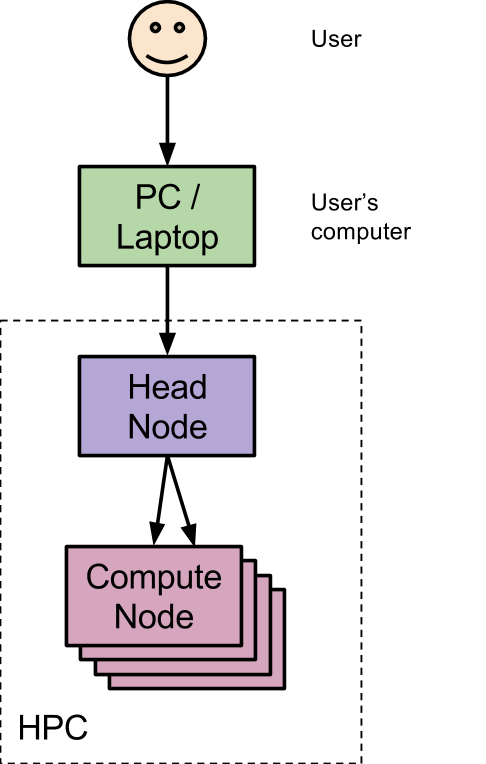

<style src="../../media/tute.css" ></style>
<style>em {font-style: normal; font-family: courier new;}</style>

# High-Performance Computing

A hands-on-workshop covering High-Performance Computing (HPC)

## How to use this workshop

The workshop is broken up into a number of *Topics* each focusing on a particular aspect of HPCs.  You should take a short break between 
each to refresh and relax before tackling the next.

*Topic*s may start with some background followed by a number of *exercises*.  Each *exercise* begins with a *question*, then 
sometimes a *hint* (or two) and finishes with the suggested *answer*.

### Question

An example question looks like:

\showable{What is the Answer to Life?}{question}

\endshowable

### Hint

Depending on how much of a challenge you like, you may choose to use hints.  Even if you work out the answer without hints, its a good 
idea to read the hints afterwards because they contain extra information that is good to know.

Note: *hint*s may be staged, that is, there may be a *more* section within a hint for further hints

\showable{Hint}{hint} &lt;- click here to reveal hint

What is the answer to everything?

As featured in *"The Hitchhiker's Guide to the Galaxy"*

\showable{More|Less} &lt;- and here to show more

It is probably a two digit number

\endshowable

\endshowable

### Answer

Once you have worked out the answer to the question expand the Answer section to check if you got it correct.

\showable{Answer}{answer} &lt;- click here to reveal answer

**Answer**: 42

Ref: [Number 42 (Wikipedia)](http://en.wikipedia.org/wiki/42_%28number%29)

\endshowable

### Usage Style

This workshop attempts to cater for two usage styles:

1. **Problem solver**: for those who like a challenge and learn best be trying to solve the problems by-them-selves (hints optional):
	* Attempt to answer the question by yourself.
	* Use hints when you get stuck.
	* Once solved, reveal the answer and read through our suggested solution.
	* Its a good idea to read the hints and answer description as they often contain extra useful information.
2. **By example**:  for those who learn by following examples:  [Expand](?exp) all sections
	* Expand the Answer section at the start of each question and follow along with the commands that are shown and check you get the
	  same (or similar) answers.
	* Its a good idea to read the hints and answer description as they often contain extra useful information.


### Connecting to HPC

To begin this workshop you will need to connect to an HPC.  Today we will use the LIMS-HPC.  The computer called *lims-hpc-m* (m is for 
master which is another name for head node) is the one that coordinates all the HPCs tasks.

**Server details**:

* **host**: lims-hpc-m.latrobe.edu.au
* **port**: 6022 
* **username**: trainingXX (where XX is a two digit number, provided at workshop)
* **password**: PROVIDED at workshop 

**Connection instructions**:

{!docs/includes/connecting.md!}


## Topic 1: Exploring an HPC

An HPC (short for ‘High Performance Computer’) is simply a collection of Server Grade computers that work together to solve large problems.



**Figure**: Overview of the computers involved when using an HPC.  Computer systems are shown in rectangles and arrows represent interactions.


### Exercises

\showable{1.1) What is the contact email for your HPC's System Administrator?}{question}

\endshowable

\showable{Hint}{hint}

When you login, you will be presented with a message; this is called the *Message Of The Day* and usually includes lots of useful 
information.  On LIMS-HPC this includes a list of useful commands, the last login details for your account and the contact email
of the system administrator

\endshowable

\showable{Answer}{answer}

* LIMS-HPC: andrew.robinson@latrobe.edu.au
* SNOWY & BARCOO: help@melbournebioinformatics.org.au

\endshowable

---------------

\showable{1.2) Run the *sinfo* command.  How many nodes are there in this hpc?}{question}

\endshowable

\showable{Hint}{hint}

The *lims-hpc-[2-4]* is shorthand for *lims-hpc-2 lims-hpc-3 and lims-hpc-4* and *lims-hpc-[1,5]* is shorthand for
*lims-hpc-1 and lims-hpc-5*

\showable{more|less}

Have a look at the NODELIST column.  Only count each node once.

```sh
$ sinfo
PARTITION AVAIL  TIMELIMIT  NODES  STATE NODELIST
compute*     up 200-00:00:      3    mix lims-hpc-[2-4]
compute*     up 200-00:00:      2   idle lims-hpc-[1,5]
bigmem       up 200-00:00:      1   idle lims-hpc-1
8hour        up   08:00:00      3    mix lims-hpc-[2-4]
8hour        up   08:00:00      3   idle lims-hpc-[1,5],lims-hpc-m
```
NOTE: the above list will vary depending on the HPC setup.

\endshowable

\endshowable

\showable{Answer}{answer}

The *sinfo* command lists all available partitions and the status of each node within them.  If you count up the names of nodes 
(uniquely) you will get the total nodes in this cluster.  

* LIMS-HPC: **6** (*lims-hpc-m* and *lims-hpc-1* through *lims-hpc-5*)
* MERRI: **84** (*turpin* and *merri001* through *merri083*)
* BARCOO: **70** (*barcoo001* through *barcoo070*)

\endshowable

\showable{Alternate Method}{indent}

An automatic (though more complex) way would have been running the following command:

```sh
$ scontrol show node | grep NodeName | wc -l
```

Where:

* *scontrol show node*: lists details of all nodes (over multiple lines)
* *grep NodeName*: only shows the NodeName line
* *wc -l*: counts the number of lines

\endshowable


## Topic 2: Software Modules

Up to this point we have been using only standard Unix software packages which are included with Linux/Unix computers.
Large computing systems such as HPCs often use a system of modules to load specific software packages (and versions)
when needed for the user.

In this topic we will discover what science software modules (tools) are available and load them ready for analysis.

This topic uses the *man* and *module* commands heavily

### Exercises

\showable{2.1) What happens if you run the *module* command without any options / arguments?}{question}

\endshowable

\showable{Hint}{hint}

Literally type *module* and press *ENTER* key.

\endshowable

\showable{Answer}{answer}

**Answer**: It prints an error followed by a list of available options / flags

~~~~{.text hl_lines="9 21 25 30 31 33"}
$ module
cmdModule.c(166):ERROR:11: Usage is 'module command  [arguments ...] '

  Modules Release 3.2.10 2012-12-21 (Copyright GNU GPL v2 1991):

  Usage: module [ switches ] [ subcommand ] [subcommand-args ]

Switches:
	-H|--help		this usage info
	-V|--version		modules version & configuration options
	-f|--force		force active dependency resolution
	-t|--terse		terse    format avail and list format
	-l|--long		long     format avail and list format
	-h|--human		readable format avail and list format
	-v|--verbose		enable  verbose messages
	-s|--silent		disable verbose messages
	-c|--create		create caches for avail and apropos
	-i|--icase		case insensitive
	-u|--userlvl <lvl>	set user level to (nov[ice],exp[ert],adv[anced])
  Available SubCommands and Args:
	+ add|load		modulefile [modulefile ...]
	+ rm|unload		modulefile [modulefile ...]
	+ switch|swap		[modulefile1] modulefile2
	+ display|show		modulefile [modulefile ...]
	+ avail			[modulefile [modulefile ...]]
	+ use [-a|--append]	dir [dir ...]
	+ unuse			dir [dir ...]
	+ update
	+ refresh
	+ purge
	+ list
	+ clear
	+ help			[modulefile [modulefile ...]]
	+ whatis		[modulefile [modulefile ...]]
	+ apropos|keyword	string
	+ initadd		modulefile [modulefile ...]
	+ initprepend		modulefile [modulefile ...]
	+ initrm		modulefile [modulefile ...]
	+ initswitch		modulefile1 modulefile2
	+ initlist
	+ initclear
~~~~

\endshowable

---------------

\showable{2.2) How do you find a list of *available* software?}{question}

\endshowable

\showable{Hint}{hint}

Try the *module* command.  Don't forget the *man* command to get help for a command

\showable{More|Less}

Run the command *man module*

Use a search to find out about the *avail* subcommand (e.g. /avail&lt;enter&gt;)

\endshowable

\endshowable

\showable{Answer}{answer}

The module command is used to show details of software modules (tools).

**Answer**:

```sh
$ module avail

------------------- /usr/share/Modules/modulefiles --------------------
dot         module-git  module-info modules     null        use.own

------------------- /usr/local/Modules/modulefiles --------------------
acana/1.60                         mafft-gcc/7.215
aftrrad/4.1.20150201               malt/0.1.0
arlequin/3.5.1.3                   matplotlib-gcc/1.3.1
...
```

The modules list has been shortened because it is very long.  The modules after the */usr/local/Modules/modulefiles* line
are the science software; before this are a few built-in ones that you can ignore.

\endshowable

---------------

\showable{2.3) How many modules are there starting with ‘*f*’?}{question}

\endshowable

\showable{Hint}{hint}

Run the command *man module*

Use a search to find out about the *avail* subcommand (e.g. /avail&lt;enter&gt;).  You may have to press 'n' a few times
to reach the section where the it describes the *avail* subcommand.

\showable{More|Less}

> If an argument is given, then each directory in the MODULEPATH is searched for modulefiles
> whose pathname match the argument

This is a quote from the manual page for the module command explaining the avail subcommand.  It uses rather technical 
language but basically it's saying you can put search terms after the avail subcommand when entering the command.

\endshowable

\endshowable

\showable{Answer}{answer}

The man page told us that we could put a search term after *module avail*.

```sh
$ module avail f
------------------- /usr/local/Modules/modulefiles -------------------
fasta-gcc/35.4.12            flex-gcc/2.5.39
fastqc/0.10.1                fontconfig-gcc/2.11.93
fastStructure-gcc/2013.11.07 freebayes-gcc/20140603
fastx_toolkit-gcc/0.0.14     freetype-gcc/2.5.3
```

**Answer**: 8 modules

\endshowable

\showable{Alternate Method}{indent}

To get a fully automated solution your could do the following command:

```sh
$ module -l avail 2>&1 | grep "^f" | wc -l
```

Where:

* *module -l avail*: lists all modules (in long format, i.e. one per line)
* *2>&1*: merges output from *standard error* to the *standard output* so it can be feed into grep.  For some reason the
developers of the *module* command thought it was a good idea to output the module names on the *error* stream rather than
the logical *output* stream.
* *grep "^f"*: only shows lines beginning with *f*
* *wc -l*: counts the number of lines

\endshowable

---------------

\showable{2.4) Run the *pear* command (without loading it), does it work?}{question}

\endshowable

\showable{Hint}{hint}

This question is very literal

\endshowable

\showable{Answer}{answer}

```sh
$ pear
-bash: pear: command not found
```

The error you see is from BASH, it is complaining that it doesn't know anything about a command called 'pear'

**Answer**: No, command not found

\endshowable

---------------

\showable{2.5) How would we *load* the *pear* module?}{question}

\endshowable

\showable{Hint}{hint}

Check the man page for *module* again and look for a subcommand that might load modules; it is quite literal as well.

\showable{More|Less}

Run the command *man module*

Use a search to find out about the *load* subcommand (e.g. /load&lt;enter&gt;)

\endshowable

\endshowable

\showable{Answer}{answer}

```sh
$ module load pear-gcc/0.9.4
```

<div class="info"><b>-gcc | -intel</b>: Lots of modules will have either <i>-gcc</i> or <i>-intel</i> after the software name.  This refers to the compiler that
was used to make the software.  If you have a choice then usually the <i>-intel</i> one will be faster.</div>
<div class="info"><b>VERSIONS</b>: <u>module load pear-gcc</u> would have been sufficient to load the module however it is best-practice (in science) to specify the 
version number so that the answer you get today will be the answer you get in 1 year time.  Some software will produce different results with different versions
of the software.</div>

\endshowable

---------------

\showable{2.6) Now it's *load*ed, run pear again, what does it do?}{question}\endshowable

\showable{Hint}{hint}

The paper citation gives a clue.

\endshowable

\showable{Answer}{answer}

```sh
$ module load pear-gcc/0.9.4
[15:59:19] training21@lims-hpc-m ~ $ pear
 ____  _____    _    ____ 
|  _ \| ____|  / \  |  _ \
| |_) |  _|   / _ \ | |_) |
|  __/| |___ / ___ \|  _ <
|_|   |_____/_/   \_\_| \_\
PEAR v0.9.4 [August 8, 2014]  - [+bzlib]

Citation - PEAR: a fast and accurate Illumina Paired-End reAd mergeR
Zhang et al (2014) Bioinformatics 30(5): 614-620 | doi:10.1093/bioinformatics/btt593

... REST REMOVED ...
```

**Answer**: "PEAR: a fast and accurate Illumina Paired-End reAd mergeR" (i.e. merges paired dna reads into a single read when they overlap)

\endshowable

---------------

\showable{2.7) *List* all the loaded modules. How many are there? Where did all the others come from?}{question}\endshowable

\showable{Hint}{hint}

Use man to find a subcommand that will list currently loaded modules.

We are not really expecting you to be able to answer the 2nd question however if you do get it correct then well-done, that was very tough.

\endshowable

\showable{Answer}{answer}

** *List* all the loaded modules. How many are there?**

```sh
$ module list
Currently Loaded Modulefiles:
  1) gmp/5.1.3         3) mpc/1.0.2         5) bzip2-gcc/1.0.6
  2) mpfr/3.1.2        4) gcc/4.8.2         6) pear-gcc/0.9.4
```
**Answer**: 6

**Where did all the others come from?**

You may have noticed when we loaded *pear-gcc* the module called *gcc* was also loaded; this gives a hint as to where the others come from.

**Answer**: They are *dependencies*; that is, they are supporting software that is used by the module we loaded.

\endshowable

---------------

\showable{2.8) How do you undo the loading of the *pear* module?  List the loaded modules again, did they all disappear?}{question}\endshowable

\showable{Hint}{hint}

Computer Scientists are not always inventive with naming commands, try something starting with *un*

\endshowable

\showable{Answer}{answer}

**How do you undo the loading of the *pear* module?**

```sh
$ module unload pear-gcc
```

**Answer**: the *unload* sub-command removes the named module from our current SSH session.

**List the loaded modules again, did they all disapear?**

**Answer**: Unfortunately not, the module command is not smart enough to determine if any of the other modules that were loaded are still
needed or not so we will need to do it manually (or see next question) 

\endshowable

---------------

\showable{2.9) How do you clear ALL loaded modules?}{question}

\endshowable

\showable{Hint}{hint}

It's easier than running *unload* for all modules

This one isn't that straight forward; try a [synonym](https://www.google.com.au/search?q=rid+synonym) of *rid*.

\showable{More|Less}

We will *purge* the list of loaded modules.

\endshowable

\endshowable

\showable{Answer}{answer}

```sh
$ module purge 
```

**Answer**: running the *purge* sub-command will unload all modules you loaded (and all dependencies).

**Alternative**: if you close your SSH connection and re-open it the new session will be blank as well.
\endshowable

---------------

**LIMS-HPC Specific**: 

The following questions use the *moduleinfo* command; this is only available on LIMS-HPC so if you are using
another HPC then you will need to skip ahead to topic 3. 


\showable{2.10) What does the *moduleinfo* command do?}{question}\endshowable

\showable{Hint}{hint}

Try running it (with *no* or only *-h* option)

\endshowable

\showable{Answer}{answer}

```text
$ moduleinfo -h
moduleinfo: support application for environment modules to provide 
            licence and citation information about each module
...
```

**Answer**: provides information about modules

\endshowable

---------------

\showable{2.11) Find a *description* of the *biostreamtools* module}{question}\endshowable

\showable{Hint}{hint}

View the help information provided when you ran *moduleinfo -h*.  Search for a function that displays a description.

Use the *module* command to find the full name for the *biostreamtools* module

\showable{More|Less}

*Function*: desc

*Module*: biostreamtools-gcc/0.4.0

\endshowable 

\endshowable

\showable{Answer}{answer}

```text
$ moduleinfo desc biostreamtools-gcc/0.4.0
biostreamtools-gcc/0.4.0: A collection of fast generic bioinformatics 
                          tools implemented in C++
```

**Answer**: A collection of fast generic bioinformatics tools implemented in C++.

*Disclaimer*: you may find that the author of this software also created this workshop :-P

\endshowable

---------------

\showable{2.12) How would you *cite* all currently loaded modules?}{question}\endshowable

\showable{Hint}{hint}

View the help information provided when you ran *moduleinfo -h*.  Search for a function that displays a citation.

\showable{More|Less}

*Function*: cite

\endshowable 

\endshowable

\showable{Answer}{answer}

Assuming we had the pear module loaded

```text
$ moduleinfo cite
gmp/5.1.3:                No information recorded
mpfr/3.1.2:               No information recorded
mpc/1.0.2:                No information recorded
gcc/4.8.2:                No information recorded
bzip2-gcc/1.0.6:          No information recorded
pear-gcc/0.9.4:           J. Zhang, K. Kobert, T. Flouri, A. Stamatakis. 
                          PEAR: A fast and accurate Illimuna Paired-End 
                          reAd mergeR
```

**Answer**: using the moduleinfo cite function with no module specified will display info for currently loaded modules.

**Note**: When you see *"No information recorded"* it means that there is no moduleinfo record for that module.
*"nil"* it means none was requested (at time software was installed, you should check software's website for updates since).  
*"No record"* means nothing could be found for this record/module

\endshowable

---------------

\showable{2.13) The malt module requires a special licence, how can you find out details of this?}{question}\endshowable

\showable{Hint}{hint}

View the help information provided when you ran *moduleinfo -h*.  Search for a function that displays a description.

Use the *module* command to find the full name for the *malt* module.

\showable{More|Less}

Verbose flag tells moduleinfo to give more information if it is available

*Function*: licence

*Module*: malt/0.1.0

\endshowable 

\endshowable

\showable{Answer}{answer}

```text
$ moduleinfo -v licence malt/0.1.0
[[malt/0.1.0]]
-----[licence]-----

Custom Academic:

1) You need to complete this form (which will send you an email):
   http://www-ab2.informatik.uni-tuebingen.de/software/megan5/register/index.php

2) Save the emailed licence details to a text file (suggested name:
   '~/megan-license.txt') on the LIMS-HPC.  NOTE: you need to copy the 
   text from the email starting at line "User: ..." and ending with line
   "Signature: ..."

3) When running the malt-* commands you need to specify this file. (Even 
   for the --help option!!!).  e.g. malt-build -L ~/megan-license.txt ...
```

**Answer**: issuing the command *moduleinfo -v licence malt/0.1.0* will display details on how to obtain the special
licence for malt.

\endshowable


## Topic 3: Job Submission

Up to this point in the workshop (and the previous Unix workshop) we have only used the head-node of the HPC.  While this is ok for small jobs on small
HPCs like LIMS-HPC, it's unworkable for most jobs.  In this topic we will start to learn how to make use of the rest of the HPCs immense compute power

### Background

On conventional Unix computers (such as the HPC headnode) we enter the commands we want to run at the terminal and see the results directly output
in front of us.  On an HPC this type of computation will only make use of one node, namely, the *Head Node*.  To make use of the remaining (*compute*) nodes
we need to use the SLURM software package (called an HPC Scheduler).  The purpose of SLURM is to manage all user jobs and distribute the available resources
(i.e. time on the compute nodes) to each job in a fair manner.  You can think of the SLURM software as like an electronic *calendar* and the user jobs like 
*meetings*.  Users *say* to SLURM "I want XX CPUS for YY hours" and SLURM will look at its current bookings and find the next available time it can fit the job.

**Terminology**:

* **Node**: a server grade computer which is part of an HPC
* **Batch Job**: a group of one or more related Unix commands that need to be run (executed) for a user.  e.g. run fastqc on all my samples
* **Partition (or Queue)**: a list of jobs that need to be run.  There is often more than one partition on an HPC which usually have specific requirements 
for the jobs that can run be added to them.  e.g. *8hour* will accept jobs less than or equal to 8hours long
* **Runtime**: the amount of time a job is expected (or actually) runs
* **Resources**: computation resources that can be given to our jobs in order to run them.  e.g. CPU Cores, Memory, and Time.
* **Job Script**: a special BASH script that SLURM uses to run a job on our behalf once resources become available.  Job scripts contain details of the 
resources that our commands need to run.
* **Output (or Results) file**: When SLURM runs our batch job it will save the results that would normally be output on the terminal to a file; this file 
is called the output file.


### Exercises

**Useful Commands**: *man, sinfo, cat, sbatch, squeue, cp, module, prime*

\showable{3.1) Which nodes could a ‘compute’ job go on?}{question}\endshowable

\showable{Hint}{hint}

Try the *sinfo* command

\showable{more|less}

Have a look at the PARTITION and NODELIST columns.  The *lims-hpc-[2-4]* is shorthand for *lims-hpc-2 lims-hpc-3 
and lims-hpc-4*

```sh
$ sinfo
PARTITION AVAIL  TIMELIMIT  NODES  STATE NODELIST
compute*     up 200-00:00:      3    mix lims-hpc-[2-4]
compute*     up 200-00:00:      2   idle lims-hpc-[1,5]
bigmem       up 200-00:00:      1   idle lims-hpc-1
8hour        up   08:00:00      3    mix lims-hpc-[2-4]
8hour        up   08:00:00      3   idle lims-hpc-[1,5],lims-hpc-m
```
\endshowable

\endshowable

Show \showable{Answer}{answer}

The *sinfo* command will list the *partitions*.  It summaries the nodes by their current status so there may be more 
that one line with *compute* in the partition column.  It lists the nodes in shorthand i.e. lims-hpc-[1,3-5] means lims-hpc-1, 
lims-hpc-3, lims-hpc-4, lims-hpc-5.
	
**Answer**: lims-hpc-1, lims-hpc-2 lims-hpc-3, lims-hpc-4, lims-hpc-5

\endshowable


---------------

\showable{3.2) What about an ‘8hour’ job?}{question}\endshowable

\showable{Hint}{hint}

Use *sinfo* again but look at the 8hour rows

\endshowable

Show \showable{Answer}{answer}

**Answer**: lims-hpc-1, lims-hpc-2 lims-hpc-3, lims-hpc-4, lims-hpc-5, lims-hpc-m

\endshowable


---------------

Use the *cat* command to view the contents of *task01*, *task02* and *task03* job script

\showable{3.3) How many *cpu cores* will each ask for?}{question}\endshowable

\showable{Hint}{hint}

Lookup the man page for *sbatch* command.  *sbatch*'s options match up with the *#SBATCH* comments at the top of each job 
script.  Some will be affected by more than one option

\showable{More|Less}

**Non-exclusive (shared) jobs**:

It is *--cpus-per-task x --ntasks* but if *--ntasks* is not present it defaults to 1 so its *--cpus-per-task x 1*

**Exclusive jobs**:

The *--nodes* options tells us how many nodes we ask for and the *--exclusive* option says give us all it has.  This
one is a bit tricky as we don't really know until it runs.

\endshowable

\endshowable

Show \showable{Answer}{answer}

**Answer**:

* task01: **1 cpu core**
* task02: **6 cpu cores**
* task03: **at least 1** as this has requested all cpu cores on the node its running on (*--exclusive*).  
However, since we know that all nodes on LIMS-HPC have 16, we know it will get 16.

\endshowable

---------------

\showable{3.4) What about total memory?}{question}\endshowable

\showable{Hint}{hint}

Lookup the man page for *sbatch* command.  *sbatch*'s options match up with the *#SBATCH* comments at the top of each job 
script.  Some will be affected by more than one option

\showable{More|Less}

The *--mem-per-cpu* OR *--mem* options are holding the answer to total memory.

For task01 and task02 the calculation is *--mem-per-cpu x --cpus-per-task x --ntasks*

For task03, like with the cpus cores question, we get all the memory available on the node we get allocated

\endshowable

\endshowable

Show \showable{Answer}{answer}

The *--mem-per-cpu* OR *--mem* options are holding the answer to total memory.

For task01 and task02 the calculation is *--mem-per-cpu x --ntasks x --cpus-per-task*

For task03, like with the cpus cores question, we get all the memory available on the node we get allocated

<div class="warning"><b>NOTE</b>: it might be tempting to use the <em>--mem</em> option on non-exclusive (i.e. <em>--shared</em>) jobs 
however this will <b>NOT</b> work since the meaning of <em>--mem</em> is <em>"go on a node with at least X MB of memory"</em>; it does 
not actually allocate any of it to you so your job will get terminated once it tries to use any memory.</div>

**Answer**:

* task01: **1024MB** (1GB) i.e. 1024 x 1 x 1
* task02: **12288MB** (12GB) i.e. 2048 x 3 x 2
* task03: **at least 1024MB** (1GB). The actual amount could be 128GB (nodes 2 to 5) or 256GB (node 1)

\endshowable

---------------

\showable{3.5) How long can each run for?}{question}\endshowable

\showable{Hint}{hint}

Use the *man sbatch* command to look up the time specification.  If you search for *--time* it will describe the formats it uses (i.e. type 
*/--time* and press enter)

\endshowable

Show \showable{Answer}{answer}

The *--time* option is what tells slurm how long your job will run for.

**Answer**:

* task01: requests **30:00 (30mins 0secs)**, uses ~30secs
* task02: requests **5:00 (5mins 0secs)**, uses ~5secs
* task03: requests **1:00 (1min 0secs)**, uses ~30secs

\endshowable

---------------

\showable{3.6) Is this maximum, minimum or both runtime?}{question}\endshowable

\showable{Hint}{hint}

Use the *man sbatch* command to look up the time specification.  If you search for *--time* it will describe the formats it uses (i.e. type 
*/--time* and press enter)

\endshowable

Show \showable{Answer}{answer}

This is a maximum time.  Your job may finish early, at which point it hands back the resources for the next job.  However if it 
tries to run longer the HPC will terminate the job.
<div class="info"><b>HINT</b>: when selecting a time for your job its best to estimate your job runtime to be close to 
what it actually uses as it can help the HPC scheduler 'fit' your job in between other jobs though be careful to allow enough 
time.  If you think your job may not complete in time you can ask the system administrator of your HPC to add more time.</div>

\endshowable

---------------

\showable+{3.7) Calculate the *--time* specification for the following runtimes:}{question}

1. <span class="fix150">1h30m:</span><span class="fix60">--time=</span><span class="answer100"></span>
2. <span class="fix150">1m20s:</span><span class="fix60">--time=</span><span class="answer100"></span>
3. <span class="fix150">1.5days:</span><span class="fix60">--time=</span><span class="answer100"></span>
4. <span class="fix150">30m:</span><span class="fix60">--time=</span><span class="answer100"></span>

\endshowable

\showable{Hint}{hint}

Use the *man sbatch* command to look up the time specification.  If you search for *--time* it will describe the formats it uses (i.e. type 
*/--time* and press enter)

\endshowable

Show \showable{Answer}{answer}


1. <span class="fix150">1h30m:</span><span class="fix60">--time=01:30:00 (alternatively: 0-01:30)</span>
2. <span class="fix150">1m20s:</span><span class="fix60">--time=01:20</span>
3. <span class="fix150">1.5days:</span><span class="fix60">--time=1-12</span>
4. <span class="fix150">30m:</span><span class="fix60">--time=30</span>

\endshowable

---------------

\showable+{3.8) What do the following --time specifications mean?}{question}

1. <span class="fix150">--time=12-00:20</span><span class="fix60"></span><span class="answer100"></span>
2. <span class="fix150">--time=45</span><span class="fix60"></span><span class="answer100"></span>
3. <span class="fix150">--time=00:30</span><span class="fix60"></span><span class="answer100"></span>

\endshowable

\showable{Hint}{hint}

Use the *man sbatch* command to look up the time specification.  If you search for *--time* it will describe the formats it uses (i.e. type 
*/--time* and press enter)

\endshowable

Show \showable{Answer}{answer}

1. <span class="fix150">--time=12-00:20</span><span class="fix60">12 days and 20 minutes</span>
2. <span class="fix150">--time=45</span><span class="fix60">45 minutes</span>
3. <span class="fix150">--time=00:30</span><span class="fix60">30 seconds</span>

\endshowable

---------------

Now use sbatch to submit the *task01* job:

---------------

\showable{3.9) What job id was your job given?}{question}\endshowable

\showable{Hint}{hint}

Use the man page for the sbatch command.  The *Synopsis* at the top will give you an idea how to run it.

\endshowable

Show \showable{Answer}{answer}

```sh
$ sbatch task01 
Submitted batch job 9998
```

**Answer**: it's unique for each job; in the above example mine was *9998*

\endshowable

---------------

\showable{3.10) Which node did your job go on?}{question}\endshowable

\showable{Hint}{hint}

The *squeue* command shows you the currently running jobs.  If its been longer than 30 seconds since you submitted it you might have to resubmit it.

\endshowable

Show \showable{Answer}{answer}

Use the *squeue* command to show all jobs.  Search for your *jobid* and look in the *NODELIST* column.

<div class="info"><b>NOTE</b>: if there are lots of jobs you can use <b>squeue -u YOUR_USERNAME</b> to only show your jobs, where 
YOUR_USERNAME is replaced with your actual username.</div>

```sh
$ sbatch task01
Submitted batch job 9999
$ squeue -u training01
 JOBID PARTITION     NAME     USER ST       TIME  NODES NODELIST(REASON)
  9999   compute   task01 training  R       0:05      1 lims-hpc-2
```

**Answer**: it's dependent on node availability at time; in the above example mine was *lims-hpc-2*

\endshowable


### Advanced

\showable{3.11) Make a copy of *task01* and call it *prime_numbers*.  Make it load the training module and use the *prime* command calculate prime 
numbers for 20 seconds.}{question}\endshowable

\showable{Hint}{hint}

You can find the *prime* command in the *training/1.0* module

\endshowable

Show \showable{Answer}{answer}

The key points to change in the task01 script are:

1. adding the *module load training/1.0*
2. replacing the *sleep* (and *echo*) statements with a call to *prime 20*.

```bash
#!/bin/bash
#SBATCH --ntasks=1
#SBATCH --mem-per-cpu=1024
#SBATCH --partition=training
#SBATCH --time=30:00

module load training/1.0

echo "Starting at: $(date)"
prime 20
echo "Finished at: $(date)"
```
<div class="info"><b>Repeatable Science</b>: It's good scientific practice to include the version number of the module when loading it as this will 
ensure that the same version is loaded next time you run this script which will mean you get the same results.</div>
<div class="info"><b>Date your work</b>: It's also good practice to include the date command in the output so you have a permanent record 
of when this job was run.  If you have one before and after your main program you will get a record of how long it ran for as well.</div>

\endshowable


---------------

\showable{3.12) Submit the job.  What was the *largest* prime number it found in 20 seconds?}{question}\endshowable

\showable{Hint}{hint}

The output from the program will provide the results that we are after.  For HPC jobs this will be placed in the *SLURM output file*; this is called
*slurm-JOBID.out* where JOBID is replaced by the actual job id.

\endshowable

Show \showable{Answer}{answer}

You should get results similar to below however the actual numbers will vary as amount of computations performed will be affected by 
the amount of other jobs running on the HPC
```bash
$ sbatch prime_numbers
Submitted batch job 9304
$ cat slurm-9304.out 
Starting at: Fri May  8 16:11:07 AEST 2015

Primes:        710119
Last trial:    10733927
Largest prime: 10733873
Runtime:       20 seconds
Finished at: Fri May  8 16:11:27 AEST 2015
```

\endshowable


---------------

\showable+{3.13) Modify your prime_numbers script to notify you via email when it starts and ends.  Submit it again}{question}

* **Did it start immediately or have some delay?**
* **How long did it actually run for?**

\endshowable

\showable{Hint}{hint}

There are two options that you will need to set.  See sbatch manpage for details.

\showable{More|Less}

Both start with *--mail*

\endshowable

\endshowable

Show \showable{Answer}{answer}

```bash
#!/bin/bash
#SBATCH --ntasks=1
#SBATCH --mem-per-cpu=1024
#SBATCH --partition=training
#SBATCH --time=30:00
#SBATCH --mail-user=name@email.address
#SBATCH --mail-type=ALL

module load training/1.0

echo "Starting at: $(date)"
prime 20
echo "Finished at: $(date)"
```

**Answers**:

* **Did it start immediately or have some delay?** The *Queued time* value in the subject of start email will tell you how long it waited.
* **How long did it actually run for?** The *Run time* value in the subject of the end email will tell you how long it ran for which should 
be ~20 seconds.

\endshowable


##Topic 4: Job Monitoring

It is often difficult to predict how a software tool may utilise HPC System Resources (CPU/Memory) as it can vary quite widely based 
on a number of factors (data set, number of CPU's, processing step etc.).

In this topic we will cover some of the tools that are available to you to *watch* what is happening so we can make better predictions
in the future.


###Exercises

\showable{4.1) What does the *top* command show?}{question}\endshowable

\showable{Hint}{hint}

When all else fails, try *man*; specifically, the description section

\endshowable

Show \showable{Answer}{answer}

```sh
$ man top
...
DESCRIPTION
       The top program provides a dynamic real-time view of a running system.
...
```

**Answer**: in lay-person terms *"Continually updating CPU and Memory usage"* 

\endshowable

---------------

Run the *top* command.  Above the black line it shows some *system-wide statistics* and below are statistics specific to a single 
process (a.k.a, tasks OR software applications).

\showable{4.2) How much total memory does this HPC (head-node) have?}{question}\endshowable

\showable{Hint}{hint}

This would be a system-wide statistic.

\endshowable

Show \showable{Answer}{answer}

**Answer**: If you look at the first value on the *Mem* line (line 4) it will tell you the total memory on this computer (node).

* **LIMS-HPC**: 132085396k or ~128 GigaBytes
* **MERRI**: 49413840k or ~48 GigaBytes
* **BARCOO**: 65942760k or ~64 GigaBytes

To transfer from kB to MB you divide by 1024 and MB to GB by 1024 again.

\endshowable

---------------

\showable{4.3) What is the current total CPU usage?}{question}\endshowable

\showable{Hint}{hint}

This might be easier to work out what is not used and subtract it from 100%

\showable{More|Less}

*Idle* is another term for not used (or *id* for short)

\endshowable

\endshowable

Show \showable{Answer}{answer}

**Answer**: If you subtract the *%id* value (4th value on Cpu(s) line) from 100% you will get the total CPU Usage

\endshowable

---------------

\showable{4.4) What column does it appear to be sorting the processes by? Is this *low-to-high* OR *high-to-low*?}{question}\endshowable

\showable{Hint}{hint}

Its not PID but from time to time it might be ordered sequentially.

\endshowable

Show \showable{Answer}{answer}

**Answer**: *%CPU* which gives you an indication of how much CPU time each process uses

\endshowable

---------------

Add up the top few CPU usages of processes and compare this to the system-wide CPU usage at that time.  NOTE: you may need to quit 
*top* (by pressing q) so you can compare before it updates.

\showable{4.5) Why might the numbers disagree?}{question}\endshowable

\showable{Hint}{hint}

It might have something to do with the total number of CPU Cores on the system.

\endshowable

Show \showable{Answer}{answer}

**Answer**: *%CPU* column gives you an indication of how much this process uses of 1 CPU Core, where as the system-wide values at the top 
are exactly that, how much the entire system is utilised.  i.e. if you could see all processes in *top* (excluding round errors) 
they would add up 100% x the number of cpu cores available; on LIMS-HPC this would be 0-1600% in the individual processes and 0-100% 
on the system-wide section.

\endshowable

---------------

\showable+{4.6) What command-line flag instructs *top* to sort results by *%MEM*?}{question}

Can you think of a reason that this might be useful?
\endshowable

\showable{Hint}{hint}

Use the *top* manpage.

\showable{More|Less}

*"m is for memory!"*

\endshowable

\endshowable

Show \showable{Answer}{answer}

**Answer**: *top -m* will cause *top* to sort the processes by memory usage.

**Can you think of a reason that this might be useful?**

Your program might be using a lot of memory and you want to know how much, by sorting by memory will cause your program to stay at the top.

\endshowable

---------------

\showable{4.7) Run *"top -c"*.  What does it do?  How might this be helpful?}{question}\endshowable

\showable{Hint}{hint}

Use the *top* manpage.

\showable{More|Less}

*"c is for complete!"*

*"c is also for command!"* which is another name for program

\endshowable

\endshowable

Show \showable{Answer}{answer}

**What does it do?**  
It changes the COMMAND column (right most) to show the complete command (or as much that fits) including the flags and options.

**How might this be helpful?**  
Sometimes you might be running a lot of commands with the same name that only differ by the command-line options.  In this case it is hard 
to tell which ones are still running unless you use the *-c* flag to show the complete command.

**NOTE**:  
If *top* is running you can press the *c* key to toggle show/hide complete command

\endshowable

---------------

\showable{4.8) How can you get *top* to only show your processes?  Why might this be useful?}{question}\endshowable

\showable{Hint}{hint}

Use the *top* manpage.

\showable{More|Less}

*"u is for user[name]!"*

\endshowable

\endshowable

Show \showable{Answer}{answer}

**How can you get *top* to only show your processes?**  
**Answer 1**: *top -u YOURUSERNAME*  
**Answer 2**: while running *top* press the *u* key, type YOURUSERNAME and press <ENTER> key 

**Why might this be useful?**  
When you are looking to see how much CPU or Memory you are using on a node that has other user jobs running it can be hard
to quickly identify yours.

\endshowable


####LIMS-HPC Specific

LIMS-HPC has an extra monitoring and graphing tool called Munin.

Open the munin webpage and have a look at the graphs

**Munin**: [http://munin-lims.latrobe.edu.au/lims-hpc.html](http://munin-lims.latrobe.edu.au/lims-hpc.html)

\showable{4.9) What are the graphs showing?}{question}\endshowable

\showable{Hint}{hint}

Take a look at the title on the graphs.  Then the style of graphs.

\endshowable

Show \showable{Answer}{answer}

**Answer**: CPU usage (stacked by type of usage)

\endshowable

---------------

\showable{4.10) How much is the Compute Node 5 being used currently?}{question}\endshowable

Show \showable{Answer}{answer}

You can either:

1. estimate this off the right most position on the graph (everything except mid-yellow is the CPU doing something) or 
2. look at the *cur* value for *idle* and subtract it from 1600 (the maximum value for a 16 core server)

\endshowable

---------------


\showable{4.11) And at midday yesterday?}{question}\endshowable

\showable{Hint}{hint}

Its easiest to think in reverse (i.e. What is not being used?)

\endshowable

Show \showable{Answer}{answer}

You have to estimate system idle at the point on the graph indicating 12:00 (yesterday).

\endshowable


##Topic 5: All Together

This topic will allow you to put all the skills that you learnt in this workshop to the test.  You might need to refer back to
the earlier topics if you have forgotten how to do these tasks.

**Overview**:

* Write jobscript
* Load/use software module
* Submit job
* Monitor job

<div class="info">
<b>NOTE (for later)</b>: to complete this topic from your regular LIMS-HPC account you will need to:
<ul>
<li>first setup node logins.  This has already been done for your *training* account so no need to do this today
<a href="https://docs.google.com/document/d/1pv_ovxs9xoGtQfXFlbM632RLW2X75aGcXJZ5DFSr6QE">LIMS-HPC Node Login Setup</a>
</li>
<li>use the *compute* partition instead of *training*
</li>
</ul>
</div>


### Task 1: Write a job script

Write a job script that requests the following resources:

* **Filename**: monINITIALS.slurm
	* where INITIALS is replaced with your initials.  e.g. for me it would be monAR.slurm
* **Tasks**: 1 
* **CPUs**: 1
* **Partition**: training 
* **Time**: 5 mins 
* **Memory**: 1 GB (remember to specify it in MB)


### Task 2: Load/use software module

Edit your job script so that it: 

* Loads the training module
* Runs the *fakejob* command with your name as the first parameter

<div class="info">
<b>NOTE</b>: remember good practice here and add the date commands to print the date/time in your output.  You can copy them from the *task01* script.
</div>


### Task 3: Submit job

1. Use *sbatch* to submit the job to the HPC.
2. Note down the job id it was given (for later).
3. Use squeue (or qs) to check that is started ok.
4. When it starts check which compute node it is running on (for the next task).


### Task 4: Monitor the job

Use the *top* command to check how much CPU and Memory the job is using.  Given that SLURM is running the job on your behalf on one of the compute 
nodes, *top* wont be able to see the job.  To be able to use top, you will first need to login to the compute node the is running your job.

To login:

```sh
$ ssh lims-hpc-X
```

Where X is the actual node number you were allocated (See task 3.4).

You are now connected from your computer to lims-hpc-m which is connected to lims-hpc-X.

```text
+---------------+            +------------+            +------------+
| YOUR COMPUTER | -- SSH --> | LIMS-HPC-M | -- SSH --> | LIMS-HPC-X |
+---------------+            +------------+            +------------+
```

You can tell which node you are on by the text in the prompt

```sh
[10:00:06] USERNAME@lims-hpc-m ~ $ 

Changes to:

[10:06:05] USERNAME@lims-hpc-1 ~ $
```

Once logged in to the relevent compute node you can run *top* to view you job.  Remember the *u* and *c* options we learnt earlier; they will be helpful 
here when everyone is running the same jobs.

 


----------------


\showable{How does the CPU and Memory usage change over time?}{question}\endshowable

\showable{Hint}{hint}

It should vary (within the limits you set in the job script)

\endshowable

Show \showable{Answer}{answer}

The *fakejob* program should vary its CPU usage between 50 and 100% CPU and 500 and 1000MB of memory (on lims-hpc-[m,2-5] this will equate to 0.4 to 0.8%)

\endshowable

---------------


## Finished

Well done, you learnt a lot over the last 5 topics and you should be proud of your achievement; it 
was a lot to take in.

From here you should be confortable to begin submitting real jobs to the HPC (in your real account, 
not the training one).

You will no-doubt forget a lot of what you learnt here so I encourage you to save a link to this 
Workshop for later reference.

Thank you for your attendance, please don't forget to complete the Melbourne Bioinformatics training survey and give it
back to the Workshop facilitators.


