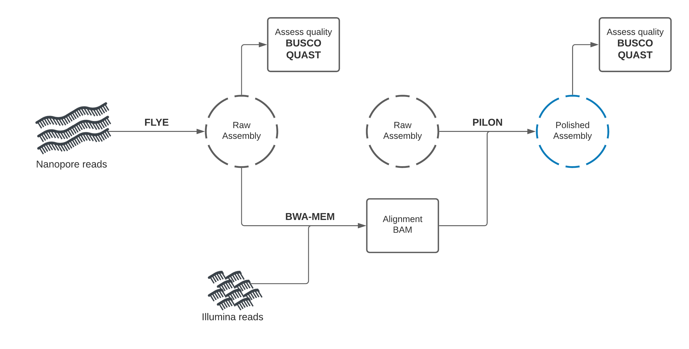
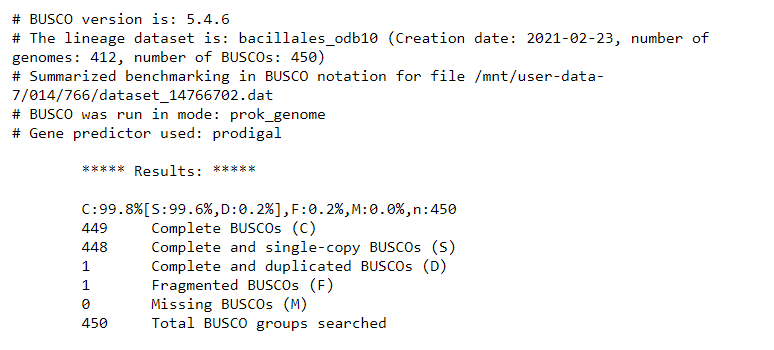
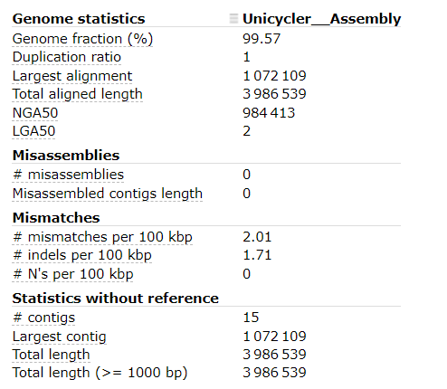

{: style="padding-right:100px"}

# Hybrid genome assembly - Nanopore and Illumina

Anticipated workshop duration when delivered to a group of participants is **2 hours**.  

For queries relating to this workshop, contact Melbourne Bioinformatics (bioinformatics-training@unimelb.edu.au).

## Overview

### Topic

* [x] Genomics
* [ ] Transcriptomics
* [ ] Proteomics
* [ ] Metabolomics
* [ ] Statistics and visualisation
* [ ] Structural Modelling
* [x] Basic skills

### Skill level

* [x] Beginner  
* [ ] Intermediate  
* [ ] Advanced  

This workshop is designed for participants with no command line knowledge. A web-based platform called Galaxy will be used to run our analysis.

How do long- and short-read assembly methods differ?

### Description

*Assemble a genome! Learn how to create and assess genome assemblies using the powerful combination of nanopore and illumina reads*

This tutorial explores how long and short read data can be combined to produce a high-quality 'finished' bacterial genome sequence. Termed 'hybrid assembly', we will use read data produced from two different sequencing platforms, Illumina (short read) and Oxford Nanopore Technologies (long read), to reconstruct a bacterial genome sequence.

In this tutorial we will perform '*de novo* assembly'. De novo assembly is the process of assembling a genome from scratch using only the sequenced reads as input - no reference genome is used.  This approach is common practise when working with microorganisms, and has seen increasing use for eukaryotes (including humans) in recent times.  

Using short read data (Illumina) alone for *de novo* assembly will produce a complete genome, but in pieces (commonly called a 'draft genome'). For the genome to be assembled into a single chromosome (plus a sequence for each plasmid), reads would need to be longer than the longest repeated element on the genome (usually ~7,000 base pairs, Note: Illumina reads are 350 base maximum).   Draft bacterial genome sequences are cheap to produce (less than AUD$60) and useful (>300,000 draft *Salmonella enterica* genome sequences published at NCBI https://www.ncbi.nlm.nih.gov/pathogens/organisms/), but sometimes you need a high-quality 'finished' bacterial genome sequence.  There are <1,000 are 'finished' or 'closed' *Salmonella enterica* genome sequences.

In these cases, long reads can be used together with short reads to produce a high-quality assembly.  Nanopore long reads (commonly >40,000 bases) can fully span repeats, and reveal how all the genome fragments should be arranged. Long reads currently have higher error rate than short reads, so the combination of technologies is particularly powerful. Long reads provide information on the genome structure, and short reads provide high base-level accuracy.  

Combining read data from the long and short read sequencing platforms allows the production of a complete genome sequence with very few sequence errors, but the cost of the read data is about AUD$ 1,000 to produce the sequence. Understanably, we usually produce a draft genome sequence with very few sequence errors using the Illumina sequencing platform.

Nanopore sequencing technology is rapidly improving, expect the cost difference to reduce!!

**Data:** Nanopore reads, Illlumina reads, bacterial organism (*Bacillus subtilis*) reference genome 
**Tools:** Flye, Pilon, Unicycler, Quast, BUSCO 
**Pipeline:** Hybrid de novo genome assembly - Nanopore draft Illumina polishing 
**Pipeline:** Hybrid de novo genome assembly - Unicycler 

Slides and workshop instructions  
Click [here](https://www.melbournebioinformatics.org.au/tutorials/tutorials/hybrid_assembly/media/hybrid_assembly_slides.pdf) for the slides.  
Click [here](https://www.melbournebioinformatics.org.au/tutorials/tutorials/hybrid_assembly/media/tutorial.pdf) for a printer friendly PDF version of this workshop.  

-------------------------------
## Learning Objectives

At the end of this introductory workshop, you will:

* Understand how Nanopore and Illumina reads can be used together to produce a high quality assembly
* Be familiar with genome assembly and polishing programs
* Learn how to assess the quality of a genome assembly, regardless of whether a reference genome is present or absent
* Be able to assemble an unknown, previously undocumented genome to high-quality using Nanopore and Illumina reads!

-------------------------------
## Requirements and preparation

**Attendees are required to bring their own laptop computers.**  

All data and tools are available on usegalaxy.org.au. You will need a computer to connect to and use their platform.
Before the tutorial, navigate to https://usegalaxy.org.au/ and use your email to create an account. Click "Login or register" in the top navigation bar of galaxy to do this.  

### Preparing your laptop prior to starting this workshop
* No additional software needs to be installed for this workshop.

### Required Data
* No additional data needs to be downloaded for this workshop.

-------------------------------
## Author Information
Written by: Grace Hall  
Melbourne Bioinformatics, The University of Melbourne

Created/Reviewed: September 2020

-------------------------------
## Background

### How do we produce the genomic DNA for a bacterial isolate?

Traditional *in vitro* culture techniques are important. Take a sample (e.g. a swab specimen from an infected sore) and streak a 'loopful' on to solid growth medium that suppoprts the growth of the bacteria. **Technology from the time of Louis Pasteur!**

Mixtures of bacterial types can be sequenced e.g. prepare genomic DNA from environmental samples containing bacteria - water, soil, faecal samples etc. (Whole Metagenome Sequencing)

One colony contains 107 – 108 cells. The genomic DNA extracted from one colony is enough for Illumina sequencing. Larger amounts of genomic DNA are required for Nanopore sequencing.

### Shotgun sequencing - Illumina Sequencing Library

Genomic DNA is prepared for sequencing by fragmenting/shearing: multiple copies of Chromosome + plasmid  --> ~500 bp fragments

Note: Nanopore sequencing - there is usually no need to shear the genomic DNA **specialist methods are used to minimise shearing during DNA preparation**. For Nanopore sequencing the longer the DNA fragments the better!

### The read data

Nanopore & Illumina: fastq format

-------------------------------

## Section 1: Nanopore draft assembly, Illumina polishing

In this section you will use Flye to create a draft genome assembly from Nanopore reads.  
We will perform assembly, then assess the quality of our assembly using two tools: Quast, and BUSCO.

### Getting the data

1. **Make sure you have an instance of Galaxy ready to go.**
    * Navigate to the [Galaxy Australia server](https://usegalaxy.org.au/) and sign in if you have an account.
2. **Copy an existing history**
    * The data you will need is available in an existing Galaxy history. You can create a copy of this history by clicking [here](https://usegalaxy.org.au/u/graceh1024/h/hybrid-de-novo-assembly) and using the import history '+' icon at the top right of the page.  
    
3. **Look at the history you imported**
    * There are 4 files - Nanopore reads, a set of paired-end Illumina reads, and a reference genome for the organism we will assemble.
    * Will we use this reference genome to assess the quality of our assemblies and judge which methods work best.

### A baseline for "high-quality" assemblies

To begin, we will identify what a high-quality assembly looks like.

When running assembly tools, we want to check the quality of assemblies we produce. 
It is paramount that genome assemblies are high-quality for them to be useful.

To get a baseline for what is considered a "high-quality" assembly, we will first run a common assembly QC tool - BUSCO - on a published genome similar to the organism we are working with today. 

In your imported history you should see a "reference_genome.fasta" item. 
This is the published genome we will compare against. 

**QC with BUSCO**

BUSCO analysis uses the presence, absence, or fragmentation of key genes in an assembly to determine is quality.

BUSCO genes are specifically selected for each taxonomic clade, and represent a group of genes which each organism in the clade is expected to possess. At higher clades, 'housekeeping genes' are the only members, while at more refined taxa such as order or family, lineage-specific genes can also be used.

We expect the reference genome to have all of these genes. When running BUSCO, we expect it to find most (if not all) of these in the assembly. 

* Find and select the ***Busco*** tool in the tools panel using the search bar.
* In this tutorial, we know our organism is within the 'Bacillales' order.
* Parameters:
    * ***Sequences to analyse*** - reference_genome.fasta
    * ***Mode***
        * ***Use Augustus instead of Metaeuk*** "Yes, use Augustus"
    * ***Auto-detect or select lineage?*** - "Select lineage"
        * ***Lineage*** - Bacillales
    * ***Which outputs should be generated*** - Tick 'Select/Unselect all' 2 times to get full output list
    * Leave all else default and execute the program.

After the program has run, look at the 'short summary' output. It may look something like this:  

It seems that BUSCO could find almost all expected genes in the reference genome assembly.
 

By looking at the results, we see that we have 449 / 450 Complete BUSCOs, and one Fragmented BUSCO.

This will form the baseline for the BUSCO QC results expected of a high-quality genome assembly. 

From here, we will use our input DNA sequence data to assemble the genome of the sequenced organism, and will compare the QC results to that of the published "reference_genome.fasta" assembly.

 

### Draft assembly with Flye + Nanopore reads

Our first assembly will use the long-read data to create a draft genome, then the short-read data to "polish" (improve) the draft into a better assembly. 

We will start by using a long-read assembly tool called "Flye" to create an assembly using the Nanopore long-read data.

* Making sure you are on the 'Analyse Data' tab of Galaxy, look for the tool search bar at the top of the left panel.
* Search for ***Flye*** and select the tool
* We need to provide some information to Flye. Set the following **parameters** in the tool UI:
    * ***Input reads*** - nanopore_reads.fastq
    * Leave all else default
* Scroll down and run Flye by clicking the blue 'execute' button at the bottom of the page.
* Flye produces a number of outputs. We only need the 'consensus' fasta file. You can delete the other outputs.
* For clarity, the consensus draft assembly can be renamed to something which makes sense, like 'nanopore draft assembly'

Once Flye has run, ***rename*** the "Flye on data2: consensus" output to "Flye: Assembly"

 

### Assessing Flye draft assembly quality

**BUSCO**

We need to check if our assembly is good quality or not. It is paramount that genome assemblies are high-quality for them to be useful.

* Find and select the ***Busco*** tool in the tools panel using the search bar.
* We will assess our Nanopore draft assembly created by Flye.
* In this tutorial, we will suspect that our organism is within the 'Bacillales' order.
* Parameters:
    * ***Sequences to analyse*** - Flye: Assembly
    * ***Mode***
        * ***Use Augustus instead of Metaeuk*** "Yes, use Augustus"
    * ***Auto-detect or select lineage?*** - "Select lineage"
        * ***Lineage*** - Bacillales
    * ***Which outputs should be generated*** - Tick 'Select/Unselect all' 2 times to get full output list
    * Leave all else default and execute the program.

After the program has run, look at the 'short summary' output. It may look something like this:  

The 'full table' is also useful. It gives a detailed list of the genes we are searching for, and information about whether they would missing, fragmented, or complete in our assembly.

Compared with the reference genome BUSCO report, we see that many genes are fragmented or missing. 
Our draft genome assembly isn't as good as the reference genome ***yet***. 

 

**Quast**

Aside from BUSCO, we can use another method to perform assembly QC. 

Quast allows us to compare two assemblies to determine their similarity.

Although the organism we sequenced may be different, we can use Quast to compare our assembly with the provided reference genome to see how similar they are on the individual base level.

* Search for the ***Quast*** tool in the tools panel.
* Parameters:
    * ***Assembly mode*** - "Individual assembly"
    * ***Use customized names for the input files?*** - "No, use dataset names"
    * ***Contigs/scaffolds file*** - Flye: Assembly
    * ***Type of assembly?*** - "Genome"
    * ***Use a reference genome?*** - Yes
    * ***Reference genome*** - reference_genome.fasta
    * Leave all else default
* Execute Quast by clicking 'execute' at the bottom of the page.
* Quast will produce a HTML report summarising it's results. 
* Open the report. It may look something like this:  

* Note the: 
    * Genome fraction (%)
    * \# mismatches per 100 kbp
    * \# indels per 100 kbp
    * \# contigs information

From the output of Quast, our draft assembly seems to have good coverage and not too many contigs. 
 

Unfortunately, the mismatch / indel rate is quite high. 
 

Although we don't expect our organism to be ***identical*** to the supplied reference, we would expect fewer mismatches and indels, as the provided reference genome is ***very*** similar to organism which was sequenced. 

 
 

### Assembly Polishing with Pilon

We should be able improve our assembly with the Illumina reads available and correct some of these errors.

This process involves two steps. We will first align the Illumina reads to our draft assembly, then supply the mapping information to Pilon which will use this alignment information to error-correct our assembly.

Illumina reads have much higher per-base accuracy than Nanopore reads. We will map the Illumina read sets to our draft assembly using a short-read aligner called BWA-MEM, then can give Pilon this alignment file to polish our draft assembly.

 

**Map Illumina reads to draft assembly**

* Search for ***Map with BWA-MEM*** in the tools panel and select
* Parameters:
    * ***Will you select a reference genome from your history or use a built-in index?*** - Use a genome from history and build index
    * ***Use the following dataset as the reference sequence*** - Flye: Assembly
    * ***Single or Paired-end reads*** - Paired
    * ***Select first set of reads*** - illumina_reads_1.fastq
    * ***Select second set of reads*** - illumina_reads_2.fastq
    * Leave all else default and execute the program.

The output will be a BAM file (Binary Alignment Map). This is tabular data recording information about how reads were aligned to the draft assembly.

We can now use this output BAM file as an input to Pilon.

Once BWA-MEM has run, ***rename*** its output to "Flye: Short read alignments"

 

**Polish assembly with Pilon**

* Search for ***pilon*** in the tools panel and select
* Parameters:
    * ***Source for reference genome used for BAM alignments*** - Use a genome from History
        * ***Select a reference genome*** - Flye: Assembly
    * ***Type automatically determined by pilon***
        * ***Input BAM file*** - Flye: Short read alignments
    * ***Variant calling mode*** - No
    * Leave all else default and execute the program.

Pilon gives a single output file - the polished assembly.

Once pilon has finished, ***rename*** its output to "Flye: Polished assembly"

 

**Compare draft and polished assemblies**

We are now interested to see how much pilon improved our draft assembly.

--- QUAST ---

* Run Quast as before with the new "Flye: Polished assembly" data
    * Select the history item for our initial Quast job, then click the rerun  button. This will load the settings used for the previous quast job.
    * Change the ***Use a reference genome? -> Reference genome*** input to "Flye: Polished assembly".
    * Hit the "Run Tool" button to submit the job. 

After Quast has finished, open the HTML report.

Make note of # mismatches per 100 kbp and # indels per 100 kbp.  
Has our assembly improved? 

--- BUSCO --- 

* Run BUSCO as before with the new "Flye: Polished assembly" data
    * Select the history item for our initial Busco job, then click the rerun  button. This will load the settings used for the previous Busco job.
    * Change the ***Sequences to analyse*** input to "Flye: Polished assembly".
    * Hit the "Run Tool" button to submit the job. 

After Busco has finished, open the "short summary" output.

Have we identified more expected genes?

 

**Section Summary**

All going well, the polished assembly should be much higher quality than our draft.

The per-base accuracy of our assembly contigs should have markedly improved. This is reflected in the lower mismatches and indels per 100kbp reported by Quast, and the higher number of complete BUSCO genes. Our contiguity and coverage (as measured by the genome fraction (%) statistic reported by Quast) may not show the same level of improvement, as the polishing step is mainly aimed at improving per-base contig accuracy.

Our next step is to use a purpose-built hybrid de novo assembly tool, and compare its performance with our sequential draft + polishing approach.

 

## Section Questions

Which read set - short or long - was used to create our draft?

Answer (click to reveal)

Long reads (Nanopore) were used to create the draft. Long reads allow excellent recreation of the proper structure of the genome, and adequately handle repeat regions. The drawback of long reads is a higher error rate of the technology compared to short reads. This results in more mismatches and indels. 

How was the draft polished?

Answer (click to reveal)

Illumina reads have higher per-base accuracy than Nanopore. Illumina reads were aligned to the draft assembly, then Pilon used this alignment information to improve locations with errors in the assembly.

How does Quast inform on assembly quality?

Answer (click to reveal)

Quast shows summary information about the assembly contigs. If a reference genome is given, it informs the genome fraction (how much of the reference is covered by the assembly), if any genomic regions appear duplicated, and error information including the rate of mismatches and indels.

How does BUSCO inform on assembly quality?

Answer (click to reveal)

BUSCO does not use a reference genome to compare. It attempts to locate key genes which should be present in the assembly, and reports whether it could/could not find those genes. If a key gene is found, it reports whether the gene was fragmented (errors) or complete.

 
-------------------------------
## Section 2: Purpose-built hybrid assembly tool - Unicycler

In this section we will use a purpose-built tool called Unicycler to perform hybrid assembly.

Unicycler uses our Nanopore and Illumina read sets together as input, and returns an assembly. Once we have created the assembly, we will assess its quality using Quast and BUSCO and compare with our previous polished assembly. We will also perform BUSCO analysis on the supplied reference genome itself, to record a baseline for our theoretical best BUSCO report.

### Hybrid de novo assembly with Unicycler

Unicycler performs assembly in the opposite manner to our approach. Illumina reads are used to create an assembly graph, then Nanopore reads are used to disentangle problems in the graph. The Nanopore reads serve to bridge Illumina contigs, and to reveal how the contigs are arranged sequentially in the genome.

 

**Run Unicycler**

* Find Unicycler in the tools panel. It is listed as ***Create assemblies with Unicycler***
* Run Unicycler using the Nanopore and Illumina read sets.
* Parameters:
    * ***Paired or Single end data?*** - Paired
    * ***Select first set of reads*** - illumina_reads_1.fastq
    * ***Select second set of reads*** - illumina_reads_2.fastq
    * ***Select long reads. If there are no long reads, leave this empty*** - nanopore_reads.fastq  
    (if nanopore_reads.fastq does not appear in the dropdown, its datatype needs to be changed - click then pencil icon next to nanopore_reads.fastq in the history panel -> 'Datatypes' tab -> 'New Type' - fastqsanger)
    * Leave all else default and execute the program.

Unicycler will output three files - the assembly, an assembly graph, and SPAges graphs.  
We are interested in the "Final Assembly" output, which is the assembly as a Fasta file.

Once Unicycler has run, ***rename*** the "Final Assembly" output to "Unicycler: Assembly"

 

### Comparing Unicycler assembly to Nanopore + Illumina polished assembly

BUSCO and Quast can be used again to assess our Unicycler assembly. As a purpose-built tool, it generally produces much better assemblies than our sequential approach. This is reflected as (Quast) a lower number of contigs, lower mismatches and indels per 100kb, and (BUSCO) greater number of BUSCO genes complete.

 

***Run BUSCO*** on the "Unicycler: Assembly" data in your history.

At time of writing, these were the BUSCO results:

It seems that the unicycler assembly is much better than the Flye + Pilon polishing assembly, and produces the same report as the reference genome. Awesome! Looks like this is pretty good. 

 

***Run Quast*** on the "Unicycler: Assembly" data in your history.

At time of writing, these were the BUSCO results:

It seems that the unicycler assembly has:

* Very high Genome fraction (coverage of the reference genome)
* Very few mismatches and indels per 100 kbp
* 15 contigs (compared with the reference genome only having 1 contig)

These results indicate that our Unicycler assembly is high quality, and the organism is extremely similar to the organism of the reference genome.  

To improve our assembly further to be publisable "complete" quality, we would want to reduce the number of contigs (ideally to a single contig). If the organism has plasmids, we would expect a handfull of contigs, likely below 10. 

To do this, the best course of action would be to generate more long-read data. 

 

## Section Questions

Why did we select 'Paired' for our Illumina reads in the Unicycler tool?

Answer (click to reveal)

Our short read set was 'paired-end'. Short read technology can only sequence a few hundred base-pairs in a single read. To provide better structural information, paired-end sequencing was created, where longer fragments (fixed length) are used. A few hundred bp is sequenced at both ends of the fragment, leaving the middle section unsequenced. The reads produced (the mate-pair) from a single fragment are separated by a fixed length, so we know they are nearby in the genome.

Does Unicycler begin by using the Long or Short reads?

Answer (click to reveal)

Unicycler uses short reads first. It creates an assembly graph from short reads, then uses the long reads to provide better structural information of the genome.

How does Unicycler use long reads to improve its assembly graph?

Answer (click to reveal)

The assembly graph produced by short reads has tangled regions. When we don't know how sections of the genome are arranged, tangled regions appear in the graph.  Unicycler uses Nanopore reads which overlap these tangled regions to resolve the proper structure of the genome.

 

-------------------------------
## Conclusion

We have learned two methods for hybrid de novo assembly. The combination of long- and short-read technology is clearly powerful, represented by our ability to create a good assembly with only 25x coverage (100Mb) of Nanopore, and 50x coverage of Illumina reads (200Mb).

To further improve our assembly, extra Nanopore read data may provide most benefit. At 50x coverage (200Mb), we may achieve a single, or few contig assembly with high per-base accuracy.

The development of new purpose-built tools for hybrid de novo assembly like Unicycler have improved the quality of assemblies we can produce. These tools are of great importance and while they already produce great results, they will continue to improve over time.

 

-------------------------------
## Additional reading
Links to additional recommended reading and suggestions for related tutorials. 
Flye: https://github.com/fenderglass/Flye/blob/flye/docs/USAGE.md#algorithm 
Pilon: https://github.com/broadinstitute/pilon/wiki/Methods-of-Operation 
Unicycler: https://github.com/rrwick/Unicycler 
Quast: https://academic.oup.com/bioinformatics/article/29/8/1072/228832 
BUSCO analysis: https://academic.oup.com/bioinformatics/article/31/19/3210/211866 
