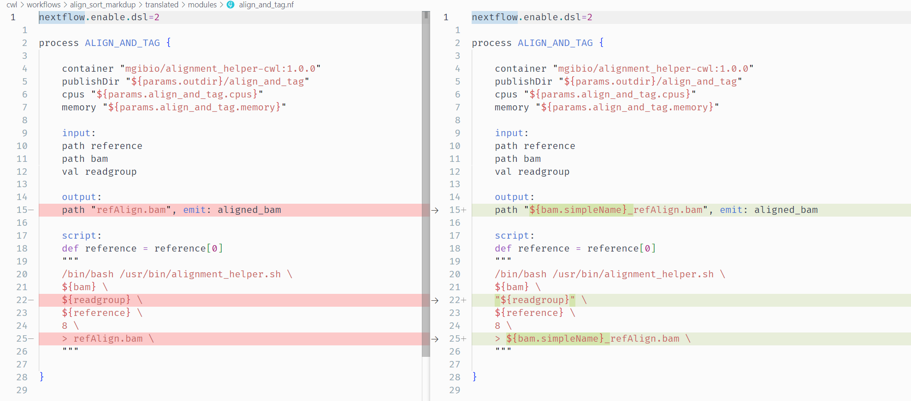
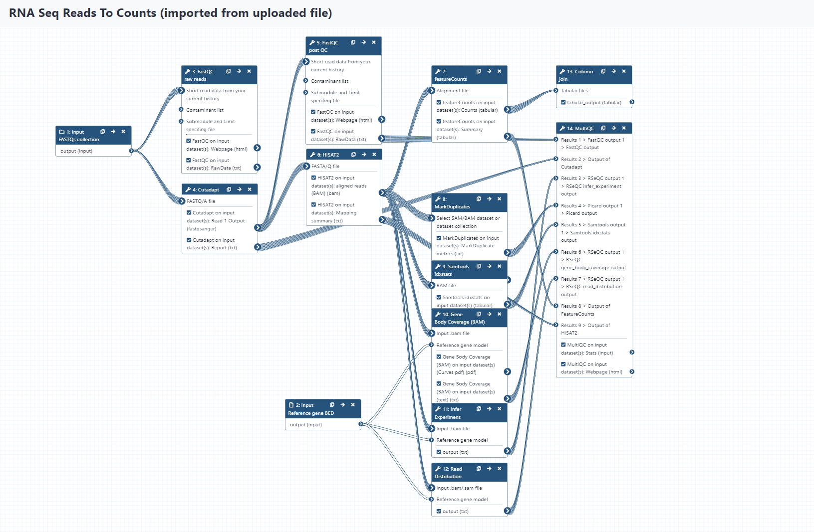
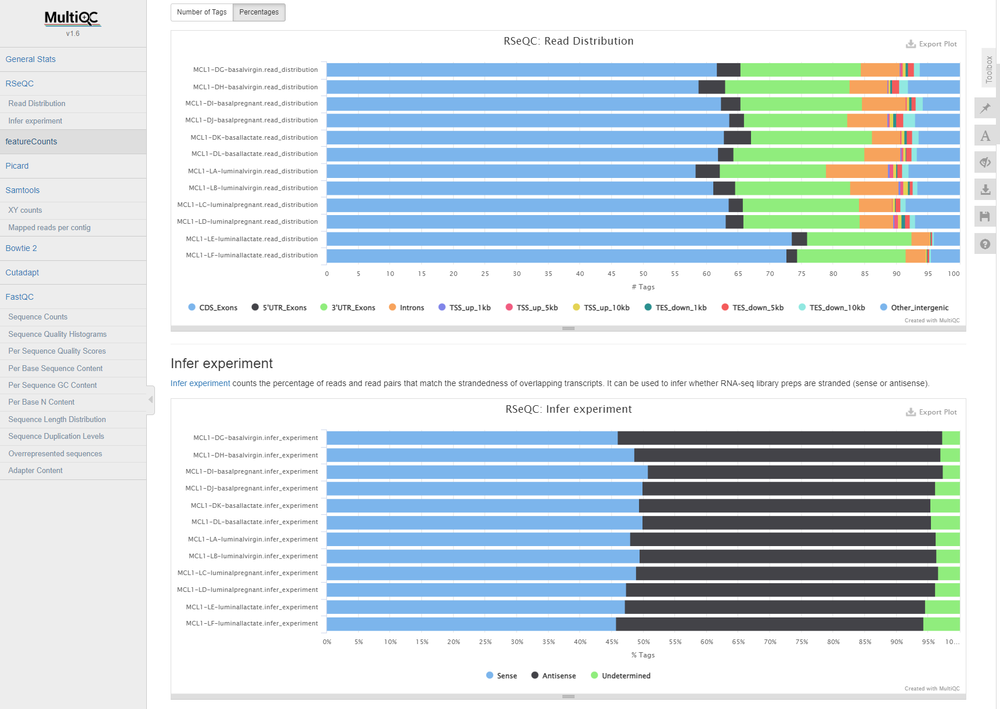

# Janis Translate - Migrating CWL / Galaxy to Nextflow

Anticipated workshop duration when delivered to a group of participants is **3.5 hours**.  

For queries relating to this workshop, contact Melbourne Bioinformatics (bioinformatics-training@unimelb.edu.au).

## Overview

### Topic

* [ ] Genomics
* [ ] Transcriptomics
* [ ] Proteomics
* [ ] Metabolomics
* [ ] Statistics and visualisation
* [ ] Structural Modelling
* [x] Basic skills

### Skill level

* [ ] Beginner  
* [ ] Intermediate  
* [x] Advanced  

The workshop is conducted in a Unix environment.<br>
Command line experience is required. <br>
Prior experience with developing, running, and troubleshooting Nextflow workflows is strongly recommended.

### Description

Bioinformatics workflows are critical for reproducibly transferring methodologies between research groups and for scaling between computational infrastructures. Research groups currently invest a lot of time and effort in creating and updating workflows; the ability to translate from one workflow language into another can make them easier to share, and maintain with minimal effort. For example, research groups that would like to run an existing Galaxy workflow on HPC, or extend it for their use, might find translating the workflow to Nextflow more suitable for their ongoing use-cases. 

***Janis*** is a framework that provides an abstraction layer for describing workflows, and a tool that can translate workflows between existing languages such as CWL, WDL, Galaxy and Nextflow. Janis aims to translate as much as it can, leaving the user to validate the workflow and make small manual adjustments where direct translations are not possible. Originating from the Portable Pipelines Project between Melbourne Bioinformatics, the Peter MacCallum Cancer Centre, and the Walter and Eliza Hall Institute of Medical Research, this tool is now available for everyone to use.

This workshop provides an introduction to Janis and how it can be used to translate Galaxy and CWL based tools and workflows into Nextflow. Using hands-on examples we’ll step you through the process and demonstrate how to optimise, troubleshoot and test the translated workflows.

***Section 1*** covers migration of CWL tools / workflows to Nextflow. <br>
***Section 2*** covers migration of Galaxy tool wrappers / workflows to Nextflow.

-------------------------------

### Learning Objectives

By the end of the workshop you should be able to:
- Recognise the main aspects and benefits of workflow translation
- Use Janis to translated Galaxy / CWL tools & workflows to Nextflow
- Configure Nextflow to run translated tools & workflows
- Troubleshoot translated Nextflow tools & workflow 
- Adjust the translated Nextflow tools / workflows & complete missing translations manually

-------------------------------

### Required Software

- IDE of your choosing (we use VS Code in this workshop).
- Refer back to the [setup instructions document](https://docs.google.com/document/d/1m4MNPNGM0qdMPYqT10uUwk9bYwC5EG0PrUfmuivhJCg/edit?usp=sharing) provided if needed. 

### Required Data
* Sample data will be provided on the compute resource.

-------------------------------

### Author Information

Written by: Grace Hall  
Melbourne Bioinformatics, University of Melbourne

Created/Reviewed: May 2023


<br>

-------------------------------

## Contents

This workshop has 2 main sections. 

We will translate CWL and Galaxy tools and workflows using janis-translate, then will do manual adjustments & run on sample data to check validity.

Section 1: CWL → Nextflow

- [Section 1.1: Samtools Flagstat Tool](#section-11-samtools-flagstat-tool-cwl)
- [Section 1.2: GATK HaplotypeCaller Tool](#section-12-gatk-haplotypecaller-tool-cwl)
- [Section 1.3: Align Sort Markdup Workflow](#section-13-align-sort-markdup-workflow-cwl)

Section 2: Galaxy → Nextflow

- [Section 2.1: Samtools Flagstat Tool](#section-21-samtools-flagstat-tool-galaxy)
- [Section 2.2: Limma Voom Tool](#section-22-limma-voom-tool-galaxy)
- [Section 2.3: RNA-Seq Reads to Counts Workflow](#section-23-rna-seq-reads-to-counts-workflow-galaxy)

<br>

-------------------------------

## Section 1.1: Samtools Flagstat Tool (CWL)

### Introduction

This section demonstrates translation of a basic `samtools flagstat` tool from CWL to Nextflow using `janis translate`. 

The CWL tool used in this section - [samtools_flagstat.cwl](https://github.com/genome/analysis-workflows/blob/master/definitions/tools/samtools_flagstat.cwl) -  is taken from the [McDonnell Genome Institute](https://www.genome.wustl.edu/) (MGI) [analysis-workflows](https://github.com/genome/analysis-workflows) repository. 

This resource stores publically available analysis pipelines for genomics data. <br>
It is a fantastic piece of research software, and the authors thank MGI for their contribution to open-source research software. 

The underlying software run by this tool - [Samtools Flagstat](http://www.htslib.org/doc/samtools-flagstat.html) - displays summary information for an alignment file.

<br>

### Janis Translate

**Downloading Janis Translate**

In this workshop we will use a singularity container to run `janis translate`. 

Containers are great because they remove the need for package managers, and guarantee that the software can run on any machine. 

Singularity is already set up on your VM.

Run the following command to pull the janis image:
```
singularity pull janis.sif docker://pppjanistranslate/janis-translate:0.13.0
```

Check your image by running the following command:
```
singularity exec ~/janis.sif janis translate
```

If the image is working, you should see the janis translate helptext.

<br>

**Downloading Training Data and Tool / Workflow Source Files**

For this workshop we will fetch all needed data from zenodo using wget.  

This archive contains source CWL / Galaxy files, sample data, and finished translations as a reference.

Run the following commands to download & uncompress the zenodo archive:
```
wget https://zenodo.org/record/8052348/files/data.tar.gz
tar -xvf data.tar.gz
```

Inside the data folder we have the following structure: 
```
data
├── final               # finalised translations for your reference
│   ├── cwl
│   └── galaxy
├── sample_data         # sample data to test nextflow processes / workflows
│   ├── cwl
│   └── galaxy
└── source              # CWL / Galaxy files we will translate
    ├── cwl
    └── galaxy
``` 

The test data provided in `data/sample_data` is also available at `/cvmfs/data.biocommons.aarnet.edu.au/training_materials/MelbBio_training/Janis_0723/sample_data/`

<br>

### Running Janis Translate

To translate a tool / workflow,  we use `janis translate`.

```
janis translate --from <src> --to <dest> <filepath>
```

The `--from` argument specifies the workflow language of the source file(s), and `--to` specifies the destination we want to translate to. 

The `<filepath>` argument is the source file we will translate. 

In this section we are translating a single CWL CommandLineTool, so we will only produce a single nextflow file. 


<br>

In this section, we want to translate CWL -> Nextflow, and our source CWL file is in the `data` folder we just downloaded from zenodo. 

It's path is `data/source/cwl/samtools_flagstat.cwl`.

Run the following command:
```
singularity exec ~/janis.sif janis translate --from cwl --to nextflow data/source/cwl/samtools_flagstat.cwl
```

<br>

You will see a folder called `translated/` appear, and a nextflow process called `samtools_flagstat.nf` will be present inside. 

<br>

### Manual Adjustments

The `translated/samtools_flagstat.nf` file should be similar to the following: 

```
nextflow.enable.dsl = 2

process SAMTOOLS_FLAGSTAT {
    
    container "quay.io/biocontainers/samtools:1.11--h6270b1f_0"

    input:
    path bam

    output:
    path "${bam[0]}.flagstat", emit: flagstats

    script:
    def bam = bam[0]
    """
    /usr/local/bin/samtools flagstat \
    ${bam} \
    > ${bam}.flagstat \
    """

}
```

We can see that this nextflow process has a single input, a single output, and calls `samtools flagstat` on the input `bam`. 

We can also see that a container image is available for this tool. In the next section we will run this process using some sample data and the specified container. 

This translation is correct for the `samtools_flagstat.cwl` file and needs no adjusting. <br>
Have a look at the source CWL file to see how they match up. 

<br>

> Note: <br>
> `def bam = bam[0]` in the script block is used to handle datatypes with secondary files. <br>
> The `bam` input is an indexed bam type, so requires a `.bai` file to also be present in the working directory alongside the `.bam` file. <br><br>
> For this reason the `bam` input is supplied as an Array with 2 files - the `.bam` and the `.bai`. <br>
> Here the `def bam = bam[0]` is used so that `bam` refers to the `.bam` file in that Array. 

<br>

### Running Samtools Flagstat as a Workflow

**Collecting Process Outputs**

Let's add a `publishDir` directive to our translated process so that we can capture the outputs of this process.

```
process SAMTOOLS_FLAGSTAT {

    container "quay.io/biocontainers/samtools:1.11--h6270b1f_0"
    publishDir "./outputs"                                          <-
    ....

}                          
```

Nextflow allows us to capture the outputs created by a process using the `publishDir` directive seen above. 

<br>

**Setting up nextflow.config**

To run this process, we will set up a `nextflow.config` file and add some lines to the top of our process definition to turn it into a workflow.

Create a new file called `nextflow.config` in the `translated/` folder alongside `samtools_flagstat.nf`. 

For this workshop, we are using sample data located at `/home2/training/data/sample_data/`. 

Copy and paste the following code into your `nextflow.config` file: 

```
nextflow.enable.dsl = 2
singularity.enabled = true
singularity.cacheDir = "$HOME/.singularity/cache"

params {

    bam = [
        '/home2/training/data/sample_data/cwl/2895499223_sorted.bam',
        '/home2/training/data/sample_data/cwl/2895499223_sorted.bam.bai',
    ]

}
```

This tells nextflow how to run, and sets up an input parameter for our indexed bam input.

The `bam` parameter is a list which provides paths to the `.bam` and `.bai` sample data we will use to test the nextflow translation. From here, we can refer to the indexed bam input as `params.bam` in other files.

<br>

>NOTE<br>
>`nextflow.enable.dsl = 2` ensures that we are using the dsl2 nextflow syntax which is the current standard. <br><br>
>`singularity.enabled = true` tells nextflow to run processes using singularity. Our `samtools_flagstat.nf` has a directive with the form `container "quay.io/biocontainers/samtools:1.11--h6270b1f_0"` provided, so it will use the specified image when running this process. <br> <br>
>`singularity.cacheDir = "$HOME/.singularity/cache"` tells nextflow where singularity images are stored. <br> <br>
> Nextflow will handle the singularity image download and stored it in the cache specified above. If you'd like to use an already available container, you can modify `samtools_flagstat.nf` container directive to `container "/cvmfs/singularity.galaxyproject.org/all/samtools:1.11--h6270b1f_0"`. <br> <br>
> The test data used above is also available at `/cvmfs`, and can be accessed as follow: `bam=['/cvmfs/data.biocommons.aarnet.edu.au/training_materials/MelbBio_training/Janis_0723/sample_data/cwl/2895499223_sorted.bam', '/cvmfs/data.biocommons.aarnet.edu.au/training_materials/MelbBio_training/Janis_0723/sample_data/cwl/2895499223_sorted.bam.bai']`. 

<br>

**Creating Workflow & Passing Data** 

Now that we have the `nextflow.config` file set up, we will add a few lines to `samtools_flagstat.nf` to turn it into a workflow. 

Copy and paste the following lines at the top of `samtools_flagstat.nf`:

```
ch_bam = Channel.fromPath( params.bam ).toList()

workflow {
    SAMTOOLS_FLAGSTAT(ch_bam)
}
```

The first line creates a nextflow `Channel` for our `bam` input and ensures it is a list. <br>
The `Channel.toList()` part collects our files into a list, as both the `.bam` and `.bai` files must be passed together. <br>
The `params.bam` global variable we set up previously is used to supply the paths to our sample data.

The new `workflow {}` section declares the main workflow entry point. <br>
When we run this file, nextflow will look for this section and run the workflow contained within. 

In our case, the workflow only contains a single task, which runs the `SAMTOOLS_FLAGSTAT` process defined below the workflow section. The single `SAMTOOLS_FLAGSTAT` input is being passed data from our `ch_bam` channel we declared at the top of the file. 

<br>

**Running Our Workflow**

Ensure you are in the `translated/` working directory, where `nextflow.config` and `samtools_flagstat.nf` reside. 

```
cd translated
```

To run the workflow using our sample data, we can now write the following command: 
```
nextflow run samtools_flagstat.nf
```

Nextflow will automatically check if there is a `nextflow.config` file in the working directory, and if so will use that to configure itself. Our inputs are supplied in `nextflow.config` alongside the dsl2 & singularity config, so it should run without issue. 

Once completed, we can check the `outputs/` folder to view our results. 

If everything went well, there should be a file called `2895499223_sorted.bam.flagstat` with the following contents:

```
2495 + 0 in total (QC-passed reads + QC-failed reads)
0 + 0 secondary
1 + 0 supplementary
0 + 0 duplicates
2480 + 0 mapped (99.40% : N/A)
2494 + 0 paired in sequencing
1247 + 0 read1
1247 + 0 read2
2460 + 0 properly paired (98.64% : N/A)
2464 + 0 with itself and mate mapped
15 + 0 singletons (0.60% : N/A)
0 + 0 with mate mapped to a different chr
0 + 0 with mate mapped to a different chr (mapQ>=5)

```

<br>

### Conclusion

In section 1.1 we explored how to translate a simple CWL tool to a Nextflow process. 

If needed, you can check the `final/cwl/samtools_flagstat` folder in the zenodo `data/` directory. 
This contains the files we created in this section for your reference. 

We will build on our knowledge in section 1.2 by translating a more complex CWL CommandLineTool definition: *GATK HaplotypeCaller*.

<br>

-------------------------------

## Section 1.2: GATK HaplotypeCaller Tool (CWL)

### Introduction

Now that we have translated a simple CWL CommandLineTool, let's translate a more real-world CommandLineTool. 

This section demonstrates translation of a `gatk HaplotypeCaller` tool from CWL to Nextflow using `janis translate`. <br>

The source CWL file used in this section is taken from the [McDonnell Genome Institute](https://www.genome.wustl.edu/) (MGI) [analysis-workflows](https://github.com/genome/analysis-workflows) repository. 

This repository stores publically available analysis pipelines for genomics data. <br>
It is a fantastic piece of research software, and the authors thank MGI for their contribution to open-source research software. 

The software tool encapsulated by the source CWL - [gatk_haplotype_caller.cwl](https://github.com/genome/analysis-workflows/blob/master/definitions/tools/gatk_haplotype_caller.cwl) - displays summary information for an alignment file. 

<br>

### Janis Translate

As in section 1.1, we will use janis-translate to translate our CWL CommandLineTool to a Nextflow process. 

First, let's make sure we're back in the main training directory
```
cd /home2/training
```

This time, since we already have a `translated/` folder, we will supply the `-o` argument to janis-translate to specify an output directory. 

```
singularity exec ~/janis.sif janis translate -o haplotype_caller --from cwl --to nextflow data/source/cwl/gatk_haplotype_caller.cwl
```

You will see a folder called `haplotype_caller/` appear, and a nextflow process called `gatk_haplotype_caller.nf` will be present inside. 

<br>

### Manual Adjustments

The `haplotype_caller/gatk_haplotype_caller.nf` file should be similar to the following: 

```
nextflow.enable.dsl = 2

process GATK_HAPLOTYPE_CALLER {
    
    container "broadinstitute/gatk:4.1.8.1"

    input:
    path bam
    path reference
    path dbsnp_vcf, stageAs: 'dbsnp_vcf/*'
    val intervals
    val gvcf_gq_bands
    val emit_reference_confidence
    val contamination_fraction
    val max_alternate_alleles
    val ploidy
    val read_filter

    output:
    tuple path("output.g.vcf.gz"), path("*.tbi"), emit: gvcf

    script:
    def bam = bam[0]
    def dbsnp_vcf = dbsnp_vcf[0] != null ? "--dbsnp ${dbsnp_vcf[0]}" : ""
    def reference = reference[0]
    def gvcf_gq_bands_joined = gvcf_gq_bands != params.NULL_VALUE ? "-GQB " + gvcf_gq_bands.join(' ') : ""
    def intervals_joined = intervals.join(' ')
    def contamination_fraction = contamination_fraction != params.NULL_VALUE ? "-contamination ${contamination_fraction}" : ""
    def max_alternate_alleles = max_alternate_alleles != params.NULL_VALUE ? "--max_alternate_alleles ${max_alternate_alleles}" : ""
    def ploidy = ploidy != params.NULL_VALUE ? "-ploidy ${ploidy}" : ""
    def read_filter = read_filter != params.NULL_VALUE ? "--read_filter ${read_filter}" : ""
    """
    /gatk/gatk --java-options -Xmx16g HaplotypeCaller \
    -R ${reference} \
    -I ${bam} \
    -ERC ${emit_reference_confidence} \
    ${gvcf_gq_bands_joined} \
    -L ${intervals_joined} \
    ${dbsnp_vcf} \
    ${contamination_fraction} \
    ${max_alternate_alleles} \
    ${ploidy} \
    ${read_filter} \
    -O "output.g.vcf.gz"
    """

}
```

We can see that this nextflow process has a multiple inputs, single output, and calls `gatk HaplotypeCaller` using the input data we supply to the process.  

<br>

> Notes on translation: <br><br>
> **(1)** `def bam = bam[0]`<br><br>
> This pattern is used in the script block to handle datatypes with secondary files. <br>
> The `bam` input is an indexed bam type, so requires a `.bai` file to also be present in the working directory. <br><br>
> To facilitate this, we supply the `bam` input as a tuple of 2 files:<br> 
> `[filename.bam, filename.bam.bai]`. <br><br>
> `def bam = bam[0]` is used so when we reference `${bam}` in the script body, we are refering to the `.bam` file in that list. <br><br>
> **(2)** `def ploidy = ploidy != params.NULL_VALUE ? "-ploidy ${ploidy}" : ""` <br><br>
> This is how we handle optional val inputs in nextflow. <br>
> Nextflow doesn't like ***null*** values to be passed to process inputs, so we use 2 different tricks to make ***optional*** inputs possible.<br><br>
> For `val` inputs we set up a `NULL_VALUE` param in `nextflow.config` which we use as a placeholder.  <br>
> For `path` inputs (ie files and directories) we set up a ***null*** file rather than passing ***null*** directly. <br>
> This ensures that the file is staged correctly in the working directory when an actual filepath is provided. <br><br>
> The format above is a ternary operator of the form `def myvar = cond_check ? cond_true : cond_false`.<br>
> We are redefining the `ploidy` string variable so that it will be correctly formatted when used in the script block.<br>
> If we supply an actual value, it will take the form `"-ploidy ${ploidy}"`. <br>
> If we supply the placeholder `params.NULL_VALUE` value, it will be a blank string `""`. <br><br>
> **(3)** `def intervals_joined = intervals.join(' ')` <br><br>
> Templates our `intervals` list of strings to a single string.<br>
> Each item is joined by a space: eg `["hello", "there"]` -> `"hello there"`. <br><br>
> **(4)** `def dbsnp_vcf = dbsnp_vcf[0] != null ? "--dbsnp ${dbsnp_vcf[0]}" : ""`<br><br>
> Same as **(2)** except uses a different check for null value, and selects the primary `.vcf.gz` file. <br><br>
> As the `path dbsnp_vcf` input is optional and consists of a `.vcf.gz` and `.vcf.gz.tbi` file, `dbsnp_vcf[0] != null` checks if the primary `.vcf.gz` file is present. <br><br>
> If true, it templates a string we can use in the script body to provide the required argument: `--dbsnp ${dbsnp_vcf[0]}`.<br>
> If false, it templates an empty string.<br><br>
> This ensures that when we use `${dbsnp_vcf}` in the script body, it will be formatted correctly for either case.<br><br>

<br>

This translation is correct for the `gatk_haplotype_caller.cwl` file and needs no adjusting. <br>
Have a look at the source CWL file to see how they match up. 

<br>

### Running GATK HaplotypeCaller as a Workflow


**Collecting Process Outputs**

Let's add a `publishDir` directive to our translated process so that we can capture the outputs of this process.

```
process GATK_HAPLOTYPE_CALLER {

    container "broadinstitute/gatk:4.1.8.1"
    publishDir "./outputs"    
    ...
}                               
```

Nextflow allows us to capture the outputs created by a process using the `publishDir` directive seen above. 

<br>

>NOTE<br>
> Our `gatk_haplotype_caller.nf` has a container directive with the form `container "broadinstitute/gatk:4.1.8.1"` provided, so Nextflow will handle this singularity image download and will use the specified image when running this process (provided that `singularity.enabled` is set to `true` in the nextflow config). <br>
> If you'd like to use an already available container, you can modify this container directive to `container "/cvmfs/singularity.galaxyproject.org/all/gatk4:4.1.8.1--py38_0"`.

<br>

**Setting up nextflow.config**

To run this process, we will set up a `nextflow.config` file and add some lines to the top of our process definition to turn it into a workflow.

Create a new file called `nextflow.config` in the `haplotype_caller/` folder alongside `gatk_haplotype_caller.nf`. 

Copy and paste the following code into your `nextflow.config` file: 

```
nextflow.enable.dsl = 2
singularity.enabled = true
singularity.cacheDir = "$HOME/.singularity/cache"

params {
    NULL_VALUE = 'NULL'

    bam = [
        '/home2/training/data/sample_data/cwl/2895499223_sorted.bam',
        '/home2/training/data/sample_data/cwl/2895499223_sorted.bam.bai',
    ]
    dbsnp = [
        '/home2/training/data/sample_data/cwl/chr17_test_dbsnp.vcf.gz',
        '/home2/training/data/sample_data/cwl/chr17_test_dbsnp.vcf.gz.tbi',
    ]
    reference = [
        '/home2/training/data/sample_data/cwl/chr17_test.fa',
        '/home2/training/data/sample_data/cwl/chr17_test.dict',
        '/home2/training/data/sample_data/cwl/chr17_test.fa.fai',
    ]
    gvcf_gq_bands = NULL_VALUE
    intervals = ["chr17"]
    emit_reference_confidence = 'GVCF'
    contamination_fraction = NULL_VALUE
    max_alternate_alleles = NULL_VALUE
    ploidy = NULL_VALUE
    read_filter = NULL_VALUE
}
```
This tells nextflow how to run, and sets up the sample data as inputs.

*file inputs*

The `bam` parameter is a list which provides paths to the `.bam` and `.bai` sample data we will use to test the nextflow translation. From here, we can refer to the indexed bam input as `params.bam` in other files. The `dbsnp` and `reference` params follow this same pattern. 

*non-file inputs*

We also set up a `NULL_VALUE` param which we use as a *placeholder* for a null value. <br> 
In this case we are providing null values for the `gvcf_gq_bands`, `contamination_fraction`, `max_alternate_alleles`, `ploidy` and `read_filter` inputs as they are all optional.

<br>

**Creating Workflow & Passing Data** 

Now that we have the `nextflow.config` file set up, we will add a few lines to `gatk_haplotype_caller.nf` to turn it into a workflow. 

Copy and paste the following lines at the top of `gatk_haplotype_caller.nf`:

```
ch_bam = Channel.fromPath( params.bam ).toList()
ch_dbsnp = Channel.fromPath( params.dbsnp ).toList()
ch_reference = Channel.fromPath( params.reference ).toList()

workflow {

    GATK_HAPLOTYPE_CALLER(
        ch_bam,
        ch_reference,
        ch_dbsnp,
        params.intervals,
        params.gvcf_gq_bands,
        params.emit_reference_confidence,
        params.contamination_fraction,
        params.max_alternate_alleles,
        params.ploidy,
        params.read_filter,
    )

}
```

The first 3 lines create nextflow `Channels` for our `bam`, `dbsnp`, and `reference` inputs and ensures they are lists.

The `Channel.toList()` aspect collects our files into a list, as the primary & secondary files for these datatypes must be passed together as a tuple.

The `params.bam`, `params.dbsnp` and `params.reference` global variables we set up previously are used to supply the paths to our sample data for these channels.

The new `workflow {}` section declares the main workflow entry point. <br>
When we run this file, nextflow will look for this section and run the workflow contained within. 

In our case, the workflow only contains a single task, which runs the `GATK_HAPLOTYPE_CALLER` process defined below the workflow section. We call `GATK_HAPLOTYPE_CALLER` by feeding inputs in the correct order, using the channels we declared at the top of the file, and variables we set up in the global `params` object. 

<br>

**Running Our Workflow**

Ensure you are in the `haplotype_caller/` working directory, where `nextflow.config` and `gatk_haplotype_caller.nf` reside. 
```
cd haplotype_caller
```

To run the workflow using our sample data, we can now write the following command: 
```
nextflow run gatk_haplotype_caller.nf
```

Nextflow will automatically check if there is a `nextflow.config` file in the working directory, and if so will use that to configure itself. Our inputs are supplied in `nextflow.config` alongside the dsl2 & singularity config, so it should run without issue. 

Once completed, we can check the `outputs/` folder to view our results. <br>
If everything went well, the `outputs/` folder should contain 2 files: 

- `output.g.vcf.gz`
- `output.g.vcf.gz.tbi`

<br>

### Conclusion

In this section we explored how to translate the `gatk_haplotype_caller` CWL CommandLineTool to a Nextflow process. 

This is a more real-world situation, where the CommandLineTool has multiple inputs, secondary files, and optionality. 

If needed, you can check the `final/cwl/gatk_haplotype_caller/` folder inside our `data/` directory which contains the files we created in this tutorial as reference.  

Now that we have translated two CWL CommandLineTools, we will translate a full CWL Workflow into Nextflow.

<br>

-------------------------------

## Section 1.3: Align Sort Markdup Workflow (CWL)

### Introduction

This section demonstrates translation of a CWL Workflow to Nextflow using `janis translate`. 

The workflow used in this tutorial is taken from the [McDonnell Genome Institute](https://www.genome.wustl.edu/) (MGI) [analysis-workflows](https://github.com/genome/analysis-workflows) repository. 

This resource stores publically available analysis pipelines for genomics data. <br>
It is a fantastic piece of research software, and the authors thank MGI for their contribution to open-source research software. 

The workflow using in this tutorial - [align_sort_markdup.cwl](https://github.com/genome/analysis-workflows/blob/master/definitions/subworkflows/align_sort_markdup.cwl) - accepts multiple unaligned readsets as input and produces a single polished alignment bam file. 

***Main Inputs*** 

- Unaligned reads stored across multiple BAM files
- Reference genome index

***Main Outputs***

- Single BAM file storing alignment for all readsets

***Steps***

- Read alignment (run in parallel across all readsets) - `bwa mem`
- Merging alignment BAM files to single file - `samtools merge`
- Sorting merged BAM by coordinate - `sambamba sort`
- Tagging duplicate reads in alignment - `picard MarkDuplicates` 
- Indexing final BAM - `samtools index`

<br>

### Janis Translate

Previously we were translating single CWL CommandLineTools, but in this section we are translating a full CWL workflow. 

To translate a workflow, we supply the main CWL workflow file to janis translate. <br>
In addition to the main CWL Workflow, all Subworkflows / CommandLineTools will be detected & translated.

First, let's make sure we're back in the main training directory
```
cd /home2/training
```

In this section, we are translating CWL -> Nextflow, and our source CWL file is located at `data/source/cwl/align_sort_markdup/subworkflows/align_sort_markdup.cwl` relative to this document.

We will add the `-o align_sort_markdup` argument to specify this as the output directory. 

To translate, run the following command:
```
singularity exec ~/janis.sif janis translate -o align_sort_markdup --from cwl --to nextflow data/source/cwl/align_sort_markdup/subworkflows/align_sort_markdup.cwl
```

<br>

### Translation Output

The output translation will contain multiple files and directories.<br>
You will see a folder called `align_sort_markdup/` appear - inside this folder, we should see the following structure:

```
align_sort_markdup
├── main.nf                             # main workflow (align_sort_markdup)
├── modules                             # folder containing nextflow processes
│   ├── align_and_tag.nf
│   ├── index_bam.nf
│   ├── mark_duplicates_and_sort.nf
│   ├── merge_bams_samtools.nf
│   └── name_sort.nf
├── nextflow.config                     # config file to supply input information
├── subworkflows                        # folder containing nextflow subworkflows
│   └── align.nf    
└── templates                           # folder containing any scripts used by processes
    └── markduplicates_helper.sh
```

Now that we have performed translation using `janis translate`, we need to check the translated workflow for correctness.  

From here, we will do a test-run of the workflow using sample data, and make manual adjustments to the translated workflow where needed. 

<br>

### Running the Translated Workflow

**Inspect main.nf**

The main workflow translation appears as `main.nf` in the `align_sort_markdup/` folder. <br>

This filename is just a convention, and we use it to provide clarity about the main entry point of the workflow. <br>
In our case `main.nf` is equivalent to the main CWL Workflow file we translated: `align_sort_markdup.cwl`. 

<br>

> NOTE: <br>
> Before continuing, feel free to have a look at the other nextflow files which have been generated during translation:<br>
> Each CWL Subworkflow appears as a nextflow `workflow` in the `subworkflows/` directory.<br>
> Each CWL CommandLineTool appears as a nextflow `process` in the `modules/` directory. 

<br>

In `main.nf` we see the nextflow workflows / processes called by the main workflow:

```
include { ALIGN } from './subworkflows/align'
include { INDEX_BAM } from './modules/index_bam'
include { MARK_DUPLICATES_AND_SORT } from './modules/mark_duplicates_and_sort'
include { MERGE_BAMS_SAMTOOLS as MERGE } from './modules/merge_bams_samtools'
include { NAME_SORT } from './modules/name_sort'
```

We also see that some nextflow `Channels` and a single `variable` have been set up. <br>
These are used to supply data according to nextflow's adoption of the *dataflow* programming model.
```
// data which will be passed as channels
ch_bams        = Channel.fromPath( params.bams ).toList()
ch_readgroups  = Channel.of( params.readgroups ).toList()

// data which will be passed as variables
reference  = params.reference.collect{ file(it) }
```

Focusing on the channel declarations, we want to note a few things:

- `ch_bams` is analygous to the *'bams'* input in `align_sort_markdup.cwl`. <br>
It declares a queue channel which expects the data supplied via `params.bams` are `path` types. <br>
It then groups the bams together as a sole emission using `.toList()`. <br>
We will need to set up `params.bams` to supply this data.

- `ch_readgroups` is analygous to the *'readgroups'* input in `align_sort_markdup.cwl`. <br>
It is the same as `ch_bams`, except it requires `val` types rather than `path` types. <br>
We will need to set up `params.readgroups` to supply this data.

We also see a new variable called `reference` being created. 

This `reference` var is analygous to the *'reference'* input in `align_sort_markdup.cwl`. 
It collects the *'reference'* primary & secondary files together in a list. 

We will need to set up `params.reference` to supply this data. 

<br>

> Note: Why does `reference` appear as a variable, rather than a `Channel`? <br><br>
> In Nextflow, we find it is best to create Channels for data that ***moves*** through the pipeline. <br>
> The `ch_bams` channel is created because we want to consume / transform the input bams during the pipeline. <br> <br>
> On the other hand, the `reference` genome variable is not something we really want to consume or transform.  <br>
> It's more like static helper data which can be used by processes, but it doesn't ***move*** through our pipeline, and definitely shouldn't be consumed or transformed in any way. 

<br>

> Note: `.toList()` <br><br>
> Nextflow queue channels work differently to lists. <br>
> Instead of supplying all items together, queue channels emit each item separately. <br> 
> This results in a separate task being spawned for each item in the queue when the channel is used. <br>
> As the CWL workflow input specifies that `bams` is a list, we use `.toList()` to group all items as a sole emission. <br>
> This mimics a CWL array which is the datatype of the `bams` inputs. <br><br>
> As it turns out, the CWL workflow ends up running the `align` step in parallel across the `bams` & `readgroups` inputs. <br><br>
> Parallelisation in nextflow happens by default. <br>
> To facilitate this, the `.flatten()` method is called on  `ch_bams` and `ch_readgroups` when used in the `ALIGN` task. <br>
> This emits items in `ch_bams` and `ch_readgroups` individually, spawning a new `ALIGN` task for each pair. <br><br>
> We're kinda doing redundant work by calling `.toList()`, then `.flatten()` when `ch_bams` and `ch_readgroups` are used.<br>
> `janis translate` isn't smart enough yet to detect this yet, but may do so in future. 

<br>

Continuing down `main.nf`, we see the main `workflow {}` has 5 tasks. 

Each task has been supplied values according to the source workflow.
Comments display the name of the process/workflow input which is being fed a particular value. 

```
workflow {

    ALIGN(
        ch_bams.flatten(),       // bam
        ch_reference,            // reference
        ch_readgroups.flatten()  // readgroup
    )

    INDEX_BAM(
        MARK_DUPLICATES_AND_SORT.out.sorted_bam.map{ tuple -> tuple[0] }  // bam
    )

    MARK_DUPLICATES_AND_SORT(
        params.mark_duplicates_and_sort.script,  // script
        NAME_SORT.out.name_sorted_bam,           // bam
        params.NULL_VALUE,                       // input_sort_order
        params.final_name                        // output_name
    )

    MERGE(
        ALIGN.out.tagged_bam.toList(),  // bams
        params.final_name               // name
    )

    NAME_SORT(
        MERGE.out.merged_bam  // bam
    )

}
```

Before `main.nf` can be run, we will need to supply values for the `params` variables. 
This is done in `nextflow.config`. 

<br>

**Inspect nextflow.config**

To test the translated workflow, we will first set up workflow inputs in `nextflow.config`. 

Before running a workflow, nextflow will attempt to open `nextflow.config` and read in config information and global *param* variables from this file. 
We use this file to tell nextflow how to run and to supply workflow inputs.

Inside the `align_sort_markdup/` folder you will see that `nextflow.config` is already provided. 

Janis translate creates this file to provide clarity about the necessary workflow inputs, and to set some other config variables. 

Open `nextflow.config` and have a look at the contents. It should look similar to the following: 

```
nextflow.enable.dsl = 2
singularity.enabled = true
singularity.cacheDir = "$HOME/.singularity/cache"

params {
    
    // Placeholder for null values.
    // Do not alter unless you know what you are doing.
    NULL_VALUE = 'NULL'

    // WORKFLOW OUTPUT DIRECTORY
    outdir  = './outputs'

    // INPUTS (MANDATORY)
    bams        = []          // (MANDATORY array)             eg. [file1, ...]
    reference   = []          // (MANDATORY fastawithindexes)  eg. [fasta, amb, ann, bwt, dict, fai, pac, sa]
    readgroups  = NULL_VALUE  // (MANDATORY array)             eg. [string1, ...]

    // INPUTS (OPTIONAL)
    final_name  = "final.bam" 

    // PROCESS: ALIGN_AND_TAG
    align_and_tag.cpus    = 8     
    align_and_tag.memory  = 20000 

    // PROCESS: INDEX_BAM
    index_bam.memory  = 4000 

    // PROCESS: MARK_DUPLICATES_AND_SORT
    mark_duplicates_and_sort.script  = "/home2/training/align_sort_markdup/templates/markduplicates_helper.sh" 
    mark_duplicates_and_sort.cpus    = 8                                                                       
    mark_duplicates_and_sort.memory  = 40000                                                                   

    // PROCESS: MERGE_BAMS_SAMTOOLS
    merge_bams_samtools.cpus    = 4    
    merge_bams_samtools.memory  = 8000 

    // PROCESS: NAME_SORT
    name_sort.cpus    = 8     
    name_sort.memory  = 26000 

}

```

<br>

> NOTE: `NULL_VALUE = 'NULL'`<br><br>
> Nextflow doesn't like `null` values to be passed to process inputs. <br>
> This is a challenge for translation as other languages allow `optional` inputs. <br>
> To get around this, Janis Translate sets the `params.NULL_VALUE` variable as a `null` placeholder for `val` type inputs. <br>
> You will see this being used in nextflow processes to do optionality checking.

<br>

The auto-generated `nextflow.config` splits up workflow inputs using some headings. 

```
// INPUTS (MANDATORY)
```
Workflow inputs which are required to run the workflow. We must provide a value for these. 

```
// INPUTS (OPTIONAL)
```
Workflow inputs which are not required to run the workflow. These are optional. 

```
// PROCESS: ALIGN_AND_TAG
```
Inputs which are specific to a particular process. These are usually static values rather than files.  
May be *mandatory* or *optional*. 

<br>

**Setting up Workflow Inputs**

Janis Translate will enter values for workflow inputs where possible. 
Others need to be manually supplied as they are specific to the input data you wish to use. 

In our case, we need to supply values for those under the `// INPUTS (MANDATORY)` heading. 
Specifically, we need to provide sample data for the `bams`, `reference`, and `readgroups` inputs. 

Additionally, the `cpu` and `memory` params need to be changed. 

The source CWL Workflow has compute requirements set greater than what is available on your VM. 

Copy and paste the following text, to override the current `nextflow.config` file:

```
nextflow.enable.dsl = 2
singularity.enabled = true
singularity.cacheDir = "$HOME/.singularity/cache"

params {
    
    // Placeholder for null values.
    // Do not alter unless you know what you are doing.
    NULL_VALUE = 'NULL'

    // WORKFLOW OUTPUT DIRECTORY
    outdir  = './outputs'

    // INPUTS (MANDATORY)
    bams        = [
        "/home2/training/data/sample_data/cwl/2895499223.bam",
        "/home2/training/data/sample_data/cwl/2895499237.bam",
    ]
    reference   = [
        "/home2/training/data/sample_data/cwl/chr17_test.fa",
        "/home2/training/data/sample_data/cwl/chr17_test.fa.amb",
        "/home2/training/data/sample_data/cwl/chr17_test.fa.ann",
        "/home2/training/data/sample_data/cwl/chr17_test.fa.bwt",
        "/home2/training/data/sample_data/cwl/chr17_test.fa.fai",
        "/home2/training/data/sample_data/cwl/chr17_test.dict",
        "/home2/training/data/sample_data/cwl/chr17_test.fa.pac",
        "/home2/training/data/sample_data/cwl/chr17_test.fa.sa",
    ] 
    readgroups  = [
        '@RG\tID:2895499223\tPU:H7HY2CCXX.3.ATCACGGT\tSM:H_NJ-HCC1395-HCC1395\tLB:H_NJ-HCC1395-HCC1395-lg24-lib1\tPL:Illumina\tCN:WUGSC',
        '@RG\tID:2895499237\tPU:H7HY2CCXX.4.ATCACGGT\tSM:H_NJ-HCC1395-HCC1395\tLB:H_NJ-HCC1395-HCC1395-lg24-lib1\tPL:Illumina\tCN:WUGSC'
    ]

    // INPUTS (OPTIONAL)
    final_name  = "final.bam" 

    // PROCESS: ALIGN_AND_TAG
    align_and_tag.cpus    = 4     
    align_and_tag.memory  = 10000 

    // PROCESS: INDEX_BAM
    index_bam.memory  = 10000 

    // PROCESS: MARK_DUPLICATES_AND_SORT
    mark_duplicates_and_sort.script  = "/home2/training/align_sort_markdup/templates/markduplicates_helper.sh" 
    mark_duplicates_and_sort.cpus    = 4
    mark_duplicates_and_sort.memory  = 10000                         

    // PROCESS: MERGE_BAMS_SAMTOOLS
    merge_bams_samtools.cpus    = 4    
    merge_bams_samtools.memory  = 10000 

    // PROCESS: NAME_SORT
    name_sort.cpus    = 4     
    name_sort.memory  = 10000 

}

```

<br>

**Run the Workflow**

Ensure you are in the `align_sort_markdup/` working directory, where `nextflow.config` and `main.nf` reside. 

If not, use the following to change directory. 
```
cd align_sort_markdup
```

To run the workflow using our sample data, we can now write the following command: 
```
nextflow run main.nf
```

While the workflow runs, you will encounter this error:

```
Access to 'MARK_DUPLICATES_AND_SORT.out' is undefined since the process 'MARK_DUPLICATES_AND_SORT' has not been invoked before accessing the output attribute
```

This is somewhat expected. Janis translate doesn't produce perfect translations - just the best it can do. 

This is the first of ***3*** errors we will encounter and fix while making this workflow runnable. 


<br>

### Manual Adjustments

Translations performed by `janis translate` often require manual changes due to the difficulty of translating between languages with non-overlapping feature sets. 

In this section we will fix ***3 errors*** to bring the translation to a finished state. 

<br>

> NOTE <br>
> If having trouble during this section, the finished workflow is available in the `data/final/cwl/align_sort_markdup` folder for reference.

<br>

### Error 1: Process Order

**Error message**

The first issue we need to address is caused by tasks being in the wrong order. 

```
Access to 'MARK_DUPLICATES_AND_SORT.out' is undefined since the process 'MARK_DUPLICATES_AND_SORT' has not been invoked before accessing the output attribute
```

This nextflow error message is quite informative, and tells us that a task is trying to access the output of `MARK_DUPLICATES_AND_SORT` before it has run. 

The offending task is `INDEX_BAM` as it uses `MARK_DUPLICATES_AND_SORT.out.sorted_bam.map{ tuple -> tuple[0] }` as an input value to the process. 

<br>

**Troubleshooting**

It seems that a nextflow process is trying to run before a prior process has finished. 

This is most likely due to the processes in our `main.nf` workflow being in the wrong order. 

Let's look at the source CWL `align_sort_markdup.cwl` workflow to view the correct order of steps:

```
steps:
    align:
        ...
    merge:
        ...
    name_sort:
        ...
    mark_duplicates_and_sort:
        ...
    index_bam:
        ...

```

This differs from our translated `main.nf` which has the following order:

```
workflow {

    ALIGN(
        ...
    )

    INDEX_BAM(
        ...
    )

    MARK_DUPLICATES_AND_SORT(
        ...
    )

    MERGE(
        ...
    )

    NAME_SORT(
        ...
    )

}
```

<br>

**Solution**

We will need to rearrange the process calls in `main.nf` so they mirror the order seen in the source CWL. 

!!! question "Rerranging process calls"
    Cut-and-paste the process calls to be in the correct order in the main workflow.

    ??? hint "Correct Order"

        1. ALIGN
        2. MERGE
        3. NAME_SORT
        4. MARK_DUPLICATES_AND_SORT
        5. INDEX_BAM

    ??? hint "Show Workflow"

        ```
        workflow {

            ALIGN(
                ch_bams.flatten(),       // ch_bam
                reference,               // ch_reference
                ch_readgroups.flatten()  // ch_readgroup
            )

            MERGE(
                ALIGN.out.tagged_bam.toList(),  // bams
                params.final_name               // name
            )
            
            NAME_SORT(
                MERGE.out.merged_bam  // bam
            )

            MARK_DUPLICATES_AND_SORT(
                params.mark_duplicates_and_sort.script,  // script
                NAME_SORT.out.name_sorted_bam,           // bam
                params.NULL_VALUE,                       // input_sort_order
                params.final_name                        // output_name
            )

            INDEX_BAM(
                MARK_DUPLICATES_AND_SORT.out.sorted_bam.map{ tuple -> tuple[0] }  // bam
            )

        }
        ```

After you are done, rerun the workflow by using the same command as before.

```
nextflow run main.nf
```

<br>

### Error 2: Unquoted Strings

**Error message**

The second error is due to the `readgroup` input of the `ALIGN_AND_TAG` process being used without enclosing quotes. 

```
Caused by:
Process `ALIGN:ALIGN_AND_TAG (1)` terminated with an error exit status (1)

Command executed:
/bin/bash /usr/bin/alignment_helper.sh     2895499223.bam     @RG INCLID:2895499223RY_PU:H7HY2CCXX.3.ATCACGGTITY=ISM:H_NJ-HCC1395-HCC1395ILB:H_NJ-HCC1395-HCC1395-lg24-lib1LEVEL=5PL:IlluminaSCN:WUGSC     chr17_test.fa          8     > refAlign.bam
```

The issue can be seen in the command above. 

We see `/bin/bash /usr/bin/alignment_helper.sh   2895499223.bam` which is expected. <br>
This is then followed by what looks like 2 string arguments: `@RG` and `INCLID...`.<br>
This is causing the problem.

<br>

**Troubleshooting**

The `Command executed` section in nextflow error messages is particularly useful. <br> 
This message is printed to the shell, but can also be seen by navigating to the process working directory & viewing `.command.sh`. 

Let's look at the nextflow `ALIGN_AND_TAG` process so we can match up which process input is causing the error. <br>
Indiviual arguments have been marked with their (position) to aid our investigation. 

```
process ALIGN_AND_TAG {
    
    container "mgibio/alignment_helper-cwl:1.0.0"
    publishDir "${params.outdir}/align_and_tag"
    cpus "${params.align_and_tag.cpus}"
    memory "${params.align_and_tag.memory}"

    input:
    path reference
    path bam
    val readgroup

    output:
    path "refAlign.bam", emit: aligned_bam

    script:
    def reference = reference[0]
    """
    (1) /bin/bash (2) /usr/bin/alignment_helper.sh \
    (3) ${bam} \
    (4) ${readgroup} \
    (5) ${reference} \
    (6) 8 \
    (7) > (8) refAlign.bam  
    """

}
```

Here is the command executed with the same numbering:

```
(1) /bin/bash (2) /usr/bin/alignment_helper.sh  (3) 2895499223.bam     (4) @RG (5) ID:2895499223	PU:H7HY2CCXX.3.ATCACGGT	SM:H_NJ-HCC1395-HCC1395	LB:H_NJ-HCC1395-HCC1395-lg24-lib1	PL:Illumina	CN:WUGSC   (6) chr17_test.fa        (7) 8  (8) >  (9) refAlign.bam 
```

Matching up the two, we can see that arguments `(1-3)` match their expected values. <br>
Argument `(4)` starts out right, as we expect the `readgroup` input. 

Looking in the `script:` section of the nextflow process, we expect the `${reference}` input to appear as argument `(5)`, but in the actual command it appears as argument `(6)` `chr17_test.fa`.

The issue seems to be that the `readgroup` input has been split into 2 strings, instead of 1 single string. <br>
By tracing back through the workflow, we can track that `params.readgroups` supplies the value for `readgroup` in this nextflow process:

```
modules/align_and_tag.nf:  readgroup
subworkflows/align.nf:     ch_readgroup
main.nf:                   ch_readgroups.flatten()
main.nf:                   ch_readgroups  = Channel.of( params.readgroups ).toList()
```

Looking at `nextflow.config` we see that this particular readgroup value is supplied as follows:

```
@RG\tID:2895499223\tPU:H7HY2CCXX.3.ATCACGGT\tSM:H_NJ-HCC1395-HCC1395\tLB:H_NJ-HCC1395-HCC1395-lg24-lib1\tPL:Illumina\tCN:WUGSC
```

The `@RG` being split from the rest of the readgroup value, and the text which follows is incorrect in the command.  

The issue here is that this value in `params.readgroups` contains spaces and tabs (`\t`). <br>
When used in a nextflow process, string arugments should be enclosed  using `""`. 

<br>

**Solution**

Back in the `modules/align_and_tag.nf` file, let's properly enclose the `readgroup` input in quotes. 

!!! question "align_and_tag.nf"
    In the `ALIGN_AND_TAG` process script enclose the `${readgroup}` reference in quotes.

    ??? hint "Show Change"
        ```
        script:
        def reference = reference[0]
        """
        /bin/bash /usr/bin/alignment_helper.sh \
        ${bam} \
        "${readgroup}" \              <- quotes added
        ${reference} \
        8 \
        > refAlign.bam 
        """
        ```

After you are have made the change, re-run the workflow by using the same command as before:

```
nextflow run main.nf
```

<br>

### Error 3: Filename Clashes

**Error Message**

The final error is flagged by the nextflow workflow engine. 

Upon re-running the workflow, you will encounter the following message:
```
Process `MERGE` input file name collision -- There are multiple input files for each of the following file names: refAlign.bam
```

This informs us that more than 1 file with the name `refAlign.bam` have been inputs to `MERGE` process. 

Nextflow does not allow this behaviour. <br>

Other workflow engines use temporary names for files so that name clashes are impossible. <br> 
Nextflow requires us to be more specific with our filenames so we can track which file is which. 

This is not a hard-and-fast rule of workflow engines, but nextflow enforces using unique names to encourage best-practises. 

<br>

**Troubleshooting**

To track the cause, let's look at the data which feeds the `MERGE` process. 

`main.nf`
```
MERGE(
    ALIGN.out.tagged_bam.toList(),  // bams
    params.final_name               // name
)
```

We can see the translated nextflow workflow is collecting the `tagged_bam` output of all `ALIGN` tasks as a list using `.toList()`. <br>
This value feeds the `bams` input of the `MERGE` process. 

The issue is that 2+ files in this list must have the same filename: "refAlign.bam".<br>
We need to see how files end up being placed into `ALIGN.out.tagged_bam` to track where the error is occuring. 

Looking in the `ALIGN` subworkflow in `subworkflows/align.nf`, we see the offending `tagged_bam` output emit. <br>
This gets its data from the `aligned_bam` output of the `ALIGN_AND_TAG` process in `modules/align_and_tag.nf`. 

The source of the issue must be that the `aligned_bam` output is producing the same filename each time the task is run. 

Opening `modules/align_and_tag.nf` we can see how the `align_bam` output is created & collected:
```
    output:
    path "refAlign.bam", emit: aligned_bam          <-

    script:
    def reference = reference[0]
    """
    /bin/bash /usr/bin/alignment_helper.sh \
    ${bam} \
    "${readgroup}" \
    ${reference} \
    8 \
    > refAlign.bam                                  <-
    """
```

From looking at the `output` and `script` section of this process, we can see that the `aligned_bam` output will always have the same filename. 

In the script, we generate a file called `refAlign.bam` by redirecting `stdout` to this file. <br>
In the output, `refAlign.bam` is collected as the output. 

This would be fine if our workflow was supplied only a single BAM input file, but we want our workflow to run when we have many BAMs. 

<br>

**Solution**

To fix this issue, we need to give the output files unique names.  

This can be accomplished using a combination of the `path bam` process input, and the `.simpleName` operator.

As our input BAM files will all have unique names, we can use their name as a base for our output alignemnts. 
If we were to use their filename directly, we would get their file extension too, which we don't want!

Luckily the `.simpleName` nextflow operator will return the basename of a file without directory path or extensions. 

For example, imagine we have a process input `path reads`.<br>
Suppose it gets fed the value `"data/SRR1234.fq"` at runtime.<br>
Calling `${reads.simpleName}` in the process script would yield `"SRR1234"`.

Note that directory path and the extension have been trimmed out!

!!! question "align_and_tag.nf"
    Script section:<br>
    Use `.simpleName` to generate an output filename based on the `path bam` process input.<br> 
    Add `_refAlign.bam` onto the end of this filename for clarity.

    Output section:<br>
    Alter the collection expression for the `aligned_bam` output to collect this file.

    ??? hint "Show Change"
        ```
        process ALIGN_AND_TAG {
            
            container "mgibio/alignment_helper-cwl:1.0.0"
            publishDir "${params.outdir}/align_and_tag"
            cpus "${params.align_and_tag.cpus}"
            memory "${params.align_and_tag.memory}"

            input:
            path reference
            path bam
            val readgroup

            output:
            path "${bam.simpleName}_refAlign.bam", emit: aligned_bam    <-

            script:
            def reference = reference[0]
            """
            /bin/bash /usr/bin/alignment_helper.sh \
            ${bam} \
            "${readgroup}" \
            ${reference} \
            8 \
            > ${bam.simpleName}_refAlign.bam                            <-
            """

        }
        ```

<br>

After you are have made these changes, re-run the workflow by using the same command as before:
```
nextflow run main.nf
```

With any luck, this will fix the remaining issues and the workflow will now run to completion. 

<br>

### Completed Workflow


Once completed, we can check the `outputs/` folder to view our results. <br>
If everything went well, the `outputs/` folder should have the following structure:
```
outputs
├── align_and_tag
│   ├── 2895499223_refAlign.bam
│   └── 2895499237_refAlign.bam
├── index_bam
│   ├── final.bam
│   └── final.bam.bai
├── mark_duplicates_and_sort
│   ├── final.bam
│   ├── final.bam.bai
│   └── final.mark_dups_metrics.txt
├── merge_bams_samtools
│   └── final.bam.merged.bam
└── name_sort
    └── final.NameSorted.bam
```

<br>

If having trouble, the finished workflow is also available in the `data/final/cwl/align_sort_markdup/` folder for reference.

In addition, the following diffs shows the changes we made to files during manual adjustment of the workflow. 

`main.nf`


`align_and_tag.nf`



<br>

### Conclusion

In this section we explored how to translate the `align_sort_markdup` CWL Workflow to Nextflow using `janis translate`. 

This is the end of section 1. 

Let's take a break!

In section 2 we will be working with Galaxy, and will translate some Galaxy Tool Wrappers and Workflows into Nextflow as seen with CWL.

<br>

-------------------------------

## Section 2.1: Samtools Flagstat Tool (Galaxy)

### Introduction

This section demonstrates translation of a basic `samtools flagstat` Galaxy Tool Wrapper to Nextflow using `janis translate`. <br>

The Galaxy Tool Wrapper used in this section was created by contributors to the [Galaxy Devteam repository](https://github.com/galaxyproject/tools-devteam) of tools. 

The underlying software used in the Galaxy Tool Wrapper - [samtools_flagstat](http://www.htslib.org/doc/samtools-flagstat.html) - displays summary information for an alignment file. 

<br>

### Janis Translate

As in the previous sections we will use janis-translate. <br>
This time instead of CWL -> Nextflow, we will do a Galaxy -> Nextflow translation. 

Aside from local filepaths, `janis translate` can also access Galaxy Tool Wrappers using a tool ID. 
We will use this method today as it is an easier way to access Tool Wrappers. 

To get the `samtools_flagstat` Tool ID, navigate to the tool using any usegalaxy.org server. <br>
The following is a link to the samtools flagstat tool in Galaxy Australia: <br> 
https://usegalaxy.org.au/root?tool_id=toolshed.g2.bx.psu.edu/repos/devteam/samtools_flagstat/samtools_flagstat/2.0.4. 

Once here, we will copy the Tool ID. 


At time of writing, the current Tool ID for the `samtools_flagstat` tool wrapper is *toolshed.g2.bx.psu.edu/repos/devteam/samtools_flagstat/samtools_flagstat/2.0.4*

Now we have the Tool ID, we can access & translate this Galaxy Tool Wrapper to a Nextflow process. 

We will add `-o samtools_flagstat` to our command to set the output directory. 

First, let's make sure we're in the training directory 
```
cd /home2/training
```

To translate the Galaxy Tool, run the following command:
```
singularity exec ~/janis.sif janis translate -o samtools_flagstat --from galaxy --to nextflow toolshed.g2.bx.psu.edu/repos/devteam/samtools_flagstat/samtools_flagstat/2.0.4
```

<br>

Once complete, you will see a folder called `samtools_flagstat/` appear, and a nextflow process called `samtools_flagstat.nf` will be present inside. 

For your own reference / interest, the actual Galaxy Tool Wrapper files will be downloaded during translation & will be presented to you in `samtools_flagstat/source/`. 

<br>

### Manual Adjustments

The `samtools_flagstat/samtools_flagstat.nf` file should be similar to the following: 

```
nextflow.enable.dsl=2

process SAMTOOLS_FLAGSTAT {
    
    container "quay.io/biocontainers/samtools:1.13--h8c37831_0"

    input:
    path input1
    val addthreads

    output:
    path "output1.txt", emit: output1

    script:
    """
    samtools flagstat \
    --output-fmt "txt" \
    -@ ${addthreads} \
    ${input1} \
    > output1.txt
    """

}
```

We can see that this nextflow process has two inputs, a single output, and calls `samtools flagstat`.  

Before continuing, let's check the [samtools flagstat](http://www.htslib.org/doc/samtools-flagstat.html) documentation. 
In the documentation, we see the following:
```
samtools flagstat in.sam|in.bam|in.cram

-@ INT
Set number of additional threads to use when reading the file.

--output-fmt/-O FORMAT
Set the output format. FORMAT can be set to `default', `json' or `tsv' to select the default, JSON or tab-separated values output format. If this option is not used, the default format will be selected.
```

By matching up the process `inputs:` section and the `script:` section, we can see that:
- `path input1` will be the input `sam | bam | cram`
- `val addthreads` will be the threads argument passed to `-@`
- the `--output-fmt` option has been assigned the default value of `"txt"`

We can also see that a container image is available for this tool. 

This translation is correct for the `samtools_flagstat.cwl` file and needs no adjusting. 

<br>

> Note: <br>
> If you would like to expose the `--output-fmt` option as a process input, you can do the following: 
>
> - add a `val format` input to the process 
> - reference this input in the script, replacing the hardcoded `"txt"` value<br>
>   (e.g. `--output-fmt ${format}`)

<br>

### Running Samtools Flagstat as a Workflow

**Setting up nextflow.config**

To run this process, we will set up a `nextflow.config` file and add some lines to the top of our process definition to turn it into a workflow.

Create a new file called `nextflow.config` in the `samtools_flagstat/` folder alongside `samtools_flagstat.nf`. 

Copy and paste the following code into your `nextflow.config` file: 

```
nextflow.enable.dsl = 2
singularity.enabled = true
singularity.cacheDir = "$HOME/.singularity/cache"

params {
    bam = "/home2/training/data/sample_data/galaxy/samtools_flagstat/samtools_flagstat_input1.bam"
    threads = 1
}
```
<br>

This tells nextflow how to run, and sets up inputs parameters we can use to supply values to the `SAMTOOLS_FLAGSTAT` process:

- The `bam` parameter is the input bam file we wish to analyse. 
- The `threads` parameter is an integer, and controls how many additional compute threads to use during runtime.

From here, we can refer to these inputs as `params.bam` / `params.threads` in other files.

<br>

**Creating Workflow & Passing Data** 

Now that we have the `nextflow.config` file set up, we will add a few lines to `samtools_flagstat.nf` to turn it into a workflow. 

Copy and paste the following lines at the top of `samtools_flagstat.nf`:

```
nextflow.enable.dsl=2

ch_bam = Channel.fromPath( params.bam )

workflow {
    SAMTOOLS_FLAGSTAT(
        ch_bam,             // input1 
        params.threads      // addthreads
    )
    SAMTOOLS_FLAGSTAT.out.output1.view()
}
```

The first line creates a nextflow `Channel` for our `bam` input. <br>
The `params.bam` global variable we set up previously is used to supply the 
path to our sample data.

The new `workflow {}` section declares the main workflow entry point. <br>
When we run this file, nextflow will look for this section and run the workflow contained within. 

In our case, the workflow only contains a single task, which runs the `SAMTOOLS_FLAGSTAT` process defined below the workflow section. We then supply input values to `SAMTOOLS_FLAGSTAT` using our `ch_bams` channel we created for `input1`, and `params.threads` for the `addthreads` input.

<br>

**Adding publishDir directive**

So that we can collect the output of `SAMTOOLS_FLAGSTAT` when it runs, we will add a `publishDir` directive to the process:

```
process SAMTOOLS_FLAGSTAT {
    
    container "quay.io/biocontainers/samtools:1.13--h8c37831_0"
    publishDir "./outputs"
    
    ...

}
```

Now that we have set up `SAMTOOLS_FLAGSTAT` as a workflow, we can run it and check the output. 

<br>

**Running Our Workflow**

Ensure you are in the `samtools_flagstat/` working directory, where `nextflow.config` and `samtools_flagstat.nf` reside. 

```
cd samtools_flagstat
```

To run the workflow using our sample data, we can now write the following command: 
```
nextflow run samtools_flagstat.nf
```

Once completed, the check the `./outputs` folder inside `samtools_flagstat/`. 

If everything went well, you should see a single file called `output1.txt` with the following contents: 
```
200 + 0 in total (QC-passed reads + QC-failed reads)
200 + 0 primary
0 + 0 secondary
0 + 0 supplementary
0 + 0 duplicates
0 + 0 primary duplicates
25 + 0 mapped (12.50% : N/A)
25 + 0 primary mapped (12.50% : N/A)
200 + 0 paired in sequencing
100 + 0 read1
100 + 0 read2
0 + 0 properly paired (0.00% : N/A)
0 + 0 with itself and mate mapped
25 + 0 singletons (12.50% : N/A)
0 + 0 with mate mapped to a different chr
0 + 0 with mate mapped to a different chr (mapQ>=5)
```

If needed, you can check the `data/final/galaxy/samtools_flagstat` folder as a reference. 

<br>

### Conclusion

In this section we explored how to translate a simple Galaxy Tool to a Nextflow process. 

Will build on this in the next section where we translate a much more complex Galaxy Tool Wrapper: ***limma***.

<br>

-------------------------------

## Section 2.2: Limma Voom Tool (Galaxy)

### Introduction

This section demonstrates translation of the `limma` tool from Galaxy to Nextflow using `janis translate`.  

The aim of this section is to document a ***more challenging*** translation, as this Galaxy Tool Wrapper is complex and uses an Rscript to run its analysis. 

***Shian Su*** is the original author of the `limma` Galaxy tool wrapper we are translating today. <br>
***Maria Doyle*** has also contributed multiple times over its many years of use as maintainence and upgrades. 

Limma is an R package which analyses gene expression using microarray or RNA-Seq data. <br>
The most common use (at time of writing) is referred to as limma-voom, which performs Differential Expression (DE) analysis on RNA-Seq data between multiple samples. 

The `voom` part of `limma-voom` is functionality within `limma` which adapts limma to use RNA-Seq data instead of microarray data. 
Since RNA-Seq data has become more common than microarray data at time of writing, limma-voom is likely the most popular use of the `limma` package as a workflow.

Under the hood, the Galaxy `limma` tool contains an R script which configures & runs limma based on command-line inputs. 
This allows Galaxy users to run `limma` as a complete workflow, rather than as individual R library functions. 

The Limma package has had many contributors over the years, including but not limited to:

- Gordon K. Smyth
- Matthew Ritchie
- Natalie Thorne
- James Wettenhall
- Wei Shi
- Yifang Hu

See the following articles related to Limma:

- Limma package capabilities (new and old)<br>
*Ritchie, ME, Phipson, B, Wu, D, Hu, Y, Law, CW, Shi, W, and Smyth, GK (2015).
limma powers differential expression analyses for RNA-sequencing and microarray studies.
Nucleic Acids Research 43(7), e47.*

- Limma for DE analysis<br>
*Phipson, B, Lee, S, Majewski, IJ, Alexander, WS, and Smyth, GK (2016). Robust
hyperparameter estimation protects against hypervariable genes and improves power to
detect differential expression. Annals of Applied Statistics 10(2), 946–963.*

- Limma-Voom for DE analysis of RNA-Seq data<br>
*Law, CW, Chen, Y, Shi, W, and Smyth, GK (2014). Voom: precision weights unlock
linear model analysis tools for RNA-seq read counts. Genome Biology 15, R29.*

<br>

### Janis Translate

We will run janis-translate in the same manner as section 2.1. 

To get the Tool ID you can either:

- Go to the [Galaxy Australia](https://usegalaxy.org.au) server & copy the Tool ID from the limma tool, or
- Copy the following ID: *toolshed.g2.bx.psu.edu/repos/iuc/limma_voom/limma_voom/3.50.1+galaxy0*

We add `-o limma_voom` to our command to specify this as the output directory. 

As always, let's make sure we're back in the training folder:
```
cd /home2/training
```

To translate, run the following command:
```
singularity exec ~/janis.sif janis translate -o limma_voom --from galaxy --to nextflow toolshed.g2.bx.psu.edu/repos/iuc/limma_voom/limma_voom/3.50.1+galaxy0
```

<br>

Once complete, you will see a folder called `limma_voom` appear, and a nextflow process called `limma_voom.nf` will be present inside. 

For your own reference / interest, the actual Galaxy Tool Wrapper files will be downloaded during translation & presented to you in `limma_voom/source`. 

<br>

### Manual Adjustments

Inside the `limma_voom/` folder, we see the following: 

- A Nextflow process named `limma_voom.nf`
- An Rscript named `limma_voom.R` 
- A folder named `source/` containing the Galaxy Tool Wrapper XML

Unlike previous tool translations, the `limma_voom.nf` process will need adjusting. 

<br>

**limma_voom.nf**

The `limma_voom/limma_voom.nf` file is our nextflow process. It should be similar to the following: 

```
nextflow.enable.dsl = 2

process LIMMA_VOOM {
    
    container "quay.io/biocontainers/quay.io/biocontainers/bioconductor-limma:3.50.1--r41h5c21468_0"

    input:
    path anno_geneanno
    path cont_cinfo
    path input_counts
    path input_fact_finfo
    path limma_voom_script
    path out_report1
    val out_report_files_path

    output:
    path "output_dir/*_filtcounts", emit: outFilt
    path "output_dir/*_normcounts", emit: outNorm
    path "outReport.html", emit: outReport2
    path "output_dir/*.tsv?", emit: outTables
    path "libsizeinfo", emit: out_libinfo
    path "unknown_collection_pattern", emit: out_rscript

    script:
    """
    Rscript \
    ${limma_voom_script} \
    -C ${cont_cinfo} \
    -R ${out_report1} \
    -a ${anno_geneanno} \
    -f ${input_fact_finfo} \
    -m ${input_counts} \
    -G 10 \
    -P "i" \
    -c 1 \
    -d "BH" \
    -j "" \
    -l 0 \
    -n "TMM" \
    -o ${out_report_files_path} \
    -p 0.05 \
    -s 0 \
    -t 3 \
    -z 0
    """

}
```

We see that this nextflow process has multiple inputs, many command line arguments, and multiple outputs. 

Look at the command line arguments for this process in the `script:` block.

This Galaxy Tool Wrapper is evidently running an Rscript which we supply to the process via the `path limma_voom_script` input.
In the script section we see that this Rscript will be run, and has some CLI arguments which follow.

When translating Galaxy Tool Wrappers, we often see this usage of scripts. 
`limma` is an R library, so we need an Rscript to run the analysis we want. 
The Galaxy Tool Wrapper supplies user inputs to this script, then the script will run the analysis. 

<br>

> NOTE<br>
> `janis translate` will copy across any scripts referenced by a source Tool / Workflow. <br>
> The `limma_voom/limma_voom.R` file is the Rscript which this Galaxy Tool Wrapper uses to run an analysis. 

<br>

**limma_voom.R**

From reading the nextflow process, it isn't particularly obvious what each command line argument does. 
We know that the process input are supplied to the `limma_voom.R` script, but the names aren't very descriptive. 
Luckily, the author of this script has good documentation at the top of the script to help us out. 

Open `limma_voom.R`. 

At the top of the file, we see some documentation:

```
# This tool takes in a matrix of feature counts as well as gene annotations and
# outputs a table of top expressions as well as various plots for differential
# expression analysis
#
# ARGS: htmlPath", "R", 1, "character"      -Path to html file linking to other outputs
#       outPath", "o", 1, "character"       -Path to folder to write all output to
#       filesPath", "j", 2, "character"     -JSON list object if multiple files input
#       matrixPath", "m", 2, "character"    -Path to count matrix
#       factFile", "f", 2, "character"      -Path to factor information file
#       factInput", "i", 2, "character"     -String containing factors if manually input
#       annoPath", "a", 2, "character"      -Path to input containing gene annotations
#       contrastFile", "C", 1, "character"  -Path to contrasts information file
#       contrastInput", "D", 1, "character" -String containing contrasts of interest
#       cpmReq", "c", 2, "double"           -Float specifying cpm requirement
#       cntReq", "z", 2, "integer"          -Integer specifying minimum total count requirement
#       sampleReq", "s", 2, "integer"       -Integer specifying cpm requirement
#       normCounts", "x", 0, "logical"      -String specifying if normalised counts should be output
#       rdaOpt", "r", 0, "logical"          -String specifying if RData should be output
#       lfcReq", "l", 1, "double"           -Float specifying the log-fold-change requirement
#       pValReq", "p", 1, "double"          -Float specifying the p-value requirement
#       pAdjOpt", "d", 1, "character"       -String specifying the p-value adjustment method
#       normOpt", "n", 1, "character"       -String specifying type of normalisation used
#       robOpt", "b", 0, "logical"          -String specifying if robust options should be used
#       trend", "t", 1, "double"            -Float for prior.count if limma-trend is used instead of voom
#       weightOpt", "w", 0, "logical"       -String specifying if voomWithQualityWeights should be used
#       topgenes", "G", 1, "integer"        -Integer specifying no. of genes to highlight in volcano and heatmap
#       treatOpt", "T", 0, "logical"        -String specifying if TREAT function should be used
#       plots, "P", 1, "character"          -String specifying additional plots to be created
#
# OUT:
#       Density Plots (if filtering)
#       Box Plots (if normalising)
#       MDS Plot
#       Voom/SA plot
#       MD Plot
#       Volcano Plot
#       Heatmap
#       Expression Table
#       HTML file linking to the ouputs
# Optional:
#       Normalised counts Table
#       RData file
#
#
# Author: Shian Su - registertonysu@gmail.com - Jan 2014
# Modified by: Maria Doyle - Jun 2017, Jan 2018, May 2018
```

For each ***process input***, find the command line argument it feeds, then look up the argument documentation in `limma_voom.R`. 

For example, the `anno_geneanno` process input feeds the `-a` argument.<br>
Looking at the documentation, we see that this is the gene annotations file. 
```
# limma_voom.nf
-a ${anno_geneanno} \

# limma_voom.R
annoPath", "a", 2, "character"      -Path to input containing gene annotations
```
The `cont_cinfo` process input feeds the `-C` argument, which is a file containing contrasts of interest:
```
# limma_voom.nf
-C ${cont_cinfo} \

# limma_voom.R
contrastFile", "C", 1, "character"  -Path to contrasts information file
```

<br>

Now that we have had a little look at how the `LIMMA_VOOM` nextflow process will run, 
let's make some adjustments so that it functions as intended. 

<br>


**Modifying Container**

The first thing to do is change the container requirement. 

Galaxy uses `conda` to handle tool requirements. 

For Galaxy Tool Wrappers which only have a single requirement, janis-translate will just fetch a container for that single requirement by looking up registries on `quay.io`. For those which have 2+ requirements, things get complicated. 

For the `limma` Galaxy Tool Wrapper, the following are listed:

- bioconductor-limma==3.50.1
- bioconductor-edger==3.36.0
- r-statmod==1.4.36
- r-scales==1.1.1
- r-rjson==0.2.21
- r-getopt==1.20.3
- r-gplots==3.1.1
- bioconductor-glimma==2.4.0

For best-practises pipelines, we want to use containers instead of conda, and want a single image.

To facilitate this, janis-translate has a new test-feature: `--build-galaxy-tool-images`

This feature allows janis-translate to build a single container image during runtime which has all software requirements. 

As this feature requires docker (which is not available on our training VMs today), and also because containers can take anywhere from 2-15 minutes to build, we won't use this feature today. 

Instead, we have pre-built images for the relevant tools using janis-translate, and placed them on a `quay.io` repository. 

!!! question "Swapping container directive"
    Change the LIMMA_VOOM process container directive from:<br>
    `quay.io/biocontainers/bioconductor-limma:3.50.1--r41h5c21468_0`
    
    To:<br>
    `quay.io/grace_hall1/limma-voom:3.50.1`

    ??? hint "Show Change"
        ```
        process LIMMA_VOOM {
            
            container "quay.io/grace_hall1/limma-voom:3.50.1"     <- 
            publishDir "./outputs"

            input:
            path anno_geneanno
            path cont_cinfo
            path input_counts
            path input_fact_finfo
            path limma_voom_script
            path out_report1
            val out_report_files_path
            ...
        }
        ```

<br>

**Add publishDir Directive**

While we're modifying directives, let's add a `publishDir` directive. 

This lets us specify a folder where outputs of this process should be presented.

!!! question "Adding publishDir Directive"
    *Add* a publishDir directive for the process with the path `"./outputs"`.

    ??? hint "Show Change"
        ```
        process LIMMA_VOOM {
            
            container "quay.io/biocontainers/janis-translate-limma-voom-3.34.9.9"
            publishDir "./outputs"                                                      <-

            ...
        
        }
        ```

<br>

**Modifying Inputs**

The `path out_report1` process input specifies the name of a html file which will present our results. 
We aren't actually supplying a file; we are providing the script a filename, which should be a string.

!!! question "Modifying inputs: html path"
    Change the type of the `out_report1` input from `path` to `val`.

    ??? hint "Show Change"
        ```
        process LIMMA_VOOM {
            
            container "quay.io/biocontainers/janis-translate-limma-voom-3.34.9.9"
            publishDir "./outputs"

            input:
            path anno_geneanno
            path cont_cinfo
            path input_counts
            path input_fact_finfo
            path limma_voom_script
            val out_report1                         <- 
            val out_report_files_path
            ...
        }
        ```

<br>

**Modifying Script**

From reading the documentation, you may have noticed that one particular argument isn't needed. 
The `-j` argument is only needed when we have multiple input files - but in our case we are using a single counts file.  

We will be using a single input counts file, so can remove this argument. 

!!! question "Modifying script: `-j` argument"
    *Remove* the `-j` argument and its value from the script section. 

    ??? hint "Show Change"
        ```
        process LIMMA_VOOM {
            ...

            script:
            """
            Rscript \
            ${limma_voom_script} \
            -C ${cont_cinfo} \
            -R ${out_report1} \
            -a ${anno_geneanno} \
            -f ${input_fact_finfo} \
            -m ${input_counts} \
            -G 10 \
            -P "i" \
            -c 1 \
            -d "BH" \                   
            -l 0 \                              <- `-j ""` removed
            -n "TMM" \
            -o ${out_report_files_path} \
            -p 0.05 \
            -s 0 \
            -t 3 \
            -z 0
            """
        }
        ```

<br>

**Modifying Outputs**

Galaxy Tool Wrappers often allow you to generate extra outputs based on what the user wants.

For this tutorial, we're not interested in any of the optional outputs - just the single `outReport2` output.

!!! question "Modifying outputs"
    *Remove* all the process outputs except `outReport2`.

    ??? hint "Show Change"
        ```
        process LIMMA_VOOM {
    
            container "quay.io/biocontainers/janis-translate-limma-voom-3.34.9.9"

            input:
            path anno_geneanno
            path cont_cinfo
            path input_counts
            path input_fact_finfo
            path limma_voom_script
            path out_report1
            val out_report_files_path

            output:
            path "outReport.html", emit: outReport2         <- other outputs removed
            
            ...
        }
        ```

<br>

Your Nextflow process should now look similar to the following: 
```
process LIMMA_VOOM {
    
    container "quay.io/grace_hall1/limma-voom:3.50.1"
    publishDir "./outputs"

    input:
    path anno_geneanno
    path cont_cinfo
    path input_counts
    path input_fact_finfo
    path limma_voom_script
    val out_report1
    val out_report_files_path

    output:
    path "outReport.html", emit: outReport2

    script:
    """
    Rscript \
    ${limma_voom_script} \
    -C ${cont_cinfo} \
    -R ${out_report1} \
    -a ${anno_geneanno} \
    -f ${input_fact_finfo} \
    -m ${input_counts} \
    -G 10 \
    -P "i" \
    -c 1 \
    -d "BH" \
    -l 0 \
    -n "TMM" \
    -o ${out_report_files_path} \
    -p 0.05 \
    -s 0 \
    -t 3 \
    -z 0
    """

}
```

Now that we have fixed up the process definition, we can set up `nextflow.config` and run the process with sample data to test. 

<br>

### Running Limma Voom as a Workflow

In this section we will run our translated `LIMMA_VOOM` process. 

We will set up a workflow with a single `LIMMA_VOOM` task, and will supply inputs to this task using `nextflow.config`. 

<br>

**Setting up nextflow.config**

To run this process, we will set up a `nextflow.config` file to supply inputs and other config. 

Create a new file called `nextflow.config` in the `limma_voom/` folder alongside `limma_voom.nf`. 

Copy and paste the following code into your `nextflow.config` file. 
```
nextflow.enable.dsl = 2
singularity.enabled = true
singularity.cacheDir = "$HOME/.singularity/cache"

params {
    limma_voom_script = "/home2/training/limma_voom/limma_voom.R"
    annotation_file   = "/home2/training/data/sample_data/galaxy/limma_voom/anno.txt"
    contrast_file     = "/home2/training/data/sample_data/galaxy/limma_voom/contrasts.txt"
    factor_file       = "/home2/training/data/sample_data/galaxy/limma_voom/factorinfo.txt"
    matrix_file       = "/home2/training/data/sample_data/galaxy/limma_voom/matrix.txt"
    html_path         = "outReport.html"
    output_path       = "."
}
```

This tells nextflow to use singularity, and sets up input parameters for our sample data.

<br>

**Creating Workflow & Passing Data** 

Now we have input data set up using the `params` global variable, we will add some lines to the top of `limma_voom.nf` to turn it into a workflow.

Copy and paste the following lines at the top of `limma_voom.nf`:

```
nextflow.enable.dsl = 2

workflow {
    LIMMA_VOOM(
        params.annotation_file,     // anno_geneanno
        params.contrast_file,       // cont_cinfo
        params.matrix_file,         // input_counts
        params.factor_file,         // input_fact_finfo
        params.limma_voom_script,   // limma_voom_script
        params.html_path,           // out_report1
        params.output_path,         // out_report_files_path
    )
}
```

The new `workflow {}` section declares the main workflow entry point. <br>
When we run `limma_voom.nf`, nextflow will look for this section and run the workflow contained within. 

In our case, the workflow only contains a single task, which runs the `LIMMA_VOOM` process defined below the workflow section. We are passing the inputs we set up as `params` in `nextflow.config` to feed values to the process inputs.

<br>

**Running Our Workflow**

Ensure you are in the `limma_voom/` working directory, where `nextflow.config` and `limma_voom.nf` reside. 

```
cd limma_voom
```

To run the workflow using our sample data, we can now write the following command: 
```
nextflow run limma_voom.nf
```

Nextflow will automatically check if there is a `nextflow.config` file in the working directory, and if so will use that to configure itself. Our inputs are supplied in `nextflow.config` alongside the dsl2 & singularity config, so it should run without issue. 

<br>

**Viewing Results**

If everything went well, we should see a new folder created called `outputs/` which has a single `outReport.html` file inside. 

If needed, you can check the `data/final/galaxy/limma_voom` folder as a reference.

`outReport.html` will be a symlink to the work folder where `LIMMA_VOOM` ran.

To see the symlink path, use the following command:
```
ls -lah outputs/outReport.html
```

The output should be similar to the following:
```
lrwxrwxrwx 1 training users 80 Jun 18 11:06 outputs/outReport.html -> 
/home2/training/limma_voom/work/02/8cd12271346eb884083815bfe0cbfa/outReport.html
```

The actual file location is displayed after the `->`, as this denotes a symlink. 

If using VSC, open this directory to see the various data and pdfs produced by `LIMMA_VOOM`.<br>
If using CLI, use the `cd` command instead, then `ls -lah` to print the contents of the directory. 

You should see the following files & directories: 
```
# directories
- glimma_MDS
- glimma_Mut-WT
- glimma_volcano_Mut-WT
- glimma_WT-Mut
- glimma_volcano_WT-Mut
- glimma_Mut-WT-WT-Mut
- glimma_volcano_Mut-WT-WT-Mut

# files
- mdsscree.png
- mdsscree.pdf
- saplot.png
- saplot.pdf
- limma-trend_Mut-WT.tsv
- mdplot_Mut-WT.pdf
- volplot_Mut-WT.pdf
- mdvolplot_Mut-WT.png
- mdplot_WT-Mut.pdf
- limma-trend_WT-Mut.tsv
- volplot_WT-Mut.pdf
- mdvolplot_WT-Mut.png
- limma-trend_Mut-WT-WT-Mut.tsv
- mdplot_Mut-WT-WT-Mut.pdf
- volplot_Mut-WT-WT-Mut.pdf
- mdvolplot_Mut-WT-WT-Mut.png
- session_info.txt
- outReport.html
```

If you're using VSC, you can download this folder. 

Right-click the folder, then select "Download...". <br>
Save it wherever you like on your local PC.

You can then open `outReport.html` inside the downloaded folder to view the `limma_voom` DE analysis results. 

Here is an example of how `outReport.html` should look: 


<br>

### Conclusion

In this section we explored how to translate a challenging Galaxy Tool Wrapper to a Nextflow process. 

In the final section - section 2.3 - we will translate a challenging Galaxy Workflow into Nextflow. 

<br>

-------------------------------

## Section 2.3: RNA-Seq Reads to Counts Workflow (Galaxy)

### Introduction

The final section demonstrates translation of a challenging Galaxy workflow to Nextflow using `janis translate`. 

The workflow we will translate in this section accepts raw RNA-seq reads as input, and produces gene counts for further analysis (eg. differential expression).

Many of the Galaxy Tool Wrappers used in this workflow are challenging. They may:

- Contain complex execution logic
- Perform multiple commands
- Use inbuilt Galaxy data for reference genomes, indexes, and annotation information.

In these situations, the translated files produced by `janis translate` will need manual invertention to run. 

<br>

The workflow used in this section is taken from the [Galaxy Training Network (GTN)](https://training.galaxyproject.org/training-material/) resource which provides tutorials on how to use Galaxy for bioinformatic analysis. 

The GTN has over 100 tutorials demonstrating how to use the Galaxy platform to analyse data, and is definitely worth having a look! 

The specific workflow we use today is from the [RNA-Seq reads to counts](https://training.galaxyproject.org/training-material/topics/transcriptomics/tutorials/rna-seq-reads-to-counts/tutorial.html) page, which provides detailed instruction on how to turn raw RNA-seq reads into gene counts.

<br>

### Janis Translate

**Obtain the Workflow**

Galaxy workflows can be found in a number of places. 

Today, we will use the workflow provided from the GTN RNA-Seq reads to counts tutorial. <br>
The workflow can be downloaded using [this link](https://training.galaxyproject.org/training-material/topics/transcriptomics/tutorials/rna-seq-reads-to-counts/workflows/rna-seq-reads-to-counts.ga).

The downloaded `.ga` workflow is also included in the local `data/source/galaxy/` as `rna_seq_reads_to_counts.ga`. 

<br>

*(for your information)*

Galaxy servers each have [shared workflows](https://usegalaxy.org.au/workflows/list_published) where you can search for a community workflow which suits your needs. The link above is to the Galaxy Australia server shared workflows page, which contains hundreds of workflows which users have made public. 


The [Galaxy Training Network (GTN)](https://training.galaxyproject.org/training-material/) also provides workflows for their training tutorials. These are useful because the topics covered are common analyses users wish to perform. 


Additionally, you can create your own workflow using the [Galaxy Workflow Editor](https://usegalaxy.org.au/workflows/list) then download your creation. 


<br>

**Run Janis Translate**

To translate a workflow, we follow the same pattern as in the previous sections. 

For this section we have included the `.ga` file in the `./source` folder so you won't need to download it yourself. 


To start, let's make sure we're in the right directory:
```
cd /home2/training
```

As usual, we will add `-o rnaseq_reads_to_counts` to our translate command to set the output directory. 

To translate the Galaxy workflow, run the following command:
```
singularity exec ~/janis.sif janis translate -o rnaseq_reads_to_counts --from galaxy --to nextflow data/source/galaxy/rna_seq_reads_to_counts.ga
```

This may take up to 5 mins as janis-translate will make many requests to the Galaxy Toolshed API and quay.io. 

Janis-translate uses the Galaxy Toolshed API to look up and download wrappers specified in the workflow.
Janis-translate also makes requests to quay.io to find the most suitable container for each Galaxy Tool Wrapper using the requirements listed in the wrapper. 


<br>

**Translation Output**

The output translation will contain multiple files and directories.<br>
You will see a folder called `rnaseq_reads_to_counts/` appear - inside this folder, we should see the following structure:

```
rnaseq_reads_to_counts
├── main.nf                             # main workflow (rna_seq_reads_to_counts)
├── modules                             # folder containing nextflow processes
│   ├── collection_column_join.nf
│   ├── cutadapt.nf
│   ├── fastqc.nf
│   ├── featurecounts.nf
│   ├── hisat2.nf
│   ├── multiqc.nf
│   ├── picard_mark_duplicates.nf
│   ├── rseqc_gene_body_coverage.nf
│   ├── rseqc_infer_experiment.nf
│   ├── rseqc_read_distribution.nf
│   └── samtools_idxstats.nf
├── nextflow.config                     # config file to supply input information
├── source                              # folder containing galaxy tool wrappers used to translate tools
├── subworkflows                        # folder containing nextflow subworkflows
└── templates                           # folder containing any scripts used by processes
    ├── collection_column_join_script
    └── multiqc_config
```

Now that we have performed translation using `janis translate`, we need to check the translated workflow for correctness.  

<br>

### Running the Translated Workflow

**Swapping containers**

As mentioned in section 2.2, some Galaxy Tool Wrappers have multiple requirements. 

As we are not using `janis translate --build-galaxy-tool-images ...`, some of the 
translated nextflow processes will not run. 

Without `--build-galaxy-tool-images`, janis-translate selects the best single container from the software requirements.
This container sometimes does not have all the required software needed to run the process script. 

We have prepared pre-built containers which contain all software requirements for the 2 affected tools. 

!!! question "Swapping HISAT2 container directive"
    Change the HISAT2 process container directive from: <br>
    `quay.io/biocontainers/hisat2:2.2.1--h87f3376_5`
    
    To: <br>
    `quay.io/grace_hall1/hisat2:2.2.1`

    ??? hint "Show Change"
        modules/hisat2.nf
        ```
        process HISAT2 {
    
            container "quay.io/grace_hall1/hisat2:2.2.1"            <-
            publishDir "${params.outdir}/hisat2"

            ...
        }
        ```

!!! question "Swapping FEATURECOUNTS container directive"
    Change the FEATURECOUNTS process container directive from: <br>
    `quay.io/biocontainers/coreutils:8.31--h14c3975_0`
    
    To: <br>
    `quay.io/grace_hall1/featurecounts:2.0.1`

    ??? hint "Show Change"
        ```
        process FEATURECOUNTS {
    
            container "quay.io/grace_hall1/featurecounts:2.0.1"     <-
            publishDir "${params.outdir}/featurecounts"

            ...
        }
        ```

<br>

**Inspect main.nf**

The main workflow translation appears as `main.nf` in the `rnaseq_reads_to_counts/` folder. <br>

<br>

> NOTE: <br>
> Before continuing, feel free to have a look at the other nextflow files which have been generated during translation.<br>
> Each Galaxy tool appears as a nextflow process in the `rnaseq_reads_to_counts/modules/` directory. <br>
> Each script used by nextflow processes appear in the `rnaseq_reads_to_counts/templates/` directory.<br>
> Each Galaxy Tool Wrapper used during translation appears in the `rnaseq_reads_to_counts/source/` directory. 

<br>

In `main.nf` we see imports for nextflow processes called by the main workflow:

```
include { FASTQC as FASTQC1 } from './modules/fastqc'
include { CUTADAPT } from './modules/cutadapt'
include { FASTQC as FASTQC2 } from './modules/fastqc'
include { HISAT2 } from './modules/hisat2'
include { FEATURECOUNTS } from './modules/featurecounts'
include { PICARD_MARK_DUPLICATES } from './modules/picard_mark_duplicates'
include { SAMTOOLS_IDXSTATS } from './modules/samtools_idxstats'
include { RSEQC_GENE_BODY_COVERAGE } from './modules/rseqc_gene_body_coverage'
include { RSEQC_INFER_EXPERIMENT } from './modules/rseqc_infer_experiment'
include { RSEQC_READ_DISTRIBUTION } from './modules/rseqc_read_distribution'
include { COLLECTION_COLUMN_JOIN } from './modules/collection_column_join'
include { MULTIQC } from './modules/multiqc'
```

We also see that some nextflow `Channels` and other variables have been set up. 

Channels are used to supply data according to nextflow's adoption of the *dataflow* programming model.
The other variable definitions ensure that file input parameters are being treated as *files* by nextflow, so that they are staged properly in the process working directory. 
```
// data which will be passed as channels
ch_in_input_fastqs_collection  = Channel.fromPath( params.in_input_fastqs_collection ).toList()

// data which will be passed as variables
collection_column_join_script  = file( params.collection_column_join_script )
fastqc1_contaminants           = file( params.fastqc1_contaminants )
fastqc1_limits                 = file( params.fastqc1_limits )
fastqc2_contaminants           = file( params.fastqc2_contaminants )
fastqc2_limits                 = file( params.fastqc2_limits )
in_input_reference_gene_bed    = file( params.in_input_reference_gene_bed )
multiqc_config                 = file( params.multiqc_config )
```

<br>

Now that we have looked at the imports and dataflow, we can look at the main `workflow` section. 

The main workflow is captured in the `workflow {}` section and has 12 tasks. 
Each task has been supplied values according to the source workflow. 
Comments display the name of the process input which is being fed a particular value. 

To get a sense of how the processes relate to each other in the workflow execution, compare the main `workflow {}` section with the following visualisation of our Galaxy workflow (using the Galaxy workflow editor).

main.nf
```
workflow {

    FASTQC1(
        ch_in_input_fastqs_collection.flatten(),  // input_file
        fastqc1_contaminants,                     // contaminants
        fastqc1_limits,                           // limits
        params.fastqc1_format_string,             // format_string
        params.fastqc1_outdir                     // outdir
    )

    CUTADAPT(
        ch_in_input_fastqs_collection.flatten()  // library_input_1
    )

    FASTQC2(
        CUTADAPT.out.out12,            // input_file
        fastqc2_contaminants,          // contaminants
        fastqc2_limits,                // limits
        params.fastqc2_format_string,  // format_string
        params.fastqc2_outdir          // outdir
    )

    HISAT2(
        CUTADAPT.out.out12,        // library_input_1
        params.hisat2_index_path,  // index_path
        params.hisat2_read11       // read11
    )

    FEATURECOUNTS(
        HISAT2.out.output_alignments  // alignment
    )

    PICARD_MARK_DUPLICATES(
        HISAT2.out.output_alignments  // input_file
    )

    SAMTOOLS_IDXSTATS(
        HISAT2.out.output_alignments,        // input_bam
        params.samtools_idxstats_addthreads  // addthreads
    )

    RSEQC_GENE_BODY_COVERAGE(
        HISAT2.out.output_alignments,             // batch_mode_input
        in_input_reference_gene_bed,              // refgene
        params.rseqc_gene_body_coverage_safename  // safename
    )

    RSEQC_INFER_EXPERIMENT(
        HISAT2.out.output_alignments,  // input_bam
        in_input_reference_gene_bed    // refgene
    )

    RSEQC_READ_DISTRIBUTION(
        HISAT2.out.output_alignments,  // input_bam
        in_input_reference_gene_bed    // refgene
    )

    COLLECTION_COLUMN_JOIN(
        FEATURECOUNTS.out.output_short.toList(),  // input_tabular
        collection_column_join_script             // collection_column_join_script
    )

    MULTIQC(
        multiqc_config,                               // multiqc_config
        FASTQC2.out.out_text_file,                    // unknown1
        CUTADAPT.out.out_report,                      // unknown2
        RSEQC_INFER_EXPERIMENT.out.outputTextfile,    // unknown3
        PICARD_MARK_DUPLICATES.out.out_metrics_file,  // unknown4
        SAMTOOLS_IDXSTATS.out.outputTabular,          // unknown5
        RSEQC_GENE_BODY_COVERAGE.out.outputtxt,       // unknown6
        RSEQC_READ_DISTRIBUTION.out.outputTextfile,   // unknown7
        FEATURECOUNTS.out.output_summary,             // unknown8
        HISAT2.out.out_summary_file                   // unknown9
    )

}
```

Galaxy Workflow



<br>

One of the tasks in this workflow is not needed for our analysis, as relates to the way Galaxy handles collections of files. 

For this workshop, we will ignore the `COLLECTION_COLUMN_JOIN` task.

!!! question "Removing the `COLLECTION_COLUMN_JOIN` process call"
    Cut or comment out the `COLLECTION_COLUMN_JOIN` process call in `main.nf`. 

    ??? hint "Show Change"

        ```
        workflow {
            ...

            // commented out!
            // COLLECTION_COLUMN_JOIN(
            //     FEATURECOUNTS.out.output_short.toList(),  // input_tabular
            //     collection_column_join_script             // collection_column_join_script
            // )

            ...
        }
        ```

Now we have removed the collection join, we will need to pass all results produced for each sample to `MULTIQC`. 

!!! question "Passing all results to `MULTIQC`"
    For each input to the `MULTIQC` process call in `main.nf` (except `multiqc_config`), add the `.toList()` operator.
    
    This will collect each result produced by previous steps (ie one for each of the 12 samples).

    ??? hint "Show Change"

        ```
        workflow {
            ...

            MULTIQC(
                   multiqc_config,                                        // multiqc_config
                   FASTQC2.out.out_text_file.toList(),                    // unknown1       <-
                   CUTADAPT.out.out_report.toList(),                      // unknown2       <-
                   RSEQC_INFER_EXPERIMENT.out.outputTextfile.toList(),    // unknown3       <-
                   PICARD_MARK_DUPLICATES.out.out_metrics_file.toList(),  // unknown4       <-
                   SAMTOOLS_IDXSTATS.out.outputTabular.toList(),          // unknown5       <-
                   RSEQC_GENE_BODY_COVERAGE.out.outputtxt.toList(),       // unknown6       <-
                   RSEQC_READ_DISTRIBUTION.out.outputTextfile.toList(),   // unknown7       <-
                   FEATURECOUNTS.out.output_summary.toList(),             // unknown8       <-
                   HISAT2.out.out_summary_file.toList()                   // unknown9       <-
            )
            ```

            ...
        }
        ```


Now that we have covered `main.nf`, let's set up inputs to run our translated Nextflow workflow. 
To do this we will supply sample data using the global `params` variable in `nextflow.config`.

<br>

**Inspect nextflow.config**

To test the translated workflow, we will first set up workflow inputs in `nextflow.config`. 

Inside the `rnaseq_reads_to_counts/` folder you will see that `nextflow.config` is already provided. 

Janis translate creates this file to provide clarity about the necessary workflow inputs, and to set some other config variables. 

Open `nextflow.config` and have a look at the contents. It should look similar to the following: 

```
nextflow.enable.dsl = 2
singularity.enabled = true
singularity.cacheDir = "$HOME/.singularity/cache"

params {
    
    // Placeholder for null values.
    // Do not alter unless you know what you are doing.
    NULL_VALUE = 'NULL'

    // WORKFLOW OUTPUT DIRECTORY
    outdir  = './outputs'

    // INPUTS (MANDATORY)
    collection_column_join_script      = NULL_VALUE  // (MANDATORY generic file)  
    in_input_fastqs_collection         = []          // (MANDATORY array)         eg. [file1, ...]
    in_input_reference_gene_bed        = NULL_VALUE  // (MANDATORY generic file)  
    multiqc_config                     = NULL_VALUE  // (MANDATORY generic file)  
    fastqc1_format_string              = NULL_VALUE  // (MANDATORY string)        
    fastqc1_outdir                     = NULL_VALUE  // (MANDATORY string)        
    fastqc2_format_string              = NULL_VALUE  // (MANDATORY string)        
    fastqc2_outdir                     = NULL_VALUE  // (MANDATORY string)        
    hisat2_index_path                  = NULL_VALUE  // (MANDATORY string)        
    hisat2_read11                      = NULL_VALUE  // (MANDATORY string)        
    rseqc_gene_body_coverage_safename  = NULL_VALUE  // (MANDATORY string)        
    samtools_idxstats_addthreads       = NULL_VALUE  // (MANDATORY string)        

    // INPUTS (OPTIONAL)
    fastqc1_contaminants  = NULL_VALUE  // (optional tabular)   
    fastqc1_limits        = NULL_VALUE  // (optional textfile)  
    fastqc2_contaminants  = NULL_VALUE  // (optional tabular)   
    fastqc2_limits        = NULL_VALUE  // (optional textfile)  

}
```

<br>

**Setting up Workflow Inputs**

To run the workflow, we will supply values for the mandatory workflow inputs, and leave the optional inputs as-is. 

The auto-generated `nextflow.config` splits up workflow inputs using some headings.

```
# Workflow inputs which are mandatory
// INPUTS (MANDATORY)

# Workflow inputs which are optional
// INPUTS (OPTIONAL)
```

We will need to supply values for those under the `// INPUTS (MANDATORY)` heading. 

Here is an explanation of the role of these inputs:

```
collection_column_join_script      # path to script needed by COLLECTION_COLUMN_JOIN
in_input_fastqs_collection         # .fastq format input reads (.gz ok)
in_input_reference_gene_bed        # .bed format gene annotations
multiqc_config                     # path to script needed by MULTIQC
fastqc1_format_string              # string to supply the input format -f to FASTQC1
fastqc1_outdir                     # string to supply the outputs folder for FASTQC1
fastqc2_format_string              # string to supply the input format -f to FASTQC2
fastqc2_outdir                     # string to supply the outputs folder for FASTQC2
hisat2_index_path                  # path to hisat2 index for HISAT2
hisat2_read11                      # ?
rseqc_gene_body_coverage_safename  # ?
samtools_idxstats_addthreads       # value for the -@ threads argument for SAMTOOLS_IDXSTATS
```

Sample data for the `.fastq` and `.bed` inputs have been provided in the `data/sample_data/galaxy/rnaseq_reads_to_counts` folder we obtained by downloading & extracting the zenodo archive.

The scripts will have been copied by `janis translate` and placed in the `rnaseq_reads_to_counts/templates` folder. 

<br>

Replace the `// INPUTS (MANDATORY)` section of `nextflow.config` with the following text to set up our sample data as workflow inputs:

```
// INPUTS (MANDATORY)
collection_column_join_script      = NULL_VALUE
in_input_fastqs_collection         = [
    "/home2/training/data/sample_data/galaxy/rnaseq_reads_to_counts/MCL1-DG-basalvirgin.fastq.gz",
    "/home2/training/data/sample_data/galaxy/rnaseq_reads_to_counts/MCL1-DH-basalvirgin.fastq.gz",
    "/home2/training/data/sample_data/galaxy/rnaseq_reads_to_counts/MCL1-DI-basalpregnant.fastq.gz",
    "/home2/training/data/sample_data/galaxy/rnaseq_reads_to_counts/MCL1-DJ-basalpregnant.fq.gz",
    "/home2/training/data/sample_data/galaxy/rnaseq_reads_to_counts/MCL1-DK-basallactate.fastq.gz",
    "/home2/training/data/sample_data/galaxy/rnaseq_reads_to_counts/MCL1-DL-basallactate.fastq.gz",
    "/home2/training/data/sample_data/galaxy/rnaseq_reads_to_counts/MCL1-LA-luminalvirgin.fastq.gz",
    "/home2/training/data/sample_data/galaxy/rnaseq_reads_to_counts/MCL1-LB-luminalvirgin.fastq.gz",
    "/home2/training/data/sample_data/galaxy/rnaseq_reads_to_counts/MCL1-LC-luminalpregnant.fastq.gz",
    "/home2/training/data/sample_data/galaxy/rnaseq_reads_to_counts/MCL1-LD-luminalpregnant.fastq.gz",
    "/home2/training/data/sample_data/galaxy/rnaseq_reads_to_counts/MCL1-LE-luminallactate.fastq.gz",
    "/home2/training/data/sample_data/galaxy/rnaseq_reads_to_counts/MCL1-LF-luminallactate.fastq.gz",
]
in_input_reference_gene_bed        = "/home2/training/data/sample_data/galaxy/rnaseq_reads_to_counts/ucsc/mm10_RefSeq.bed"
multiqc_config                     = "templates/multiqc_config"
fastqc1_format_string              = "fastq"
fastqc1_outdir                     = "outdir"
fastqc2_format_string              = "fastq"
fastqc2_outdir                     = "outdir"
hisat2_index_path                  = "/home2/training/data/sample_data/galaxy/rnaseq_reads_to_counts/hisat2_index/*.ht2"
hisat2_read11                      = NULL_VALUE  // (MANDATORY string)  
rseqc_gene_body_coverage_safename  = NULL_VALUE  // (MANDATORY string)    
samtools_idxstats_addthreads       = "2"       
```

<br>

Before we supply values, lets look at the inputs which were marked `?` in the explanation of inputs. Specifically, the `hisat2_read11` and `rseqc_gene_body_coverage_safename` params. 

These both seem a bit strange. Hisat2 will receive reads as output from CUTADAPT so why do we need to supply a value? Rseqc is similar - there is no safename argument for the software, so we are unsure what this does. 

<br>

**Investigating hisat2_reads11 parameter**

Open `modules/hisat2.nf` to look at its process definition. It should look similar to the following: 
```
process HISAT2 {
    
    container "quay.io/grace_hall1/hisat2:2.2.1" 
    publishDir "${params.outdir}/hisat2"

    input:
    path library_input_1
    val index_path
    val read11

    output:
    path "summary.txt", emit: out_summary_file
    path "unknown_collection_pattern", emit: output_alignments

    script:
    """
    hisat2 \
    ${library_input_1} \
    -U ${read11} \
    -x ${index_path}
    """

}
```

It's clear that `janis translate` has gotten a bit confused here.

From looking at `main.nf`, we see that the output of CUTADAPT is being fed to the `library_input_1` process input of HISAT2. 
The input reads are therefore arriving as `library_input_1` rather than `read11`. 

In the `script:` section of HISAT2 we see what is going on.

The `read11` input is being fed to `-U`, but this should instead be `library_input_1`. 
`read11` appears to have the same role as `library_input_1` and looks like a temporary variable the source Galaxy Tool Wrapper used. 

To fix this, we will remove the `read11` HISAT2 process input & associated references.<br>
We will then make changes to the HISAT2 process script & outputs.

<br>

>Note:<br>
>Why does this happen?<br>
>Galaxy often uses temporary variables to configure / sanitise values.<br>
>It's common for Galaxy tools to reassign an input to a temporary value, then pass that temp value to the actual software command. <br>
>Here the Galaxy hisat2 tool has created a temporary variable (read11) then passes that to hisat2 rather than the original input. 

<br>

To begin, let's remove the process input itself, as well as the `nextflow.config` param, and the value supplied in the `HISAT2` process call. 

!!! question "Removing process input"
    Remove the `val read11` input in the `HISAT2` process. 

    ??? hint "Show Change"
        modules/hisat2.nf:
        ```
        process HISAT2 {
            ...

            input:
            path library_input_1
            val index_path              
                                            <- val read11 removed

            ...
        }
        ```

!!! question "Removing value in process call"
    Cut or comment out the value for `read11` supplied in the `HISAT2` process call in `main.nf`. 

    ??? hint "Show Change"
        main.nf:
        ```
        workflow {
            ...

            HISAT2(
                CUTADAPT.out.out12,        // library_input_1
                params.hisat2_index_path,  // index_path
                // params.hisat2_read11    // read11            <- commented out / removed
            )

            ...
        }
        ```

!!! question "Removing `nextflow.config` param"
    Cut or comment out the `hisat2_read11` param in `nextflow.config`. 

    ??? hint "Show Change"
        nextflow.config:
        ```
        params {
            ...

            hisat2_index_path                  = "/home2/training/data/sample_data/galaxy/rnaseq_reads_to_counts/hisat2_index/*.ht2"
            // hisat2_read11                      = NULL_VALUE  // (MANDATORY string)     <-
            rseqc_gene_body_coverage_safename  = NULL_VALUE  // (MANDATORY string)    
            samtools_idxstats_addthreads       = "2"

            ...
        }
        ```

<br>

Next we will swap `read11` with `library_input_1` in the script section & add some extra arguments.

!!! question "Addressing HISAT2 script args"
    Swap `read11` with `library_input_1` in the HISAT2 script section. <br>
    Remove the original line referencing `library_input_1`. <br>
    Supply `--summary-file summary.txt` to hisat2 to specify an output summary textfile name.<br>
    Supply `-S out.sam` to hisat2 to specify the name of the produced SAM file. 

    ??? hint "Show Change"
        modules/hisat2.nf:
        ```
        process HISAT2 {
            ...

            script:
            """
            hisat2 \
            -U ${library_input_1} \             <-
            -x ${index_path} \
            --summary-file summary.txt \        <-
            -S out.sam                          <-
            """

        }
        ```

<br>

While we're here, we will also add some samtools commands as downstream tasks required a *sorted & indexed BAM*, not a SAM file which is the default output of `hisat2`. 

!!! question "Adding Samtools commands"
    Add samtools commands at the bottom of the script section to convert the output SAM to BAM, then sort and index the file. <br>
    You will need to add `samtools sort`, `samtools view`, and `samtools index` commands. 


    ??? hint "Show Change"
        modules/hisat2.nf:
        ```
        process HISAT2 {
            ...

            script:
            """
            hisat2 \
            -U ${library_input_1} \
            -x ${index_path} \
            --summary-file summary.txt \
            -S out.sam

            samtools view out.sam -o out.bam                <-
            samtools sort out.bam -o sorted.bam             <-
            samtools index sorted.bam -o sorted.bam.bai     <-
            mv sorted.bam alignment.bam                     <-
            mv sorted.bam.bai alignment.bam.bai             <-
            """

        }
        ```

<br>

As a final change, we will modify the collection pattern for the `output_alignments` output in HISAT2. 

In the example above we have named the output `alignment.bam`, so will update the collection pattern accordingly. If you have chosen a different name, make sure the correct file is being collected by `output_alignments`. 

!!! question "Modifying output collection"
    Change the collection pattern for `output_alignments` to collect your sorted & indexed BAM file.

    ??? hint "Show Change"
        modules/hisat2.nf:
        ```
        process HISAT2 {
            ...

            output:
            path "summary.txt", emit: out_summary_file
            path "alignment.bam", emit: output_alignments       <-

            ...
        }
        ```

<br>

**Investigating rseqc_gene_body_coverage_safename parameter**

Now that we have fixed up HISAT2 inputs and script, let's do the same for 
the `rseqc_gene_body_coverage_safename` param. 

Open `rseqc_gene_body_coverage.nf` to look at the process definition. <br>
It should look similar to the following:
```
process RSEQC_GENE_BODY_COVERAGE {
    
    container "quay.io/biocontainers/rseqc:2.6.4--py27hf8a1672_2"
    publishDir "${params.outdir}/rseqc_gene_body_coverage"

    input:
    path batch_mode_input
    path refgene
    val safename

    output:
    path "output.geneBodyCoverage.curves.pdf", emit: outputcurvespdf
    path "output.geneBodyCoverage.txt", emit: outputtxt

    script:
    """
    geneBody_coverage.py \
    ${batch_mode_input} \
    -r ${refgene} \
    -i ${safename} 
    """

}
```

We see an identical situation as encountered for HISAT2. <br>
The `safename` process input is actually just a Galaxy temporary value, and takes the role of `batch_mode_input`. 

<br>

Let's fix up `rseqc_gene_body_coverage_safename` process input in RSEQC_GENE_BODY_COVERAGE.
We will take the same approach as we did for the `read11` process input in HISAT2. 

!!! question "Addressing `rseqc_gene_body_coverage_safename`"
    Remove the `rseqc_gene_body_coverage_safename` param in `nextflow.config`. <br>
    Remove the value being passed to `safename` in `main.nf`. <br>
    Remove the `safename` process input from `RSEQC_GENE_BODY_COVERAGE`. <br>
    Swap `safename` for `batch_mode_input` in the script, and remove the original reference to `batch_mode_input`.<br>
    Additionally, supply `-o output` after the `-i` argument in the script section to set an output filename.<br><br>

    ??? hint "Show Changes"
        modules/rseqc_gene_body_coverage.nf:
        ```
        process RSEQC_GENE_BODY_COVERAGE {
            
            container "quay.io/biocontainers/rseqc:2.6.4--py27hf8a1672_2"
            publishDir "${params.outdir}/rseqc_gene_body_coverage"
        
            input:
            path batch_mode_input
            path refgene                                                        <-
        
            output:
            path "output.geneBodyCoverage.curves.pdf", emit: outputcurvespdf
            path "output.geneBodyCoverage.txt", emit: outputtxt
        
            script:
            """
            geneBody_coverage.py \
            -r ${refgene} \
            -i ${batch_mode_input} \                                            <-
            -o output                                                           <-
            """
        
        }
        ```

        main.nf:
        ```
        workflow {
            ...

            RSEQC_GENE_BODY_COVERAGE(
                HISAT2.out.output_alignments,             // batch_mode_input
                in_input_reference_gene_bed,              // refgene
                // params.rseqc_gene_body_coverage_safename  // safename        <-
            )

            ...
        }
        ```


        nextflow.config:
        ```
        params {
            ...

            hisat2_index_path                  = "/home2/training/data/sample_data/galaxy/rnaseq_reads_to_counts/hisat2_index/*.ht2"
            // hisat2_read11                      = NULL_VALUE  // (MANDATORY string)     
            // rseqc_gene_body_coverage_safename  = NULL_VALUE  // (MANDATORY string)     <-
            samtools_idxstats_addthreads       = "2"

            ...
        }
        ```

<br>

**Run the Workflow**

Now that we have set up our sample data and made a few changes to the workflow, lets run it to see where we stand. 

Ensure you are in the `rnaseq_reads_to_counts/` working directory, where `nextflow.config` and `main.nf` reside. 

If not, use the following to change directory. 
```
cd rnaseq_reads_to_counts
```

To run the workflow using our sample data, we can now write the following command: 
```
nextflow run main.nf
```

While the workflow runs, you will encounter one of the following errors:

```
Caused by:
  Process `FASTQC1 (9)` terminated with an error exit status (2)

Command executed:
  fastqc               --outdir outdir     -f fastq     MCL1-LC-luminalpregnant.fastq.gz

Command error:
  Specified output directory 'outdir' does not exist
```

```
ERROR ~ Error executing process > 'CUTADAPT (3)'

Caused by:
  Process `CUTADAPT (3)` terminated with an error exit status (255)

Command executed:

  cutadapt     MCL1-DI-basalpregnant.fastq.gz
```


It could be either of the above, as the dataflow paradigm adopted by nextflow doesn't guarantee the order which processes are executed. 

Errors are somewhat expected when translating Galaxy workflows. Janis translate doesn't produce perfect translations - just the best it can do. 

This is the first of multiple errors we will encounter and fix while making this workflow runnable. 


<br>

### Manual Adjustments

In the remainer of this workshop we will fix up 7 errors we encounter along the way. 

During the process we will discuss some differences between Galaxy and Nextflow, and will get some practise with Nextflow debugging.

We have split each error into parts: the ***Error message***, ***Diagnosing the error***, and the ***solution***. 

If your error message is different to the one being discussed, do not worry. You can still follow the order listed below to create the runnable workflow. 

<br>

### Error 1: FASTQC outdir

The first issue we need to address is caused by the FASTQC process translation. 

**Error message**
```
Caused by:
  Process `FASTQC1 (9)` terminated with an error exit status (2)

Command executed:
  fastqc               --outdir outdir     -f fastq     MCL1-LC-luminalpregnant.fastq.gz

Command error:
  Specified output directory 'outdir' does not exist
```

<br>

**Diagnosing the error**

This message tells us that FastQC was trying to place files in `outdir/` folder of the process working directory, but no such folder existed. 

Nextflow task errors can be broken down accordingly:
```
Error executing process > 'FASTQC1 (9)'     # Main error heading
Caused by:                                  # Task which experienced the error
Command executed:                           # Final shell command which was executed
Command exit status:                        # Exit code for the executed command
Command output:                             # Stdout for the executed command
Command error:                              # Stderr for the executed command
Work dir:                                   # The process working directory
```

By re-reading the error message provided by Nextflow, we see that FASTQC1 experienced an error. 
```
Process `FASTQC1 (9)` terminated with an error exit status (2)
```

We can also see the exact shell command which was executed (yours may have a different fastq): 
```
fastqc --outdir outdir -f fastq MCL1-LC-luminalpregnant.fastq.gz
```

Finally we see that the FastQC software threw the error, rather than Nextflow:
```
Command error:
Specified output directory 'outdir' does not exist
```

From the above, we can understand that the folder we specify using `--outdir` must exist before FastQC runs. 

<br>

**Solution**

Let's update the FASTQC process definition in `modules/fastqc.nf` so this directory is created before fastqc runs. Since we pass the name of this directory as the `outdir` process input, we will use a reference.

!!! question "Creating FASTQC output directory"
    Add `mkdir ${outdir}` to the script section of the FASTQC process. <br>
    Make sure it appears before the main `fastqc` command. <br>
    As it is a separate statement, make sure you ***don't*** add `\` after this statement.

    ??? hint "Show Change"
        modules/fastqc.nf:
        ```
        process FASTQC {
            ...

            script:
            def contaminants = contaminants.simpleName != params.NULL_VALUE ? "--contaminants ${contaminants}" : ""
            def limits = limits.simpleName != params.NULL_VALUE ? "--limits ${limits}" : ""
            """
            mkdir ${outdir}                 <-
            fastqc \
            ${contaminants} \
            ${limits} \
            --outdir ${outdir} \
            -f ${format_string} \
            ${input_file} 
            """

        }
        ```

<br>

While we are here, let's also adjust the output collection patterns. 

As we are supplying `--outdir ${outdir}` to the fastqc command, output files will be in a folder determined by the `val outdir` process input. 
Fastqc also adds `_fastqc.ext` to each output file, where `ext` is the file extension.<br>

!!! question "Modifying output collection patterns"
    Adjust the output collection pattern of the FASTQC `out_html_file` and `out_text_file` outputs. <br>
    Collect each `.html` and `.zip` in the folder supplied via the `val outdir` process input. 

    ??? hint "Show Changes"
        modules/fastqc.nf:
        ```
        process FASTQC {
            ...

            output:
            path "${outdir}/*_fastqc.html", emit: out_html_file     <-
            path "${outdir}/*_fastqc.zip", emit: out_text_file      <-

            ...
        }
        ```

<br>

>Note<br>
>Nextflow supports ***wildcards*** wherever paths are used. <br>
>Here, `${outdir}/*_fastqc.html` will collect any file which ends in _fastqc.html with `out1`, as `*` matches any text. 

<br>

After you have made the above changes, re-run the workflow using the same command as before:
```
nextflow run main.nf
```

<br>

### Error 2: CUTADAPT output collection

The next error you will experience is due to output collection in the CUTADAPT process. 

**Error message**

```
Error executing process > 'CUTADAPT (11)'

Caused by:
  Missing output file(s) `out1*` expected by process `CUTADAPT (11)`

Command executed:
  cutadapt     MCL1-LE-luminallactate.fastq.gz
```

<br>

**Diagnosing the Error**

The error message above informs us that Nextflow had a problem collecting the outputs of a CUTADAPT task. Cutadapt seems to have run without issue, but Nextflow expected a file starting with *"out1"* to be present in the process working directory to collect as an output. 

Looking at the `Command output:` section of the error message, you will also see what looks like the contents of a `.fastq` file.  As the `Command output:` component of Nextflow error messages shows us `stdout` during execution, we can gather that the cutadapt output is being sent to stdout, rather than being sent to a file. 

Open `modules/cutadapt.nf` to look at the process definition. <br>
You should see something similar to the following:
```
process CUTADAPT {
    
    container "quay.io/biocontainers/cutadapt:1.16--py35_2"
    publishDir "${params.outdir}/cutadapt"

    input:
    path library_input_1

    output:
    path "out1*", emit: out12
    path "report.txt", emit: out_report

    script:
    """
    cutadapt \
    ${library_input_1} 
    """

}
```

We can see that `cutadapt` is being called using `library_input_1` as input reads. After `cutadapt` has run, the `out12` output is trying to collect a file starting with "out1", and the `out_report` output is trying to collect "report.txt". 

If you are familiar with cutadapt, you will also see that we are not supplying any adapter sequence to remove from reads. 

<br>

**Solution**

Let's update the `input:` section to add an adapters input, the `script:` section to format the command correctly, and the `output:` section to collect our outputs. 

To begin, we will address supplying an adapter sequence to the CUTADAPT process. 

!!! question "Adding CUTADAPT process input"
    Add a new `val` process input called `adapter` to the CUTADAPT process.

    ??? hint "Show Change"
        modules/cutadapt.nf:
        ```
        CUTADAPT {
            ...

            input:
            path library_input_1
            val adapter                     <-

            ...
        }
        ```

!!! question "Adding new param in nextflow config"
    Add a new `cutadapt_adapter` param in `nextflow.config` with the value "AGATCGGAAGAGCACACGTCTGAACTCCAGTCAC".<br>

    ??? hint "Show Change"
        nextflow.config:
        ```
        params {
            ...

            samtools_idxstats_addthreads       = "2"   
            cutadapt_adapter                   = "AGATCGGAAGAGCACACGTCTGAACTCCAGTCAC"     <-

            ...
        }
        ```

!!! question "Suppling new param to CUTADAPT call"
    Supply the new `params.cutadapt_adapter` as a value to the CUTADAPT process call in the main workflow.<br>
    Make sure you add a comma after `ch_in_input_fastqs_collection.flatten()`!

    ??? hint "Show Change"
        main.nf:
        ```
        workflow {
            ...

            CUTADAPT(
                ch_in_input_fastqs_collection.flatten(),  // library_input_1    <-
                params.cutadapt_adapter                                         <-
            )

            ...
        }
        ```

<br>

Next, we will formulate the script section of CUTADAPT so that the correct command gets executed. <br>
The correct format to run cutadapt is as follows:
```
cutadapt -a AACCGGTT -o out.fastq in.fastq > report.txt
```
When used in this manner, the output fastq is sent to `-o`, and the summary report is sent to `stdout` (collected as "report.txt" above).

!!! question "Modifying CUTADAPT script"
    Add the `-a` argument to the process script section. Supply a reference to the new `adapters` process input as its value.<br>
    Add the `-o` argument to the process script section. Supply a filename as its value based on the basename of our input reads (`library_input_1`) using `.simpleName`.<br>
    Send `stdout` to a file using a `>` redirect. Supply a filename based on the basename of our input reads as above. <br>

    ??? hint "Show Changes"
        modules/cutadapt.nf:
        ```
        process CUTADAPT {
            ...

            script:
            """
            cutadapt \
            -a ${adapter} \                                             <-
            -o ${library_input_1.simpleName}.cutadapt.fastq.gz \        <-
            ${library_input_1} \    
            > ${library_input_1.simpleName}.cutadapt.txt                <-
            """

        }
        ```

<br>

Now that we have fixed the script section of CUTADAPT, we will change the collection pattern for our outputs. 

!!! question "Modifying CUTADAPT output collection"
    For the `out12` output, collect the same filename you supplied in the script section with `o-`.<br>
    For the `out_report` output, collect the same filename you supplied in the script section as stdout redirect. <br>

    ??? hint "Show Changes"
        modules/cutadapt.nf:
        ```
        process CUTADAPT {
            ...

            output:
            path "${library_input_1.simpleName}.cutadapt.fastq.gz", emit: out12     <-
            path "${library_input_1.simpleName}.cutadapt.txt", emit: out_report     <-

            ...
        }
        ```

<br>

After making the changes above, re-run the Nextflow workflow:
```
nextflow run main.nf
```

<br>

>NOTE <br>
>Why were these `cutadapt` arguments missed? <br><br>
>The default setting for `janis translate` is to translate tools according to their usage in the workflow. <br>
>This is because Galaxy Tool Wrappers are complex and often have many inputs - most of which aren't relevant to the workflow being translated. <br><br>
>To get the extended tool translation we can use `--mode full` when running janis translate:
>```
>janis translate --from galaxy --to nextflow source/rna_seq_reads_to_counts.ga --mode full
>```
>
>For the `CUTADAPT` process, it will now look similar to the following: 
>```
>nextflow.enable.dsl = 2
>
>process CUTADAPT {
>    
>    container "quay.io/biocontainers/cutadapt:1.16--py35_2"
>    publishDir "${params.outdir}/cutadapt"
>
>    input:
>    path library_input_1
>    path info_file
>    path output_file
>    path paired_output
>    path rest_file
>    path too_long_output
>    path too_long_paired_output
>    path too_short_output
>    path too_short_paired_output
>    path untrimmed_output
>    path untrimmed_paired_output
>    path wildcard_file
>    val discard
>    val discard_untrimmed
>    val mask_adapter
>    val match_read_wildcards
>    val no_indels
>    val no_trim
>    val trim_n
>    val error_rate
>    val length
>    val length_tag
>    val max_n
>    val maximum_length
>    val minimum_length
>    val nextseq_trim
>    val option_j
>    val option_u
>    val option_u
>    val overlap
>    val pair_filter
>    val prefix
>    val quality_cutoff
>    val read1
>    val read2
>    val suffix
>    val times
>
>    output:
>    path "out1*", emit: out1
>    path "out2*", emit: out2
>    path "info_file.txt", emit: out_info_file
>    path "report.txt", emit: out_report
>    path "rest_output.fastqsanger", emit: out_rest_output
>    path "too_long_output.fastqsanger", emit: out_too_long_output
>    path "too_long_paired_output.fastqsanger", emit: out_too_long_paired_output
>    path "too_short_output.fastqsanger", emit: out_too_short_output
>    path "too_short_paired_output.fastqsanger", emit: out_too_short_paired_output
>    path "untrimmed_output.fastqsanger", emit: out_untrimmed_output
>    path "untrimmed_paired_output.fastqsanger", emit: out_untrimmed_paired_output
>    path "wild_output.txt", emit: out_wild_output
>
>    script:
>    def info_file = info_file.simpleName != params.NULL_VALUE ? "--info-file=${info_file}" : ""
>    def output_file = output_file.simpleName != params.NULL_VALUE ? "--output=${output_file}" : ""
>    def paired_output = paired_output.simpleName != params.NULL_VALUE ? "--paired-output=${paired_output}" : ""
>    def rest_file = rest_file.simpleName != params.NULL_VALUE ? "--rest-file=${rest_file}" : ""
>    def too_long_output = too_long_output.simpleName != params.NULL_VALUE ? "--too-long-output=${too_long_output}" : ""
>    def too_long_paired_output = too_long_paired_output.simpleName != params.NULL_VALUE ? "--too-long-paired-output=${too_long_paired_output}" : ""
>    def too_short_output = too_short_output.simpleName != params.NULL_VALUE ? "--too-short-output=${too_short_output}" : ""
>    def too_short_paired_output = too_short_paired_output.simpleName != params.NULL_VALUE ? "--too-short-paired-output=${too_short_paired_output}" : ""
>    def untrimmed_output = untrimmed_output.simpleName != params.NULL_VALUE ? "--untrimmed-output=${untrimmed_output}" : ""
>    def untrimmed_paired_output = untrimmed_paired_output.simpleName != params.NULL_VALUE ? "--untrimmed-paired-output=${untrimmed_paired_output}" : ""
>    def wildcard_file = wildcard_file.simpleName != params.NULL_VALUE ? "--wildcard-file=${wildcard_file}" : ""
>    def discard = discard ? "--discard" : ""
>    def discard_untrimmed = discard_untrimmed ? "--discard-untrimmed" : ""
>    def mask_adapter = mask_adapter ? "--mask-adapter" : ""
>    def match_read_wildcards = match_read_wildcards ? "--match-read-wildcards" : ""
>    def no_indels = no_indels ? "--no-indels" : ""
>    def no_trim = no_trim ? "--no-trim" : ""
>    def trim_n = trim_n ? "--trim-n" : ""
>    def error_rate = error_rate != params.NULL_VALUE ? error_rate : 0.1
>    def length = length != params.NULL_VALUE ? length : 0
>    def length_tag = length_tag != params.NULL_VALUE ? "--length-tag ${length_tag}" : ""
>    def max_n = max_n != params.NULL_VALUE ? "--max-n ${max_n}" : ""
>    def maximum_length = maximum_length != params.NULL_VALUE ? maximum_length : 0
>    def minimum_length = minimum_length != params.NULL_VALUE ? minimum_length : 0
>    def nextseq_trim = nextseq_trim != params.NULL_VALUE ? nextseq_trim : 0
>    def option_u = option_u != params.NULL_VALUE ? option_u : 0
>    def option_j = option_j != params.NULL_VALUE ? option_j : 1
>    def option_u = option_u != params.NULL_VALUE ? option_u : 0
>    def overlap = overlap != params.NULL_VALUE ? overlap : 3
>    def pair_filter = pair_filter != params.NULL_VALUE ? pair_filter : "any"
>    def prefix = prefix != params.NULL_VALUE ? "--prefix ${prefix}" : ""
>    def quality_cutoff = quality_cutoff != params.NULL_VALUE ? quality_cutoff : "0"
>    def read1 = read1 != params.NULL_VALUE ? read1 : ""
>    def read2 = read2 != params.NULL_VALUE ? read2 : ""
>    def suffix = suffix != params.NULL_VALUE ? "--suffix ${suffix}" : ""
>    def times = times != params.NULL_VALUE ? times : 1
>    """
>    cutadapt \
>    ${library_input_1} \
>    ${info_file} \
>    ${output_file} \
>    ${paired_output} \
>    ${rest_file} \
>    ${too_long_output} \
>    ${too_long_paired_output} \
>    ${too_short_output} \
>    ${too_short_paired_output} \
>    ${untrimmed_output} \
>    ${untrimmed_paired_output} \
>    ${wildcard_file} \
>    --error-rate ${error_rate} \
>    --length ${length} \
>    ${length_tag} \
>    ${max_n} \
>    --maximum-length ${maximum_length} \
>    --minimum-length ${minimum_length} \
>    --nextseq-trim ${nextseq_trim} \
>    --overlap ${overlap} \
>    --pair-filter ${pair_filter} \
>    ${prefix} \
>    --quality-cutoff ${quality_cutoff} \
>    ${suffix} \
>    --times ${times} \
>    -U ${option_u} \
>    -j ${option_j} \
>    -u ${option_u} \
>    ${discard} \
>    ${discard_untrimmed} \
>    ${mask_adapter} \
>    ${match_read_wildcards} \
>    ${no_indels} \
>    ${no_trim} \
>    ${trim_n} \
>    ${read1} \
>    ${read2} \
>    """
>
>}
>```
>
>In this case: 
>- The `--output` option is now present as `--output=${output_file}` when supplied
>- The `--adapter` option is not needed as we are using `--info-file=${info_file}` to supply adapter information

<br>

### Error 3: HISAT2 index 

The third error is due to the index not being supplied correctly to the HISAT2 process.

**Error message**

```
Error executing process > 'HISAT2 (1)'

Caused by:
  Process `HISAT2 (1)` terminated with an error exit status (2)

Command executed:
  hisat2     -U MCL1-LD-luminalpregnant.cutadapt.fastq.gz     -x /home2/training/data/sample_data/galaxy/rnaseq_reads_to_counts/hisat2_index/*.ht2     --summary-file summary.txt     -S out.sam
  
  samtools view out.sam -o out.bam
  samtools sort out.bam -o sorted.bam
  samtools index sorted.bam -o sorted.bam.bai
  mv sorted.bam alignment.bam 
  mv sorted.bam.bai alignment.bam.bai

Command error:
  (ERR): "/home2/training/data/sample_data/galaxy/rnaseq_reads_to_counts/hisat2_index/*.ht2" does not exist
  Exiting now ...

Work dir:
  janis-translate-examples/rnaseq_reads_to_counts/work/1b/542e03429accaf016afc55379ad951
```

<br>

**Diagnosing the Error**

The error message above tells us that hisat2 threw an error as it could not find the index to use during read alignment. 

For those similar with hisat2, you will know that we need to supply the basename of the index rather than the full path. 

Let's look at the process working directory to check how the index files present. <br>
Open the process working directory provided as the `Work dir:` section of your error. <br>
Alternatively you can execute the following command, substituting `<work_dir>` for the path nextflow provided:
```
ls -lah <work_dir>
```

You will see the following files:
```
.command.begin
.command.err
.command.log
.command.out
.command.run
.command.sh
.exitcode
MCL1-LD-luminalpregnant.cutadapt.fastq.gz
```

From looking at the contents of the working directory, you will notice that the hisat2 index is missing. 

You may remember we provided a filepath to the index using the `hisat2_index_path` param in `nextflow.config`, and this param is provided as an input value for the HISAT2 task in `main.nf` process, so why doesn't it appear? 

This demonstrates an important aspect of how Nextflow treats different datatypes. 

For `val` process inputs, nextflow is expecting a simple value such as a *string* or *integer*. <br>
It holds this as a variable which can be used within the process. 

For `path` process inputs, nextflow knows that the input is a file or directory, so *stages* it into the process working directory for use. 

Looking at our HISAT2 process definition, we can see that the `index_path` input is a `val` input. <br>
We haven't told nextflow to treat it as a file, so the file isn't localised into the process working directory. 

<br>

**Solution**

To fix this issue, we will change the process input type for `index_path` to a `path` type. 

We will also add a `Channel` declaration to `main.nf` so that nextflow provides the index correctly to the `index_path` input. 

Finally, we will update the `script:` section to specify the index basename to hisat2, rather than the full path. 

<br>

To start, let's update `main.nf` with our Channel declaration. 

Hisat2 indexes are split into multiple chunks, so we will using `.toList()` to ensure they are moved together in the workflow. 

!!! question "Adding a Channel declaration"
    Add a new Channel declaration at the top of `main.nf` under the `ch_in_input_fastqs_collection` channel. <br>
    This channel should be called `ch_hisat2_index` and should use `params.hisat2_index_path` to supply the files. <br>
    Additionally, append `.toList()` so that nextflow groups each chunk of the index together. 

    ??? hint "Show Change"
        main.nf:
        ```
        ...

        // data which will be passed as channels
        ch_in_input_fastqs_collection  = Channel.fromPath( params.in_input_fastqs_collection ).toList()
        ch_hisat2_index                = Channel.fromPath( params.hisat2_index_path ).toList()              <-
        
        ...
        ```

<br>

Now that we have created a channel for the hisat2 index, we will need to replace the current value supplied to the HISAT2 task. 

!!! question "Replacing HISAT2 process call value"
    Replace the value supplied for `index_path` in the HISAT2 task call of `main.nf`. <br>
    Its new value should be `ch_hisat2_index` as this is the channel we just created to feed the index.

    ??? hint "Show Change"
        main.nf:
        ```
        workflow {
            ...

            HISAT2(
                CUTADAPT.out.out12,        // library_input_1
                ch_hisat2_index,           // index_path            <-
            )
    
            ...
        }
        ```

<br>

Finally we will update the `index_path` input of HISAT2 to a `path` type, and update the `script:` section of HISAT2 so that we supply the basename of the index to HISAT2.  

The hisat2 index consists of multiple files in a list. <br>
As each chunk starts with the same basename we will use the first chunk basename with the `-x` argument. 

!!! question "Modifying HISAT2 inputs and script"
    Update the type of the `index_path` HISAT2 process input from `val` to `path`.

    Update the script section of HISAT2 to correctly supply the `-x` argument.<br>
    The value should be the basename of ***the first item*** in the `index_path` input.<br>

    ??? hint "Show Changes"
        modules/hisat2.nf:
        ```
        process HISAT2 {
    
            container "quay.io/biocontainers/janis-translate-hisat2-2.2.1"
            publishDir "${params.outdir}/hisat2"

            input:
            path library_input_1
            path index_path                                                         <-

            output:
            path "summary.txt", emit: out_summary_file
            path "alignment.bam", emit: output_alignments   

            script:
            """
            hisat2 \
            -U ${library_input_1} \
            -x ${index_path[0].simpleName} \                                        <-
            --summary-file ${library_input_1.simpleName}.alignment_summary.txt \
            -S out.sam

            samtools view out.sam -o out.bam
            samtools sort out.bam -o sorted.bam
            samtools index sorted.bam -o sorted.bam.bai
            mv sorted.bam ${library_input_1.simpleName}.bam 
            mv sorted.bam.bai ${library_input_1.simpleName}.bam.bai
            """

        }
        ```

<br>

After making these changes, re-run the workflow:
```
nextflow run main.nf
```

<br>

### Error 4: FEATURECOUNTS command 

The 4th error is due to incorrect formatting in the FEATURECOUNTS process script. 

**Error message**

```
Error executing process > 'FEATURECOUNTS (1)'

Caused by:
  Process `FEATURECOUNTS (1)` terminated with an error exit status (255)

Command executed:
  featureCounts     alignment.bam
```

<br>

**Diagnosing the Error**

By looking at the `Command error:` section of your nextflow error, you will see that the featureCounts helptext has been printed. 

This indicates that the error was triggered by featureCounts, and that the reason was our command wasn't formulated correctly. 

Nextflow will truncate the `Command output:` and `Command error:` sections of its error messages as these could be very long depending on the tool and the error encountered. 

To view the full `stderr` stream of an executed process, we can navigate to the process working directory and view the `.command.err` file. 

<br>

Open `.command.err` for the FEATURECOUNTS process which caused the error using the path nextflow provides in the `Work dir:` section of its error message. 

At the top of `.command.err` you will see that featureCounts tells us the correct way to format a command:<br>
```
Usage: featureCounts [options] -a <annotation_file> -o <output_file> input_file1 [input_file2] ... 
```

Below this, we see its extended options including descriptions of each. 

For our use of featureCounts we will use the inbuilt `mm10` bed file for genomic feature annotations, and will provide an output filename to collect. 

From reading the helptext, we can deduce that the correct way structure our command is as follows:
```
featureCounts -a <annotations> -F "SAF" -o <outfile> <infile>
```

The `-F "SAF"` part of the command is to tell featureCounts that the annotations file is in SAF format. The inbuilt featureCounts annotation files are all in SAF format, so we will need to include this as we are using the inbuilt annotations. 

<br>

**Solution**

To fix this issue we will restructure the FEATURECOUNTS `script:` section, and will change the output collection patterns. 

First, let's modify the FEATURECOUNTS script section. 

!!! question "Modifying FEATURECOUNTS script"
    Add the `-a` argument to your command in the script section. <br>
    Its value should be `/usr/local/annotation/mm10_RefSeq_exon.txt` as this is where the required mm10 annotations file exists inside the container image we are using. <br>
    Add the `-F` argument to your command and supply its value as `"SAF"` <br>
    Add the `-o` argument to your command and supply a `.txt` filename as its value based on the basename of the `alignment` process input. <br>

    ??? hint "Show Changes"
        modules/featurecounts.nf:
        ```
        process FEATURECOUNTS {
            ...
    
            script:
            """
            featureCounts \
            -a /usr/local/annotation/mm10_RefSeq_exon.txt \         <-
            -F "SAF" \                                              <-
            -o ${alignment.simpleName}.txt \                        <-
            ${alignment} 
            """

        }
        ```

<br>

Now that the script has the correct structure, let's modify the output collection patterns to capture the files we need. 

!!! question "Modifying FEATURECOUNTS output collection"
    Modify the `output_short` and `output_summary` outputs so they capture the target files.<br>
    The `output_short` output should capture whatever you supplied to the `-o` argument.<br>
    The `output_summary` output should capture whatever you supplied to the `-o` argument, with `.summary` appended on the end.

    ??? hint "Show Changes"
        modules/featurecounts.nf:
        ```
        process FEATURECOUNTS {
            ...
    
            output:
            path "${alignment.simpleName}.txt", emit: output_short              <-
            path "${alignment.simpleName}.txt.summary", emit: output_summary    <-

            ...
        }
        ```

<br>

After those changes have been made, re-run the workflow. 

This time we will add `-resume` so that previous tasks before FEATURECOUNTS aren't executed again. 
```
nextflow run main.nf -resume
```

<br>

### Error 5: PICARD_MARK_DUPLICATES command 

The 5th error is due to incorrect formatting in the PICARD_MARK_DUPLICATES process script. 

**Error message**

```
Error executing process > 'PICARD_MARK_DUPLICATES (2)'

Caused by:
  Process `PICARD_MARK_DUPLICATES (2)` terminated with an error exit status (1)

Command executed:
  picard MarkDuplicates     INPUT=alignment.bam
```

<br>

**Diagnosing the Error**

This error is identical to the FEATURECOUNTS error. 

You will see that the helptext is printed in the `Command error:` section of your nextflow error, again indicating that the command was not correct. 

By viewing `.command.err` in the process working directory for the errored task, we see the following at the top of the file:
```
ERROR: Option 'OUTPUT' is required.
```

Further down, we see the following:
```
Usage example:

java -jar picard.jar MarkDuplicates \
I=input.bam \
O=marked_duplicates.bam \
M=marked_dup_metrics.txt
```

This indicates that we need to add the `OUTPUT=` and `METRICS_FILE=` arguments to our command. We can also use the shorthand notation for our arguments if desired as seen in the usage example (`I=`, `O=`, `M=`). <br>
For this tutorial we will stick to the longform notation. 

<br>

**Solution**

To fix this issue, we will supply the `OUTPUT=` and `METRICS_FILE=` arguments to our command, and will adjust the output collection patterns to collect these files.

First, we will add these extra arguments to the PICARD_MARK_DUPLICATES script section.

!!! question "Adding arguments to PICARD_MARK_DUPLICATES script"
    Add the `OUTPUT=` argument to the script section of PICARD_MARK_DUPLICATES. <br>
    Its value should be a filename derived using the basename of the `input_file` process input, and should have the `.bam` extension.
    
    Add the `METRICS_FILE=` argument to the script section of PICARD_MARK_DUPLICATES. <br>
    Its value should be a filename derived using the basename of the `input_file` process input, and should have the `.txt` extension.

    ??? hint "Show Changes"
        modules/picard_mark_duplicates.nf:
        ```
        process PICARD_MARK_DUPLICATES {
            ...
    
            script:
            """
            picard MarkDuplicates \
            INPUT=${input_file} \
            OUTPUT=${input_file.simpleName}.markdup.bam \       <-
            METRICS_FILE=${input_file.simpleName}.metrics.txt   <-
            """

        }
        ```

<br>

Now that we have added the required arguments, let's modify the output collection patterns. 

!!! question "Adding arguments to PICARD_MARK_DUPLICATES script"
    Modify the `outFile2` output collection pattern to collect the file you specified using the `OUTPUT=` argument. 

    Modify the `out_metrics_file` output collection pattern to collect the file you specified using the `METRICS_FILE=` argument. 

    ??? hint "Show Changes"
        modules/picard_mark_duplicates.nf:
        ```
        process PICARD_MARK_DUPLICATES {
            ...
    
            output: 
            path "${input_file.simpleName}.markdup.bam", emit: outFile2             <-
            path "${input_file.simpleName}.metrics.txt", emit: out_metrics_file     <-

        }
        ```

<br>

After making these changes, re-run the workflow.
```
nextflow run main.nf -resume
```

<br>

### Error 6: MULTIQC input filename collision

The 6th error is due to multiple input files possessing the same filename. 

**Error message**

```
Error executing process > 'MULTIQC'

Caused by:
  Process `MULTIQC` input file name collision -- There are multiple input files for each of the following file names: alignment.txt.summary, alignment.metrics.txt, outputTextfile.txt, outputTabular.tabular, summary.txt, output.geneBodyCoverage.txt
```

<br>

**Diagnosing the error**

The cause of this error is related to how we create & capture output files in previous tasks. 
From the error message above, nextflow is telling us that multiple input files had the same filename. 

Nextflow doesn't allow this behaviour, which is probably a good thing. <br>
Nextflow is forcing us ensure each `path` input provided to a process has a unique name. <br>
This is ensuring we use good practises when writing our code, so that unexpected *silent* errors don't occur. 

If avoidable, we should never use hard-coded filenames for output files. 
Instead, we should generate output filenames based on input filenames.
Each output filename will be a variant of the input filename, enabling us to track each sample when running a batch workflow (like the one used in this tutorial).

<br>

**Solution**

To fix this issue, we will check the outputs of previous tasks to ensure they are based on the input filename. <br>
For any that are hard-coded, we will modify them to be generated based on an input to that process. 

!!! question "Adding arguments to PICARD_MARK_DUPLICATES script"
    Make a list of the processes which are using hard-coded output filenames. <br>
    Do this by looking at each process definition in the `modules/` folder. 
    
    - Ignore `collection_column_join.nf` as this process is unused. <br>
    - Ignore `multiqc.nf` as this process collates the results of other tasks, so a hard-coded filename is ok for this tutorial. 

    ??? hint "Show list of processes which have hard-coded output filenames"
        
        - HISAT2
        - RSEQC_GENE_BODY_COVERAGE
        - RSEQC_INFER_EXPERIMENT
        - RSEQC_READ_DISTRIBUTION
        - SAMTOOLS_IDXSTATS


<br>

>NOTE:
>For a production workflow we would create a new param eg. `batch_name` and pass this to MULTIQC via a new `val` input.<br>
>We would then supply this input in the MULTIQC script to create a unique name for the multiqc report.<br>
>In the essence of brevity, we are leaving this of the tutorial as it is already long. 

<br>

For each of the processes in your list, we will modify the script section and output file collection to ensure unique output filenames. 

!!! question "Modifying affected processes"
    Modify the processes in your list so that output filenames are based on input filenames and are unique. <br>
    You can use `.simpleName` when referencing an input file to get the basename without its extension. 

    ??? hint "Show Changes"
        hisat2.nf:
        ```
        process HISAT2 {
            
            container "quay.io/biocontainers/janis-translate-hisat2-2.2.1"
            publishDir "${params.outdir}/hisat2"
        
            input:
            path library_input_1
            path index_path
        
            output:
            path "${library_input_1.simpleName}.alignment_summary.txt", emit: out_summary_file  <-
            path "${library_input_1.simpleName}.bam", emit: output_alignments                   <-
        
            script:
            """
            hisat2 \
            -U ${library_input_1} \
            -x ${index_path[0].simpleName} \
            --summary-file ${library_input_1.simpleName}.alignment_summary.txt \               <-
            -S out.sam
        
            samtools view out.sam -o out.bam
            samtools sort out.bam -o sorted.bam
            samtools index sorted.bam -o sorted.bam.bai
            mv sorted.bam ${library_input_1.simpleName}.bam                                    <-
            mv sorted.bam.bai ${library_input_1.simpleName}.bam.bai                            <-
            """
        
        }
        ```
        
        rseqc_gene_body_coverage.nf:
        ```
        process RSEQC_GENE_BODY_COVERAGE {
            
            container "quay.io/biocontainers/rseqc:2.6.4--py27hf8a1672_2"
            publishDir "${params.outdir}/rseqc_gene_body_coverage"
        
            input:
            path batch_mode_input
            path refgene
        
            output:
            path "${batch_mode_input.simpleName}.geneBodyCoverage.curves.pdf", emit: outputcurvespdf   <-
            path "${batch_mode_input.simpleName}.geneBodyCoverage.txt", emit: outputtxt                <-
        
            script:
            """
            geneBody_coverage.py \
            -r ${refgene} \
            -i ${batch_mode_input} \
            -o ${batch_mode_input.simpleName}                                                          <-
            """
        
        }
        ```
        
        rseqc_infer_experiment.nf:
        ```
        process RSEQC_INFER_EXPERIMENT {
            
            container "quay.io/biocontainers/rseqc:2.6.4--py27hf8a1672_2"
            publishDir "${params.outdir}/rseqc_infer_experiment"
        
            input:
            path input_bam
            path refgene
        
            output:
            path "${input_bam.simpleName}.infer_experiment.txt", emit: outputTextfile  <-
        
            script:
            """
            infer_experiment.py \
            -i ${input_bam} \
            -r ${refgene} \
            > ${input_bam.simpleName}.infer_experiment.txt                             <-
            """
        
        }
        ```
        
        rseqc_read_distribution.nf:
        ```
        process RSEQC_READ_DISTRIBUTION {
            
            container "quay.io/biocontainers/rseqc:2.6.4--py27hf8a1672_2"
            publishDir "${params.outdir}/rseqc_read_distribution"
        
            input:
            path input_bam
            path refgene
        
            output:
            path "${input_bam.simpleName}.read_distribution.txt", emit: outputTextfile <-
        
            script:
            """
            read_distribution.py \
            -i ${input_bam} \
            -r ${refgene} \
            > ${input_bam.simpleName}.read_distribution.txt                            <-
            """
        
        }
        ```
        
        samtools_idxstats.nf:
        ```
        process SAMTOOLS_IDXSTATS {
            
            container "quay.io/biocontainers/samtools:1.9--h10a08f8_12"
            publishDir "${params.outdir}/samtools_idxstats"
        
            input:
            path input_bam
            val addthreads
        
            output:
            path "${input_bam.simpleName}.idxstats.tabular", emit: outputTabular   <-
        
            script:
            """
            samtools idxstats \
            -@ ${addthreads} \
            ${input_bam} \
            > ${input_bam.simpleName}.idxstats.tabular                             <-
            """
        
        }
        ```

<br>

After these changes have been made, re-run the workflow.

As the filenames will be different this run, don't add `-resume`.  
```
nextflow run main.nf
```

<br>

### Final Error: MULTIQC script

The last error we need to fix is the MULTIQC script. 

**Error message**

```
Error executing process > 'MULTIQC'

Caused by:
  Process `MULTIQC` terminated with an error exit status (2)

Command executed:
  multiqc multiqc_WDir     --config multiqc_config

Command error:
  Usage: multiqc [OPTIONS] <analysis directory>
  
  Error: Invalid value for "analysis_dir": Path "multiqc_WDir" does not exist.
```

<br>

**Diagnosing the error**

This error is due to our MULTIQC script command. 

Galaxy expects a folder called `multiqc_WDir` to be present, and for our input files to be staged in that directory. 
Additionally, Galaxy supplies a config file using the `--config` argument when it runs multiqc to do special formatting of the output report. 

By looking at our MULTIQC process script, we can see these two arguments being supplied: <br>
```
script:
"""
multiqc multiqc_WDir \
--config ${multiqc_config} \
"""
```

For our nextflow workflow, our input files will be staged into the process working directory, rather than `multiqc_WDir`. 

We also don't need the `--config` argument as this is unnecessary. 

<br>

**Solution**

To fix this issue, we will modify the script section of MULTIQC. 

We will also update the output collection patterns to be multiqc defaults.

!!! question "Modifying MULTIQC script"
    In the script section, change `multiqc_WDir` to `.`

    In the script section, remove the `--config` argument and its value.

    ??? hint "Show Changes"
        modules/multiqc.nf:
        ```
        process MULTIQC {
            ...

            script:
            """
            multiqc .           <- modified line
                                <- removed line
            """
        
        }
        ```

!!! question "Modifying MULTIQC output collection patterns"
    Modify the `out_html_report` output collection pattern to `"multiqc_report.html"` (default).

    Modify the `out_stats` output collection pattern to `"multiqc_data/multiqc_*.txt"`. <br>
    This will collect each text file from the default MultiQC output directory.

    ??? hint "Show Changes"
        modules/multiqc.nf:
        ```
        process MULTIQC {
            ...

            output:
            path "multiqc_report.html", emit: out_html_report       <-
            path "multiqc_data/multiqc_*.txt", emit: out_stats      <-

            ...
        }
        ```

<br>

After making these changes, re-run the workflow using the `-resume` argument. 
```
nextflow run main.nf -resume
```

<br>

### Completed Workflow

Your workflow should now run to completion. <br>
You can now use this workflow to transform raw reads into count data. 

If you have any issues, the final adjusted workflow can be seen in the `final/` folder inside `janis-translate-examples/`.  

To view the outputs, check the `outputs/` folder. It will contain the results of each process. 

This folder was specified to each process as a `publishDir` directive using the `outdir` param set in `nextflow.config`. 

The final result is located at `outputs/multiqc/multiqc_report.html`. <br>
Reveal this file on your PC and open it with an internet browser. 

If all went well, you should see a MultiQC report with metrics for each sample we processed. 

<br>




...


## Conclusion

Thank you for your time! 

We hope `janis translate` can assist you in your work. 

If you have any bugs or issues you need help with, please raise an issue in the [janis-core github repository](https://github.com/PMCC-BioinformaticsCore/janis-core). 

We look at each issue raised and aim to resolve these if possible. 

<br>

<br>

<br>
