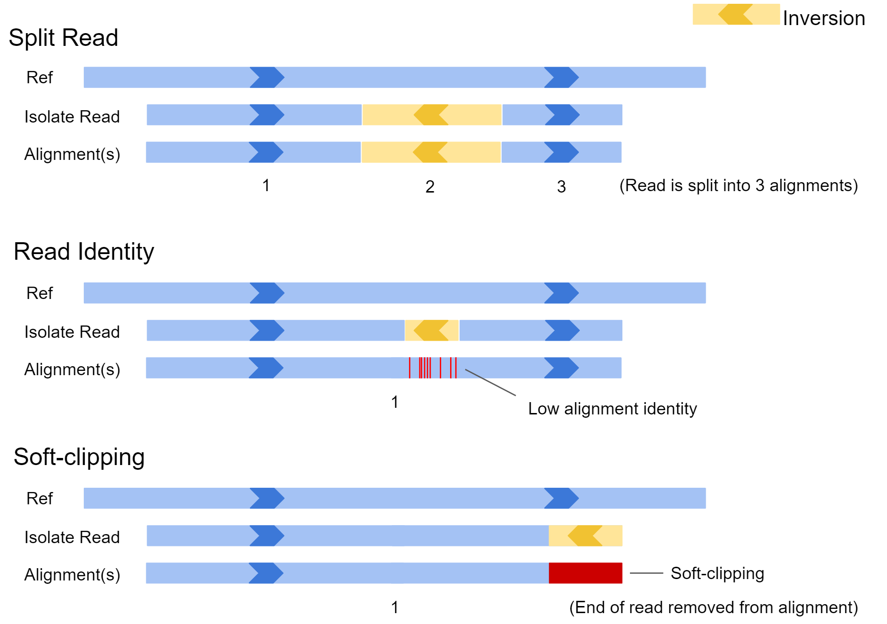

 

# Structural variant calling - long read data

Anticipated workshop duration when delivered to a group of participants is **4 hours**.  

For queries relating to this workshop, contact Melbourne Bioinformatics (bioinformatics-training@unimelb.edu.au).

## Overview

### Topic

* [x] Genomics
* [ ] Transcriptomics
* [ ] Proteomics
* [ ] Metabolomics
* [ ] Statistics and visualisation
* [ ] Structural Modelling
* [ ] Basic skills


### Skill level

* [ ] Beginner  
* [x] Intermediate  
* [ ] Advanced  

This workshop is designed for participants with no command line knowledge. A web-based platform called Galaxy will be used to run our analysis. We *will* be using **1 line awk programs** to process text output, but these will be supplied and explained. 

### Description

*Long reads have turbo-charged structural variant detection - be part of the renaissance!*

This tutorial uses ***sniffles*** to implement a structural variant calling pipeline. 

(short summary) Structural Variants (SVs)...

<br>

**Data:** Nanopore reads: bacterial & human (FASTQ), genomic feature annotations (GFF), human reference genome hg38 

**Pipeline:** Read summaries & QC, alignment, SV calling, text processing, visualisation

**Tools:** NanoPlot, Filtlong, minimap2, CalMD, SortSam, sniffles, VCFsort, VCFannotate, awk, Circos, IGV<br>

<br>

*Section 1* covers bacterial SV calling and benchmarking of bioinformatics tools. <br>
*Section 2* will demonstrate SV calling on a human sample to diagnose a patient condition. 

<br>

-------------------------------

## Learning Objectives

At the end of this introductory workshop, you will :

* Be able to perform SV calling in model *and* non-model organisms
* Be familiar with the current field of SV calling
* Gain an understanding of *why* and *when* SV calling is an appropriate analysis to perform.

<br>

-------------------------------


### Required Software
* Zoom

### Required Data
* No additional data needs to be downloaded for this workshop.

<br>

-------------------------------

## Author Information
Written by: Grace Hall  
Melbourne Bioinformatics, University of Melbourne

Created/Reviewed: March 2021

<br>

-------------------------------

## Background

### What is Structural Variation?

Genetic variation is always relative. In general, we have a reference sequence which we know lots about, and query sequences to compare against this reference.  Given we know lots about the reference, the ***impact*** of any variation we find in the query sequences can be inferred. The query sequences by originate from a single individual or a group, depending on the biological question.  
<br>


<br>Genetic variants are often separated into two categories: ***sequence variants***, and ***structural variants***. 

***Sequence variants*** cover small-scale changes which affect a few nucleotides, such as single nucleotide variants (SNVs) or small insertions / deletions (Indels). They are particularly important when they impact coding sequences of genes, as can alter the amino acid sequence of proteins.

***Structural variants (SVs)*** are large-scale events (>50 bp) where entire sections of genetic material have changed. An example is a deletion, where an entire section of DNA has been removed. Structural variants have the potential to greatly alter the gene dosage of a cell by duplicating or deleting entire exons or genes at a time. 


### Benefit of Long Reads

Structural variation has historically been hard to detect. This is because structural variation often involves repeat elements which are notoriously hard to resolve using short-read sequencing technologies. Either the structural variant itself is a repeat, or it occurs in a repetitive region of the reference genome. 

<br>


<br>

In general, long reads have greater mappability. Mappability is the ability to unambiguously align reads to a reference. In the example above, a short read sampled from a tandem repeat cannot be accurately mapped, as it is equally likely it came from 3 different locations. On the other hand, a long read sampled from this region can be uniquely mapped to a single location. The extra repeat found in the isolate could also be detected given such a read. 

This is highly pertinent when working with the human genome, ***as more than 60% appears to be repetitive sequence***.  This repetitive sequence consists of 2 main elements: mobile elements, and repeats. Mobile elements are sections of DNA which copy or move themselves throughout our genome and including retrotransposons (LINE, SINE, LTR, and SVA) and DNA transposons. Repeats are genomic regions which contain the same sequence repeated many times, and consist of Short Tandem Repeats (STRs / microsatellites) which are 1-6 bp tandem repeats, or Variable Number of Tandem Repeats (VNTRs / minisatellites) which are tandem repeats where the repeat length is greater than 7 bp.  


### Applications of Structural Variant Detection

The importance of structural variation has become more apparent in recent years. This has been driven by the advent of long-read sequencing technologies, and the availability of better reference genomes (including improvements to human reference genome hg38). Today, SV detection is implicated in many areas of bioinformatics, including the following:

**Human Disease**

* Cohort studies
	* Identifying new, disease-causing structural variation
	* Assessing an individual's susceptibility to disease mediated by SVs
* Cancer genomics
	* Susceptibility of individual to certain cancers
	* Monitoring of tumor progression

**Agriculture**

* Identifying desirable traits
	* Flowering rate, frost / drought resistance, improved crop yield
* Genetic modification 

**The Microbial World**

* Understanding the relationship between microbiome SVs and human health
* Studing phylogeny and evolution of microbes (including horizontal gene transfer)
* Researching the spread of mobile elements and plasmids which convey virulence or antibiotic resistence genes


### Structural Variant Types
Structural variants are either destructive (involving a change in total genetic material), or non-destructive (total genetic material stays the same). Destructive variants are often particularly interesting, as they alter the gene dosage of a call. This can lead to overexpression of genes, or knock-out variants with zero expression if a gene was removed. Destructive SVs are highly implicated in cancer genomics, as undesirable genes such as tumor-suppressors can be removed, while desirable genes involving growth and proliferation can be expressed in much higher quantity.

<br>


<br>There are **5 main types** of structural variation. Insertions, Deletions, Inversions, Duplications, and Translocations. Specifically, they involve the following:

* **Insertions**<br>
A foreign section of genetic material is inserted

* **Deletions**<br>
A section of genetic material is removed

* **Inversions**<br>
A section of genetic material swaps its orientation

* **Duplications** (interspersed or tandem)<br>
A section of genetic material is copied, then inserted. 
Can be seperated into:
	* Interspersed duplications, where the insertion site is away from the copied section
	* Tandem duplications, where the insertion site is directly beside the copied section

* **Translocations** (intra- or inter-chromosomal)<br>
A section of genetic material is cut out, then inserted somewhere else. Can be seperated into:
	* Intra-chromosomal translocations, where the insertion site is within the same chromosome
	* Inter-chromosomal translocations, where the insertion site is on another chromosome


### Variants detected by common SV calling programs

Many SV calling programs ***do not*** attempt to detect interspersed duplications and intra-chromosomal translocations. This is because most SV callers have been designed for use with human data, and these variants are less relevant to the human genome than other organisms. 

Regarding ***interspersed duplications***, most RNA transposons (the mechanism of variation) are inactive in the human genome. A few are still active, but an impact will only be seen if the insertion site (insert location of the copied segment) is within an important genomic feature, such as a gene body or enhancer region. 

***Intra-chromosomal translocations*** are ignored for similar reasons. These are mainly caused by DNA transposons, which are considered inactive in humans. DNA transposons are still active in other eukaryotes (including most plants) and bacteria, so must be considered when working outside human data. 


### TODO if time: Mechanisms


### SV calling pipeline

Today, we will explore one workflow for SV calling. We will first call variants using a benchmarking dataset, where the true SVs are known. We will then swap to a human clinical scenario, and will identify a structural variant causing patient disease. 

We will use the workflow below to explore structural variation. This workflow has 3 main sections - data exploration, calling variants, then interpreting our findings. Our process will be slightly different depending on whether we are working with the bacterial read set, or the human sample. 

<br>


<br>

Our SV calling workflow will consist of 5 key steps:

1. **Read QC**<br>
The length an quality distribution of long-read data is highly variable. We will summarise our read set using ***Nanoplot***, to understand what quality of results to expect during analysis.  ***Filtlong*** will then be used to remove short reads, or those with patches of low quality. This will reduce erroneous read mapping and will improve our results. 

2. **Alignment**<br>
Structural variation is always relative to a reference. Our isolate reads will act as the query, and an appropriate reference genome will be selected to measure structural variation against. We will align our isolate reads using ***minimap2*** to the chosen reference genome, then will pass the output alignment BAM file to our SV caller.  

3. **SV calling**<br>
Our SV caller, ***sniffles***, uses the read alignment information to detect structural variation. It will output variant calls in VCF format, which we will then process with ***awk*** to create a summary which is easy to read.

4. **Feature annotation**<br>
Variants which span or otherwise intersect with key genomic regions are most likely to have functional impact. Rather than doing this manually for each variant, we can use ***awk*** and ***VCFannotate*** to automatically label variants with the genomic features they intersect with.

5. **Visualisation**<br>
Visualisation will be performed to understand variation on a genome-wide scale, and to probe single variants for their potential functional impact. ***Circos*** plots will be generated for the bacterial read set to view the total variation across the genome, and ***IGV*** will be used on the human clinical dataset to infer the functional consequences of variants. 


<br>

-------------------------------

## Section 1: Bacterial dataset

### Introduction

The first dataset we will use is a synthetically mutated bacterial genome. Structural variants and single base mutations have been added to an *E. coli sakai* assembly, then Nanopore reads of this mutated genome were simulated using ***NanoSim***.  We will use these reads to identify the SVs we added using our SV calling pipeline. 

The benefit to this approach is that we know the ground truth. SVs were manually added to our *E. coli sakai* reference genome, and their details were recorded. As we have a list of SVs which were added, we can assess sniffles performance at SV calling by the number of SVs it correctly identifies.  

In this section we will:

* Perform read Quality Control (QC)
* Align reads
* Perform SV calling
* Create SV call summaries using awk (text processing)
* Visualise SV calls with Circos

We will employ a number of tools in our pipeline, so let's get to it!

<br>

### Getting the data
To start, we need a the set of reads of our synthetic isolate, a reference genome to call SVs against, and a 'ground truth' list of variants which have been added to our isolate. 

Import the following Galaxy history to get started:  
https://usegalaxy.org.au/u/graceh1024/h/sniffles-benchmarking-ecoli-sakai

!!! question "Importing a galaxy history"

    ??? hint "How to import"
        Galaxy histories can be accessed via a link, or in the 'Shared Data' tab of the top navigation bar. Once you find a history you want to copy, press the '+' icon at the top right of the page to import the history

* The reference genome is "ecoli_sakai.fasta"
* Our reads are “isolate_reads.fastq”
* The list of added SVs is "isolate_sv_record.tsv"

<br>

### Read QC
Before proceeding, we want to understand our read set. Nanopore reads can have highly variable read length and quality distributions from sample to sample - by creating a summary, we can know what to expect from our reads, and whether we should perform QC filtering. 

**Create a summary of the reads**

First, we want to get a summary of our read set. ***NanoPlot*** creates plots to summarise the length distribution and quality of our read set.

**Tool:** NanoPlot

* ***Type of the file(s) to work on:*** fastq
	* ***files:***  isolate_reads.fastq

<br> NanoPlot creates 5 outputs. Today, we are only interested in the HTML report. This report contains a summary table which will summarise most of the important information, followed by plots displaying the read length and quality distribution of reads. Your report may be similar to the following image: 


<br>
Answer the questions below regarding isolate_reads.fastq:

!!! question "What is the median read length?"

    ??? hint "answer"
        ____ bp

!!! question "What is the median read quality?"

    ??? hint "answer"
        Q__ (phred ___)

!!! question "What is the length and mean quality of the longest single read?"

    ??? hint "answer "
        ____ bp, Q ___

As a significant proportion of the reads are short or low quality, we will perform a filtering step to reduce incorrect SV calls downstream in our analysis. 

<br>

**Filter reads**

Long reads can have a wide range of lengths and qualities. Filtering of long reads is often conducted slightly differently to short reads. Often, reads less than 1000 bp are removed, and reads containing ***patches*** of poor quality are discarded. This is an important distinction to short read filtering, as a given long read can have a good overall base quality, while having areas which are very low quality. As our SV caller, sniffles, looks at alignment quality when identifying structural variation, it is important we remove reads with low-quality patches.   

**Tool:** filtlong

* ***Input FASTQ*** isolate_reads.fastq
* ***Output thresholds***
	* ***Min. Length*** 1000
	* ***Min. window quality*** 9

The above will remove any reads which are less than 1000 bp, or those where a section (250bp) of the read has mean quality below Q9. Our readset will now be ready for structural variant calling.

<br>

### Alignment

Sniffles requires an alignment file when calling variants. It searches the alignments for split reads, alignments containing patches of high error rate, and soft clipping of reads to identify structural variation.  Below we can see how different isolate reads capturing an inversion might be aligned to the reference genome.

 

In the first example, the inversion appears near the middle of the read and is large. In this case, the aligner may split the read and report the alignment in 3 sections. In scenario 2, the inversion is quite small, and the read may not be split. In this case there would be a patch of low sequence identity between the read and reference genome at the inversion location. In the final example, only the very edge of the read has spanned the SV, and as a result the aligner may just report a single alignment with part of the read clipped off.  All this information is available to our SV caller after the reads are aligned to our reference genome.

To provide this file, we need to map our read set to our reference genome of choice. The reference genome should be as close as possible to the isolate from which our reads originate for best results.  In this situation, the original E. coli sakai assembly which we computationally mutated will be our reference genome. 


**Align reads**

**Tool:** Map with minimap2

* ***Will you select a reference genome from your history or use a built-in index?*** Use a genome from history and build index
* ***Use the following dataset as the reference sequence*** ecoli_sakai.fna

* ***Single or Paired-end reads*** single
* ***Select fastq dataset*** isolate_reads.fastq
	* ***Select a profile of preset options*** Oxford Nanopore read to reference mapping...

* ***Set advanced output options***
	* ***Generate CIGAR*** Yes

Rename output to “isolate mapped reads”

**Calculate MD Tag**

Sniffles requires alignments to contain the ‘MD tag’ in our BAM file. This is a condensed representation of the alignment of a read to the reference, and is similar to a CIGAR string. We can use CalMD to add this to each alignment in our BAM file.  

**Tool:** CalMD

* ***BAM file to recalculate*** isolate mapped reads
* ***Choose the source for the reference genome*** Use a genome from the history
* ***Using reference file*** ecoli_sakai.fna

Rename output to “isolate mapped reads MD”


### SV calling with sniffles

Now we have our alignments (BAM) in the correct format, we can call variants with sniffles. Sniffles generally has good defaults, so we will leave everything as-is for now. Later, we will tweak the settings based on our read set for better results. 


**Call variants**


**Tool:** sniffles

* ***Input BAM file*** isolate mapped reads MD

Rename the output to ‘sniffles variant calls’

Have a look at the VCF output of sniffles. It contains header lines providing metadata and definitions, followed by variant call lines. VCF stands for 'Variant Call Format' and is the standard format for recording variant information - both *sequence variants*, and *structural variants.* Click the eye icon  to view.


**Sort VCF output**

For ease of viewing, we can sort the variant calls so they are in coordinate order. This will help us compare against the truth SV record for our simulated isolates (provided SV records are sorted by coordinate).  

**Tool:** VCFsort

* ***Select VCF dataset*** sniffles output VCF

Rename the output to ‘sniffles variant calls sorted’

<br>

### Creating a summary (awk)

Unfortunately, the VCF file format was not created to store structural variant information, and generally does a poor job. We would prefer a summary which identifies the contig, location, type, and size of each variant call. We can create such a summary using text processing - specifically by using the ‘awk’ tool.

Awk processes the input file line-by-line.  For each line, it follows the following approach:

```
pattern { action }
```

For a given line, if the ***pattern*** is matched, the ***action*** will be performed. For example, given the following input file:

```
chr12		gene		NTRK2
chr18		CDS			BRCA1
chr22		gene		P53	
```

And the command:

```
Awk ‘/gene/ { print $0 }’
```

We will obtain the output:

```
chr12		gene		NTRK2
chr22		gene		P53	
```

How it works:

`/gene/` will match any line which contains “gene”, and the statement `{ print $0 }` will print the line.  Awk always sets some variables for the line being processed - in particular, the complete line is stored as $0, and $1, $2, $3 etc store the value for field 1, 2, 3 etc respectively. 

If desired, we can also perform multiple actions when the pattern is matched:

```
pattern { action 1; action 2; action 3; }
```

Awk is a highly versatile tool for text processing, and can perform all the common functionality including conditional if / else statements and loops. 

From here the awk programs will be supplied, but if you wish to learn more, here is a good place to start: https://zetcode.com/lang/awk/

<br>

**Process VCF with awk**

**Tool:** Text reformatting with awk

* ***File to process:*** sniffles variant calls
* ***AWK Program:*** 
```
/SVTYPE=/ {split($8,infoArr,";"); print substr(infoArr[9],8), $3, $1, substr(infoArr[3],6), $2, substr(infoArr[4],5), substr(infoArr[11],7)}
```

Rename output to “sniffles VCF summary”

<br>

We now have both files we need to measure the performance of sniffles - the variant calls provided by sniffles, and the ground SV truth. Open both files in new tabs and compare them. Specifically, record the following:
How many real SVs did sniffles identify
How many did it miss? 
How many false positives are present? (SVs called by sniffles but which were not added to the reference genome)

Add this information to the excel sheet we obtained our isolate reads and SV records from. There are columns for true positives (TP - correct calls), false positives (FP - how many incorrect variants were called), and false negatives (how many SVs were missed) in the sheet. From these figures, the accuracy, precision, and recall for sniffles will be automatically calculated. 


<br>

### Visualising SV calls

<br>

**Create Circos plot**
* Circos


<br>

-------------------------------
## Section 2: Human clinical dataset

### Introduction

In this section we will ...

<br>

-------------------------------
## Additional reading
Links to additional recommended reading and suggestions for related tutorials.

<br>

# Graveyard

In the example above, the isolate genome contains an insertion relative to the reference. Sections of reads which have sampled this insertion (shown in grey) cannot be mapped to the reference genome, as this sequence does not exist. This is a problem for the short reads as they only capture a small genomic region, whereas the long read can still be correcly mapped to the reference due to the large interval it has sampled. The presence of an insertion is easily detectable as it has been completely captured by a long read. 