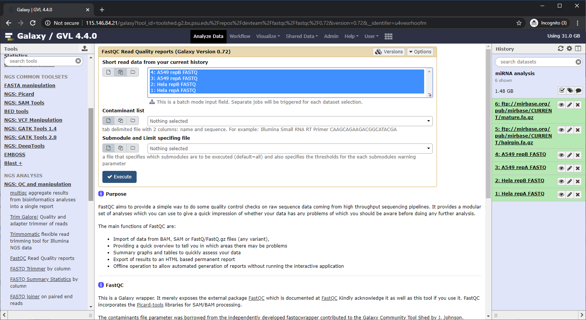
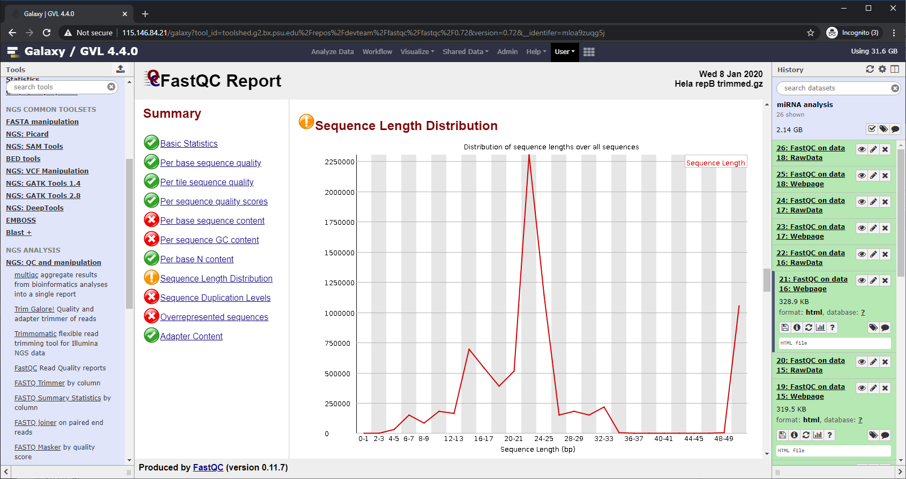
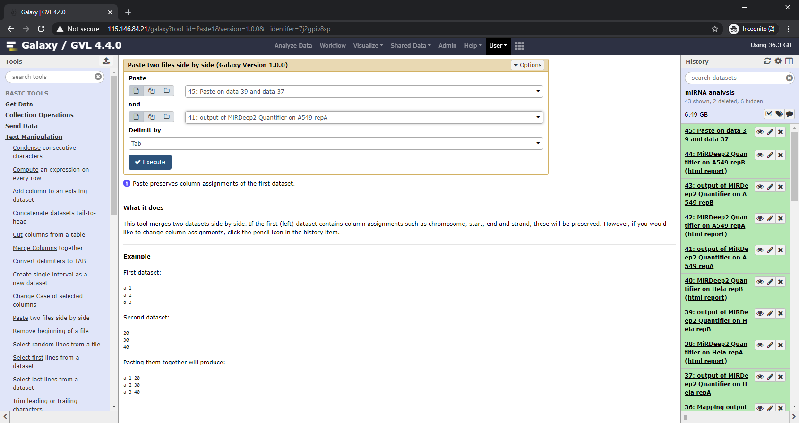

 

# Basic miRNA-seq data analysis

Anticipated workshop duration when delivered to a group of participants is **2 hours**.  

For queries relating to this workshop, contact Melbourne Bioinformatics (bioinformatics-training@unimelb.edu.au).

## Overview
This is a tutorial for basic miRNA-seq data analysis using miRdeep2 on Galaxy. 
It assumes that you have your sequencing result files in FASTQ format. From there this tutorial takes you through a series of tasks, including an essential quality control procedure, alignment, identification and quantification of (known) miRNAs and a basic differential expression analysis. 
Additionally, some subsequent analyses that commonly follow the differential expression analysis are suggested in the end.

### Topic

* [ ] Genomics
* [x] Transcriptomics
* [ ] Proteomics
* [ ] Metabolomics
* [ ] Statistics and visualisation
* [ ] Structural Modelling
* [x] Basic skills

### Skill level

* [x] Beginner  
* [ ] Intermediate  
* [ ] Advanced  

This workshop is designed for participants with limited skills in computers and linux/unix environments.

### Description

This tutorial uses a subset of small RNA-seq data from a published paper, which was for a study of biogenesis of miRNAs (ref). The raw sequencing data for this study are downloadable from Gene Expression Omnibus database of NCBI, a public repository for genomic data, in FASTQ format. The downloaded FASTQ files were quality-checked and pre-processed by FastQC and Trimmomatic, and the pre-processed FASTQ files were analysed by MirDeep2 for the sequence alignment, identification and quantification of known miRNAs. The latest MiRBase database (ref) was used as the reference for known miRNAs of human. MiRBase is a database of published miRNAs sequences and annotation (http://www.mirbase.org/) 
After the quantification of known human miRNAs, edgeR was used for differential expression analysis.

Data: 4 samples from Gene Expression Omnibus dataset GSE56862 
Pipeline & Tools: FastQC, Trimmomatic, miRDeep2, edgeR

**Section 1** covers basic background of miRNA and miRNA-seq experiment. 
**Section 2** illustrates the overall miRNA-seq data procedure, introducing tools utilized for each step in this tutorial. 
**Section 3** introduces the example dataset from NCBI GEO database. 
**Section 4** covers essential quality control and pre-processing procedures. 
**Section 5** covers taking the pre-processed miRNA-seq data through the 'MiRDeep2' pipeline. 
**Section 6** covers how to combine (known) miRNA quantification result from each sample into a single read-count matrix. 
**Section 7** (optional) introduces an alternative way to generate a single read-count matrix, using spreadsheet softwares such as MS Excel, Google-spreadsheet, etc. 
**Section 8** covers basic differential expression analysis on miRNA read-count matrix using edgeR. 
**In the Additional reading,** some subsequent analysis that commonly follow the differential expression analysis are introduced. 

-------------------------------
## Learning Objectives

At the end of this introductory workshop, you will :

* Understand the overall procedure of miRNA-seq data analysis.
* Be familiar with data types and tools for miRNA-seq data analysis.
* Know how to use the Galaxy for data-processing and exploring.

-------------------------------
## Requirements and preparation

!!! attention "Important"
    **Attendees are required to bring their own laptop computers.**  
    At least one week before the workshop, participants should install the software and data files below.  This should provide sufficient time for participants to liaise with their own IT support should they encounter any IT problems.  

### Preparing your laptop prior to starting this workshop
1. Required softwares:
  * Web browser is necessary ([Chrome](https://www.google.com/chrome/) or [FireFox](https://www.mozilla.org/en-US/) are preferable.) 
2. Required Data:
  * Required data will be directly downloaded from NCBI's GEO site and MiRBase database site.

-------------------------------
## Author Information
Written by: Chol-hee JUNG
Melbourne Bioinformatics, University of Melbourne

Created/Reviewed: March, 2020 
Updated: Aug, 2020

-------------------------------
## Background

MicroRNA (miRNA) is a type of small non-coding RNA, which is typically ~21nt long and processed from a hairpin structured precursor (typically 60-120nt long). 
MiRNA is found in animals and plants, and involved in the gene-expression regulation in various mechanisms by binding to their target mRNAs (e.g., inducing degradation, inhibiting translation, etc.).

-------------------------------

## Section 1: Basics of miRNAs

In this section you will learn about some basics of miRNA-seq experiments. 

-------------------------------
## Section 2: Overview of miRNA-seq data analysis procedure

In this section we will take a look at the overview of miRNA-seq analysis procedure. 
As shown in the image below, once library construction and sequencing are done as per the design of the experiment, the resulting sequencing data (FASTQ files) will go through two steps of quality control (QC). 
The first QC is for checking the sequencing quality. Popular FASTQ quality assessment tools, such as [FastQC](https://www.bioinformatics.babraham.ac.uk/projects/fastqc/), should be able to report the overall quality of the sequencing data. FastQC also reports the over-represented sequences in the FASTQ file. This is particularly important for miRNA-seq. In miRNA-seq data the 3'-adapter sequence almost always appears in every read, because the typical read-length of sequencing machines exceed the full length of mature miRNAs. Unless there is a serious contamination, the most over-represented sequence in the FASTQ file should be the 3'adapter sequence. Unlike 3'-adapter sequence, 5'-adapter sequence should be appear in the FASTQ file. If it does, it would mean poor library quality or poor sequencing quality. Once the over-represented sequences are identified as 3'-adapter sequence, sequence trimming tools, such as [Trimmomatic](http://www.usadellab.org/cms/?page=trimmomatic), can trim out from each read the adapter sequence and/or prevailing or trailing poor quality regions. 
The second QC checks more specifically for the library quality. At this stage, 3'-adapter sequence should be removed from the sequencing data. Without 3'-adapter sequence, each read should contains only the mature miRNA sequence, the length of which typically ranges 20-25nt. If the trimmed sequences include a large quantity of sequence reads that are outside of this size-range, it may mean high level of contamination at the library construction stage. 
After two-steps of QC, when all look good, the trimmed reads will be mapped to the genome. From this alignment result, the expression level known miRNAs can be  measured, and novel miRNAs can be also identified and quantified. 
Known/unknown miRNAs were identified and quantified across samples from multiple groups (e.g., disease vs control), differential expression analysis can follow using other popular tools, such as [edgeR](https://bioconductor.org/packages/release/bioc/html/edgeR.html).

-------------------------------
## Section 3: Example dataset from NCBI GEO

In this section, we will import the example dataset to Galaxy for the analysis. 

### Example dataset from NCBI GEO
<b>GSE: [GSE56862](https://www.ncbi.nlm.nih.gov/geo/query/acc.cgi?acc=GSE56862) </b> 
<b>SRA: [SRP041228](https://www.ncbi.nlm.nih.gov//sra/?term=SRP041228) </b> 
This GEO dataset GSE56832 consist of 12 samples, including 7 small RNA-seq samples and 5 RNA-seq samples. The GSE dataset page from the link contains the description of the study using this dataset. Briefly, this study examines the biogenesis of miRNAs by the Microprocessor complex. The actual raw sequencing data are separately deposited in Sequence Read Archive (SRA) with the ID SRP041228. 
Although there are a total of 12 samples in this dataset, we will use only 4 of them with individual sample accession IDs from GSM1370365 through to GSM1370368 as below. 

| Sample | Description | SRX ID | SRR ID |
| :--------- | :------ | :-----: | :-----: |
| GSM1370365 | Hela_repA_smallRNASeq | SRX518817 | SRR1240812 |
| GSM1370366 | Hela_repB_smallRNASeq | SRX518818 | SRR1240813 |
| GSM1370367 | A549_repA_smallRNASeq | SRX518819 | SRR1240814 |
| GSM1370368 | A549_repB_smallRNASeq | SRX518820 | SRR1240815 |

#### 1. Download example sequences
Raw FASTQ files for the 4 small RNA-seq samples need to be downloaded to Galaxy.
Galaxy has a functionality to directly retrieve data from SRA using the accession IDs. 
**a.** 'Get Data' -> 'Download and Extract Reads in FASTA/Q' 
Put a SRR ID (e.g, SRR1240812) in the 'Accession' box  

**b.** Repeat for three other SRR IDs. 
It may take some time to complete this task. 
When completed the downloaded FASTQ files will appear in the 'History' panel on the right-hand side of the screen. Clicking on the 'View data' icon show top lines of the imported FASTQ file as below. 

**c.** Rename the uploaded data to more appropriate names by clicking on 'Edit attributes' icon

*e.g.,* 
'SRR1240812' to 'Hela repA FASTQ', 
'SRR1240813' to 'Hela repB FASTQ', 
'SRR1240814' to 'A549 repA FASTQ', 
'SRR1240815' to 'A549 repB FASTQ' 

  

**d.** Alternatively, the raw FASTQ files can be downloaded to local computer and be uploaded using <b>'Get Data'</b> -> <b>'Upload File'</b>. 
(need a screenshot)

#### 2. Upload reference miRNA data from miRBase
MiRDeep2 uses sequences of known miRNAs (both precursor and mature) as reference to identify which miRNAs are present in the input data. In this tutorial, we will use the miRNA sequences deposited in miRBase database (ref). 
The reference precursor miRNAs and mature miRNA sequences can be downloaded to local computer from the miRBase FTP site, and be uploaded to Galaxy. But, Galaxy can also fetch files directly as using the URL of files:  

**a.** 'Get Data' -> 'Upload File' -> 'Paste/Fetch data'
Copy and paste the URLs below into the text box, and set the 'Type' to 'fasta.gz'. Leave other parameters as default.

<fn>ftp://mirbase.org/pub/mirbase/CURRENT/hairpin.fa.gz</fn> 
<fn>ftp://mirbase.org/pub/mirbase/CURRENT/mature.fa.gz</fn>

-------------------------------
## Section 4: Quality control and pre-processing

In this section we will check the quality of the 4 small RNA-seq data uploaded to Galaxy. As mentioned above, we will use FastQC and Trimmomatic. 
Quality control and pre-processing include the checking of general sequencing quality, adapter-contamination and the removal of any un-wanted parts from the sequencing data. FastQC examines the sequencing quality, and Trimmomatic cleans up the sequencing data. 

#### 1. Check sequencing quality
**a.** 'FASTQ Quality Control' -> 'FastQC' 
All four FASTQ files can be selected at once. 

**b.** In most cases, the sequence reads are longer than mature miRNA sequences. In consequence, 3'-adapter sequence is left in the FASTQ file. In contrast, 5'-adapter sequence should not be present in the FASTQ file. It this is from one's own analysis, the information of 3'-adapter sequence would be probably provided. However, if the adapter sequence is unknown, it could be identified from FastQC reports. 
Among the over-represented sequences, the sequence in the first row takes up ~64% of all sequences of Hela_repA. Also, the whole 50bp region is identical to a known RNA PCR primer sequence with 100% identity. This is likely the adapter sequence to be removed before further analysis. 

 

#### 2. Trim out adapter sequence and low-quality region
**a.** ‘FASTA/FASTQ' -> ‘Trimmomatic’ 
**b.** Select all 4 FastQ files 
**c.** ‘Yes’ to ‘Perform initial ILLUMINACLIP step?’ 
**d.** ‘Custom’ to ‘Select standard adapter sequences or provide custom?’ and paste in the most over-represented RNA PCR Primer sequence in FASTA format 
*e.g.* 
\>primer 
TGGAATTCTCGGGTGCCAAGGAACTCCAGTCACATCACGATCTCGTATGC 

 

**e.** 'Execute'

**f.** Rename Trimmomatic results to more appropriate names 
*e.g.,* 'Trimmomatic on Hela repA FASTQ' to 'Hela repA trimmed' 

 

#### 3. Run FastQC again on the trimmed
It is always a good idea to check the quality of the pre-processed data, which are the result files from Trimmomatic, in this case. Thus, FastQC run at this stage is mainly for checking on read-length distribution. 
**a.** 'FASTQ Quality Control' -> 'FastQC' 

**b.** 'Execute' 

**c.** After adapter-trimming, sequences of typical miRNA-sizes are enriched. 
Note that this sample contains miRNAs and other types of small RNAs. So, we should expect to see peaks at the sizes outside of typical miRNA lengths.  

-------------------------------
## Section 5: Running miRdeep2

In this section we will run MiRDeep2 to identify and quantify known human miRNAs present in the sequencing data. 
First, the pre-processed sequencing data will be mapped to the reference genome using 'MiRDeep2 Mapper'. By default, pre-processed reads are collapsed before mapping. I.e., identical reads become a single read, but the total number of identical reads is kept in the sequence description line. This reduces the mapping time.

#### 1. Run ‘MiRDeep2 Mapper’ on built-in genome (hg38) with trimmed sequences
**a.** Select all 4 trimmed results 

**b.** Select 'Clip Sequence' to clip 3'-Adapter Sequence and insert the adapter sequence used for Trimmomatic. 
**c.** Select ‘Human (Homo sapiens) (b38): hg38’ in 'Select a reference genome' 
  

**d.** 'Execute' 
This may take a while. 

**e.** Rename the mapping results to more appropriate names 
*e.g.,* 'Collapsed reads of MiRDeep2 Mapper on data 16' to 'Hela repA mapped'

#### 2. Run ‘MiRDeep2 Quantifier’ on ‘MiRDeep2 Mapper’ results
**a.** In 'Collapsed deep sequencing reads', Select all four ‘MirDeep2 Mapper’ results. 
**b.** Select ‘ftp://mirbase.org/pub/mirbase/CURRENT/hairpin.fa.gz’ for ‘Precursor sequences’ 
**c.** Select ‘ftp://mirbase.org/pub/mirbase/CURRENT/mature.fa.gz’ for ‘Mature miRNA sequences’ 
**d.** Select ‘human’ for ‘Search in species’ 

**e.** 'Execute' 
This may take a while. 

**f.** Rename the quantification results to more appropriate names 

*e.g.,* 'output of MiRDeep2 Quantifier on data 7, data 6, and data 20' to 'MiRDeep2 Quantifier on Hela repA' 
'MiRDeep2 Quantifier on data 7, data 6, and data 20 (html report)' to 'MiRDeep2 Quantifier on Hela repA (html report)' 

#### 3. Inspect the quantification results.
‘MirDeep2 Quantifier’ generates two output files: quantification table and detailed HTML report of the miRNA quantification. 
**a.** ‘MiRDeep2 Quantifier on A549 repB’ shows the number of reads associated to each of known miRNA in the reference data. 
In this example, ‘read_count’, ‘total’ and ‘seq’ columns have the same raw-read counts, which could be used for the subsequent differential expression analysis. 

**b.** ‘MiRDeep2 Quantifier on A549 repB (html report)’ show the same read-count table with links to detailed information. 

-------------------------------
## Section 6: Generate a single read-count matrix

In this section we will merge the individual quantification results into one read-count matrix, which can be used for differential expression analysis. 
'MiRDeep2 Quantifier' output data for each of 4 samples will be merged into one big table, and relevant columns will be extracted from the merged table.

#### 1. Merge read-count columns from four quantification results into one table.
**a.** ‘Text Manipulation’ -> ‘Paste’. 
Select ‘output of MiRDeep2 Quantifier on Hela repA’ for the first drop-down box, and ‘output of MiRDeep2 Quantifier on Hela repB’ for the second drop-down box. 

**b.** Repeat the ‘Paste’ with the previous ‘Paste’ result and another quantification output: 
‘Paste on data 39 and data 37’ for the first drop-box’ and ‘output of MiRDeep2 Quantifier on A549 repA’ 

**c.** Repeat ‘b’ for ‘output of MiRDeep2 Quantifier on A549 repB’ 
The result is a table of 24 columns, because 4 tables of 6 columns were merged side-by-side. 

#### 2. Extract the read-count matrix
The merged table from the previous step has lots of redundant columns. So, we’ll have to extract only read-count columns. Also, miRNA IDs are not appropriate for unique identifier, because there could be multiple copies of precursor miRNAs originating the same miRNAs. For example, ‘hsa-let-7a-5p’ appears 3 times in the table, because there are 3 copies of ‘hsa-let-7a’ (hsa-let-7a-1, hsa-let-7a-2 and hsa-let-7a-3). So, we’ll combine the precursor ID and mature miRNA ID with ‘.’ in-between. 

**a.** ‘Text Manipulation’ -> ‘Add column’ 
‘Add this value’: ‘.’ 
'to Dataset': '38: Paste on data 34 and data 37'
 

The resulting table has a column on '.' at the right-most end (column 25). 
 

**b.** ‘Merge Columns’-> ‘+Insert Columns’ button (we’re merging 3 columns). 
‘Select data’: result of the previous step (e.g., ‘48: Add column on data 47’) 
‘Merge column’: ‘column: 3’ (column for ‘precursor’) 
‘with column’: ‘column: 25’ (added column in the previous step, containing only ‘.’) 
‘Add column’: ‘Column: 1’ (column for ‘mature miRNA’) 

**c.** ‘Cut’ 
Input ‘c26,c2,c8,c14,c20’ 
‘c26’ (Column 26) is the newly added column containing the new ID, which is precursor name followed by ‘.’ and mature miRNA name. c2, c8, c14 and c20 are columns for read-counts. 

**d.** The resulting table has only the new IDs and four read-count columns. 

**e.** The merged table include all known miRNAs in the reference data. But they aren’t always expressed. We’re keeping in miRNAs that were expressed at least in one sample. 
‘Filter and Sort’ -> ‘Filter’ 
Insert ‘(c2+c3+c4+c5) > 0’ in ‘With following condition’ 

#### 3. Add column names to the filtered read-count matrix
The filtered table has no column names. The easiest way to add them in is downloading the table file, adding the header using a text editor and re-uploading the new file. 
**a.** Download the filtered table by clicking on ‘Download’ icon. 
**b.** Use any text editor to add the header line as below: 
‘precursor.miRNA	Hela_repA	Hela_repB	A549_repA	A549_repB’ 
***Remember to use ‘tab’ as separator*** 

**c.** Save and upload the edited table file 
‘Get Data’ -> ‘Upload File’ 

**d.** Rename the uploaded table to ‘GSE56862 miRNAs read-counts’ 

-------------------------------
## Section 7: An alternative way to generate a single read-count matrix (optional)

In this section we will use a spreadsheet software and a text editor on your local computer to generate a single read-count matrix. Depending on your familiarity to those software, you may find it much easier to achieve the same thing that we did in the Section 6.

-------------------------------
## Section 8: Basic differential expression analysis

In this section we will try a differential expression analysis on the miRNAs. 
Now, we have miRNA expression data from a subset of GSE56862 dataset. The miRNA expression data were now merged into a single read-count table, which can be analyzed by any count-based differential expression analysis tools. In this tutorial, we will use 'edgeR'.

**a.**	‘NGA: RNA Analysis’ -> ‘edgeR’ 
‘Single Count Matrix’ 
‘Factor Name’: ‘cell-line’ 
‘Groups’: HeLa,HeLa,A549,A549 
‘Contrast of Interest’: HeLa-A549 

**b.** Before the execution, we can choose to obtain the normalised counts, R scripts and R dataset from this edgeR analysis. 

**c.** 'edgeR' report 

**d.** Summary of differential expression test for each miRNA 

-------------------------------
## Additional reading (optional)

Once differentially expressed miRNAs are identified, one of the common subsequent analyses is looking for the (potential) target genes, which are the genes that  are regulated by miRNAs. Target gene analysis tools include [miRanda](http://www.microrna.org/microrna/home.do) and [TargetScan](http://www.targetscan.org/) among many. 
For example, 'miRanda' takes in a list of miRNAs of interest and retrieves the list of genes that have the target sites. Two miRNAs "let-7e" and "mir-1" were among the differentially expressed miRNAs in this tutorial. Searching for the target sites of these two miRNAs retrieved thousands of genes as below. 
 

