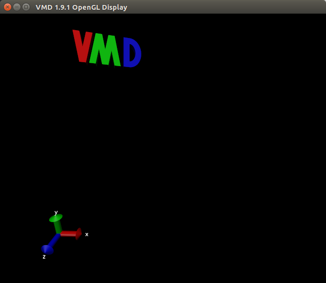
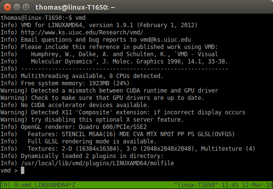

# Molecular Dynamics Tutorial - Introduction to cluster computing

## Overview

In the following tutorials we will be logging on to a high performance computer (HPC) to submit [NAMD](http://www.ks.uiuc.edu/Research/namd/) molecular dynamics (MD) jobs and visualising the results with the molecular visualization program [VMD](http://www.ks.uiuc.edu/Research/vmd/). As students have a vast range of skill levels and requirements, the tutorials are divided into two parts described below. Each tutorial is designed to be stand alone, start where you feel most comfortable and skip the exercises that are too simple.

* **MD tutorial - Introduction to cluster computing (this tutorial)**: If you have never launched a job on a cluster before, this tutorial is for you. Here we will simply copy across a bare minimum directory containing input files ready to go for a short NAMD simulation. Once the job is finished, we will download the data to your local computer and visualize the trajectory with VMD.

* **[MD tutorial - Building input files](../molecular_dynamics_201/molecular_dynamics_201/)**: In this tutorial we will be introducing a more sophisticated directory structure using scripts to direct the output and run the job. We initially download a copy of the directory to our local computer where we then build up the input files using VMD. We then upload this directory to the cluster where we submit the job. Finally we will download the results back to our local computer to visualize with VMD.

## Learning Objectives

At the end of the course, you will be able to:

* Log onto a high performance computer cluster
* Upload files to the cluster
* Submit a basic molecular dynamics job on the cluster
* Download the output and visualise the preliminary results

## Requirements

This workshop is intended for scientists interested in learning the basics of running molecular dynamics on a HPC cluster.

It is recommended that participants attend Introduction to [High Performance Computing](../hpc/hpc.md) prior to this workshop. If you are not familiar with using the command line, please also attend the [Introduction to Unix](../unix/unix.md) workshop.

Please bring along your laptops with the following installed before arriving:

* VMD (http://www.ks.uiuc.edu/Research/vmd/)
* Putty (https://www.putty.org/) – only if you use Windows.

**Important**: NAMD has specific licencing requirements. Users are required to agree to these requirements to use NAMD on the Melbourne Bioinformatics HPC clusters. Login on [https://my.vlsci.org.au/](https://my.vlsci.org.au/), select 'Software agreement', 'Add software', 'NAMD'.

> **Note**: this tutorial describes the use of Snowy, but all these steps can be carried out on Barcoo by substituting every instance of `snowy` for `barcoo`.

*Tutorials created by Mike Kuiper, edited by Thomas Coudrat.*

-----

## 1 - Overview

The aim of this tutorial is to give the user experience to upload and submit a typical parallel job to the cluster, download the output, and visualize the preliminary results. Though this example is mostly relevant to those studying in the life sciences area, the workflow is representative of launching other parallel jobs.

The program we shall use, NAMD, is a parallel, molecular dynamics simulation program developed by the [Theoretical and Computational Biophysics Group at Illinois University at Urbana Champaign](http://www.ks.uiuc.edu/). It is particularly good at modelling large biomolecular systems using HPC clusters and is freely available for academic work. If you are interested in running NAMD simulations you should also install a local copy of VMD on your own computer. VMD is a molecular viewer program developed by the same group that can be used to help set up NAMD simulation and to help visualize NAMD output.

## 2 - Basic introduction to cluster computing

### a) Logging in to the cluster

Using a terminal on your local computer and your username and password, login to the HPC cluster.

```
ssh <username>@snowy.vlsci.unimelb.edu.au
```

You should see a welcome screen and a command line prompt.
If you type `ls` at the prompt you should see a list of the files and directories - which should be nothing as we haven’t put anything there yet!

> **Note**: be careful to use the right **terminal** when you are typing in commands!
> Sometimes you need to type the commands on the cluster terminal, and sometimes on your local terminal. You can tell which is which by looking at the command line prompt. When you are logged into the cluster, you should see the machine name at the prompt, for example:

> `[<username>@snowy ~]$`               <- tells you your terminal is on Snowy


### b) Copy across files, starting the job

We’ll need to copy across the basic example directory to our working directory on **Snowy**. Do this with:

```
cp -r /vlsci/examples/namd/Namd_simple_example_01 .
```

> Note that the dot is important!

Change into this directory and launch the job with the command `sbatch` and the sbatch script.

```
cd Namd_simple_example_01
```

Then type:

```
sbatch sbatch_namd_start_job
```

Your job has now been submitted to the cluster. Easy hey?
Check the job is running with the `showq` command. (type it at the command line).

Too much information? Try:

```
showq -u <username>
```

This particular job is *very* short compared to a regular NAMD simulation and should be finished in less than 4 minutes. As the job runs, various output files are produced but the main one you will be interested in is the trajectory file with the **.dcd** suffix.

### c) Understanding the input files

While we wait, let's take a look at the sbatch example script to understand what is going on. Type:

```
less sbatch_namd_start_job
```

> `less` is a Unix file viewer. **Press “q” to quit the viewing of the file**

You should see the lines:

```
#SBATCH --nodes=4
```

This line tells us how many cores we are to use for the job. Generally speaking, the more cores used the faster the job runs, but only to a point. Molecular dynamics jobs don’t always scale efficiently so eventually more cores will actually run slower than less cores. This depends very much on the program you use and the architecture of the HPC.

Now let us have a look at the NAMD configuration script:

```
less namd_1ubq_example.conf
```

Woah! There is quite a bit of information here, don't worry though. Most of the parameters stay the same for each simulation. Let us just point out the important bits. See the lines near the top:

```
structure    1ubq_example.psf
coordinates  1ubq_example.pdb
outputName   1ubq_output_01
```

These are simply defining the input files, (the protein structure file **.psf**, and the coordinate file, **.pdb**) and also the name of the output files.

Further down you will see:

```
set Temp    310
temperature $Temp
```

Which is setting the temperature to 310 K (37 C) while below that we have:

```
## Parameter file

paraTypeCharmm 	on
parameters		par_all27_prot_na.prm
```

which tells NAMD which parameter file to use. (you'll see a copy of the parameter file in the NAMD_example directory). Depending on what molecules you have in your simulation, you may need to use a more detailed parameter file.

Somewhere in the middle you will see these lines:

```
## Periodic Boundary Conditions

cellBasisVector1  48. 0.  0.
cellBasisVector2  0. 48.  0.
cellBasisVector3  0.  0. 48.
cellOrigin        0   0   0
wrapAll on
wrapWater on
```

This defines the boundary conditions (a cheats way to simulate an infinite system), where a molecule coming off one side of the boundary will reappear on the other.

Near the bottom we have the lines:

```
## Output files

restartfreq 5000
dcdfreq 100
xstFreq 100
outputEnergies 100
outputPressure 100
outputTiming 100
```

These lines tell us how often to write out to the output files. The most important is the `dcdfreq`, (here set to 100), or how often to save a frame of the dynamics trajectory. (Usually this is set around 5,000 to 10,000). The **.dcd** output file can become ridiculously **HUGE** if this is too small. 100 is OK for this short example. Just remember to change it for a much larger value in your own runs!

The last few line in the configuration file:

```
## Minimize, reinitialize velocities, run dynamics

minimize 500
run 10000
```

tell us that the simulation is first minimized for 500 steps (a good idea to iron out bad contacts and steric clashes, but usually set to 1000 steps or more), and then told to run only a mere 10,000 steps. (**This is a very short example!**). Typically you might set "run" to 10,000,000 or more.

Press "q" to quit viewing the configuration file.

Check again on the status of your job:

```
showq -u <username>
```

If you don't see anything it probably means the job has finished.
List your directory using the command `ls -lrt` and you should see something like:

```
[mike@snowy Namd_simple_example_01]$ ls -rlt
total 17088
-rw-r--r-- 1 mike VR0021   243622 Dec  8 11:40 par_all27_prot_na.prm
-rw-r--r-- 1 mike VR0021      655 Dec  8 11:40 sbatch_namd_start_bluegene
-rw-r--r-- 1 mike VR0021     3932 Dec  8 11:40 namd_1ubq_example.conf
-rw-r--r-- 1 mike VR0021   814960 Dec  8 11:40 1ubq_example.pdb
drwxr-xr-x 2 mike VR0021      512 Dec  8 11:40 BUILD_DIR
-rw-r--r-- 1 mike VR0021      700 Dec  8 11:40 sbatch_namd_restartjob_bluegene
-rw-r--r-- 1 mike VR0021  1182412 Dec  8 11:40 1ubq_example.psf
-rw-r--r-- 1 mike VR0021     4508 Dec  8 11:40 namd_1ubq_restart_example.conf
-rw-r--r-- 1 mike VR0021      159 Dec  8 11:40 slurm-2746442.out
-rw-r--r-- 1 mike VR0021     1371 Dec  8 11:40 FFTW_NAMD_2.9_BlueGeneQ.txt
-rw-r--r-- 1 mike VR0021   247564 Dec  8 11:41 1ubq_output.restart.coor.old
-rw-r--r-- 1 mike VR0021   247564 Dec  8 11:41 1ubq_output.restart.vel.old
-rw-r--r-- 1 mike VR0021      216 Dec  8 11:41 1ubq_output.restart.xsc.old
-rw-r--r-- 1 mike VR0021   247564 Dec  8 11:42 1ubq_output.restart.coor
-rw-r--r-- 1 mike VR0021   247564 Dec  8 11:42 1ubq_output.restart.vel
-rw-r--r-- 1 mike VR0021      218 Dec  8 11:42 1ubq_output.restart.xsc
-rw-r--r-- 1 mike VR0021     8417 Dec  8 11:42 1ubq_output.xst
-rw-r--r-- 1 mike VR0021 13005576 Dec  8 11:42 1ubq_output.dcd
-rw-r--r-- 1 mike VR0021      215 Dec  8 11:42 1ubq_output.xsc
-rw-r--r-- 1 mike VR0021   247564 Dec  8 11:42 1ubq_output.coor
-rw-r--r-- 1 mike VR0021   247564 Dec  8 11:42 1ubq_output.vel
-rw-r--r-- 1 mike VR0021   425681 Dec  8 11:43 Namd_1ubq_example_output.txt
```

The highlighted **.dcd** file is the main output file while the **.xsc**, **.coor**, **.vel** files all have to do with being able to restart the simulation at a later date, while the `Namd_1ubq_example_output.txt` file contains the text output from the simulation.

*Congratulations!*

You have just run a short molecular dynamics simulation on the cluster. Next, we'll copy that information back to your local computer and use VMD to visualize the results.

Now on to part 2, visualizing the results with VMD.

## 3 - Visualizing NAMD results with VMD

In this section you will be using the [molecular visualization program VMD](http://www.ks.uiuc.edu/Research/vmd/) to look at the trajectory data of the ubiquitin protein you generated in the first part of the tutorial. If you haven't already done so, download and install VMD to your local computer (make sure to pick the right flavour: Windows, Mac or Linux).

> **Tip**: the most confusing part of this exercise seems to be remembering to use the right terminal! That is, either one is connected to the cluster, or one is running on your local computer. The exercises we just ran were on the cluster. That is, a terminal which we used to connect to the **Snowy** cluster using the program **ssh**.

> You can usually tell which computer you are logged into by the terminal command line: for example the terminal command line:

> `[mike@snowy Namd_simple_example_01]$`

> tells me I am logged into **Snowy**, in the `Namd_simple_example_01` directory.

> Compared to my local terminal command line:

> `mike@axion:~$`

> tells me I am on my local machine (called "axion" in this case).

Download the entire NAMD example directory back to your **local computer**.
For example, in Linux you can type in your **local computer** terminal: (if you see `snowy` in the command line prompt you are typing in the wrong terminal!)

```
scp -r <username>@snowy.vlsci.unimelb.edu.au:Namd_simple_example_01 .
```

What to do if your simulations didn’t run.

If for some reason your simulations didn’t run properly you can download a copy of the precomputed data to your local computer by using the following command command from a local terminal:

```
scp -r <username>@snowy.vlsci.unimelb.edu.au:/vlsci/examples/namd/Namd_simple_example_01_finished .  
```

You can now start VMD **locally** and load up the trajectory data. In a new local terminal type:

```
vmd
```

> **Note**: On Windows, start VMD from the Program menu, under the folder University of Illinios. If this doesn’t work, there could be a problem with defining the path to vmd on your computer.

Two new windows should pop up.

The *main panel*:


The *display*:



And the terminal should turn into the *console*:



### a) Reading structure data files into VMD

The first file you need to read into VMD is the protein structure file,
(1ubq_example.psf in this case). The **.psf** file contains important information about the system such as which atoms are bonded together, what charge they are, and the mass of each atom type, but does not contain any spatial information.

From the *main panel*:

> File → New molecule → (browse: 1ubq_example.psf) → load

You should see nothing in the display, but an entry in the Main panel.
Next load the coordinates from the **.pdb** file. First, select the 1ubq_example.psf entry in the VMD main panel, then:

> File → Load data onto molecule → (browse: 1ubq_example.pdb) → load

Now you should have the model in the display that can be moved around with the mouse.
This is the initial starting position of the simulation. Next load in the trajectory data into VMD (again, select the entry in the VMD main panel):

> File → Load data onto molecule → (browse:1ubq_output.dcd) → load

This data represents the “molecular movie” or trajectory of how the atoms in the model moved around during the course of the NAMD simulation. You can play the trajectory by clicking the bottom right arrow of the *main panel*. (Use the speed scroll bar to the left of that button to slow it down).

What you are seeing represents the molecular motion of the protein on an extremely small time scale. The NAMD program calculates how the molecule moves over time given certain parameters such as temperature. These models and simulations can give insight into how proteins behave and their role in biological function and certain diseases.

From the *main panel* you can bring up the graphical representations window to play with more rendering types: - try them out!

> Graphics → Representations

And this conclude the basic tutorial to running a simple job on a cluster.
Wasn’t so scary now was it?

Please play around with VMD. Once you feel comfortable, try start the next tutorial:
[Molecular dynamics - Building input files](../molecular_dynamics_201/molecular_dynamics_201/)
