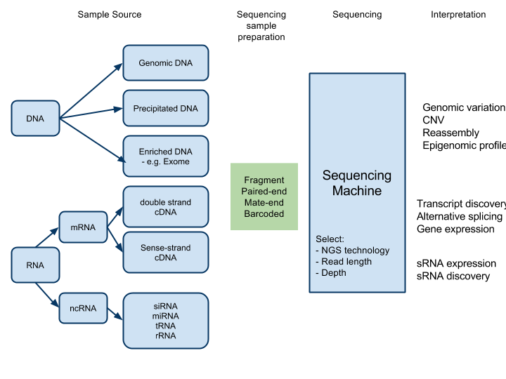

Next Generation Sequencing Overview
===================================

Sequencing technologies
-----------------------

1.  Sequencing by hybridisation and ligation (Complete Genomics, Life Technologies, Polonator)
    1.  Emulsion PCR amplification
    2.  Detection: Cyclic ligation of nucleotide dimers. Multiple rounds required.
2.  Sequencing by synthesis (Helicos, Illumina, Intelligent Bio-Sys)
    1.  Bridge PCR amplification on slides
    2.  Detection: cyclic addition of reversible polymerisation terminators
3.  Real-time sequencing by synthesis (Pacific BioSciences, VisiGen)
    1.  Single molecule, no amplification
    2.  Cyclic removal of nucleotide and measure change in conductance of micropore
4.  Pyrosequencing (Roche/454™).
    1.  Emulsion PCR amplification
    2.  Detection: cyclic addition of single nucleotide species and detection of number of pyrophosphates released during polymerisation (through ATP to luciferase reaction)

Applications
------------

#### Genomic

1.  **Whole genome resequencing** for **variation detection**
2.  Whole genome sequencing for de novo assembly
3.  Metagenomics (sequencing of multiple genomes together in a 'metasample')
4.  **Targetted resequencing** for variation detection
    1.  **Exome sequencing**/targetted exome capture
    2.  Arbitrary PCR enrichment of target

#### Epigenomic

1. [CHiP-Seq](http://www.illumina.com/technology/chip_seq_assay.ilmn) through sequencing of DNA enriched by immunoprecipitation
2. **DNA methylation analysis**
   1.  Sequencing of DNA enriched through immunoprecipitation of 5-methylcytosine ()
   2.  Methylation-sensitive restriction enzyme fragment enrichment

#### Transcriptomic (RNA-seq)

1. Whole transcriptome **expression profiling** (comparative gene expression)
2. Whole transcriptome sequencing for de novo assembly (identify genes)
3. **Strand-specific mRNA-seq**
4. **Paired-end RNA-seq**
5. **Whole transcriptome variation detection**
6. **Differential splicing detection**
7. sRNA analysis

### Types of outcome

#### **Variation Detection**

1. Copy number variation (CNV)
2. Single Nucleotide Polymorphisms (SNPs)
3. Insertions and deletions (Indels)
4. Rearrangements

#### De Novo assembly

Concatemers (length?)

#### Comparative gene expression

Matrix of gene vs expression level

#### Splicing detection

List of alternative splice isoforms

#### Resequencing alignment strategies

1.  Align to transcriptome (simplest)
2.  Align to genome and exon-exon junction sequences (discover new transcripts, splice variants)
3.  De novo (most complex)

Categories of analysis
----------------------

NGS informatics may be categorised into:

**1. Primary analysis:**

Conversion of imagesets (output from NGS machines) into strings of bases - 'base calling'.

*Inputs:*

-  *Image files from NGS machine*

*Outputs:*

-  *Short reads*

*Software:*

-  Firecrest and Bustard (for Illumina) 

**2. Secondary analysis:**

Assembly of short strings of bases (output of primary analysis) into
contigs, and/or -Li Jason 11/18/09 2:43 PM alignment onto a reference
genome and extraction of the first level of genomic meaning (SNP,
rearrangements)

*Inputs:*

- *Short reads (20-30million/run?)*

*Outputs:*

- *Aligned sequences against a reference genome*
- *SNP analysis*
- *Copy number variation data*
- *Quantified expression data*

*Software:*

- E.g. Eland, BWA, MAQ for alignment. Velvet, ABySS for de-novo
assembly. 

*References:*

[http://www.illumina.com/Documents/products/technotes/technote\_denovo\_assembly.pdf](http://www.illumina.com/Documents/products/technotes/technote\_denovo\_assembly.pdf)

**3. Tertiary analysis**

Extraction of biological information from the aligned sequences.
Annotation of sequence data.

*Inputs:*

- *E.g. Aligned sequences, SNP analysis *

*Outputs:*

- *Biological and statistical interpretations and visualisations*

At each stage there are multiple options for processing - vendor
software, open source software, each with varying levels of accuracy and
computational expense. There are also large amounts of data produced at
each stage. Additionally, primary and secondary analysis are dependent
on the NGS platform being supported - Illumina Solexa pipeline is
different to an Applied Biosystems SOLiD pipeline.

**Anecdotally, 80% of processing in a NGS project is manual and occurs
mainly in tertiary analysis.**

Sample preparation
------------------

### Fragment

Each read is independent - an arbitrary fragment of DNA with no
meta-information about the relationship of that read to any other read

### Paired-end sequencing

Each fragment is sequenced twice, once from each end, in succession.
Probably the reads will not overlap, as the average length of a fragment
is normally >2x that of a read.

The two reads are thus 'related' and have extra information about the
structure of the sample. The information is that the two reads from the
single fragment are 'close' - depending on the length of fragments that
were prepared for the run.

[http://www.illumina.com/technology/paired\_end\_sequencing\_assay.ilmn](http://www.illumina.com/technology/paired\_end\_sequencing\_assay.ilmn)

### **Mate-pair**

Similar to paired-end, but ends of sequenced fragment can be much
further apart - up to 10kb (normally 2-5kb)

[http://www.illumina.com/technology/mate\_pair\_sequencing\_assay.ilmn](http://www.illumina.com/technology/mate\_pair\_sequencing\_assay.ilmn)

### Barcoded fragments

Multiple samples are prepared independently. Each sample is 'labelled'
with a unique sequence adaptor (barcode). Samples are then mixed and
sequenced together. Individual reads can be categorised to a particular
sample by their barcodes.

### Enrichment for target sequences

1.  PCR
2.  Hybridisation to oligo arrays
3.  PolyA selection (mRNA-seq)
4.  Size selection
5.  Precipitation

Potential services in NGS
-------------------------

Courtesy [Colorado State Uni](http://web.research.colostate.edu/NGS/process.aspx?AspxAutoDetectCookieSupport=1)

Sequence Matching Analysis

- Align SOLiD colorspace reads with reference genomes

- Generate consensus sequences

Mate-Pair Analysis

-   Analyze paired reads from SOLiD mate-pair runs

-   Improve accuracy of read matches to detect structural variations
    > between sample and reference genomes

SNP / Indel Analysis

-   Identify single nucleotide polymorphisms

-   Identify insertion and deletion mutations in DNA sequences

Copy Number Variation Analysis

-   Detect copy number variations in DNA sequences

Whole Transcriptome Analysis

-   Map SOLiD reads from a transcript sample to reference genomes

-   Assign tag counts to features of the reference genome

-   Identify novel transcripts

Inversion Analysis

-   Identify paracentric and pericentric chromosomal inversions

*de Novo* Assembly

-   Create *de novo* assemblies from SOLiD colorspace reads

-   Characterize genomic sequences for which no closely related reference genome exists

-   Assemble SOLiD reads from microbial genomes into nucleotide sequence contigs of several thousand bases, and scaffolds of tens of thousands of bases.

-   Assemble SOLiD reads from microbial genomes into scaffolds of tens of thousands of bases

smRNA Analysis

-   Whole genome analysis of SOLiD RNA library reads

-   Includes filtering, matching against miRBase sequences, and matching against reference genomes

NextGENe Analysis

-   NextGENe is a comprehensive NGS bioinformatics package

-   NextGENe includes de novo assembly, target assembly, SNP/Indel discovery, digital gene expression analysis, whole transcriptome analysis, ChiPSeq analysis, miRNA discovery and quantification, and a condensation assembly tool for reducing instrument error

System Alignment Browser (SAB)

-   SAB is a graphical genome annotation viewer

-   Used for viewing basespace and colorspace reads aligned to reference genomes

GFF Conversion

-   Convert SOLiD system mapping files into GFF-format files

-   GFF is a standardized file format for describing DNA, RNA, and proteins

SRF Conversion

-   Convert SOLiD system reads into SRF format

-   SRF is a standardized file format for describing DNA sequence data

Appendix
--------

### Paired end sequencing - empirical observations

*paired end* or *mate pair* refers to how the library is made, and
then how it is sequenced. Both are methodologies that, in addition to
the sequence information, give you information about the physical
distance between the two reads in your genome. For example, you shear up
some genomic DNA, and cut a region out at ~500bp. Then you prepare your
library, and sequence 35bp from each end of each molecule. Now you have
three pieces of information:

- the tag 1 sequence
- the tag 2 sequence*
- that they were 500bp ± (some) apart in your genome

When we do 2x 50 bp paired-end runs on a GAIIx using the current gel
purification step we get read distances of between that vary by about
100 bp in a nice tight bell shaped curve starting between 160-200 bp. So
the first thing to bear in mind is that L is not fixed within or between
runs. Either way this group accounts for >99.99% of paired-end reads in
an assembly. Because of the way fragments are generated for sequencing 1
and 2 can align either F-B of B-F.

If you want to be more realistic there are always a tiny proportion of
reads <0.1% that align with much longer read distances, some of which
is due to bioinformatics but some of which is real and simply reflects
biology. Likewise a tiny proportion of reads at all read distances will
be F-F or B-B. Also there appear to often be a tiny proportion of reads
that come out overlapping where the read distance is the same as a read
length ie 1+L+2 is, in this case, \~50-100. I have no idea of the
prevelance of such reads but you can often find them if you look. Lastly
if its not going to be part of the assembler, end trimming and quality
trimming can often mean that 1 and 2 are different lengths and that a
substantial number of reads from a paired end run end up with no partner
at all.

### Mate-pair sequencing

Illumina refers to "paired end" as the original library preparation
method they use, where you sequence each end of the same molecule.
Because of the way the cluster generation technology works, it is
limited to an inter-pair distance of ~300bp ( 200-600bp).

Illumina refers to *mate pairs* as sequences derived from their newer
library prep method which is designed to provide paired sequences
separated by a greater distance (between about 2 and 10kb). This method
still actually only sequences the ends of ~400bp molecules, but this
template is derived from both ends of a 2-10kb fragment that has had the
middle section cut out and the 'internal' ends ligated in the middle.
Basically, you take your 2-10kb random fragments, biotinylate the end,
circularise them, shear the circles to ~400bp, capture biotinylated
molecules, and then sequence those (they go into what is essentially a
standard 'paired end' sample prep procedure).

Source: [http://seqanswers.com/forums/showthread.php?t=503](http://seqanswers.com/forums/showthread.php?t=503)
