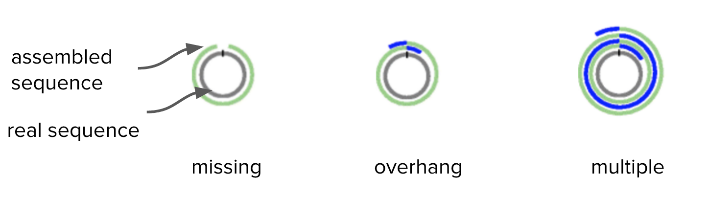
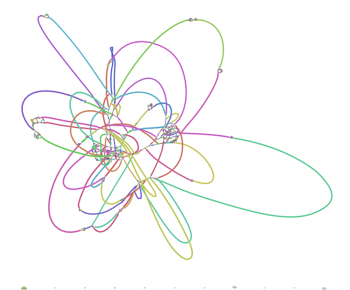
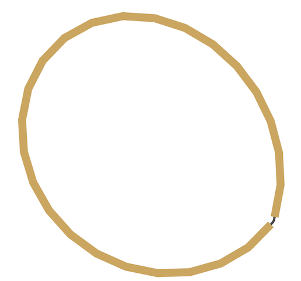

# Long read assembly workshop

This is a tutorial for a workshop on long-read (PacBio) genome assembly. 

It demonstrates how to use long PacBio sequencing reads to assemble a bacterial genome, and includes additional steps for circularising, trimming, finding plasmids, and correcting the assembly with short-read Illumina data. 

## Overview

Simplified version of workflow:


## 1. Get started

Your workshop trainers will provide you with the address of a virtual machine. 


### Mac users
Open the Terminal. 

- Type in 

```
ssh researcher@[your virtual machine address]
```

- Type in the password provided. 


### Windows users

If you are using Windows 10, you might be able to use the Ubuntu Subsystem. Otherwise, install and open Putty. 

- Download putty [here](http://www.chiark.greenend.org.uk/~sgtatham/putty/download.html).
- Open. A configuration window will appear. 
- Under "Host Name (or IP address)" enter in the address of your virtual machine. 
- Under "Port" type in 22
- Under "Connection Type" select "SSH"
- Click "Open"
- Under "Login as:" enter "researcher"
- Type in the password provided. 

### Create a new working directory on your remote computer.

Because we are starting a new analysis it is always good practice to start in a new empty directory. Therefore, we will create a new directory and change to it for the rest of the workshop.

In your terminal:

- Create a new directory called "Workshop"

```text
mkdir Workshop
```

- Change to that directory

```text
cd Workshop
```

**NOTE: Everytime you open a new terminal or Putty session, you will need to make sure you are in this directory again.**

The current directory can be obtained with the linux command:

```text
pwd
```


## 2. Get data

The sample used in this tutorial is from a bacteria called *Staphylococcus aureus*. We have used a small section of its real genome so that the programs can run in the workshop time. 

The files we need are:

- <fn>pacbio.fq</fn>: the PacBio reads
- <fn>R1.fq</fn>: the Illumina forward reads
- <fn>R2.fq</fn>: the Illumina reverse reads

In a new tab, go to [https://doi.org/10.5281/zenodo.1009308](https://doi.org/10.5281/zenodo.1009308). 

- Next to the first file, right-click (or control-click) the "Download" button, and select "Copy link address".
- Back in your terminal, enter 
```text
wget [paste file link here]
```
- The file should download. 
- *Note:* paste the link to the file, not to the webpage.
- Repeat this for the other two files. 


## 3. Assemble<a name="assemble"></a>

We will use the assembly software called [Canu](http://canu.readthedocs.io/en/stable/), version 1.6.

Run Canu with these commands:

```text
canu -p canu -d canu_outdir genomeSize=0.03m -pacbio-raw pacbio.fq
```

- the first `canu` tells the program to run
- `-p canu` names prefix for output files ("canu")
- `-d canu_outdir` names output directory ("canu_outdir")
- `genomeSize` only has to be approximate. (In this case we are using a partial genome of expected size 30,000 base pairs). 
- Canu will correct, trim and assemble the reads.
- Various output will be displayed on the screen.
- *Note*: Canu could say "Finished" but may still be running. In this case, type `squeue` to see if jobs are still running. 

If you run `squeue` you will see something like this:

```text
             JOBID PARTITION     NAME     USER ST       TIME  NODES NODELIST(REASON)
                 6      main canu_can research PD       0:00      1 (Dependency)
               5_1      main cormhap_ research  R       0:29      1 master
```

You will know if **Canu** has completely finished when `squeue` shows no jobs listed under the header row. 

## 4. Check assembly output

Move into the canu output folder: 
```
cd canu_outdir
```

View the list of files: 
```
ls
```


- The <fn>canu.contigs.fasta</fn> are the assembled sequences.
- The <fn>canu.unassembled.fasta</fn> are the reads that could not be assembled.
- The <fn>canu.correctedReads.fasta.gz</fn> are the corrected Pacbio reads that were used in the assembly.
- The <fn>canu.contigs.gfa</fn> is the graph of the assembly.
- The <fn>canu.report</fn> file is a summary of all of the steps Canu performed with information about the reads used, how they were handled and a whole lot of summary information about the assembly.

Display summary information about the contigs: (`infoseq` is a tool from [EMBOSS](http://emboss.sourceforge.net/index.html))

```text
infoseq canu.contigs.fasta
```

- This will show the contigs found by Canu. e.g.,  tig00000001	39136
- "tig00000001" is the name given to the contig
- "39136" is the number of base pairs in that contig.

This matches what we were expecting for this sample (approximately 30,000 base pairs). For other data, Canu may not be able to join all the reads into one contig, so there may be several contigs in the output.

We should also look at the <fn>canu.report</fn>. To do this:

```
less canu.report
```

* "less" is a command to display the file on the screen.
* Use the up and down arrows to scroll up and down. 
* You will see lots of histograms of read lengths before and after processing, final contig construction, etc. 
* For a description of the outputs that Canu produces, see: [http://canu.readthedocs.io/en/latest/tutorial.html#outputs](http://canu.readthedocs.io/en/latest/tutorial.html#outputs)
* Type `q` to exit viewing the report. 
 
### Questions

!!! note "Question"
    How do long- and short-read assembly methods differ?

    ??? "Answer"
         Short reads are usually assembled with De Bruijn graphs. For long reads, there is a move back towards simpler overlap-layout-consensus methods.

!!! note "Question"
    Where can we find out the what the approximate genome size should be for the species being assembled?

    ??? "Answer"
        Go to NCBI Genomes, enter species name, click on Genome Assembly and Annotation report, sort table by clicking on the column header Size (Mb), look at range of sizes in this column.


!!! note "Question"
    In the assembly output, what are the unassembled reads? Why are they there?

    ??? "Answer"
        Reads and low-coverage contigs that were not used in the assembly. 

!!! note "Question"
    What are the corrected reads? How did canu correct the reads?

    ??? "Answer"
        Canu builds overlaps between reads. The consensus is used to correct the reads. 

!!! note "Question"
    Where could you view the output .gfa and what would it show?

    ??? "Answer"
        A useful program is [Bandage](https://rrwick.github.io/Bandage/). If the assembly has multiple contigs, the assembly graph shows how these are connected. 


## 5. Trim and circularise

Bacteria have circular chromosomes. 

- Because of sequencing errors, there may be some "overhang" in the assembled linear sequence. 
- Our assembly may have some overhang because it is 9000 bases longer than expected. 


*Adapted from Figure 1. Hunt et al. Genome Biology 2015*


A tool called [Circlator](http://sanger-pathogens.github.io/circlator/) identifies and trims overhangs (on chromosomes and plasmids). It takes in the assembled contigs from Canu, as well as the corrected reads prepared by Canu.

Move back into your main analysis folder: 
```
cd ..
```


### Run Circlator

```text
circlator all --threads 4 --verbose canu_outdir/canu.contigs.fasta canu_outdir/canu.correctedReads.fasta.gz circlator_outdir
```

- (Click on the dark grey slider bar above and move it to the right, to see all the way to the end of the line.)

- `--threads` is the number of cores
- `--verbose` prints progress information to the screen
- `canu_outdir/canu.contigs.fasta` is the file path to the input Canu assembly
- `canu_outdir/canu.correctedReads.fasta.gz` is the file path to the corrected Pacbio reads - note, fastA not fastQ
- `circlator_outdir` is the name of the output directory.

Some output will print to screen. When finished, it should say "Circularized x of x contig(s)".

### Check the output

Move into the Circlator output directory: 

```
cd circlator_outdir
```

List the files: 
```
ls
```

Circlator has named the output files with numbers as prefixes. 

Were the contigs circularised?

```
less 04.merge.circularise.log
```

- "less" is a command to display the file on the screen.
- <fn>04.merge.circularise.log</fn> is the name of the file. 
- Yes, the contig was circularised (last column).
- Type `q` to exit.

What are the trimmed contig sizes? 
```
infoseq 06.fixstart.fasta
```

* The contig "tig00000001" has a length of 30019.
* This is about 9000 bases shorter than before circularisation. This was the "overhang" and has now been trimmed. 

Copy the circularised contigs file to the main analysis directory with a new name:

```
cp 06.fixstart.fasta ../contig1.fasta
```

Move back into the main folder: 
```
cd ..
```

### Questions

!!! note "Question"
    Were all the contigs circularised? 

    ??? "Answer"
        In this example, yes, the contig was circularised. 

!!! note "Question"
    Circlator can set the start of the sequence at a particular gene. Which gene does it use? Is this appropriate for all contigs?

    ??? "Answer"
        Circlator uses dnaA (if present) for the chromosomal contig. For other contigs, it uses a centrally-located gene. However, ideally, plasmids would be oriented on a gene such as repA. It is possible to provide a file to Circlator to do this.


## 6. Find smaller plasmids
Pacbio reads are long, and may have been longer than small plasmids. We will look for any small plasmids using the Illumina reads.

This section involves several steps:

1. Use the Canu+Circlator output of a trimmed assembly contig.
2. Map all the Illumina reads against this Pacbio-assembled contig.
3. Extract any reads that *didn't* map and assemble them together: this could be a plasmid, or part of a plasmid.
5. Look for overhang: if found, trim.

### Align Illumina reads to the PacBio contig

Index the contigs file:

```text
bwa index contig1.fasta
```

Align Illumina reads using using bwa mem:

```text
bwa mem -t 4 contig1.fasta R1.fq R2.fq | samtools sort > aln.bam
```

- `bwa mem` is the alignment tool
- `-t 4` is the number of cores
- `contig1.fasta` is the input assembly file
- `R1.fq R2.fq` are the Illumina reads
- ` | samtools sort` pipes the output to samtools to sort
- `> aln.bam` sends the alignment to the file <fn>aln.bam</fn>

### Extract unmapped Illumina reads

Index the alignment file:

```text
samtools index aln.bam
```

Extract the fastq files from the bam alignment - those reads that were unmapped to the Pacbio alignment - and save them in various "unmapped" files:

```text
samtools fastq -f 4 -1 unmapped.R1.fastq -2 unmapped.R2.fastq -s unmapped.RS.fastq aln.bam
```

- `fastq` is a command that coverts a <fn>.bam</fn> file into fastq format
- `-f 4` : only output unmapped reads
- `-1` : put R1 reads into a file called <fn>unmapped.R1.fastq</fn>
- `-2` : put R2 reads into a file called <fn>unmapped.R2.fastq</fn>
- `-s` : put singleton reads into a file called <fn>unmapped.RS.fastq</fn>
- `aln.bam` : input alignment file

We now have three files of the unampped reads: <fn> unmapped.R1.fastq</fn>, <fn> unmapped.R2.fastq</fn>, <fn> unmapped.RS.fastq</fn>.

### Assemble the unmapped reads

Assemble with Spades:

```text
spades.py -1 unmapped.R1.fastq -2 unmapped.R2.fastq -s unmapped.RS.fastq --careful --cov-cutoff auto -o spades_assembly
```

- (Click on the dark grey slider bar above and move it to the right, to see all the way to the end of the line.)

- `-1` is input file forward
- `-2` is input file reverse
- `-s` is unpaired
- `--careful` minimizes mismatches and short indels
- `--cov-cutoff auto` computes the coverage threshold (rather than the default setting, "off")
- `-o` is the output directory

Move into the output directory: 
```
cd spades_assembly
```

Look at the contigs: 
```
infoseq contigs.fasta
```

- 1 contig has been assembled with a length of 2359 bases. 

Copy it to a new file: 
```
cp contigs.fasta contig2.fasta
```

### Trim the plasmid

To trim any overhang on this plasmid, we will blast the start of contig2 against itself.


Take the start of the contig: 

```
head -n 10 contig2.fasta > contig2.fa.head
```
- `head -n 10` takes the first ten lines of <fn>contig2.fasta</fn>
- `>` sends that output to a new file called <fn>contig2.fa.head</fn>

- We want to see if the start of the contig matches the end (overhang).


Format the assembly file for blast: 
```
makeblastdb -in contig2.fasta -dbtype nucl
```
- `makeblastdb` makes a database for the tool Blast
- This will generate three new files in the directory with suffixes .nhr, .nin and .nsq
- `-in` sets the input file as <fn> contig2.fasta</fn>
- `-dbtype nucl` sets the type to nucleotide (rather than protein)


Blast the start of the assembly (.head file) against all of the assembly: 
```
blastn -query contig2.fa.head -db contig2.fasta -evalue 1e-3 -dust no -out contig2.bls
```

- `blastn` is the tool Blast, set as blast**n** to compare sequences of nucleotides to each other
- `-query` sets the input sequence as <fn>contig2.fa.head</fn>
- `-db` sets the database as that of the original sequence <fn>contig2.fasta</fn>. We don't have to specify the other files that were created when we formatted this file, but they need to present in our current directory. 
- `-evalue` is the number of hits expected by chance, here set as 1e-3
- `-dust no` turns off the masking of low-complexity regions
- `-out` sets the output file as <fn>contig2.bls</fn>


Look at the hits (the matches): 
```
less contig2.bls
```

- The first hit is at the start, as expected. We can see that "Query 1" (the start of the contig) is aligned to "Sbject 1" (the whole contig), for the first 540 bases.
- Scroll down with the down arrow. 
- The second hit shows "Query 1" (the start of the contig) also matches to "Sbject 1" (the whole contig) at position 2253, all the way to the end, position 2359. 


- This is the overhang.
- Therefore, in the next step, we need to trim the contig to position 2252.
- Type `q` to exit. 
 
First, change the name of the contig within the file:

```
nano contig2.fasta
```

- `nano` opens up a text editor. 
- Use the arrow keys to navigate. (The mouse won't work.)
- At the first line, delete the text, which will be something like ">NODE_1_length_2359_cov_3.320333"
- Type in ">contig2" 
- Don't forget the `>` symbol
- Press Control-X
- "Save modified buffer ?" - type `Y`
- Press the Enter key

Index the file (this will allow samtools to edit the file as it will have an index): 

```
samtools faidx contig2.fasta
```

- `faidx` means index the fasta file

Trim the contig:

```
samtools faidx contig2.fasta contig2:1-2252 > plasmid.fasta
```

- this extracts contig2 from position 1-2252
- `> plasmid.fasta` sends the extracted section to a new file


- We now have a trimmed plasmid.


Copy the plasmid file into the main folder: 

```
cp plasmid.fasta ../
```

Move file back into main folder: 

```
cd ..
```


### Collect contigs

Collect the chromosome and the plasmid in one fasta file (they will be 2 records in the file): 

```text
cat contig1.fasta plasmid.fasta > genome.fasta
```

See the contigs and sizes:

```text
infoseq genome.fasta
```

- chromosome: 30019
- plasmid: 2252

### Questions

!!! note "Question"
    Why is this section so complicated?

    ??? "Answer"
        Finding small plasmids is difficult for many reasons! This paper has a nice summary: On the (im)possibility to reconstruct plasmids from whole genome short-read sequencing data. doi: https://doi.org/10.1101/086744

!!! note "Question"
    Why can PacBio sequencing miss small plasmids?

    ??? "Answer"
        Library prep size selection.

!!! note "Question"
    We extract unmapped Illumina reads and assemble these to find small plasmids. What could they be missing?

    ??? "Answer"
        Repeats that have mapped to the PacBio assembly.

!!! note "Question"
    How do you find a plasmid in a Bandage graph?

    ??? "Answer"
        It is probably circular, matches the size of a known plasmid, and has a rep gene.

!!! note "Question"
    Are there easier ways to find plasmids?

    ??? "Answer"
        Possibly. One option is the program called Unicycler which may automate many of these steps. https://github.com/rrwick/Unicycler


## 7. Correct the assembly

Sequences from PacBio can have more errors than those from Illumina. Therefore, although it is useful to use the long PacBio reads to assemble the genome, we can also use the shorter and more accurate Illumina reads to correct errors in the PacBio assembly. 

### Make an alignment file

Index the fasta file:

```text
bwa index genome.fasta
```

Align the Illumina reads:

```text
bwa mem -t 4 genome.fasta R1.fq R2.fq | samtools sort > pilon_aln.bam
```

- Aligns Illumina <fn>R1.fq</fn> and <fn>R2.fq</fn> to the PacBio assembly <fn>genome.fasta</fn>. 
- This produces a .bam file
- `| ` pipes the output to samtools to sort (required for downstream processing)
- `> pilon_aln.bam` redirects the sorted bam to this file


Index the files:

```text
samtools index pilon_aln.bam
```

```text
samtools faidx genome.fasta
```

- Now we have an alignment file to use  with the tool [Pilon](https://github.com/broadinstitute/pilon/wiki): <fn>pilon_aln.bam</fn>


### Run Pilon

Run:

```text
pilon --genome genome.fasta --frags pilon_aln.bam --output pilon1 --fix all --mindepth 0.5 --changes --verbose --threads 4
```

- `--genome` is the name of the input assembly to be corrected
- `--frags` is the alignment of the reads against the assembly
- `--output` is the name of the output prefix
- `--fix` is an option for types of corrections
- `--mindepth` gives a minimum read depth to use
- `--changes` produces an output file of the changes made
- `--verbose` prints information to the screen during the run
- `--threads`: number of cores


Look at the changes file: 
```
less pilon1.changes
```

*Example:*


- We can see lots of cases where a deletion (represented by a dot) has been corrected to a base.  
- Type `q` to exit. 


Look at the details of the fasta file: 
```
infoseq pilon1.fasta
```

- chromosome - 30060 (net +41 bases)
- plasmid - 2252 (no change)


Change the file name: 
```
cp pilon1.fasta assembly.fasta
```

We now have the corrected genome assembly of *Staphylococcus aureus* in .fasta format, containing a chromosome and a small plasmid.  

### Questions

!!! note "Question"
    Why don't we correct earlier in the assembly process?


    ??? "Answer"
        We need to circularise the contigs and trim overhangs first.

!!! note "Question"
    Why can we use some reads (Illumina) to correct other reads (PacBio) ?


    ??? "Answer"
        Illumina reads have higher accuracy.

!!! note "Question"
    Could we just use PacBio reads to assemble the genome?

    ??? "Answer"
        Yes, if accuracy adequate.


## 8. Comparative Genomics

In the workshop so far, we used a partial bacterial genome so that the exercises could run in the time available. As a demonstration, to better see the effect of long and short reads on the assembly, we will examine complete bacterial genome. 


### Assemblies

This bacterial genome has been assembled from either long PacBio reads (using Canu) or shorter Illumina reads (using Spades). 

Assembly graphs:

Look at the assembly graph (usually has a suffix .gfa), in the program [Bandage](https://rrwick.github.io/Bandage/). This shows how contigs are related, albeit with ambiguity in some places.

The assembly graph from Illumina reads (Spades assembly):



The assembly graph from PacBio reads (Canu assembly) - this is missing the small plasmid:



Here we can see that the long read data results in a more contiguous assembly - one complete chromosome versus many smaller contigs with ambiguous placement. 

!!! note "Question"
    Does it matter that an assembly is in many contigs?


    ??? "Answer"
        Yes and No. Yes: broken genes can lead to missing/incorrect annotations; fragmented assemblies provide less information about the genomic structure (*e.g.* the number of plasmids) and the location of genes of interest (*e.g.* gene A is located on plasmid X). No: many or all genes may still be annotated correctly. Gene location is useful (e.g. chromosome, plasmid1) but not always essential (e.g. presence/absence of particular resistance genes may be enough information).


### Annotations

Genomic features such as genes can be identified with annotation tools. We have used a tool called [Prokka](https://github.com/tseemann/prokka) to annotate the two genomes described above. 

Some of the output data is displayed here:

<center>

|assembly:| PacBio|Illumina|
|-------|--------:|-------:|
|size|2,825,804|2,792,905|
|contigs|2|123|
|CDS|2614|2575|
|tRNA|61|65|
|rRNA|19|4|

</center>


!!! note "Question"
    Why are there more CDS identified in the PacBio assembly? 


    ??? "Answer"
        The PacBio assembly may have errors (usually a one base indel) which will cause a frame shift, which can result in three things: a longer CDS, a shorter CDS, or a shorter CDS plus an additional CDS. In addition, the Illumina assembly is about 33 kb smaller than the PacBio assembly. In bacteria, a rule of thumb is that 1 kb is roughly equal to one gene. Thus, we would probably expect about 33 fewer identified genes, which fits with these results.  


!!! note "Question"
    Why are there more rRNA identified in the PacBio assembly? 


    ??? "Answer"
        There may be multiple copies of the rRNAs and these could have been collapsed as repeats in the Illumina assembly. 

## 9. Summary

In this workshop, we used bacterial sequencing data from long and short reads to produce a polished genome. 

Procedure and tools: 

- Canu to assemble long-read PacBio data
- Circlator to trim and circularise contigs
- BWA-MEM to map shorter Illumina reads to the PacBio assembly
- Spades to assemble any unmapped, leftover Illumina reads (the plasmid)
- Pilon to correct the PacBio assembly with the more accurate Illumina reads

We also looked at comparative genomics:

- Bandage to examine assembly graphs
- Prokka to annotate genomes with features such as genes

Further research:

- Align genomes with Mauve: [tutorial link](http://sepsis-omics.github.io/tutorials/modules/mauve/)
- Find core and pan genomes with Roary and Phandango: [tutorial link](http://sepsis-omics.github.io/tutorials/modules/roary/)

Melbourne Bioinformatics tutorials:

- https://www.melbournebioinformatics.org.au/tutorials/

Additional microbial genomics tutorials:

- http://sepsis-omics.github.io/tutorials/


