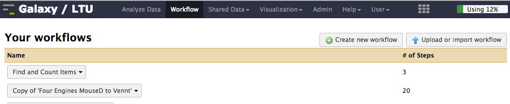
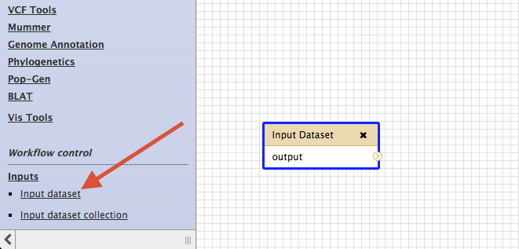
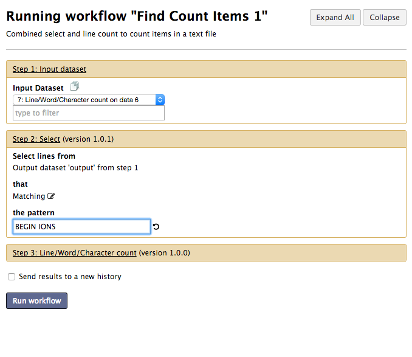

# Create a workflow

1. Click the _Workflow_ menu item at the top of galaxy
2. Click the button called _Create New Workflow_

	

3. Enter a name and description for the new workflow and click _Create_
4. You should now have a blank workflow canvas.  Create an input box for the workflow by scrolling to the bottom left of the galaxy tool menu.  Under _Workflow Control_ and then under _Inputs_ you should see an _Input dataset_ item. Click it to create a blank input box

	

5. Now add workflow nodes for other tools by clicking on the relevant tool in the galaxy tool menu (left pane of galaxy). The tools to add are;
	- The _Select_ tool from the _Find and Sort_ submenu
	- The _Line/Word/Character_ count tool from the _Text Manipulation_ submenu

6. After adding these tools you can join them up by dragging from the outputs of one node to the inputs of the next

	

7. Save your workflow
	
	

8. After saving the workflow return to the main _Workflow_ menu (top of Galaxy) and select your new workflow to run it.  Before running the workflow you will be presented with a window that allows you to alter the workflow inputs. 

	

	
