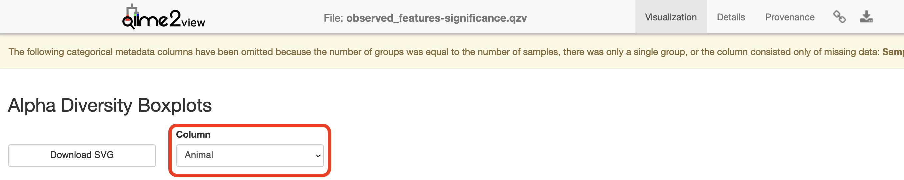

{: style="width:350px; padding-right:50px"}       {: style="width:150px"}

# QIIME2 - Mammal Dataset

Anticipated workshop duration when delivered to a group of participants is **4 hours**.  

For queries relating to this workshop, contact Melbourne Bioinformatics (bioinformatics-training@unimelb.edu.au).

## Overview

### Topic

* [x] Genomics
* [ ] Transcriptomics
* [ ] Proteomics
* [ ] Metabolomics
* [ ] Statistics and visualisation
* [ ] Structural Modelling
* [ ] Basic skills


### Skill level

* [ ] Beginner  
* [x] Intermediate  
* [ ] Advanced  

<br>
This workshop is designed for participants with command-line knowledge. You will need to be able to `ssh` into a remote machine, navigate the directory structure and `scp` files from a remote computer to your local computer.


### Description

What is the influence of sex and individual on gut microbiota of the short-beaked echidna, *Tachyglossus aculeatus*?

**Data:** Illumina MiSeq v3 paired-end (2 × 300 bp) reads (FASTQ).

**Tools:** QIIME 2

**Pipeline:**  

*Section 1:* Importing, cleaning and quality control of the data  
*Section 2:* Taxonomic Analysis  
*Section 3:* Building a phylogenetic tree  
*Section 4:* Basic visualisations and statistics  
*Section 5:* Exporting data for further analysis in R  
*Section 6:* Extra Information


-------------------
## Learning Objectives

At the end of this introductory workshop, you will:

* Take raw data from a sequencing facility and end with publication quality graphics and statistics
* Answer the question *What is the influence of sex and individual on gut microbiota of the short-beaked echidna?*


-------------------------------
## Tutorial layout

* There is a `Table of contents` on the right-hand side which can be used to easily navigate through the tutorial by clicking the relevant section.

```
These grey coloured boxes are code blocks. The rectangular boxes in the top
right hand corner of this code block/grey box can be used to copy the code to
the clipboard.
```

??? example "Coloured boxes like these with > on the far right hand side, can be clicked to reveal the contents."
    REVEALED!


!!! attention "Attention: Pay attention to the information in these boxes."
    Important information, hints and tips.


!!! fail "STOP"
    Important information about running a command - read carefully.


-------------------------------
## Requirements and preparation


!!! attention "Important"
    **Attendees are required to use their own laptop computers.**  

    At least one week before the workshop, if required, participants should install the software below.  This should provide sufficient time for participants to liaise with their own IT support should they encounter any IT problems.  


----------------------------
### Mode of Delivery

This workshop will be run on a Nectar Instance. For more information click [here](https://www.melbournebioinformatics.org.au/tutorials/tutorials/workshop_delivery_mode_info/workshops_nectar/#workshops-using-nectar-instances).

It is possible to [apply for your own Nectar allocation](https://www.melbournebioinformatics.org.au/tutorials/tutorials/workshop_delivery_mode_info/workshops_nectar/#applying-for-your-own-nectar-allocation) to run this workshop independently though you will need to install any software needed.


--------------------------------
### Required Software

For information about required software, click [here](https://www.melbournebioinformatics.org.au/tutorials/tutorials/workshop_delivery_mode_info/workshops_nectar/#required-software).  

You will need to use a Google Chrome or Mozilla Firefox web browser to view files in QIIME2 View.


-----------------------
### Required Data

* No additional data needs to be downloaded for this workshop - it is all located on the Nectar Instance. FASTQs are located in the directory `raw_data` and a metadata (`echidna_metadata.tsv`) file has also been provided.

* If you wish to analyse the data independently at a later stage, it can be downloaded from [here](https://zenodo.org/records/10158305). This link contains both the FASTQs and associated metadata file.

* If you are running this tutorial independently, you can also access the classifier that has been trained specifically for this data from [here](https://www.dropbox.com/scl/fi/s42p5fif7szzm38swcu0m/silva_138_16s_515-806_classifier.qza?rlkey=ss983qau9rwgztis2gfulhjcz&dl=0).


-------------------------------

### Slides and workshop instructions


Click <a href="../media/*.pdf" type="application/pdf" target="_blank">here</a> for slides presented during this workshop.

Click <a href="../*.pdf" type="application/pdf" target="_blank">here</a> for a printer friendly PDF version of this workshop.


-------------------------------
## Author Information
Developed by: Dr. Ashley Dungan, Dr. Gayle Philip and Laura Geissler  
School of Biosciences, University of Melbourne; Melbourne Bioinformatics


Created/Reviewed: November 2023

-------------------------------

## Background

What is the influence of sex and individual on gut microbiota of the short-beaked echidna?

### The Players


(Photo credit: [David Cook](https://www.flickr.com/photos/kookr/49303043801/in/photolist-2i7JZek-pokqhL-9YPmnf-2hwGZJt-V2m5AE-qQ9Rjr-6jYarZ-hQmKs1-2kV81TK-7nwjS4-7nwi66-5RmH9M-7nAfij-69Zuu7-3PtbYN-5BNEUc-am8qQx-dZVPsC-doMfv1-2cqMHxD-p5Uyac-69Zuu3-am8r6c-23Lud9a-6bd6qR-2kRwo2w-7L6aJn-5KkECj-dzPMye-FXNWc-dzVgMC-yVSjA-2oTmQRo-pTj2F3-6bd6FT-EsUo4F-GfPWB-5uVoMf-Kx1NXU-24bPRnh-67QWoY-fcswi1-4dnR2F-4drPaW-hPxeYn-722tRR-2qtRpk-7La9MC-qagum-2mMNSJ2))


* Short-beaked echidna [*Tachyglossus aculeatus*](https://en.wikipedia.org/wiki/Short-beaked_echidna) - a monotreme that has evolved to lay and incubate an egg. There are 38 samples in this dataset (*This data is a subset from a larger experiment*):  
    1. 5 samples from each individual (3x male and 3x female).  
    2. 8 control samples (DNA extraction blanks (n=5) and PCR blanks (n=3)).

* The gut bacterial communities, or microbiome, of the echidna.  


### The Study
Indigenous microbial communities (microbiota) play critical roles in host health. Monotremes, such as the short-beaked echidna, have evolved to lay and incubate an egg. Since both faeces and eggs pass through the cloaca, the faecal microbiota of female echidnas provides an opportunity for vertical transmission of microbes to their offspring as well as maintaining foetus health. Here, we characterise the gut microbiome of female and male short-beaked echidnas from six individuals living in captivity in the Currumbin Wildlife Sanctuary in Queensland. *This data is a subset from a larger experiment*.

Buthgamuwa I, Fenelon JC, Roser A, Meer H, Johnston SD, Dungan AM (2023) Unraveling the fecal microbiota stability in the short-beaked echidna (*Tachyglossus aculeatus*) across gestation. In review at *MicrobiologyOpen*. Full text on [ResearchSquare](https://www.researchsquare.com/article/rs-3243769/v1).


### QIIME 2 Analysis platform

!!! attention
    The version used in this workshop is qiime2-2023.9. Other versions of QIIME2 may result in minor differences in results.

<br>
Quantitative Insights Into Microbial Ecology 2 ([QIIME 2™](https://www.nature.com/articles/s41587-019-0209-9)) is a next-generation microbiome [bioinformatics platform](https://qiime2.org/) that is extensible, free, open source, and community developed. It allows researchers to:  

* Automatically track analyses with decentralised data provenance
* Interactively explore data with beautiful visualisations
* Easily share results without QIIME 2 installed
* Plugin-based system — researchers can add in tools as they wish

<br>
#### Viewing QIIME2 visualisations

!!! attention
    In order to use QIIME2 View to visualise your files, you will need to use a Google Chrome or Mozilla Firefox web browser (not in private browsing). For more information, click [here](https://view.qiime2.org).


As this workshop is being run on a remote Nectar Instance, you will need to [download the visual files (<fn>*.qzv</fn>) to your local computer](https://www.melbournebioinformatics.org.au/tutorials/tutorials/workshop_delivery_mode_info/workshops_nectar/#transferring-files-between-your-computer-and-nectar-instance) and view them in [QIIME2 View](https://view.qiime2.org) (q2view).


!!! attention
    We will be doing this step multiple times throughout this workshop to view visualisation files as they are generated.


<br>
Alternatively, ***if you have QIIME2 installed and are running it on your own computer***, you can use `qiime tools view` to view the results from the command line (e.g. `qiime tools view filename.qzv`). `qiime tools view` opens a browser window with your visualization loaded in it. When you are done, you can close the browser window and press `ctrl-c` on the keyboard to terminate the command.


------------
## Initial Set up on Nectar

### Byobu-screen

To ensure that commands continue to run should you get disconnected from your Nectar Instance, we'll [run a byobu-screen session](https://www.melbournebioinformatics.org.au/tutorials/tutorials/workshop_delivery_mode_info/workshops_nectar/#byobu-screen).


#### Starting a byobu-screen session
On Nectar, to start a `byobu-screen` session called `workshop`, type  

```bash
byobu-screen -S workshop
```

#### Reconnecting to a byobu-screen session
If you get disconnected from your Nectar Instance, follow the instructions [here](https://www.melbournebioinformatics.org.au/tutorials/tutorials/workshop_delivery_mode_info/workshops_nectar/#reconnecting-to-a-byobu-screen-session) to resume your session.

-------------
### Symbolic links to workshop data
Data for this workshop is stored in a central location (`/mnt/shared_data/`) on the Nectar file system that we will be using. We will use symbolic links (`ln -s`) to point to it. Symbolic links (or symlinks) are just "virtual" files or folders (they only take up a very little space) that point to a physical file or folder located elsewhere in the file system. Sequencing data can be large, and rather than unnecessarily having multiple copies of the data which can quickly take up a lot of space, we will simply point to the files needed in the `shared_data` folder.


```Bash
cd
ln -s /mnt/shared_data/raw_data raw_data
ln -s /mnt/shared_data/echidna_metadata.tsv echidna_metadata.tsv
ln -s /mnt/shared_data/silva_138_16s_515-806_classifier.qza silva_138_16s_515-806_classifier.qza
```

------------------------------
## Section 1: Importing, cleaning and quality control of the data

### Import data
These [samples](#the-study) were sequenced on a single Illumina MiSeq run using v3 (2 × 300 bp) reagents at the Walter and Eliza Hall Institute (WEHI), Melbourne, Australia. Data from WEHI came as paired-end, demultiplexed, unzipped <fn>*.fastq</fn> files with adapters still attached. Following the [QIIME2 importing tutorial](https://docs.qiime2.org/2023.9/tutorials/importing/), this is the Casava One Eight format. The files have been renamed to satisfy the Casava format as <fn>SampleID_FWDXX-REVXX_L001_R[1 or 2]_001.fastq</fn> e.g. CTRLA_Fwd04-Rev25_L001_R1_001.fastq.gz. The files were then zipped (.gzip).

Here, the data files (two per sample i.e. forward and reverse reads `R1` and `R2` respectively) will be imported and exported as a single QIIME 2 artefact file. These samples are already demultiplexed (i.e. sequences from each sample have been written to separate files), so a metadata file is not initially required.

!!! note
    To check the input syntax for any QIIME2 command, enter the command, followed by `--help` e.g. `qiime tools import --help`


!!! attention
    If you haven't already done so, make sure you are running the workshop in [byobu-screen](#byobu-screen) and have created the symbolic links to the [workshop data](#symbolic-links-to-workshop-data).


Start by making a new directory `analysis` to store all the output files from this tutorial. In addition, we will create a subdirectory called `seqs` to store the exported sequences.

```Bash
cd
mkdir -p analysis/seqs
```

Run the command to import the raw data located in the directory `raw_data` and export it to a single QIIME 2 artefact file, `combined.qza`.


```python
qiime tools import \
--type 'SampleData[PairedEndSequencesWithQuality]' \
--input-path raw_data \
--input-format CasavaOneEightSingleLanePerSampleDirFmt \
--output-path analysis/seqs/combined.qza
```


### Remove primers


!!! important
    Remember to ask you sequencing facility if the raw data you get has the primers attached - they may have already been removed.


These sequences still have the primers attached - they need to be removed (using `cutadapt`) before denoising. For this experiment, amplicons were amplified following the Earth Microbiome protocol with 515F (Caporaso)– 806R (Caporaso) primers targeting the v4 region of the 16S rRNA gene. The reads came back from the sequencer with primers attached, which are removed before denoising using cutadapt (v4.5 with python v3.8.15). With cutadapt, the sequence specified and all bases prior are trimmed; most sequences were trimmed at ~50 base pairs (bp). An error rate of 0.15 was used to maximize the number of reads that the primers were removed from while excluding nonspecific cutting. Any untrimmed read was discarded.


```python
qiime cutadapt trim-paired \
--i-demultiplexed-sequences analysis/seqs/combined.qza \
--p-front-f GTGCCAGCMGCCGCGGTAA \
--p-front-r GGACTACHVGGGTWTCTAAT \
--p-discard-untrimmed \
--p-error-rate 0.15 \
--output-dir analysis/seqs_trimmed \
--verbose
```


!!! attention
    The primers specified (515F (Caporaso)– 806R (Caporaso) targeting the v4 region of the bacterial 16S rRNA gene) correspond to *this* specific experiment - they will likely not work for your own data analyses.

!!! attention
    The error rate parameter, `#!python --p-error-rate`, will likely need to be adjusted for your own sample data to get 100% (or close to it) of reads trimmed.


### Create and interpret sequence quality data

Create a viewable summary file so the data quality can be checked. Viewing the quality plots generated here helps determine trim settings.


!!! info "**Things to look for:**"
    1. Where does the median quality drop below 35?  
    2. Do any of the samples have only a few sequences e.g. <1000? If so, you may want to omit them from the analysis later on in R.

Create a subdirectory in `analysis` called `visualisations` to store all files that we will visualise in one place.

```bash
mkdir analysis/visualisations
```


```python
qiime demux summarize \
--i-data analysis/seqs_trimmed/trimmed_sequences.qza \
--o-visualization analysis/visualisations/trimmed_sequences.qzv
```


Copy `analysis/visualisations/trimmed_sequences.qzv` to your local computer and view in [QIIME 2 View](https://view.qiime2.org) (q2view).


??? example "Visualisations: Read quality and demux output"
    [Click to view the **`trimmed_sequences.qzv`** file in QIIME 2 View](https://view.qiime2.org/visualization/?type=html&src=https%3A%2F%2Fdl.dropboxusercontent.com%2Fscl%2Ffi%2Fm484d0ukdn9n7a2gdw7hh%2Ftrimmed_sequences.qzv%3Frlkey%3Dta8bbyyuz6ucpyn4jymx78bp2%26dl%3D1).

    <br>
    Make sure to switch between the "Overview" and "Interactive Quality Plot" tabs in the top left hand corner. Click and drag on the plot to zoom in. Double click to zoom back out to full size. Hover over a box to see the parametric seven-number summary of the quality scores at the corresponding position.


    


###  Denoising the data

Trimmed sequences are now quality assessed using the `dada2` [plugin](https://pubmed.ncbi.nlm.nih.gov/27214047/) within QIIME2. `dada2` denoises data by modelling and correcting Illumina-sequenced amplicon errors, and infers exact amplicon sequence variants (***ASVs***), resolving differences of as little as 1 nucleotide. Its workflow consists of filtering, de-replication, reference‐free chimera detection, and paired‐end reads merging, resulting in a feature or ***ASV*** table.

!!! note
    This step may long time to run (i.e. hours), depending on files sizes and computational power.

    Remember to adjust `p-trunc-len-f` and `p-trunc-len-r` values according to your own data.


!!! question "Question: Based on your assessment of the quality plots from the <fn>trimmed_sequences.qzv</fn> file generated in the previous step, what values would you select for `p-trunc-len-f` and `p-trunc-len-r` in the command below? *Hint: At what base pair does the median quality drop below 35?*"

    ??? answer
        For version **qiime2.2023.9** (other QIIME2 versions may slightly differ). Upload your `trimmed_sequences.qzv` file to QIIME2 view, change to the "Interactive Quality Plot" tab and zoom in on the plots to find the relevant base pairs for the QIIME2 version you are using. Median quality score for raw reads dropped below 35 at 253 and 208 bp for the forward and reverse reads, respectively. However, being conservative and truncating significantly less than these values provides higher quality data with more reads retained. In this case, we will use `p-trunc-len-f 213` and `p-trunc-len-r 168` (40 bp extra truncated). **Researchers should play around with this and compare the denoising stats after various trimming lengths.**  


In the following command, a pooling method of 'pseudo' is selected. With the pseudo-pooling method, samples are denoised independently once, ASVs detected in at least 2 samples are recorded, and samples are denoised independently a second time, but this time with prior knowledge of the recorded ASVs and thus higher sensitivity to those ASVs. This is better than the default of 'independent' (where samples are denoised independently) when you expect samples in the run to have similar ASVs overall.

!!! fail "STOP - Workshop participants only"
    Due to computational limitations in a workshop setting, this command will be run staggered (by co-ordinating with other users on the Nectar Instance you are logged in to), with no more than two users per Instance running the command at the same time.

*The specified output directory must not pre-exist.*  

```python
qiime dada2 denoise-paired \
--i-demultiplexed-seqs analysis/seqs_trimmed/trimmed_sequences.qza \
--p-trunc-len-f xx \
--p-trunc-len-r xx \
--p-n-threads 0 \
--p-pooling-method 'pseudo' \
--output-dir analysis/dada2out \
--verbose
```


### Generate summary files

A [metadata file](https://docs.qiime2.org/2023.9/tutorials/metadata/) is required which provides the key to gaining biological insight from your data. The file <fn>echidna_metadata.tsv</fn> is provided in the home directory of your Nectar instance. This spreadsheet has already been verified using the plugin for Google Sheets, [keemei](https://keemei.qiime2.org/).  

!!! info "**Things to look for:**"
    1. How many features (*ASVs*) were generated? Are the communities high or low diversity?
    2. Do BLAST searches of the representative sequences make sense? Are the features what you would expect e.g. marine or terrestrial?
    3. Have a large number (e.g. >50%) of sequences been lost during denoising/filtering? If so, the settings might be too stringent.

<br>


```python
qiime metadata tabulate \
--m-input-file analysis/dada2out/denoising_stats.qza \
--o-visualization analysis/visualisations/16s_denoising_stats.qzv \
--verbose
```


Copy `analysis/visualisations/16s_denoising_stats.qzv` to your local computer and view in QIIME 2 View (q2view).


??? example "Visualisation: Denoising Stats"
    [Click to view the **`16s_denoising_stats.qzv`** file in QIIME 2 View](https://view.qiime2.org/visualization/?type=html&src=https%3A%2F%2Fdl.dropboxusercontent.com%2Fscl%2Ffi%2Fhwpyu01wm0ubb82wbb1dt%2F16s_denoising_stats.qzv%3Frlkey%3Dkuc0zfuozlpzr0c49sxhr96m7%26dl%3D1).


<br>
```python
qiime feature-table summarize \
--i-table analysis/dada2out/table.qza \
--m-sample-metadata-file echidna_metadata.tsv \
--o-visualization analysis/visualisations/16s_table.qzv \
--verbose
```

Copy `analysis/visualisations/16s_table.qzv` to your local computer and view in QIIME 2 View (q2view).


??? example "Visualisations: Feature/ASV summary"
    [Click to view the **`16s_table.qzv`** file in QIIME 2 View](https://view.qiime2.org/visualization/?type=html&src=https%3A%2F%2Fdl.dropboxusercontent.com%2Fscl%2Ffi%2Fhkvk2yqpnm4w9oy64maf3%2F16s_table.qzv%3Frlkey%3Dtm368u59rexzgdwpm9m6l11l1%26dl%3D1).
    <br>  

    Make sure to switch between the "Overview" and "Feature Detail" tabs in the top left hand corner.  
    

<br>
```python
qiime feature-table tabulate-seqs \
--i-data analysis/dada2out/representative_sequences.qza \
--o-visualization analysis/visualisations/16s_representative_seqs.qzv \
--verbose
```

Copy `analysis/visualisations/16s_representative_seqs.qzv` to your local computer and view in QIIME 2 View (q2view).

??? example "Visualisation: Representative Sequences"
    [Click to view the **`16s_representative_seqs.qzv`** file in QIIME 2 View](https://view.qiime2.org/visualization/?type=html&src=https%3A%2F%2Fdl.dropboxusercontent.com%2Fscl%2Ffi%2F2uesky0zntkapxhlr58gu%2F16s_representative_seqs.qzv%3Frlkey%3Dakmmi05wpcwommjuytgub2grk%26dl%3D1).


------------
## Section 2: Taxonomic Analysis

### Assign taxonomy
Here we will classify each identical read or *Amplicon Sequence Variant (ASV)* to the highest resolution based on a database. Common databases for bacteria datasets are [Greengenes](https://greengenes.secondgenome.com/), [SILVA](https://www.arb-silva.de/), [Ribosomal Database Project](http://rdp.cme.msu.edu/), or [Genome Taxonomy Database](https://gtdb.ecogenomic.org/). See [Porter and Hajibabaei, 2020](https://www.frontiersin.org/articles/10.3389/fevo.2020.00248/full) for a review of different classifiers for metabarcoding research. The classifier chosen is dependent upon:

1. Previously published data in a field
2. The target region of interest
3. The number of reference sequences for your organism in the database and how recently that database was updated.


A classifier has already been trained for you for the V4 region of the bacterial 16S rRNA gene using the SILVA database. The next step will take a while to run. *The output directory cannot previously exist*.


n_jobs = 1  This runs the script using all available cores

!!! note
    [The classifier](https://www.dropbox.com/scl/fi/s42p5fif7szzm38swcu0m/silva_138_16s_515-806_classifier.qza?rlkey=ss983qau9rwgztis2gfulhjcz&dl=0) used here is only appropriate for the specific 16S rRNA region that *this* data represents. You will need to train your own classifier for your own data. For more information about training your own classifier, see [Section 6: Extra Information](#train-silva-v138-classifier-for-16s18s-rrna-gene-marker-sequences).

!!! fail "STOP - Workshop participants only"
    Due to time limitations in a workshop setting, please do NOT run the `qiime feature-classifier classify-sklearn` command below. You will need to access a pre-computed `classification.qza` file that this command generates by running the following: `cd; mkdir analysis/taxonomy; cp /mnt/shared_data/pre_computed/classification.qza analysis/taxonomy`. If you have accidentally run the command below, `ctrl-c` will terminate it.

```python
qiime feature-classifier classify-sklearn \
--i-classifier silva_138_16s_515-806_classifier.qza \
--i-reads analysis/dada2out/representative_sequences.qza \
--p-n-jobs 1 \
--output-dir analysis/taxonomy \
--verbose
```


!!! warning "Warning"
    This step often runs out of memory on full datasets. Some options are to change the number of cores you are using (adjust `--p-n-jobs`) or add `--p-reads-per-batch 10000` and try again. The QIIME 2 forum has many threads regarding this issue so always check there was well.


### Generate a viewable summary file of the taxonomic assignments.


```python
qiime metadata tabulate \
--m-input-file analysis/taxonomy/classification.qza \
--o-visualization analysis/visualisations/taxonomy.qzv \
--verbose
```


Copy `analysis/visualisations/taxonomy.qzv` to your local computer and view in QIIME 2 View (q2view).

??? example "Visualisation: Taxonomy"
    [Click to view the **`taxonomy.qzv`** file in QIIME 2 View](https://view.qiime2.org/visualization/?type=html&src=https%3A%2F%2Fdl.dropboxusercontent.com%2Fscl%2Ffi%2Fpl5fz8bfv3iraqe7w3ryt%2Ftaxonomy.qzv%3Frlkey%3Dbnury3ua0w002sozo0eudklv7%26dl%3D1).


### Filtering

Filter out reads classified as mitochondria and chloroplast. Unassigned ASVs are retained. Generate a viewable summary file of the new table to see the effect of filtering.

According to QIIME developer Nicholas Bokulich, low abundance filtering (i.e. removing ASVs containing very few sequences) is not necessary under the ASV model.


```python
qiime taxa filter-table \
--i-table analysis/dada2out/table.qza \
--i-taxonomy analysis/taxonomy/classification.qza  \
--p-exclude Mitochondria,Chloroplast \
--o-filtered-table analysis/taxonomy/16s_table_filtered.qza \
--verbose
```

```python
qiime feature-table summarize \
--i-table analysis/taxonomy/16s_table_filtered.qza \
--m-sample-metadata-file echidna_metadata.tsv \
--o-visualization analysis/visualisations/16s_table_filtered.qzv \
--verbose
```


Copy `analysis/visualisations/16s_table_filtered.qzv` to your local computer and view in QIIME 2 View (q2view).

??? example "Visualisation: 16s_table_filtered"
    [Click to view the **`16s_table_filtered.qzv`** file in QIIME 2 View](https://view.qiime2.org/visualization/?src=https%3A%2F%2Fdl.dropboxusercontent.com%2Fscl%2Ffi%2F9c1m746lxuplmwb79gldo%2F16s_table_filtered.qzv%3Frlkey%3D9iz32202xm36rfac3r7i50wtx%26dl%3D1&type=html).


---------------------------------------
## Section 3: Build a phylogenetic tree

The next step does the following:

1. Perform an alignment on the representative sequences.
2. Mask sites in the alignment that are not phylogenetically informative.
3. Generate a phylogenetic tree.
4. Apply mid-point rooting to the tree.

A phylogenetic tree is necessary for any analyses that incorporates information on the relative relatedness of community members, by incorporating phylogenetic distances between observed organisms in the computation. This would include any beta-diversity analyses and visualisations from a weighted or unweighted Unifrac distance matrix.


```bash
mkdir analysis/tree
```

Use one thread only (which is the default action) so that identical results can be produced if rerun.


```python
qiime phylogeny align-to-tree-mafft-fasttree \
--i-sequences analysis/dada2out/representative_sequences.qza \
--o-alignment analysis/tree/aligned_16s_representative_seqs.qza \
--o-masked-alignment analysis/tree/masked_aligned_16s_representative_seqs.qza \
--o-tree analysis/tree/16s_unrooted_tree.qza \
--o-rooted-tree analysis/tree/16s_rooted_tree.qza \
--p-n-threads 1 \
--verbose
```

----------
## Section 4: Basic visualisations and statistics

### ASV relative abundance bar charts
Create bar charts to compare the relative abundance of ASVs across samples.


```python
qiime taxa barplot \
--i-table analysis/taxonomy/16s_table_filtered.qza \
--i-taxonomy analysis/taxonomy/classification.qza \
--m-metadata-file echidna_metadata.tsv \
--o-visualization analysis/visualisations/barchart.qzv \
--verbose
```


Copy `analysis/visualisations/barchart.qzv` to your local computer and view in QIIME 2 View (q2view). Try selecting different taxonomic levels and metadata-based sample sorting.


??? example "Visualisations: Taxonomy Barplots"
    [Click to view the **`barchart.qzv`** file in QIIME 2 View](https://view.qiime2.org/visualization/?type=html&src=https%3A%2F%2Fdl.dropboxusercontent.com%2Fscl%2Ffi%2F0r73637tkg60wjbf5s07a%2Fbarchart.qzv%3Frlkey%3Djlx2ctcs9n5rszkun7bgaint1%26dl%3D1).
    <br>   

    Increase the "Bar Width", select "Animal" or "Sex" in "Sort Samples By" drop-down menu and explore the resulting barplots by changing the levels in the "Change Taxonomic Level" dropdown menu (Select Level 1, then Level 3, and then Level 5 for example).  

    


### Rarefaction curves
Generate rarefaction curves to determine whether the samples have been sequenced deeply enough to capture all the community members. The max depth setting will depend on the number of sequences in your samples.


!!! info "**Things to look for:**"
    1. Do the curves for each sample plateau? If they don’t, the samples haven’t been sequenced deeply enough to capture the full diversity of the bacterial communities, which is shown on the y-axis.
    2. At what sequencing depth (x-axis) do your curves plateau? This value will be important for downstream analyses, particularly for alpha diversity analyses.


!!! note
    The value that you provide for --p-max-depth should be determined by reviewing the “Frequency per sample” information presented in the <fn>16s_table_filtered.qzv</fn> file that was created above. In general, choosing a value that is somewhere around the median frequency seems to work well, but you may want to increase that value if the lines in the resulting rarefaction plot don’t appear to be levelling out, or decrease that value if you seem to be losing many of your samples due to low total frequencies closer to the minimum sampling depth than the maximum sampling depth.


```python
qiime diversity alpha-rarefaction \
--i-table analysis/taxonomy/16s_table_filtered.qza \
--i-phylogeny analysis/tree/16s_rooted_tree.qza \
--p-max-depth 20000 \
--p-min-depth 500 \
--p-steps 40 \
--m-metadata-file echidna_metadata.tsv \
--o-visualization analysis/visualisations/16s_alpha_rarefaction.qzv \
--verbose
```


Copy `analysis/visualisations/16s_alpha_rarefaction.qzv` to your local computer and view in QIIME 2 View (q2view).


??? example "Visualisation: Rarefaction"
    [Click to view the **`16s_alpha_rarefaction.qzv`** file in QIIME 2 View](https://view.qiime2.org/visualization/?type=html&src=https%3A%2F%2Fdl.dropboxusercontent.com%2Fscl%2Ffi%2Fa9tqrizdol82j4f2em7ll%2F16s_alpha_rarefaction.qzv%3Frlkey%3Dilcp14psote78zp7rbjrdlz26%26dl%3D1).
    <br>   

    Select "Animal" in the "Sample Metadata Column" and "observed_features" under "Metric":

    


### Alpha and beta diversity analysis
The following is taken directly from the [Moving Pictures tutorial](https://docs.qiime2.org/2023.9/tutorials/moving-pictures/) and adapted for this data set. QIIME 2’s diversity analyses are available through the `q2-diversity` plugin, which supports computing alpha- and beta- diversity metrics, applying related statistical tests, and generating interactive visualisations. We’ll first apply the core-metrics-phylogenetic method, which rarefies a FeatureTable[Frequency] to a user-specified depth, computes several alpha- and beta- diversity metrics, and generates principle coordinates analysis (PCoA) plots using Emperor for each of the beta diversity metrics.

The metrics computed by default are:

* Alpha diversity (operate on a single sample (i.e. within sample diversity)).
    * Shannon’s diversity index (a quantitative measure of community richness)
    * Observed OTUs (a qualitative measure of community richness)
    * Faith’s Phylogenetic Diversity (a qualitative measure of community richness that incorporates phylogenetic relationships between the features)
    * Evenness (or Pielou’s Evenness; a measure of community evenness)
* Beta diversity (operate on a pair of samples (i.e. between sample diversity)).
    * Jaccard distance (a qualitative measure of community dissimilarity)
    * Bray-Curtis distance (a quantitative measure of community dissimilarity)
    * unweighted UniFrac distance (a qualitative measure of community dissimilarity that incorporates phylogenetic relationships between the features)
    * weighted UniFrac distance (a quantitative measure of community dissimilarity that incorporates phylogenetic relationships between the features)

An important parameter that needs to be provided to this script is `--p-sampling-depth`, which is the even sampling (i.e. rarefaction) depth that was determined above. As most diversity metrics are sensitive to different sampling depths across different samples, this script will randomly subsample the counts from each sample to the value provided for this parameter. For example, if `--p-sampling-depth 500` is provided, this step will subsample the counts in each sample without replacement, so that each sample in the resulting table has a total count of 500. If the total count for any sample(s) are smaller than this value, those samples will be excluded from the diversity analysis. Choosing this value is tricky. We recommend making your choice by reviewing the information presented in the <fn>16s_table_filtered.qzv</fn> file that was created above. Choose a value that is as high as possible (so more sequences per sample are retained), while excluding as few samples as possible. Extraction blanks and PCR negatives are absolutely fine to omit.


```python
qiime diversity core-metrics-phylogenetic \
  --i-phylogeny analysis/tree/16s_rooted_tree.qza \
  --i-table analysis/taxonomy/16s_table_filtered.qza \
  --p-sampling-depth 7316 \
  --m-metadata-file echidna_metadata.tsv \
  --output-dir analysis/diversity_metrics
```

Copy the `.qzv` files created from the above command into the `visualisations` subdirectory.

```Bash
cp analysis/diversity_metrics/*.qzv analysis/visualisations
```

To view the differences between sample composition using unweighted UniFrac in ordination space, copy `analysis/visualisations/unweighted_unifrac_emperor.qzv` to your local computer and view in QIIME 2 View (q2view).


??? example "Visualisations: Unweighted UniFrac Emperor Ordination"
    [Click to view the **`unweighted_unifrac_emperor.qzv`** file in QIIME 2 View](https://view.qiime2.org/visualization/?type=html&src=https%3A%2F%2Fdl.dropboxusercontent.com%2Fscl%2Ffi%2Fpsqxp4hfgvrzpeta687lk%2Funweighted_unifrac_emperor.qzv%3Frlkey%3Dujflsjcjx5qjl2z9vc61072pi%26dl%3D1).  

    On q2view, select the "Color" tab, choose "Animal" under the "Select a Color Category" dropdown menu, then select the "Shape" tab and choose "Sex" under the "Select a Shape Category" dropdown menu.  

    

Next, we’ll test for associations between categorical metadata columns and alpha diversity data. We’ll do that here for observed ASVs and evenness metrics.


```python
qiime diversity alpha-group-significance \
  --i-alpha-diversity analysis/diversity_metrics/observed_features_vector.qza \
  --m-metadata-file echidna_metadata.tsv \
  --o-visualization analysis/visualisations/observed_features-significance.qzv
```


Copy `analysis/visualisations/observed_features-significance.qzv` to your local computer and view in QIIME 2 View (q2view).

??? example "Visualisation: Observed Diversity output"
    [Click to view the **`observed_features-significance.qzv`** file in QIIME 2 View](https://view.qiime2.org/visualization/?type=html&src=https%3A%2F%2Fdl.dropboxusercontent.com%2Fscl%2Ffi%2Ftn3r31tk3s04pv19cb0ig%2Fobserved_features-significance.qzv%3Frlkey%3D0qmb7fezh6am8drib39qn629h%26dl%3D1).  

    Select "Animal" under the "Column" dropdown menu.  

    

<br>
```python
qiime diversity alpha-group-significance \
  --i-alpha-diversity analysis/diversity_metrics/evenness_vector.qza \
  --m-metadata-file echidna_metadata.tsv \
  --o-visualization analysis/visualisations/evenness-group-significance.qzv
```

Copy `analysis/visualisations/evenness-group-significance.qzv` to your local computer and view in QIIME 2 View (q2view).

??? example "Visualisation: Evenness output"
    [Click to view the **`evenness-group-significance.qzv`** file in QIIME 2 View](https://view.qiime2.org/visualization/?type=html&src=https%3A%2F%2Fdl.dropboxusercontent.com%2Fscl%2Ffi%2Foi8wbq9x4uztgkjv422gd%2Fevenness-group-significance.qzv%3Frlkey%3Dlvmydv7kkuotbtz2cilztyss7%26dl%3D1).  

    Select "Animal" under the "Column" dropdown menu.

    

Finally, we’ll analyse sample composition in the context of categorical metadata using a permutational multivariate analysis of variance (PERMANOVA, first described in Anderson (2001)) test using the beta-group-significance command. The following commands will test whether distances between samples within a group are more similar to each other then they are to samples from the other groups. If you call this command with the `--p-pairwise` parameter, as we’ll do here, it will also perform pairwise tests that will allow you to determine which specific pairs of groups differ from one another, if any. This command can be slow to run, especially when passing `--p-pairwise`, since it is based on permutation tests. So, unlike the previous commands, we’ll run beta-group-significance on specific columns of metadata that we’re interested in exploring, rather than all metadata columns to which it is applicable. Here we’ll apply this to our unweighted UniFrac distances, using two sample metadata columns, as follows.


```python
qiime diversity beta-group-significance \
  --i-distance-matrix analysis/diversity_metrics/unweighted_unifrac_distance_matrix.qza \
  --m-metadata-file echidna_metadata.tsv \
  --m-metadata-column Sex \
  --o-visualization analysis/visualisations/unweighted-unifrac-gender-significance.qzv \
  --p-pairwise
```


Copy `analysis/visualisations/unweighted-unifrac-gender-significance.qzv` to your local computer and view in QIIME 2 View (q2view).

??? example "Visualisation: Gender significance output"
    [Click to view the **`unweighted-unifrac-gender-significance.qzv`** file in QIIME 2 View](https://view.qiime2.org/visualization/?type=html&src=https%3A%2F%2Fdl.dropboxusercontent.com%2Fscl%2Ffi%2Fo8jzhit0mgs2w13i5mzno%2Funweighted-unifrac-gender-significance.qzv%3Frlkey%3Di4pddpyo9cosz7tg2dk8nr2zr%26dl%3D1).


<br>
```python
qiime diversity beta-group-significance \
  --i-distance-matrix analysis/diversity_metrics/unweighted_unifrac_distance_matrix.qza \
  --m-metadata-file echidna_metadata.tsv \
  --m-metadata-column Animal \
  --o-visualization analysis/visualisations/unweighted-unifrac-animal-significance.qzv \
  --p-pairwise
```


Copy `analysis/visualisations/unweighted-unifrac-animal-significance.qzv` to your local computer and view in QIIME 2 View (q2view).


??? example "Visualisation: Animal significance output"
    [Click to view the **`unweighted-unifrac-animal-significance.qzv`** file in QIIME 2 View](https://view.qiime2.org/visualization/?type=html&src=https%3A%2F%2Fdl.dropboxusercontent.com%2Fscl%2Ffi%2Fir3xgvn0vdwajx5hw663o%2Funweighted-unifrac-animal-significance.qzv%3Frlkey%3Dcekbzric4xww39b7hlf4x4772%26dl%3D1).
    <br>   


??? example "Provenance"
    [Click to view the **`unweighted-unifrac-animal-significance.qzv`** provenance file in QIIME 2 View](https://view.qiime2.org/provenance/?src=https%3A%2F%2Fdl.dropboxusercontent.com%2Fscl%2Ffi%2Fir3xgvn0vdwajx5hw663o%2Funweighted-unifrac-animal-significance.qzv%3Frlkey%3Dcekbzric4xww39b7hlf4x4772%26dl%3D1).
    <br>   
    

------------------------------------------
## Section 5: Exporting data for further analysis in R

You need to export your ASV table, taxonomy table, and tree file for analyses in R. Many file formats can be accepted.

Export unrooted tree as `.nwk` format as required for the R package `phyloseq`.


```python
qiime tools export \
  --input-path analysis/tree/16s_unrooted_tree.qza \
  --output-path analysis/export
```

Create a BIOM table with taxonomy annotations. A FeatureTable[Frequency] artefact will be exported as a BIOM v2.1.0 formatted file.


```python
qiime tools export \
  --input-path analysis/taxonomy/16s_table_filtered.qza \
  --output-path analysis/export
```

Then export BIOM to TSV

```python
biom convert \
-i analysis/export/feature-table.biom \
-o analysis/export/feature-table.tsv \
--to-tsv
```

Export Taxonomy as TSV


```python
qiime tools export \
--input-path analysis/taxonomy/classification.qza \
--output-path analysis/export
```

Delete the header lines of the .tsv files

``` bash
sed '1d' analysis/export/taxonomy.tsv > analysis/export/taxonomy_noHeader.tsv
sed '1d' analysis/export/feature-table.tsv > analysis/export/feature-table_noHeader.tsv
```

Some packages require your data to be in a consistent order, i.e. the order of your ASVs in the taxonomy table rows to be the same order of ASVs in the columns of your ASV table. It's recommended to clean up your taxonomy file. You can have blank spots where the level of classification was not completely resolved.

## Section 6: Extra Information

!!! fail "STOP"
    This section contains information on how to train the classifier for analysing your **own** data. This will **NOT** be covered in the workshop.


### Train SILVA v138 classifier for 16S/18S rRNA gene marker sequences.

The newest version of the [SILVA](https://www.arb-silva.de/) database (v138) can be trained to classify marker gene sequences originating from the 16S/18S rRNA gene. Reference files `silva-138-99-seqs.qza` and `silva-138-99-tax.qza` were [downloaded from SILVA](https://www.arb-silva.de/download/archive/) and imported to get the artefact files. You can download both these files from [here](https://www.dropbox.com/s/x8ogeefjknimhkx/classifier_files.zip?dl=0).


Reads for the region of interest are first extracted. **You will need to input your forward and reverse primer sequences**. See QIIME2 documentation for more [information](https://docs.qiime2.org/2023.9/plugins/available/feature-classifier/extract-reads/).


```python
qiime feature-classifier extract-reads \
--i-sequences silva-138-99-seqs.qza \
--p-f-primer FORWARD_PRIMER_SEQUENCE \
--p-r-primer REVERSE_PRIMER_SEQUENCE \
--o-reads silva_138_marker_gene.qza \
--verbose
```

The classifier is then trained using a naive Bayes algorithm. See QIIME2 documentation for more [information](https://docs.qiime2.org/2023.9/plugins/available/feature-classifier/fit-classifier-naive-bayes/).


```python
qiime feature-classifier fit-classifier-naive-bayes \
--i-reference-reads silva_138_marker_gene.qza \
--i-reference-taxonomy silva-138-99-tax.qza \
--o-classifier silva_138_marker_gene_classifier.qza \
--verbose
```
