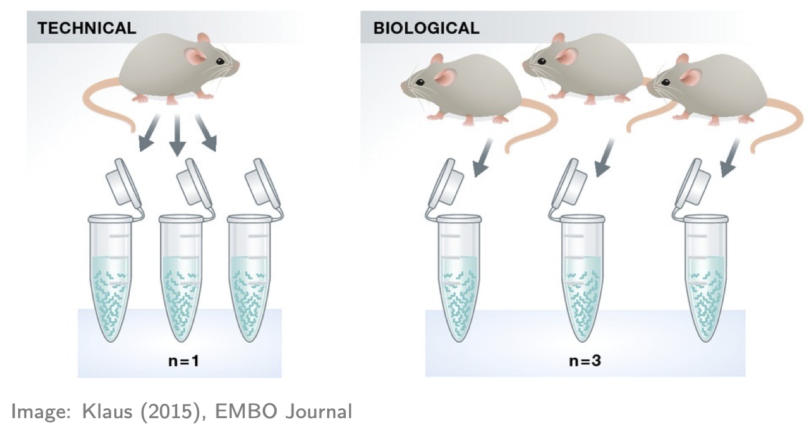

# An introduction to RNA-seq analysis: counts to differentially expressed genes


**Author:** Luke C. Gandolfo, Melbourne Bioinformatics. Last updated October 2025.

## Overview

**Topic**

* [ ] Genomics
* [x] Transcriptomics
* [ ] Proteomics
* [ ] Metabolomics
* [ ] Statistics and visualisation
* [ ] Structural Modelling
* [ ] Basic skills


**Skill level**

* [ ] Beginner  
* [x] Intermediate  
* [ ] Advanced  

**Data:** [Obers et al. "Retinoic acid and TGF-β orchestrate organ-specific programs of tissue residency", *Immunity* (2024)](https://www.cell.com/immunity/abstract/S1074-7613(24)00459-X)

**Tools:** RStudio

**Pipeline:**  
*Section 1:* Introduction, background, and preliminaries.   
*Section 2:* Filtering, visualisation, normalisation.  
*Section 3:* Differential Expression with the *limma* package.   
*Section 4:* Summary and exercises.   

**Learning objectives:** TO-DO.


# Introduction

Comparing gene expression, i.e. the amount of RNA transcript, in different experimental conditions provides important biological insights. For example, comparing gene expression in cancer and non-cancer tissue gives us insights into the biology of cancer. While there are many ways of measuring gene expression, the focus of this workshop will be (bulk) *RNA-seq*, a technology which (nominally) measures gene expression across the whole transcriptome, i.e. *all* RNA transcripts, in a sample.

The main aim of this workshop is to show you how to go from a "counts table" of RNA-seq data to a ranked list of differentially expressed (DE) genes using R and statistical software packages from Bioconductor (note: basic knowledge of R will be assumed). This aim may seem modest, but our approach will be to carefully discuss each step along the way. The motivation for this is twofold: (1) to give you some understanding and thus confidence in what you're doing; and (2) to give you some skills to judge whether the DE results you obtain are likely to be trustworthy or rubbish.

The second motivation is important. In our context, rubbish DE results take two forms: *missed discoveries* (i.e. failing to infer a gene to be DE when it really is DE) or *false discoveries* (i.e. inferring a gene to be DE when it's actually not DE). Rubbish results are a real danger in the following way: you can competently do all the steps in this workshop and still arrive at rubbish! How is this possible? Because some data sets aren't amenable to the kinds of analyses we'll be discussing, and it's important to know when this occurs (if you care about the results!). Such data sets are typically problematic or difficult in some way and will require techniques and strategies beyond those contained in this workshop to obtain non-rubbish results. The good news, however, is that many data sets are amenable to the analyses we'll discuss.

*Important note*. Our starting point for RNA-seq analysis will be a `table of counts'; we won't begin from raw sequencing data (in the form of .fastq files). There's several reasons for this. Firstly, going from raw sequencing data to a table of counts can be computationally intensive and a little involved. Secondly, because of this, workshops often fail to spend enough time on the (more important) statistical part that comes after this, i.e. analysing the table of counts. Thirdly, many people have no interest in processing raw sequencing data; they're simply interested in analysing one of vast number of publicly available counts tables of RNA-seq data. If you've generated raw sequencing data of your own (or want to look at publicly available raw sequencing files) then you should look at other workshops for how to go from this data to a table of counts. But, if you've got a table of counts that you want to analyse, then this is the workshop for you!

# Some background

RNA-seq involves several steps, as summarised in this figure:


{width=90%}


We could say a lot more about each step, but this isn't our focus. For us, the important thing to know is that after this whole process we arrive at a *table of counts*---the fundamental object of RNA-seq data analysis. For example, here's a made up table of counts for two groups (A and B) each with three biological replicates (using the typical 'genes rows, samples in columns' convention):


{width=80%}


The counts quantify expression: more counts, more expression (roughly speaking---see below). The fundamental question we want to ask is: which genes are DE between the groups? (e.g. is Gene 3 DE?)

Before proceeding, some important comments about replicates:

1. If you don't have replicates (ideally for all groups), STOP! You'll likely produce rubbish results (actually statistical tools will often give you an error in this situation, but not always!). Here "replicates" means *biological* replicates (data collected from distinct individuals), not *technical* replicates (data repeatedly collected from the same individual), a distinction nicely depicted in the figure below. Biological replicates are essential because you cannot do rigorous RNA-seq analysis (i.e. statistics) without them. Why? There are many reasons, e.g. you'll have no way of estimating the (biological) variation, i.e. "noise", in your data and so no way of properly comparing any "signal" (of DE) to the "noise" (actually there are some ways around this issue but they're not recommended). Thus, 2 replicates is a minimum and 3+ replicates (depending on the context and situation) are recommended.


{width=50%}


2. If you have technical replicates, PROCEED CAREFULLY! They shouldn't be analysed as if they were separate (independent) samples. Why? To see the main reason, consider an example: suppose one of your groups consists of three individuals each with 2 technical replications, making 3x2 = 6 samples in that group. It may seem like there's 6 samples in that group for doing the relevant statistics, but don't be fooled: there's only 3 independent samples (i.e. distinct individuals). If you analysed the 6 samples as if they were separate samples, your analysis would "overestimate" the amount of information available---there's only 3 "pieces" of information, not 6---and thus might produce many false discoveries (because the estimated variation might be too small). The standard advice for handling technical replicates is this: add the counts (gene-wise) of each technical replicate to produce single biological replicates. Note, however, that this only applies if there's no significant technical differences between the replicates (e.g. the technical replicates sit almost on top of each other in a PCA plot---see below). If there are significant technical differences between the replicates (e.g. if each replicate is in different batch, which incidentally is one of the main reasons for generating technical replicates) then you should consult an expert. And, if you're in doubt about applying this advice, consult an expert!

Another nice way of understanding the technical replicate issue above is through humour, e.g. reflect on the mistake being made in this [xkcd](https://xkcd.com/) comic:


{width=80%}


# Example data

For illustration, we'll look at data from the publication: [Obers et al. "Retinoic acid and TGF-β orchestrate organ-specific programs of tissue residency", *Immunity* (2024)](https://www.cell.com/immunity/abstract/S1074-7613(24)00459-X). The aim of this study was to investigate the roles of retinoic acid (RA) and the cytokine TGFb in driving organ-specificity of tissue resident T cells.

The relevant RNA-seq counts table for this study can be obtained from [Gene Expression Omnibus](https://www.ncbi.nlm.nih.gov/geo) as follows:

1. Use this [link](https://www.ncbi.nlm.nih.gov/geo/query/acc.cgi?acc=GSE232852)
2. Scroll down to the "Supplementary file" section
3. For the file "GSE232852_CountsTable.txt.gz" (first row), hit "ftp" or "http" in the "Downloads" column

Once the file is downloaded, move it to your R working directory and unzip it. Now let's read it into R and take a look (note: you'll need to adjust the file path accordingly):
```{r, paged.print=F}
tab <- read.table("../Data/GSE232852_CountsTable.txt", header=TRUE)
head(tab, n=50)
```
Here's what we have:

- The first 2 columns are gene annotation: "EnsembleID" and "Symbol", respectively (note: EnsembleID is one of many standard gene identifiers in use; another common identifier is "Entrez" gene ID).
- The next 12 columns represent the count data on the four experimental groups of interest, each with three biological replicates; specially, a special kind of T cell treated with either: RA, TGFb, both (RA_TGFb), or neither (WT).

# Preliminaries

Before we can start analysing this data, there's four preliminaries:

1. Let's load the R packages we'll be using (note: if you don't have the relevant packages installed, then you'll need to run the commented code):
```{r}
# # CRAN packages
# install.packages(c("ggplot2","ggrepel","ggfortify","scales","pheatmap","matrixStats","openxlsx"))
library(ggplot2)
library(ggrepel)
library(ggfortify)
library(scales)
library(pheatmap)
library(matrixStats)
library(openxlsx)

# # Bioconductor packages
# install.packages("BiocManager")
# BiocManager::install(c("limma","edgeR"))
library(limma)
library(edgeR)
```
We'll mainly be using `limma` and some functions from `edgeR` to analyse the data above; the other packages will be used for plotting and exporting results tables.

2. We need to organize our data into `DGEList` which is a special "container" for our analysis:
```{r}
annotation <- tab[,c(1,2)]
counts <- tab[,-c(1,2)]

dge <- DGEList(counts=counts, genes=annotation)
```
Note that we split the data table into two distinct parts---gene annotation and counts---storing each into the relevant slots of the container.

3. It's helpful to create a table of sample information:
```{r, paged.print=F}
samples <- colnames(tab)[-c(1,2)]
group <- c(rep("RA",3), rep("TGFb",3), rep("RA_TGFb",3), rep("WT",3))

info <- data.frame(samples, group)
info
```
Here the first column is a unique sample name and the second labels the experimental group the sample belongs to. Incidentally, this would be the place to store any other relevant sample information (e.g. what batch each sample belongs to, if relevant) and even relevant biological covariates (e.g. sex, age, etc.). Note also that such sample information is usually prepared separately (in, say, Excel) and then read into R; since our example is simple, we created it on the fly.

4. We need to create a factor vector for our groups:
```{r}
group <- factor(info$group)
group
```
Factor vectors are special in R: they have an extra piece of information called "levels" (in this case, it's saying this factor has four levels), information which R uses to specify statistical models etc. As you'll see, this particular `group` vector will be important in our analysis.

# First steps: filtering, visualisation, and basic normalisation
## Filtering

So, assuming your counts table has biological replicates in each group (and any technical replicates have been taken care of), the first thing we need to do is *filtering*. More precisely, removing genes with little to no expression, because the former add "noise" while the latter aren't even relevant. There are various approaches to filtering, but one of the simplest is to use the `limma` function `filterByExpression`:
```{r}
keep <- filterByExpr(dge, group=group) # logical vector indicating which rows of dge to keep
table(keep) # 32069 genes will be removed; 14009 genes will be kept

dge <- dge[keep,,keep.lib.size=FALSE]
head(dge$counts) # compare to pre-filtered data to see the difference
```
Roughly speaking, this strategy keeps genes that have a reasonable number of counts in a worthwhile number samples, and removes them otherwise (see function help for precise details).

Following filtering, you should check the *library size* of each sample. The library size of a sample is simply the sum of the counts in that library, i.e.
```
\begin{align*}
\text{Library size for sample}\ j &= \sum_{i} Y_{ij} \\
& = \sum_{\substack{\text{all genes}}} \text{counts for sample}\ j
\end{align*}
```
where $Y_{ij}$ is the count for gene $i$ in sample $j$. Here's a plot of the library sizes for our data:
```{r}
lib.size.millons <- colSums(dge$counts) / 1e6

barplot(lib.size.millons, las=2, cex.names=0.8, main="Library size (millons)")
abline(h=20, lwd=2, col="red2")
```

Library size is an important quantity. One reason to check it is because bigger is usually better: 5 million or less (not that good); 10-15 million (better); 20+ million (much better). This is because (1) it's a limited resource that needs to be "shared" between all the genes (in proportion to their expression); and (2) bigger counts generally means better statistical properties (e.g. power to detect DE). Another reason to check is because it will help signpost what tools you should use to analyse your data (more about this later).

## Visualisation

The next thing to do is *visualise* your data. This allows you to (1) see the landscape of biological differences between experimental groups, and (2) assess whether the data is affected by technical variation. Detecting technical variation is particularly important because its presence leads to missed and/or false discoveries, i.e. rubbish DE results. Thus, this step is crucial: analysing RNA-seq data without visualisation is literally "flying blind"!

There are many visualisation methods. Each has different advantages and show different aspects of the data---there is no single perfect visualisation, so use several! Here we'll discuss three: 

1. *PCA plots*. These give a special low dimensional representation of our (very) high dimensional data (i.e. where we've taken thousands of measurements on each sample). A ``good" plot looks like this: (1) replicates *cluster*; and (2) there's some *separation* of biological groups.

2. *Boxplots*. These are very simple: you take all the expression measurements in each sample and dump them into a boxplot, one boxplot for each sample. A ``good" set of plots looks like this: the boxplots are lined up, without much movement between them.

3. *RLE plots*. These are the same as boxplots but with one extra (crucial) step: subtracting the row median from each row before dumping the observations into boxplots. This additional step removes the between-gene variation, making the plot more sensitive than boxplots for detecting technical variation. A ``good" plot looks like this: the boxplot medians are lined up around zero and the boxes are roughly the same size.

If any of these plots don't look ``good", in the ways described, this indicates the presence of technical variation. 

Let's make each plot then discuss them:
```{r, fig.width=5, fig.height=4}
# log transform counts, note: 1/2 offset to avoid log transforming zeros
y <- log2(dge$counts + 1/2)

# PCA plot (nice ggplot version, potentially for publication)
pca <- prcomp(t(y), center=TRUE) 
autoplot(pca, data.frame(group=group), col='group', size=4) + 
  theme_classic() +
  ggtitle("PCA plot")
```
```{r, fig.width=9, fig.height=4.5}
# boxplot and RLE plot (simple base R versions; they're generally not for publication)
par(mfcol=c(1,2))
cols.group <- group
levels(cols.group) <- hue_pal()(4)

boxplot(y, col=as.character(cols.group), outline=FALSE, las=2, cex.axis=0.6, main="Boxplots")

RLE <- y - rowMedians(y)
boxplot(RLE, col=as.character(cols.group), outline=FALSE, las=2, cex.axis=0.6, main="RLE plot")
abline(h=0, col="grey20", lwd=3, lty=1)
```

Note that we made these plots with log transformed counts, not the counts themselves (the reason for this is technical: the log transformation roughly removes the strong mean-variance relationship inherent in RNA-seq data, something we don't want driving our visualisations). 

For our data, the PCA plot looks okay; the replicates cluster reasonably well and there's separation of biological groups. The boxplots and RLE plot, on the other hand, tell a different story (which is why you should visualise your data multiple ways!). The boxplots are wobbling around a little, which is a problem. Indeed, the RLE plot reveals things are far from ideal. The boxplots and RLE plot clearly indicate the presence of technical variation which needs to be removed if we're to obtain non-rubbish results. This is the topic we turn to next.

## Basic normalisation

Unfortunately, when doing RNA-seq analysis we can't simply compare counts between samples because there's almost always technical differences between them. To make samples properly comparable, the data needs to be *normalised*: we need to remove or adjust for technical differences between samples, leaving only biological differences (the thing we're interested in!). Failing to successfully normalise your data can lead to significant missed and/or false discoveries (rubbish results).

Two important technical differences between samples are (1) library size differences and (2) compositional differences:

1. *Library size differences*. To see the problem here look at Gene 3 in the made up table of counts:


{width=70%}


Does Gene 3 show a biological or technical difference between the two groups? Looks like a biological difference, but what if I told you the library sizes for group B were 3 times bigger? In that case, the difference looks more like an artifact of library size rather than a true biological difference. Let's look at the problem another way:


{width=70%}


It should be clear from this that differences resulting from different library sizes can be mistaken for biological differences. One simple way to (roughly) normalise for library size differences is to calculate *counts-per-million (CPM)*. If we again let $Y_{ij}$ be the count for gene $i$ in sample $j$, and let $N_j$ be the library size for sample $j$, then the CPM value for gene $i$ in sample $j$ is given by
```
\text{CPM}_{ij} = \frac{Y_{ij}}{N_j} \times 10^6 = \frac{\text{Count}}{\text{Library size}} \times 10^6,
```
Because CPM values are (scaled) *proportions*, i.e. "Count / Library size", not absolute counts, the issue of library size differences is no longer relevant.

2. *Compositional differences*. For each sample, the probability of sequencing a transcript is proportional to its abundance---this is the basis of how RNA-seq works (of course!). To see the potential problem this fact creates, look at this figure:


{width=70%}


These two samples are the same (they have the same number of red, yellow, blue, and green transcripts) except for the black transcript: sample A has many more black transcripts. This difference in composition means that even if the library sizes are the same, comparing raw counts still gives the wrong impression. One popular approach for normalising out these differences is the `TMM` method (from the `edgeR` package).

Here's how to adjust for library size and compositional differences in our example:
```{r}
dge <- calcNormFactors(dge, method="TMM") # adjustment factors for composition; stored in our container for later use
CPM <- cpm(dge) # adjustment factors for composition incorporated when calculating cpm values
head(CPM) # compare to the raw counts
```

Before we can proceed, however, we need to do something *very important*: we need to *check* that the normalisation methodology we've applied has actually worked! One way of doing this is through visualisation. You want to see that the normalisation has (1) removed technical (unwanted) variation, while (2) retaining (i.e. not removing) the biological differences of interest. For example, here's what our data looks like after normalising for library size and composition:
```{r, fig.width=5, fig.height=4}
# log transform adjusted CPM values
y <- cpm(dge, log=TRUE)

# PCA plot (nice ggplot version, potentially for publication)
pca <- prcomp(t(y), center=TRUE) 
autoplot(pca, data.frame(group=group), col='group', size=4) + 
  theme_classic() +
  ggtitle("PCA plot")
```
```{r, fig.width=9, fig.height=4.5}
# boxplot and RLE plot (simple base R versions; they're generally not for publication)
par(mfcol=c(1,2))
cols.group <- group
levels(cols.group) <- hue_pal()(4)

boxplot(y, col=as.character(cols.group), outline=FALSE, las=2, cex.axis=0.6, main="Boxplots")

RLE <- y - rowMedians(y)
boxplot(RLE, col=as.character(cols.group), outline=FALSE, las=2, cex.axis=0.6, main="RLE plot")
abline(h=0, col="grey20", lwd=3, lty=1)
```

Note that we can now use the cpm function to calculate logged data. The PCA plot looks better: the replicates are clustered more tightly (technical variation has been removed), and the biological groups are more separated (biological differences between groups are maintained, actually improved). Moreover, the boxplots and RLE plot are looking much better: the boxplots are lined up, and the RLE plot medians are centered on zero and the boxes are roughly similar in size.

WARNING!...library size and composition differences aren’t the only kinds of technical differences that can arise between samples:

- Another way they can arise is when different samples are prepared differently, e.g.

  - with different protocols, or
  - in different labs, or
  - on different dates, or
  - by different people, or
  - etc.


  
  These differences can lead to so-called "batch effects". For example, consider these PCA plots of a real data set:


{width=80%}


These are both the "same" PCA plot, but one is coloured by biological condition and the other is coloured by batch. The major factor driving separation (along PC1) is batch, not biological condition; consequently, replicates are not clustering by group, and the groups aren't separating. Batch effects like these can only be corrected with more sophisticated analysis approaches, a topic outside the scope of this workshop. 

- Moreover, batch effects aren't the only way problems can arise (beyond library size and composition). For example, consider this PCA plot of another real data set (coloured by biological condition):


{width=40%}


Again, the replicates aren't really clustering and the groups aren't really separating. The problem here, however, isn't batch effects---it's something much more subtle.

The bottom line is this: if, after normalising for library size and composition, your visualisations don't look reasonably "good", in the ways discussed above, the results you'll get from proceeding with a DE analysis will likely contain missed and/or false discoveries---you'll likely get rubbish results.

# Differential expression: limma
## Statistical model (for the data)

Let's remind ourselves of our goal. Look again at the made up table of counts:


{width=80%}


We want to answer the question: which genes are DE, i.e. have significantly different levels of expression between groups? For example, does Gene 3 have higher expression in group B? It looks like it does (assuming there's no library size and composition difference), but there’s also *variation*. Thus, we need to do some statistics! And for this we're going to need a *statistical model* for the data. Let $Y_{ij}$ be the count for gene $i$ in sample $j$:


{width=30%}


For various reasons (theoretical and empirical), it turns out that a good model for RNA-seq count data (on biological replicates) is the *Negative Binomial* (NB) distribution:
```
Y_{ij} \sim \text{Negative Binomial}
```
You might have never even heard of this obscure distribution! Remarkably, however, it can shown that log transformed NB count data (or adjusted CPM data) follows, to good approximation, a simple *Normal* distribution:
```
\log(Y_{ij}) \sim \text{Normal}
```
With this in mind, we can distinguish the two main approaches to DE analysis:

1. Analyse the counts directly
    - Popular methods are: `edgeR` and `DEseq2`
    - These use the NB distribution and generalised linear models (GLMs)
    - Roughly speaking, these are applicable in all situations (in contrast to recommendations below)
<br>
<br>
2. Analyse log transformed expression values (more precisely: log transformed adjusted CPM values)
    - The most popular method is `limma`, which comes in two flavours: `limma-trend` and `limma-voom`
    - These use the normal distribution and simple linear models (LMs).
    - Recommendations
      - Neither flavour is recommended when library sizes are very small (e.g. less than 1M) [or more generally: when the average counts per feature is small]
      - `limma-voom` in particular is recommended when library sizes are very different (e.g. some libraries have size 2M while others have size 20M).
    
Since the library sizes aren't too small in our example, we'll focus on the `limma` approach, and since the library sizes aren't too different, we'll focus initially on `limma-trend` and return to a discussion of `limma-voom` later. While methods that analyse counts directly are more generally applicable, they're more difficult to understand conceptually and to apply. Thankfully, however, the log transformation approach (`limma`) is applicable to most RNA-seq data sets.

The first step in our analysis will be to create another container, called an `EList`, which will store our log transformed (adjusted) CPM values and gene annotation:
```{r}
y <- new("EList")
y$E <- cpm(dge, log=TRUE, prior.count=1/2)
y$genes <- dge$genes
```

## Linear model (for the means)

Now that we've decided on a model for the data, and corresponding methodology, we need to connect the data to the *means* for each experimental group. For this, we use a *linear model*. There's many ways to talk about and apply linear models---we'll do it the simplest way possible.

Take any gene, and let $y_1, y_2, \ldots, y_{12}$ be the 12 log expression observations for that gene. Now let $y_{1,RA}, y_{2,RA}, y_{3,RA}$ be the three observations for the RA group specifically. We can write
```
\begin{align}
y_{1,RA} &= \mu_{RA} + \epsilon_1 \\
y_{2,RA} &= \mu_{RA} + \epsilon_2 \\
y_{3,RA} &= \mu_{RA} + \epsilon_3,
\end{align}
```
where $\mu_{RA}$ is the RA group mean and the $\epsilon$'s are random errors (i.e. biological variation!). Note that all three observations share the group mean $\mu_{RA}$; they differ only because of the random errors. 

Similarly, we can do this for all 12 observations:
```
\begin{align}
y_{1,RA} &= \mu_{RA} + \epsilon_1 \\
y_{2,RA} &= \mu_{RA} + \epsilon_2 \\
y_{3,RA} &= \mu_{RA} + \epsilon_3 \\
y_{4,TGFb} &= \mu_{TGFb} + \epsilon_4 \\
y_{5,TGFb} &= \mu_{TGFb} + \epsilon_5 \\
y_{6,TGFb} &= \mu_{TGFb} + \epsilon_6 \\
y_{7,RA\_TGFb} &= \mu_{RA\_TGFb} + \epsilon_7 \\
y_{8,RA\_TGFb} &= \mu_{RA\_TGFb} + \epsilon_8 \\
y_{9,RA\_TGFb} &= \mu_{RA\_TGFb} + \epsilon_9 \\
y_{10,WT} &= \mu_{WT} + \epsilon_{10} \\
y_{11,WT} &= \mu_{WT} + \epsilon_{11} \\
y_{12,WT} &= \mu_{WT} + \epsilon_{12}.
\end{align}
```
Now, using some simple high-school matrix-vector notation and algebra, we can write
```
\begin{bmatrix}  
y_{1,RA} \\ 
y_{2,RA} \\ 
y_{3,RA} \\ 
y_{4,TGFb} \\ 
y_{5,TGFb} \\ 
y_{6,TGFb} \\ 
y_{7,RA\_TGFb} \\ 
y_{8,RA\_TGFb} \\ 
y_{9,RA\_TGFb} \\ 
y_{10,WT} \\ 
y_{11,WT} \\ 
y_{12,WT}
\end{bmatrix}
\quad
=
\quad
\begin{bmatrix}
\mu_{RA} + \epsilon_1 \\
\mu_{RA} + \epsilon_2 \\
\mu_{RA} + \epsilon_3 \\
\mu_{TGFb} + \epsilon_4 \\
\mu_{TGFb} + \epsilon_5 \\
\mu_{TGFb} + \epsilon_6 \\
\mu_{RA\_TGFb} + \epsilon_7 \\
\mu_{RA\_TGFb} + \epsilon_8 \\
\mu_{RA\_TGFb} + \epsilon_9 \\
\mu_{WT} + \epsilon_{10} \\
\mu_{WT} + \epsilon_{11} \\
\mu_{WT} + \epsilon_{12}
\end{bmatrix}
\quad
= 
\quad
\begin{bmatrix} 
1 & 0 & 0 & 0 \\
1 & 0 & 0 & 0 \\
1 & 0 & 0 & 0 \\
0 & 0 & 1 & 0 \\
0 & 0 & 1 & 0 \\
0 & 0 & 1 & 0 \\
0 & 1 & 0 & 0 \\
0 & 1 & 0 & 0 \\
0 & 1 & 0 & 0 \\
0 & 0 & 0 & 1 \\
0 & 0 & 0 & 1 \\
0 & 0 & 0 & 1
\end{bmatrix}
\begin{bmatrix}
\mu_{RA}\\
\mu_{RA\_TGFb}\\
\mu_{TGFb}\\
\mu_{WT}
\end{bmatrix}
\quad
+
\quad
\begin{bmatrix}
\epsilon_1 \\
\epsilon_2 \\
\epsilon_3 \\
\epsilon_4 \\
\epsilon_5 \\
\epsilon_6 \\
\epsilon_7 \\
\epsilon_8 \\
\epsilon_9 \\
\epsilon_{10} \\
\epsilon_{11} \\
\epsilon_{12}
\end{bmatrix}
```
or, more compactly: $\mathbf{y} = \mathbf{X} \boldsymbol\beta + \boldsymbol\epsilon$. This is the linear model for our data, and we'll use the following terminology:

  - $\mathbf{X}$ is called the "design" matrix
  - $\boldsymbol\beta$ is called the vector of coefficients

We'll fit this (one) model to every gene, which amounts to *estimating* the coefficient vector $\boldsymbol\beta$ for each gene, i.e. the group means for every gene!

While the terminology above is important to know, don't worry if you didn't follow all the details of the discussion. The details are there partly for completeness, but mostly to help demystify design matrices: they're just something that connects your data (observed expression values) to the things of interest, in our case the means of the groups. The design matrix is easy to make using our `group` factor vector:
```{r}
X <- model.matrix(~0 + group) # note the "0": VERY important!
colnames(X) <- levels(group)
X
```
Observe, of course, that this is the same as the design matrix above. Fitting the linear model is easy too:
```{r}
fit <- lmFit(y, design=X)
names(fit)
head(fit$coefficients)
```
We've arrived at the group means for each gene, but this isn't what we're really after: what we really want are differences between the group means---remember: we're looking for DE genes---or, more precisely, we want *differences* between the group means for *contrasts* (i.e. comparisons) of interest. To do this, we construct the contrasts of interest and then fit them. For example, suppose we're interested in two comparisons: (1) RA vs WT (i.e. the effect of RA), and (2) TGFb vs WT (i.e. the effect of TGFb). The corresponding contrast (matrix) is constructed as follows:
```{r}
CM <- makeContrasts(
  RA_WT   = RA - WT,
  TGFb_WT = TGFb - WT,
  levels=X)
CM
```
Now, to calculate these contrasts, i.e. to fit them, we do the following:
```{r}
fit2 <- contrasts.fit(fit, contrasts=CM)
head(fit2$coefficients)
```
This has transformed the initial coefficients (i.e. groups means) into the contrasts of interest: the difference in means between the RA and WT groups (column 1) and the difference in means between the TGFb and WT groups (column 2).

## Testing for DE

Now that we have our differences in group means for each gene, we want to ask if any of these differences are *significantly different from zero* (over and above what you might see by random chance). In other words, for each gene we want to statistically test if the means of the two groups are different---more simply: we want to test for DE! To do this, we'll use the so-called t-test (applied to each gene), whose test statistic looks like this:
```
T = \frac{\bar{y}_{_{A}} - \bar{y}_{_{B}}}{ \sqrt{v}}
```
where $\bar{y}_{_{A}}$ and $\bar{y}_{_{B}}$ are the means of the two groups being compared, and $v$ is an estimate of the variance. To test the null hypothesis (that the means are the same), we use the $t$-distribution to calculate probabilities about this test statistic (if the chances of seeing certain values of $T$ are small, this is evidence against the null hypothesis that the group means are the same).

At this point you must be thinking: "why did we do all that linear models stuff if, in the end, we're just going to use a t-test?" There are at least two reasons. Briefly:

1. By using a linear model we've actually used *all* the samples to estimate the variability $v$ here (a standard t-test would only estimate it from the two groups being compared) and so the estimate is better.
2. Linear models are much more powerful than our simple situation suggests: they can be used to easily adjust for things which aren't of interest but affect the things of interest, e.g. you can make comparisons while adjusting for biological things (e.g. sex) or while adjusting for technical things (e.g. batch), or while adjusting for both!

Hopefully this convinces you that linear models are your friend, but now you must be thinking a different question: "wait a second...we're going to do t-tests with as little as 2 or 3 observations in each group?...that's crazy!" Yes, that does seem crazy---there's barely any information in each group to make a reliable inference about whether the means are different. But this is where the real magic of RNA-seq analysis comes in, the thing that makes it all work: *empirical Bayes* statistics. The full details are beyond the scope of our discussion, but the rough idea is this: we use a procedure whereby the genes are allowed to *share information* with each other---this sharing of information between genes makes up for the fact that there isn't much information within any single gene. This procedure is applied to the gene variances---the $v$'s above---which *moderates* them, making them better estimates, and thus increasing our power to detect DE (other terms for this 'moderation' procedure include 'shrinkage' or 'regularization', terms which you may see in your travels---this powerful technique is used in many places in statistical omics analysis). So, the statistic used to test for DE is actually
```
\widetilde{T} = \frac{\bar{y}_{_{A}} - \bar{y}_{_{B}}}{ \sqrt{ \widetilde{v} }}
```
where $\widetilde{v}$ is the moderated variance; accordingly, $\widetilde{T}$ is called the "moderated t-statistic".

That said, testing for DE with the moderated t-statistic is actually easy:
```{r}
fit2 <- eBayes(fit2, trend=TRUE) # "eBayes" means empirical Bayes
names(fit2) # note the addition of "t" (and other empirical Bayes things, which needn't concern us)
```
NOTE. We've specified the function option `trend=TRUE` (this isn't default). This is because one characteristic of RNA-seq data is that there is a downward trend in variability as a function of the level of expression---genes with lower levels of expression are more variable than genes with higher levels of expression (see next section). The empirical Bayes procedure takes this trend into account.

There's a fair amount of differential expression---here's the number of DE genes for each comparison:
```{r, paged.print=FALSE}
dt <- decideTests(fit2)
summary(dt)
```

## Some checks

Before we look at the DE results more closely, there's some things we need to check:

1. *SA plot*. This is a plot of variability (estimated by the linear model) as a function of expression level. It typically has a characteristic shape: it (monotonically) trends downward.
2. *MD plot (for each comparison)*. This is simply a plot of log-fold-change (y-axis) and expression level (x-axis) for all genes. The meaning of 'log-fold-change' will be discussed below. For now, we note that these plots should look as follows: (1) the 'cloud' of data is skewered through the middle, (2) the red/blue dots are on top/bottom, respectively, and in roughly the same proportions (unless you have a reason to think otherwise), and (3) there's a characteristic funnel shape, thicker to thinner as expression level increases. 
3. *p-value histogram (for each comparison)*. This is simply a histogram of all the DE hypothesis test p-values (one p-value for each gene). It should look like this: flat, with a possible spike on the far left. The intuitive idea here is simple: a large majority of genes aren't DE, i.e. the null hypothesis is true for then, and so testing them for DE should just produce p-values that are random noise between 0-1, and thus a the histogram of these p-values should be flat; the possible spike to the far left are p-values from genes which are truly DE.

These are made as follows:
```{r, fig.width=5, fig.height=4}
plotSA(fit2)
```
```{r, fig.width=10, fig.height=5}
par(mfcol=c(1,2))
plotMD(fit2, coef="RA_WT", status=dt[,"RA_WT"], cex=0.6, main="MD-plot: RA vs WT")
abline(h=0, lwd=2, col="green2")
plotMD(fit2, coef="TGFb_WT", status=dt[,"TGFb_WT"], cex=0.6, main="MD-plot: TGFb vs WT")
abline(h=0, lwd=2, col="green2")
```
```{r, fig.width=9, fig.height=4.5}
par(mfcol=c(1,2))
hist(fit2$p.value[,"RA_WT"], col="grey", xlab="p-value", main="p-value histogram: RA vs WT")
hist(fit2$p.value[,"TGFb_WT"], col="grey", xlab="p-value", main="p-value histogram: TGFb vs WT")
```

These visualisations look as they should in this case. However, if you produce plots that don't look reasonably close to these, then something isn't right. Depending on how bad they look, the results will likely contain missed and/or false discoveries---they'll be rubbish. The p-value histograms are particularly important. Consider two real examples from different data sets below:


{width=80%}


The plot on the right is ideal, i.e. flat with possible spike to the left. The plot on the left is far from ideal. If you produce a plot that looks like this, your results are likely rubbish!

## Results

With these checks done, we're now ready to look at the results. Here's results for the top genes from each comparison:
```{r, paged.print=FALSE}
tab1 <- topTable(fit2, coef="RA_WT", n=Inf)
tab2 <- topTable(fit2, coef="TGFb_WT", n=Inf)

# RA vs WT
head(tab1)

# TGFb vs WT
head(tab2)
```
Let's interpret these results (note: we'll ignore the "B" column):

1. *Symbol*. These are simply gene symbols.
3. *AveExpr*. The average level of expression for that gene (taken across all samples).
2. *logFC*, i.e. log-fold-change. This is important, but sometimes misunderstood. Here it means the difference between the group means, or more specifically: for the first table logFC = RA group mean - WT group mean; for the second table logFC = TGFb group mean - WT group mean. The reason for the "log" bit in "log-fold-change" is because the means are calculated on a log-scale; the reason for the "fold-change" bit in "log-fold-change" is because a difference of logs is the log of the ratio.
4. *t*. The moderated t-statistic.
5. *P.Value*. The p-value for the hypothesis test of DE obtained using the moderated t-statistic (NOTE: this is typically ignored--see below).
6. *adj.P.Val*. The p-value adjusted for 'multiple testing' (typically using the Benjamini-Hochberg method). Usually a gene is inferred/judged to be DE only if adj.P.Val < 0.05.

The distinction between (5) and (6) is particularly important, so let's say more. Firstly, in our context, we're doing ~10,000 hypothesis tests, and so the idea of a p-value isn't particularly useful. To appreciate this, consider the following [xkcd](https://xkcd.com/) comic:


{width=60%}


Recall that the p-value is the probability of seeing certain values of our test statistic, assuming the null hypothesis is true, and that we reject the null assumption if the calculated probability is small, say, below 0.05. But, this implies the following: if we were testing 10,000 genes, and the null hypothesis was true for every gene (i.e. there was no DE in the data set), then we'd still reject the null (i.e. infer DE) for ~500 genes---that's 500 false discoveries! The solution to this problem is to focus on a different idea: the *false discovery rate* (FDR). This is the proportion of false discoveries of DE amongst all the genes you've declared to be DE. This is what the adjusted p-value (adj.P.Val) represents, i.e. if you choose a DE cutoff of adj.P.Val < 0.05 then only 5% of the genes declared DE with this cutoff will be false discoveries.

At this point, one extra way of checking your results is to look at any known *control genes* relevant to the experiment: *positive* or *negative* controls, i.e. genes which *should* or *shouldn't* be DE between conditions, respectively. For example, a *positive* control for this experiment is Hic1 because RA is known to up-regulate this gene---it should be DE in the RA vs WT comparison, and indeed it is:
```{r, paged.print=FALSE}
i <- tab1$Symbol=="Hic1"
tab1[i,]
```
If it turned out this gene wasn't DE, this would cast some doubt over the validity of the analysis.

Finally, let's save our results in an Excel spreadsheet!:
```{r}
write.xlsx(tab1, file="../Results/DE_RA-vs-WT.xlsx")
write.xlsx(tab2, file="../Results/DE_TGFb-vs-WT.xlsx")
```

## Two limma approaches: "trend" vs "voom"

Recall that there's two flavours of `limma`: `trend` and `voom`. We've been using the `trend` approach, but now we'll briefly turn to the `voom` approach. Both approaches are essentially the same, except for one key difference: `voom` first estimates "precision weights" (the details are beyond our scope) and incorporates them into the linear modelling step.

Given you now know the `trend` approach, the `voom` approach is easy to summarise. We do all the same steps above, right up until before we create an `EList`, at which point we proceed as follows:
```{r, paged.print=FALSE, fig.width=5, fig.height=4}
# prepare a voom EList, containing "precision weights" from our DGEList and the same design X above
v <- voom(dge, design=X, plot=FALSE)

# fit linear model (to get group means); "precision weights" will be incorporated
fit.voom <- lmFit(v, design=X)

# fit contrasts using the same contrast matrix CM (for the relevant comparisons)
fit2.voom <- contrasts.fit(fit.voom, contrasts=CM)

# test for DE using empirical Bayes moderated t-statistics
fit2.voom <- eBayes(fit2.voom, trend=FALSE) # NOTE: trend=FALSE (see comments below)

# DE summary and results
dt <- decideTests(fit2.voom)
summary(dt)

# top DE genes
topTable(fit2.voom, coef="RA_WT")
topTable(fit2.voom, coef="TGFb_WT")
```
The results have the same interpretations as before, and we can also do the same checks as before (i.e. MD plots, p-value histograms, control genes) except that instead of checking an SA plot, we check the voom 'mean-variance' trend plot produced automatically when `plot=TRUE` is specified in the voom function.

Two important comments:

1. We specified `trend=FALSE` in the `eBayes` DE testing step. This is because the voom "precision weights" actually remove the trend in variability noted earlier, and so this step doesn't need to use the 'trend' anymore.
2. `voom` is recommended when the library sizes are very different (e.g. some libraries have size 2M while others have size 20M) because the "precision weights" are able to take these differences in library sizes into account.

The library sizes aren't very different in our example and so both `limma` approaches give essentially the same DE genes, as can be seen here:
```{r, fig.width=10, fig.height=5}
# DE results
dt.trend <- decideTests(fit2)
dt.voom <- decideTests(fit2.voom)

# venn diagram comparisons
df1 <- cbind(dt.trend[,"RA_WT"], dt.voom[,"RA_WT"])
df2 <- cbind(dt.trend[,"TGFb_WT"], dt.voom[,"TGFb_WT"])

par(mfcol=c(1,2))

vennDiagram(df1,
            main="RA vs WT",
            names=c("trend","voom"),
            include=c("up","down"), 
            counts.col=c("red3","blue3"), 
            circle.col=c("purple","turquoise"))

vennDiagram(df2,
            main="TGFb vs WT",
            names=c("trend","voom"),
            include=c("up","down"), 
            counts.col=c("red3","blue3"), 
            circle.col=c("purple","turquoise"))
```

# Summary and exercise

Let's summarise by putting the key analysis code together with comments (for the RA vs WT comparison). Here's the preliminaries etc.:
```{r, eval=FALSE}
# organise data into a DGEList
tab <- read.table("../Data/GSE232852_CountsTable.txt", header=TRUE)

annotation <- tab[,c(1,2)]
counts <- tab[,-c(1,2)]

dge <- DGEList(counts=counts, genes=annotation)

# sample info and group vector
samples <- colnames(tab)[-c(1,2)]
group <- c(rep("RA",3), rep("TGFb",3), rep("RA_TGFb",3), rep("WT",3))
info <- data.frame(samples, group)

group <- factor(info$group)

# filter for low expression
i <- filterByExpr(dge, group=group)
dge <- dge[i,,keep.lib.size=FALSE]

# check library sizes
lib.size.millons <- colSums(dge$counts) / 1e6
barplot(lib.size.millons, las=2, cex.names=0.8, main="Library size (millons)")
abline(h=20, lwd=2, col="red2")

# visualisation: raw data
y <- log2(dge$counts + 1/2)

pca <- prcomp(t(y), center=TRUE) 
autoplot(pca, data.frame(group=group), col='group', size=4) + 
  theme_classic() +
  ggtitle("PCA plot")

cols.group <- group
levels(cols.group) <- hue_pal()(4)
boxplot(y, col=as.character(cols.group), outline=FALSE, las=2, cex.axis=0.7, main="Boxplots")
RLE <- y - rowMedians(y)
boxplot(RLE, col=as.character(cols.group), outline=FALSE, las=2, cex.axis=0.7, main="RLE plot")
abline(h=0, col="grey20", lwd=3, lty=1)

# normalise for library size and composition
dge <- calcNormFactors(dge, method="TMM")
y <- cpm(dge, log=TRUE)

# visualisation: normalised data
pca <- prcomp(t(y), center=TRUE)
autoplot(pca, data.frame(group=group), col='group', size=4) + 
  theme_classic() +
  ggtitle("PCA plot")

cols.group <- group
levels(cols.group) <- hue_pal()(4)
boxplot(y, col=as.character(cols.group), outline=FALSE, las=2, cex.axis=0.5, main="Boxplots")
RLE <- y - rowMedians(y)
boxplot(RLE, col=as.character(cols.group), outline=FALSE, las=2, cex.axis=0.5, main="RLE plot")
abline(h=0, col="grey20", lwd=3, lty=1)
```
If the library sizes aren't too different, we proceed with `limma-trend`:
```{r, eval=FALSE}
# organise EList
y <- new("EList")
y$E <- cpm(dge, log=TRUE)
y$genes <- dge$genes

# design matrix
X <- model.matrix(~0 + group)
colnames(X) <- levels(group)

# fit linear model (to get group means)
fit <- lmFit(y, design=X)

# make contrasts
CM <- makeContrasts(
  RA_WT   = RA - WT,
  TGFb_WT = TGFb - WT,
  levels=X)

# fit contrasts
fit2 <- contrasts.fit(fit, contrasts=CM)

# test for DE
fit2 <- eBayes(fit2, trend=TRUE)

# some checks
dt <- decideTests(fit2)
plotSA(fit2) # SA plot
plotMD(fit2, coef="RA_WT", status=dt[,"RA_WT"], cex=0.6, main="MD-plot: RA vs WT") # MD plot
abline(h=0, lwd=2, col="green2")
hist(fit2$p.value[,"RA_WT"], col="grey", xlab="p-value", main="p-value histogram: RA vs WT") # p-value hist

# DE results
tab <- topTable(fit2, coef="RA_WT", n=Inf)
write.xlsx(tab, file="../Results/DE_limma-trend_RA-vs-WT.xlsx")
```
If the library sizes are very different, proceed with `limma-voom`:
```{r, eval=FALSE}
# organise voom EList
v <- voom(dge, design=X, plot=TRUE) # same X as above
 
# fit linear model (to get group means)
fit.voom <- lmFit(v, design=X)
 
# fit contrasts
fit2.voom <- contrasts.fit(fit.voom, contrasts=CM) # same CM as above

# test for DE
fit2.voom <- eBayes(fit2.voom, trend=FALSE) # NOTE: trend=FALSE
 
# some checks
dt <- decideTests(fit2.voom)
plotMD(fit2.voom, coef="RA_WT", status=dt[,"RA_WT"], cex=0.6, main="MD-plot: RA vs WT") # MD plot
abline(h=0, lwd=2, col="green2")
hist(fit2$p.value[,"RA_WT"], col="grey", xlab="p-value", main="p-value histogram: RA vs WT") # p-value hist

# DE results
tab <- topTable(fit2.voom, coef="RA_WT", n=Inf)
write.xlsx(tab, file="../Results/DE_limma-voom_RA-vs-WT.xlsx")
```

To reinforce what you've learnt, try your hand at finding DE results for the RA+TGFb vs WT comparison using both limma approaches.

Solution:
```{r, eval=FALSE}
# new contrast matrix
CM2 <- makeContrasts(
  RA_WT      = RA - WT,
  TGFb_WT    = TGFb - WT,
  RA.TGFb_WT = RA_TGFb - WT, # new comparison
  levels=X)

# limma-trend
fit2 <- contrasts.fit(fit, contrasts=CM2)
fit2 <- eBayes(fit2, trend=TRUE)

dt <- decideTests(fit2)
summary(dt)

tab <- topTable(fit2, coef="RA.TGFb_WT", n=Inf)
write.xlsx(tab, file="../Results/DE_limma-trend_RA.TGFb_WT.xlsx")

# limma-voom
fit2.voom <- contrasts.fit(fit.voom, contrasts=CM2)
fit2.voom <- eBayes(fit2.voom, trend=FALSE)

dt <- decideTests(fit2.voom)
summary(dt)

tab <- topTable(fit2.voom, coef="RA.TGFb_WT", n=Inf)
write.xlsx(tab, file="../Results/DE_limma-voom_RA.TGFb_WT.xlsx")

```

# Visualisation of results

There are several common ways to visualise DE results, e.g. volcano plots, MD plots (already used for checking above but made nicer here), and heatmaps. Let's produce basic examples of each, for the RA vs WT comparison.
```{r, paged.print=F, fig.height=5, fig.width=6}
# organize data frame for volcano and MD plots
tab <- topTable(fit2, coef="RA_WT", n=Inf)
logFC <- tab$logFC
p.value <- tab$P.Value
A <- tab$AveExpr
Gene <- tab$Symbol

Status <- rep("Not DE", nrow(tab))
Status[tab$logFC>0 & tab$adj.P.Val<0.05] <- "Up"
Status[tab$logFC<0 & tab$adj.P.Val<0.05] <- "Down" # table(Status)

df <- data.frame(logFC, p.value, A, Gene, Status)

# prepare some annotation
genes <- c("Hic1","Itgae","Zfp683")
i <- match(genes, df$Gene)
HL <- df[i,]

# basic volcano plot
ggplot(data=df, aes(x=logFC, y=-log10(p.value))) +
  geom_point(shape=16, aes(color=Status)) +
  scale_color_manual(values=c("blue3","grey70","red3")) +
  geom_label_repel(data=HL, aes(label=Gene), box.padding=2) +
  labs(title="Volcano: RA vs WT", x="log2(fold-change)", y="-log10(p-value)")

# basic MD plot
ggplot(data=df, aes(x=A, y=logFC)) +
  geom_point(shape=16, aes(color=Status)) +
  scale_color_manual(values=c("blue3","grey70","red3")) +
  geom_hline(yintercept=0, linetype=2, colour="black") +
  geom_label_repel(data=HL, aes(label=Gene), box.padding=2) +
  labs(title="Volcano: RA vs WT", x="Average log-expression", y="log2(fold-change)")
```
```{r, paged.print=F, fig.height=6, fig.width=4}
# organize data frame for heatmap
top.genes <- tab[1:50,]$Symbol
df <- y$E
rownames(df) <- y$genes$Symbol
df <- df[top.genes,]

# basic heatmap
pheatmap(
  df,
  border_color=NA, 
  scale="row", 
  cluster_rows=TRUE,
  cluster_cols=FALSE,
  treeheight_row=0,
  main="Top 50 DE genes: RA vs WT",
  fontsize_row=6)
```

# Getting data

Now that you have some basic analysis skills, you'll want to get your hands on some data, e.g. publicly available RNA-seq counts tables. As we've seen, one place to get data is [Gene Expression Omnibus (GEO)](https://www.ncbi.nlm.nih.gov/geo). But, GEO can be hit-and-miss: sometimes counts tables are available as supplementary files (as we saw), but sometimes they're not. Although, sometimes there are other ways of getting counts tables on GEO. It's really a bit of a mess---you just need to get on there and try your luck. 

Thankfully, there are alternatives. For example, for human and mouse data, [GREIN](https://dev.ilincs.org/apps/grein/?gse=) is a real gem: its search interface is clear and simple to use and the counts data and sample information is uniformly pre-packaged and ready for easy download. Check it out. 

And have fun!