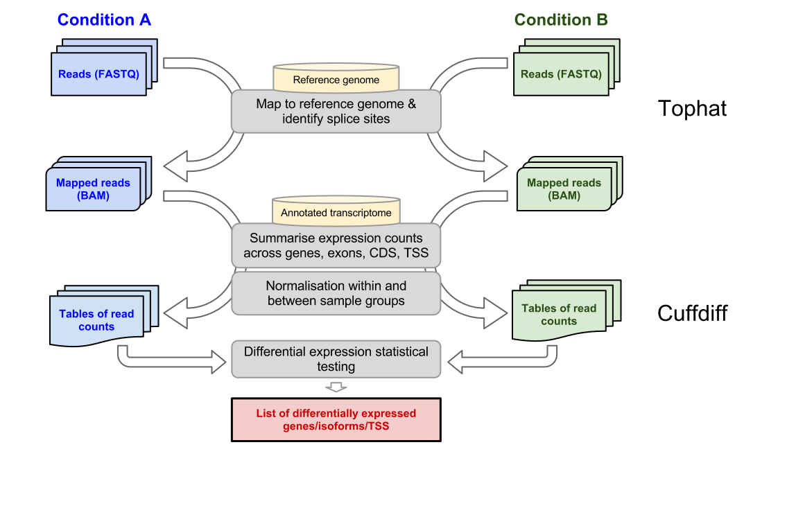

# Background

## Introduction to RNA-seq

RNA-seq as a genomics application is essentially the process of collecting RNA (of any type: mRNA, rRNA, miRNA), converting in some way to DNA, and sequencing on a massively parallel sequencing technology such as Illumina Hiseq. Critically, the number of short reads generated for a particular RNA is assumed to be proportional to the amount of that RNA that was present in the collected sample.

Differential gene expression studies can exploit RNA-seq to quantitate the amount of mRNA in different samples and statistically test the difference in expression per-gene (generally measured as the normalised number of sequence reads per gene/transcript) between the samples.

In eukaryotes, differential gene expression analysis is complicated by the possibility of multiple isoforms for any particular gene through alternative splicing and/or multiple transcription start sites

## The Galaxy workflow platform

### What is Galaxy?

Galaxy is an online bioinformatics workflow management system. Essentially, you upload your files, create various analysis pipelines and run them, then visualise your results.

Galaxy is really an interface to the various tools that do the data processing; each of these tools could be run from the command line, outside of Galaxy. Galaxy makes it easier to link up the tools together and visualise the entire analysis pipeline.

Galaxy uses the concept of 'histories'. Histories are sets of data and workflows that act on that data. The data for this workshop is available in a shared history, which you can import into your own Galaxy account

[Learn more about Galaxy here](http://wiki.g2.bx.psu.edu/)

#### Figure 1: The Galaxy interface

Tools on the left, data in the middle, analysis workflow on the right.

## Differential gene expression analysis using Tophat and Cufflinks

Two protocols are described in the paper inspiring this tutorial (Trapnell et al 2012):

1. The *Tuxedo protocol*: a full analysis protocol covering the assembly and characterisation of the expressed genes from the experimental data, and statistical analysis of gene expression changes in those genes

2. The *Alternate protocol*: a shorter approach for experiments in which the set of genes to be analysed is already known. Changes in expression of those genes are analysed

Assembling a transcriptome is advised if no well characterised transcriptome exists, but as *D. melanogaster* is a model organism we have access to well-annotated and comprehensive genomes and transcriptomes from the multitude of previous genomic analyses on *D. melanogaster*, so the simpler ‘Alternate protocol’ is appropriate. It also has the advantage of being simpler.

If we were investigating a novel organism then we would first need to characterise the transcriptome by assembling it from the experimental data, as gene expression is only meaningful in the context of a defined transcriptome.

### The Alternate protocol

 The overall workflow for this protocol is depicted below[^1]. Briefly, raw reads from each of the sequenced replicates for each experimental condition are aligned against a reference genome; during this process splice sites are identified and reads mapped across introns as required. The mapped reads are then used to derive counts of reads vs genes by cross referencing against a list of known genes (the ‘reference transcriptome’); these read counts are normalised within and between sample sets by a variety of methods and then statistical tests are used to assess the significance of differences between the normalised read counts of sample sets, producing a ranked list of differentially expressed genes.

#### Figure 2: General workflow for testing expression differences between two experimental conditions

### Tophat

Reads from experimental conditions A and B are mapped to a reference genome with TopHat. TopHat uses the Bowtie aligner as an alignment engine; it breaks up the reads that Bowtie cannot align on its own into smaller pieces called segments.

 * TopHat input: Fasta or Fastq files
 * TopHat output: BAM file (Compressed SAM file)

### Cuffdiff

The reads and the reference transcriptome are fed to Cuffdiff which calculates expression levels and tests the statistical significance of the observed changes.

 * Cuffdiff input: Reference transcriptome as GTF file
 * Cuffdiff output:
     * Gene and transcript expression levels as tables of normalised read counts
     * Differential analysis testing on:
        * Genes
        * Transcripts
        * Transcription Start Site (TSS) groups
        * Splicing: files reporting on splicing
        * Promoter: differentially spliced genes via promoter switching
        * CDS: CoDing Sequences

## The full Tuxedo Protocol

#### Figure 3: Full Tuxedo protocol workflow

1. Tophat: Reads from different experimental conditions are mapped to a reference genome with TopHat. TopHat uses the Bowtie aligner as an alignment engine. It breaks up the reads that Bowtie cannot align on its own into smaller pieces called segments.
     * TopHat input: Fasta or Fastq files
     * TopHat output: BAM file (Compressed SAM file)

2. Cufflinks: Resulting alignment files are provided to the Cufflinks program. Cufflinks uses these alignments to generate a transcriptome assembly for each condition. It reports a parsimonious transcriptome assembly of the data, i.e. all transcript fragments or ‘transfrags’ needed to ‘explain’ all the splicing event outcomes in the input data are reported. Cufflinks also quantifies the expression level of each transfrag in the sample to filter out the artificial ones
    * Cufflinks input:
        * Mapped reads (SAM or BAM), use accepted\_hits.bam from Tophat
        * Genome annotation: GTF file
    * Cufflinks output:
        * assembled transcripts (GTF) including all isoforms with their exon structure and expression levels. (tabular)
        * transcript\_expression (tabular): table of expression levels for each transcript
        * gene\_expression (tabular): table of total expression levels for each gene.

3. Cuffmerge[^2]/Cuffcompare: Cufflinks produces an assembly for each condition/sample. To perform differential expression we need to combine to assemblies into a single assembly. Assemblies can be merged together using the Cuffmerge or Cuffcompare utilities which are included with the Cufflinks package. This will result in the creation of a meta-transcriptome. Both Cuffcompare and Cuffmerge are available on Galaxy.
    * Cuffcompare input:
        * Assembled\_transcripts for each sample
        * Reference Annotation
    * Cuffcompare output: combined\_transcripts.gtf

4. Cuffdiff:The reads and the combined assembly are fed to Cuffdiff which calculates expression levels and tests the statistical significance of the observed changes.
    * Cuffdiff input:
        * Reference transcriptome as GTF file
        * BAM files of mapped reads from Tophat for all samples
    * Cuffdiff output:
        * Gene and transcript expression levels as tables of normalised read counts
        * Differential analysis testing on:
            * Genes
            * Transcripts
            * Transcription Start Site (TSS) groups
            * Splicing: files reporting on splicing
            * Promoter: differentially spliced genes via promoter switching
            * CDS: CoDing Sequences

5. CummRbund[^3]: Using an R package called CummRbund, diiferentially expressed genes and transcriptomes can be visually displayed using various expression plots.

## Protocols recommendations

1. Create a replicate from each condition to control the batch effects such as variation in culture conditions. With current available kits creating triplicates is feasible and strongly recommended.
2. Do paired-end sequencing whenever possible. For example, Cufflinks is much more accurate in the presence of paired-end reads.
3. Sequence with longer reads whenever possible. Tophat is more accurate in presence of longer reads in compare to shorter reads. However, since the cost of sequencing with longer reads is substantially more than shorter reads, some researchers prefer to do more replicates or more samples with shorter reads.
4. Identify new genes with traditional cloning and PCR-based techniques because transcriptome assembly is difficult.

## Limitations of the protocols

1. Both Tophat and Cufflinks require a reference genome.
2. The protocol assumes that RNASeq was done using Illumina or Solid sequencing techniques.

## References

 * Trapnell C, Roberts A, Pachter L, et al. Differential gene and transcript expression analysis of RNA-seq experiments with TopHat and Cufflinks. *Nature Protocols* [serial online]. March 1, 2012;7(3):562-578.
 * James T. Robinson, Helga Thorvaldsdóttir, Wendy Winckler, Mitchell Guttman, Eric S. Lander, Gad Getz, Jill P. Mesirov.[***Integrative Genomics Viewer***](http://www.nature.com/nbt/journal/v29/n1/abs/nbt.1754.html)[*. Nature Biotechnology 29, 24–26 (2011)*](http://www.nature.com/nbt/journal/v29/n1/abs/nbt.1754.html),

[^1]: *The published protocol has been designed for running on the
    command line in Linux. This tutorial has been adapted to use on the
    web-based Galaxy platform.*

[^2]: *Note: Cuffmerge is a meta-assembler. It treats the assemblies
    created by Cufflinks the same way Cufflinks treats reads from
    Tophat. That is, it produces a parsimonious transcript assembly of
    the assemblies. The difference between Cuffmerge and Cuffcompare is
    that if we have two transfrags A and B, Cuffcompare only combines
    the two where either A or B is ‘contained’ in the other transfrag or
    in other words one of them is redundant; whereas Cuffmerge assembles
    them if they overlap with each other and agree on splicing.*

[^3]: *Since CummRbund is currently not installed on Galaxy, the
    underlying steps are not included in this tutorial; instead we use
    IGV (Robinson et al 2011) and Trackster for visualizing the output
    which are accessible from Galaxy.*
