# Gene ontology analysis and integration for single-cell RNA-seq data

**Author:** Xiaochen Zhang, Lê Cao Lab, The University of Melbourne.  
**Contributors:** Vini Salazar, Melbourne Bioinformatics.

## Overview

**Topic**

* [ ] Genomics
* [x] Transcriptomics
* [ ] Proteomics
* [ ] Metabolomics
* [ ] Statistics and visualisation
* [ ] Structural Modelling
* [ ] Basic skills


**Skill level**

* [ ] Beginner  
* [x] Intermediate  
* [ ] Advanced  

**Data:** 10k Human PBMCs, Multiome v1.0, Chromium X.

**Tools:** R >= 4.4.0 and associated packages:  

- Seurat  
- SeuratData  
- clusterProfiler  
- Signac  
- ggplot2  

**Pipeline:**  
*Section 1:* Setup, Introduction, and Preprocessing.  
*Section 2:* Gene Ontology analysis.  
*Section 3:* Integration of ATAC-seq data.  

**Learning objectives:**  

- Apply GO enrichment analysis to identify biological processes, molecular functions, and cellular components represented in single-cell RNA-seq data.  
- Interpret GO results and identify key pathways and functional modules relevant to specific biological questions.  
- Design a workflow for integrating various omics layers, considering the biological context and research goals.  
- Take advantage of the Seurat, Signac and clusterProfiler R packages to perform the analysis, generate plots and interpret the results.  

<!--
!!! warning "Disclaimer"
    This tutorial is partially based on some existing material.
-->

<!-- Use this divider between sections -->
---
<!-- Use this divider between sections -->

## Setup

**Install R packages for this workshop**

You only need to run these code once.

```r
# install Packages
install.packages("Seurat")
setRepositories(ind=1:3) # needed to automatically install Bioconductor dependencies

if (!require("BiocManager", quietly = TRUE))
    install.packages("BiocManager")

BiocManager::install("Rsamtools")

install.packages("Signac")
install.packages("ggplot2")
install.packages("cowplot")
install.packages("devtools")
devtools::install_github('satijalab/seurat-data')

BiocManager::install("EnsDb.Hsapiens.v86")
BiocManager::install("biovizBase")
BiocManager::install(c('BSgenome.Hsapiens.UCSC.hg38', 'EnsDb.Hsapiens.v86'))
BiocManager::install("clusterProfiler")
BiocManager::install("org.Hs.eg.db")
BiocManager::install("enrichplot")
```

!!! success "Well done!"
    You are ready to start the workshop.


<!-- Use this divider between sections -->
---
<!-- Use this divider between sections -->

## Introduction

### Load these packages

```r
# load libraries
library(Seurat)
library(Signac)
library(EnsDb.Hsapiens.v86)
library(ggplot2)
library(cowplot)
library(clusterProfiler)
library(org.Hs.eg.db)
library(enrichplot)
```

### Download the datasets

```r
library(SeuratData)
# install the dataset and load requirements
InstallData("pbmcMultiome")
```

### Load the data sets (Seurat object)

We will use two data sets today. One is the single-cell RNA-seq data
(`pbmc.rna`), and the other is the single-cell ATAC-seq data
(`pbmc.atac`). We will do a gene ontology analysis for single-cell
RNA-seq data set first. And we will integrate scRNA-seq data set to the
scATAC-seq data set to explain the difference which we observe at the
scRNA-seq analysis.

```r
# load both modalities
pbmc.rna <- LoadData("pbmcMultiome", "pbmc.rna")
pbmc.atac <- LoadData("pbmcMultiome", "pbmc.atac")
```

## Preprocess for single-cell RNA-seq data (Seurat pipeline)

### QC for RNA data (have done and saved in the data set)

To make this workshop focus on downstream analysis, we have done the QC
for the RNA data and given label "filtered". We just choose cells that
are not be labelled 'filtered'.

```r
# We use Seurat V5 object
pbmc.rna[["RNA"]] <- as(pbmc.rna[["RNA"]], Class = "Assay5")
# repeat QC steps performed in the WNN vignette
pbmc.rna <- subset(pbmc.rna, seurat_annotations != "filtered")
```

### Preprocess RNA data (from Seurat workshop)

We will perform standard Seurat pipeline for single-cell RNA analysis.
We will normalize the data, find variable features, scale the data, run
PCA, and run UMAP. See also our introduction to single-cell RNA-seq
workshop for more details.

```r
# Perform standard analysis of each modality independently RNA analysis
pbmc.rna <- NormalizeData(pbmc.rna)

## Normalizing layer: counts

pbmc.rna <- FindVariableFeatures(pbmc.rna)

## Finding variable features for layer counts

pbmc.rna <- ScaleData(pbmc.rna)

## Centering and scaling data matrix

pbmc.rna <- RunPCA(pbmc.rna)
```

??? note "Output"
    ```r
    ## PC_ 1 
    ## Positive:  PLXDC2, SLC8A1, LRMDA, FCN1, TYMP, MCTP1, JAK2, RBM47, IRAK3, NAMPT 
    ##     DMXL2, TBXAS1, ZEB2, LYN, LRRK2, SAT1, GAB2, CYBB, TNFAIP2, CSF3R 
    ##     HCK, TLR2, CLEC7A, LYST, VCAN, DENND1A, FGD4, CD36, GRK3, FAM49A 
    ## Negative:  CD247, IL32, CAMK4, IL7R, LTB, LEF1, BACH2, INPP4B, BCL2, SYNE2 
    ##     THEMIS, TRBC2, RORA, TXK, ANK3, CD69, TRBC1, MLLT3, APBA2, ACTG1 
    ##     RASGRF2, NELL2, LINC01934, TAFA1, SAMD3, PCAT1, PFN1, NCALD, CTSW, KCNQ5 
    ## PC_ 2 
    ## Positive:  CD247, IL32, DPYD, IL7R, INPP4B, AOAH, CAMK4, PDE3B, THEMIS, TXK 
    ##     RORA, LEF1, SLCO3A1, NEAT1, FNDC3B, ARHGAP26, ANXA1, SRGN, ADGRE5, SAMD3 
    ##     SYNE2, NCALD, TRBC1, CTSW, PLCB1, APBA2, CCL5, S100A4, TGFBR3, PRF1 
    ## Negative:  BANK1, PAX5, MS4A1, FCRL1, NIBAN3, AFF3, IGHM, EBF1, LINC00926, OSBPL10 
    ##     RALGPS2, CD79A, CD22, COBLL1, BLK, BLNK, AP002075.1, ADAM28, IGHD, COL19A1 
    ##     BCL11A, CD79B, PLEKHG1, GNG7, DENND5B, WDFY4, TCF4, AC120193.1, RUBCNL, SPIB 
    ## PC_ 3 
    ## Positive:  BACH2, LEF1, PDE3B, CAMK4, IL7R, LTB, ANK3, FHIT, INPP4B, NELL2 
    ##     BCL2, RASGRF2, CSGALNACT1, SLC2A3, MLLT3, AC139720.1, PLCL1, PRKN, PAX5, FCRL1 
    ##     LINC00926, TSHZ2, MS4A1, PTPRK, AL589693.1, CD79A, EBF1, ST6GALNAC3, BANK1, COL19A1 
    ## Negative:  GZMB, NKG7, GNLY, PRF1, KLRD1, GZMA, CST7, CLIC3, CCL5, FGFBP2 
    ##     SPON2, ADGRG1, KLRF1, GZMH, CCL4, TGFBR3, LINC00996, LINC01478, PDGFD, PTGDR 
    ##     C1orf21, FCRL6, CLEC4C, SLAMF7, BNC2, CTSW, IL2RB, EPHB1, LILRA4, HOPX 
    ## PC_ 4 
    ## Positive:  NKG7, GNLY, PRF1, KLRD1, GZMA, CST7, CCL5, FGFBP2, MCTP2, ADGRG1 
    ##     GZMH, CCL4, KLRF1, FCGR3A, SPON2, TGFBR3, PDGFD, PAX5, FCRL1, MS4A1 
    ##     FCRL6, PTGDR, BNC2, MTSS1, CX3CR1, LINC00926, C1orf21, IL2RB, PPP2R2B, HOPX 
    ## Negative:  LINC01478, CUX2, EPHB1, CLEC4C, LILRA4, COL26A1, AC023590.1, PTPRS, SCN9A, LINC01374 
    ##     COL24A1, LINC00996, NRP1, PHEX, FAM160A1, TNFRSF21, PLXNA4, PACSIN1, SCAMP5, SLC35F3 
    ##     DNASE1L3, P3H2, LRRC26, PLD4, ITM2C, SCN1A-AS1, PLEKHD1, SERPINF1, SCT, PTCRA 
    ## PC_ 5 
    ## Positive:  CDKN1C, IFITM3, HES4, CSF1R, SMIM25, FCGR3A, MS4A7, LST1, AIF1, LRRC25 
    ##     AC104809.2, MAFB, CALHM6, CFD, AC020651.2, SERPINA1, GPBAR1, SIGLEC10, CST3, HMOX1 
    ##     CTSL, TCF7L2, FMNL2, HLA-DPA1, CKB, MTSS1, COTL1, IFI30, CCDC26, SPRED1 
    ## Negative:  PLCB1, VCAN, ARHGAP24, CSF3R, DYSF, LINC00937, FNDC3B, GLT1D1, VCAN-AS1, AC020916.1 
    ##     PDE4D, PADI4, ARHGAP26, CREB5, TREM1, MCTP2, CD36, MEGF9, KIF13A, MICAL2 
    ##     FCAR, ACSL1, CLMN, JUN, ANXA1, MIR646HG, RAB11FIP1, CRISPLD2, GNLY, ZBTB16
    ```

```r
pbmc.rna <- RunUMAP(pbmc.rna, dims = 1:30)

## Warning: The default method for RunUMAP has changed from calling Python UMAP via reticulate to the R-native UWOT using the cosine metric
## To use Python UMAP via reticulate, set umap.method to 'umap-learn' and metric to 'correlation'
## This message will be shown once per session
## 11:47:36 UMAP embedding parameters a = 0.9922 b = 1.112
## 11:47:36 Read 10412 rows and found 30 numeric columns
## 11:47:36 Using Annoy for neighbor search, n_neighbors = 30
## 11:47:36 Building Annoy index with metric = cosine, n_trees = 50
## 0%   10   20   30   40   50   60   70   80   90   100%
## [----|----|----|----|----|----|----|----|----|----|
## **************************************************|
## 11:47:36 Writing NN index file to temp file /var/folders/pv/fvynh7953flggrfb49p2lqsc0000gn/T//RtmpuPPPuo/file4dc32cd5de65
## 11:47:36 Searching Annoy index using 1 thread, search_k = 3000
## 11:47:38 Annoy recall = 100%
## 11:47:38 Commencing smooth kNN distance calibration using 1 thread with target n_neighbors = 30
## 11:47:39 Initializing from normalized Laplacian + noise (using RSpectra)
## 11:47:39 Commencing optimization for 200 epochs, with 450622 positive edges
## 11:47:42 Optimization finished
```

### Do clustering and visualization for RNA data

We want to overview the RNA data by clustering and visualizing the data.

```r
# Clustering
pbmc.rna <- FindNeighbors(pbmc.rna, dims = 1:30)

## Computing nearest neighbor graph
## Computing SNN

pbmc.rna <- FindClusters(pbmc.rna, resolution = 0.5)

## Modularity Optimizer version 1.3.0 by Ludo Waltman and Nees Jan van Eck
## 
## Number of nodes: 10412
## Number of edges: 412246
## 
## Running Louvain algorithm...
## Maximum modularity in 10 random starts: 0.9154
## Number of communities: 17
## Elapsed time: 0 seconds

# Visualize the RNA data
DimPlot(pbmc.rna, group.by = "seurat_clusters", label = TRUE)
```
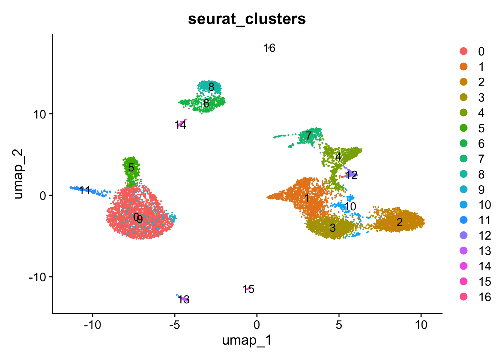

### Find marker genes for each cell sub-type

We found it is very clear cluster 2, 3 and 8 should have some different
functions, so they form very clear shape of cluster. Cluster 2 maybe
more relate to cluster 2 comparing to cluster 8. We will find marker
genes for each cluster to further explore the difference.

```r
# Find marker genes for each cell subtype
Idents(pbmc.rna) <- "seurat_clusters"
marker.genes.pbmc.rna <- FindAllMarkers(pbmc.rna, only.pos = TRUE, 
                                        min.pct = 0.5, logfc.threshold = 0.5)

## Calculating cluster 0
## For a (much!) faster implementation of the Wilcoxon Rank Sum Test,
## (default method for FindMarkers) please install the presto package
## --------------------------------------------
## install.packages('devtools')
## devtools::install_github('immunogenomics/presto')
## --------------------------------------------
## After installation of presto, Seurat will automatically use the more 
## efficient implementation (no further action necessary).
## This message will be shown once per session
## Calculating cluster 1
## Calculating cluster 2
## Calculating cluster 3
## Calculating cluster 4
## Calculating cluster 5
## Calculating cluster 6
## Calculating cluster 7
## Calculating cluster 8
## Calculating cluster 9
## Calculating cluster 10
## Calculating cluster 11
## Calculating cluster 12
## Calculating cluster 13
## Calculating cluster 14
## Calculating cluster 15
## Calculating cluster 16
```


## Gene Ontology analysis

We know have a marker gene list for each cluster. But it is hard for us
to find out true signals and explain these gene names. A good method to
explain a list of gene is gene ontology analysis. We will perform gene
ontology analysis to understand the biological functions of these marker
genes.

### Preview the marker genes

Let's have a look the data structure of the result of marker gene list.

```r
marker.genes.pbmc.rna[1:5, ]
```

|        | p_val <dbl\> | avg_log2FC <dbl\> | pct.1 <dbl\> | pct.2 <dbl\> | p_val_adj <dbl\> | cluster <fct\> | gene <chr\> |
|--------|------------:|-----------------:|------------:|------------:|----------------:|---------------|------------|
| LRMDA  |           0 |         3.907970 |       0.976 |       0.142 |               0 | 0             | LRMDA      |
| PLXDC2 |           0 |         3.948556 |       0.994 |       0.171 |               0 | 0             | PLXDC2     |
| SLC8A1 |           0 |         3.389460 |       0.977 |       0.158 |               0 | 0             | SLC8A1     |
| CSF3R  |           0 |         4.401877 |       0.903 |       0.092 |               0 | 0             | CSF3R      |
| RBM47  |           0 |         3.747440 |       0.935 |       0.153 |               0 | 0             | RBM47      |

### Find marker genes for Cluster 2, Cluster 3 and Cluster 8

The gene list is too long, we will just focus on Cluster 2, Cluster 3
and Cluster 8 with significant p-value (adjust p-value < 0.05).

```r
Cluster2.markers <- marker.genes.pbmc.rna[marker.genes.pbmc.rna$cluster==2 
                                           & marker.genes.pbmc.rna$p_val_adj < 0.05, ]
Cluster3.markers <- marker.genes.pbmc.rna[marker.genes.pbmc.rna$cluster==3 
                                           & marker.genes.pbmc.rna$p_val_adj < 0.05, ]
Cluster8.markers <- marker.genes.pbmc.rna[marker.genes.pbmc.rna$cluster==8
                                           & marker.genes.pbmc.rna$p_val_adj < 0.05, ]
```

### Convert gene symbols to Entrez IDs

Gene symbols is very useful, it can easily understand by human. But it
is not unique, so we need to convert them to Entrez IDs for gene
ontology analysis.

```r
Cluster2.gene_ids <- bitr(Cluster2.markers$gene, fromType = "SYMBOL",
                                   toType = "ENTREZID", OrgDb = org.Hs.eg.db)

## 'select()' returned 1:1 mapping between keys and columns
## Warning in bitr(Cluster2.markers$gene, fromType = "SYMBOL", toType =
## "ENTREZID", : 0.41% of input gene IDs are fail to map...

Cluster3.gene_ids <- bitr(Cluster3.markers$gene, fromType = "SYMBOL",
                                   toType = "ENTREZID", OrgDb = org.Hs.eg.db)

## 'select()' returned 1:1 mapping between keys and columns
## Warning in bitr(Cluster3.markers$gene, fromType = "SYMBOL", toType =
## "ENTREZID", : 1.01% of input gene IDs are fail to map...

Cluster8.gene_ids <- bitr(Cluster8.markers$gene, fromType = "SYMBOL",
                                   toType = "ENTREZID", OrgDb = org.Hs.eg.db)

## 'select()' returned 1:1 mapping between keys and columns
## Warning in bitr(Cluster8.markers$gene, fromType = "SYMBOL", toType =
## "ENTREZID", : 2.94% of input gene IDs are fail to map...

```

### Perform GO enrichment analysis for Cluster 2

Let's begin with Cluster 2. I will show you how to perform gene ontology
analysis for Cluster 2. You can follow the same steps to do the analysis
for Cluster 3 and Cluster 8.

We will use the `enrichGO()` function from `clusterProfiler` package to
perform gene ontology analysis.

Firstly, we need to load the gene ontology database. We use the
`org.Hs.eg.db` database for human gene ontology analysis. If you want to
do gene ontology analysis for other species, you can find the
corresponding database in the Bioconductor.

Then, we will first focus on biological process (BP) ontology, so
`ont = "BP"`. There are also other two database of ontology (CC:
Cellular Component and MF: Molecular Function), you can try them later.

We will set the p-value cutoff and q-value cutoff to 0.05 to control the
false positive rate and false negative rate respectively. We will also
set the p-value adjustment method to "BH" (Benjamini & Hochberg). If you
want to know more about p-value adjustment methods (why we need them and
what are they), see also:
<https://www.ncbi.nlm.nih.gov/pmc/articles/PMC6099145/>.

```r
Cluster2.ego <- enrichGO(gene = Cluster2.gene_ids$ENTREZID, 
                OrgDb = org.Hs.eg.db, 
                ont = "BP", # biological process
                pAdjustMethod = "BH", 
                pvalueCutoff = 0.05, 
                qvalueCutoff = 0.05, 
                readable = TRUE)
```

### Visualize the GO enrichment results

#### Box plot

A good way to visualize the GO enrichment results is to use a box plot.
It can tell you how many genes are overlap in each GO term with you
marker gene list and how significant the enrichment is.

```r
barplot(Cluster2.ego, showCategory=10, 
        title="GO Enrichment Analysis for Cluster 2")
```


#### Dot plot

Dot plot is another way to visualize the GO enrichment results with more
information. It can show you the proportion of the overlap genes over
the whole marker gene list and also overlap gene counts and p-value of
each GO term. You can also set the number of GO terms you want to show.

```r
p1 <- dotplot(Cluster2.ego, showCategory=20, 
        title="GO Enrichment Analysis for Cluster 2")
p1 + theme(axis.text.y = element_text(size = 3))
```

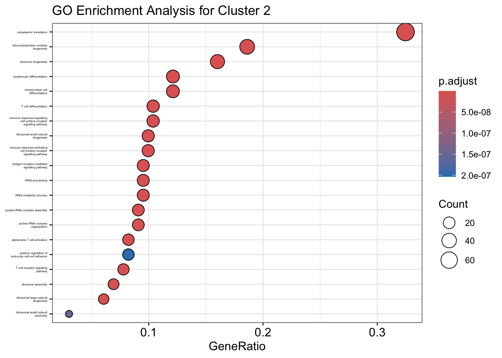

#### Enrichment map plot

The GO terms are correlated with each other. The enrichment map plot can
show you the correlation between GO terms. It can help you to understand
the relationship between different biological processes.

```r
Cluster2.ego <- pairwise_termsim(Cluster2.ego)
emapplot(Cluster2.ego, showCategory=20)
```

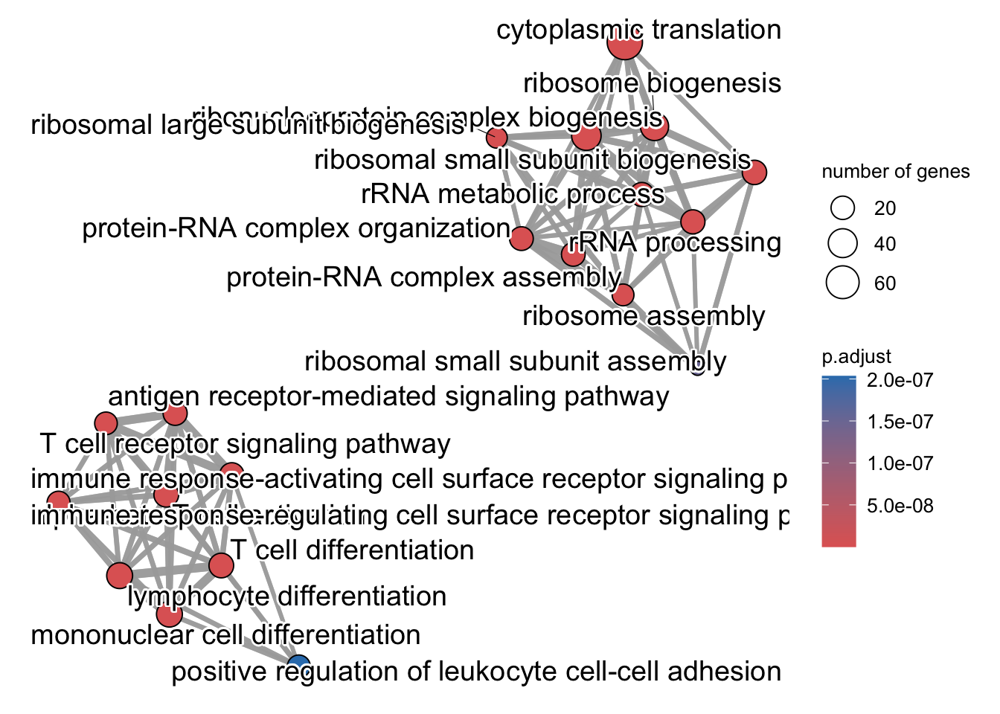

#### Cnet plot

Cnet plot can show you the relationship between GO terms and genes. It
can help you to understand the relationship between GO terms and genes.

```r
cnetplot(Cluster2.ego, categorySize="pvalue", 
         foldChange=Cluster2.gene_ids$ENTREZID, showCategory = 3)
```

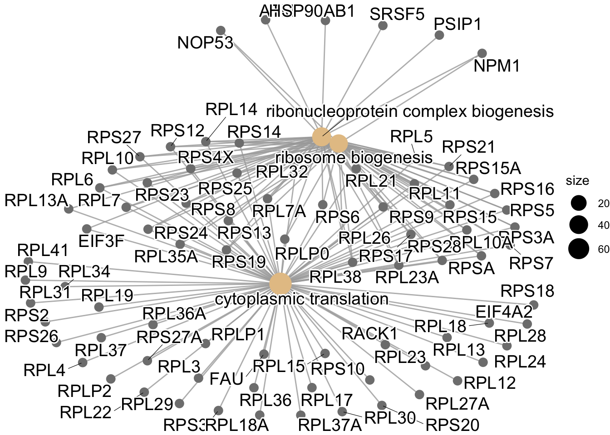

!!! question "Challenge"
    Perform GO enrichment analysis for the other 2 cluster.
    ??? info "Solution"
        ```r
        Cluster3.ego <- enrichGO(gene = Cluster3.gene_ids$ENTREZID, 
                        OrgDb = org.Hs.eg.db, 
                        ont = "BP",
                        pAdjustMethod = "BH", 
                        pvalueCutoff = 0.05, 
                        qvalueCutoff = 0.05, 
                        readable = TRUE)

        Cluster8.ego <- enrichGO(gene = Cluster8.gene_ids$ENTREZID,
                        OrgDb = org.Hs.eg.db, 
                        ont = "BP",
                        pAdjustMethod = "BH", 
                        pvalueCutoff = 0.05, 
                        qvalueCutoff = 0.05, 
                        readable = TRUE)
        ```


### Visualize the GO enrichment results for other 2 clusters

```r
barplot(Cluster3.ego, showCategory=10, 
        title="GO Enrichment Analysis for Cluster 3")
```
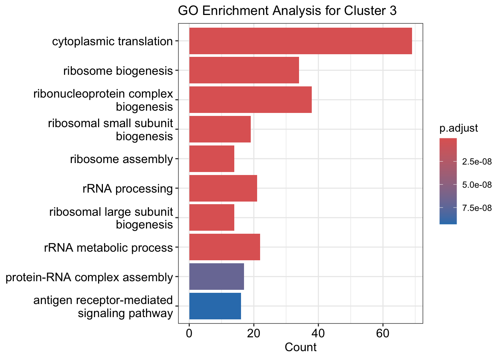

```r
p_cluster3 <- dotplot(Cluster3.ego, showCategory=20, 
        title="GO Enrichment Analysis for Cluster 3")
p_cluster3 + theme(axis.text.y = element_text(size = 3))
```
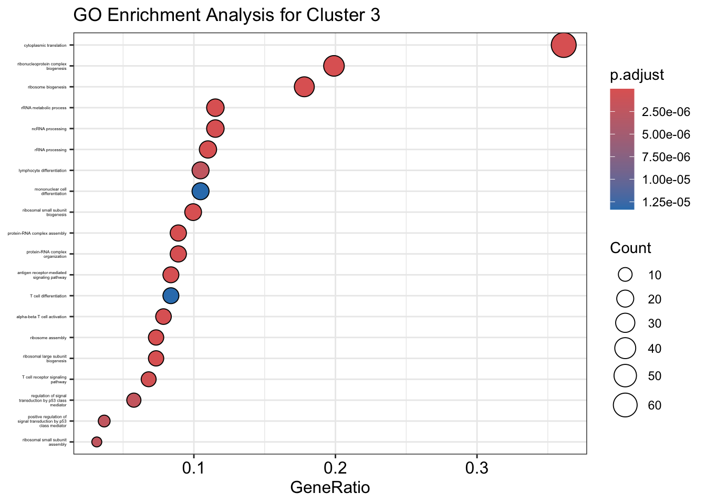

```r
Cluster3.ego <- pairwise_termsim(Cluster3.ego)
emapplot(Cluster3.ego, showCategory=20)
```


```r
cnetplot(Cluster3.ego, categorySize="pvalue", 
         foldChange=Cluster3.gene_ids$ENTREZID, showCategory = 3)

## Warning in cnetplot.enrichResult(x, ...): Use 'color.params = list(foldChange = your_value)' instead of 'foldChange'.
##  The foldChange parameter will be removed in the next version.
```
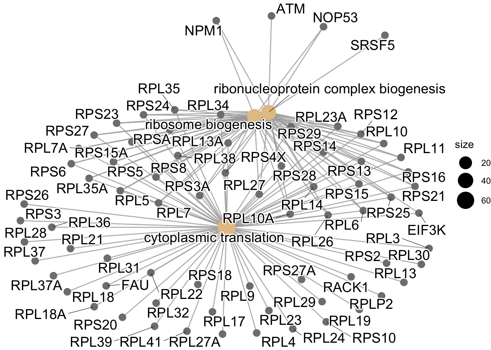

```r
barplot(Cluster8.ego, showCategory=10, 
        title="GO Enrichment Analysis for Cluster 8")
```


```r
p_cluster8 <- dotplot(Cluster8.ego, showCategory=20, 
        title="GO Enrichment Analysis for Cluster 8")
p_cluster8 + theme(axis.text.y = element_text(size = 3))
```
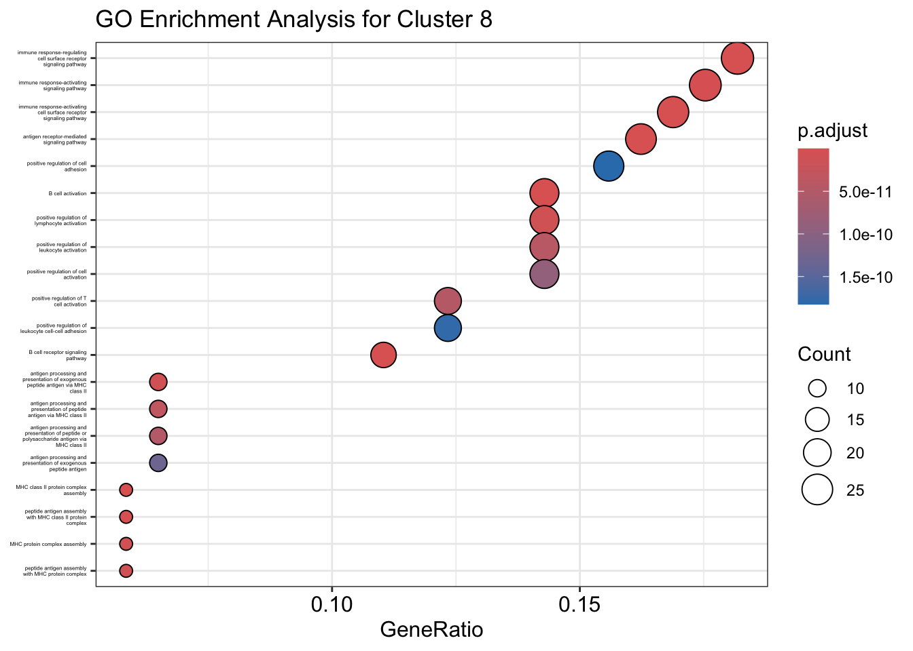

```r
Cluster8.ego <- pairwise_termsim(Cluster8.ego)
emapplot(Cluster8.ego, showCategory=20)
```
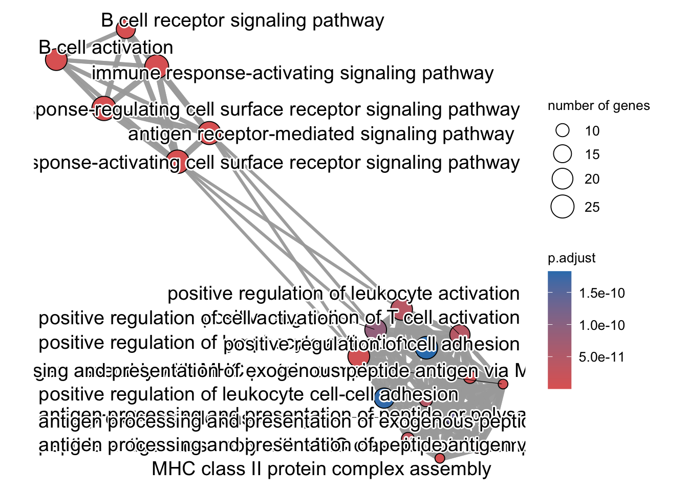

```r
cnetplot(Cluster8.ego, categorySize="pvalue", 
         foldChange=Cluster8.gene_ids$ENTREZID, showCategory = 3)

## Warning in cnetplot.enrichResult(x, ...): Use 'color.params = list(foldChange = your_value)' instead of 'foldChange'.
##  The foldChange parameter will be removed in the next version.
```
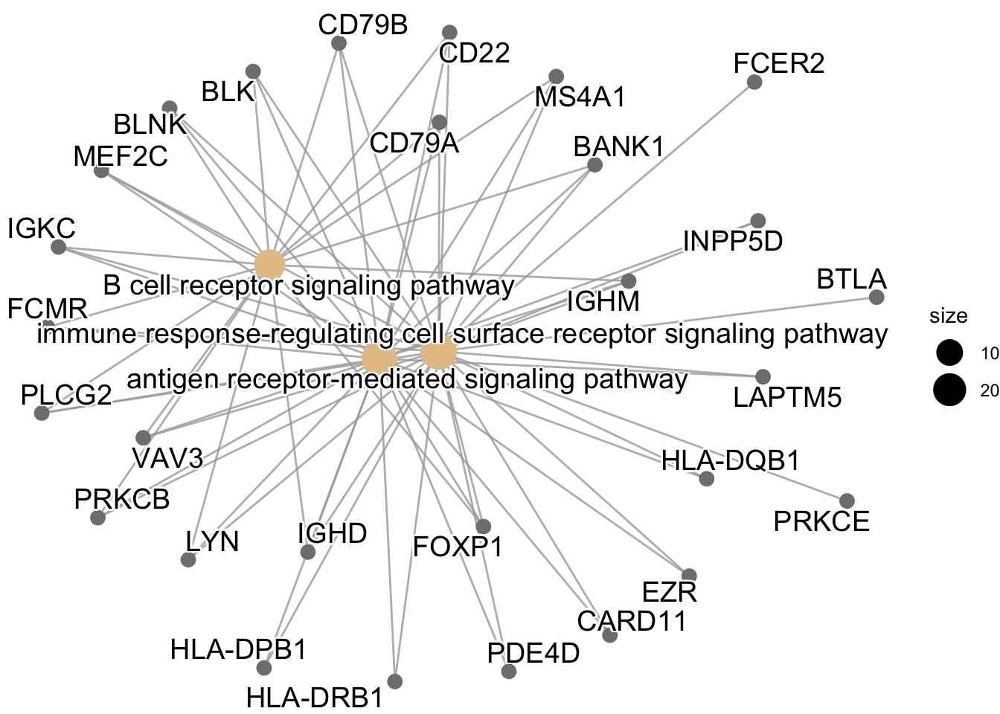

!!! question "Discussion"
    - What are the differences between the three clusters?
    - Which plots are most informative for you?
    - What are the most interesting GO terms you found?

## Do gene ontology analysis for all clusters

We have done gene ontology analysis for each cluster. But we can also do
gene ontology analysis for all clusters together. We can combine all
marker genes from all clusters and do gene ontology analysis for them.

```r
cluster_gene_list <- split(marker.genes.pbmc.rna$gene, marker.genes.pbmc.rna$cluster)

cluster_gene_list <- lapply(cluster_gene_list, function(genes) {
  gene_ids <- bitr(genes, fromType = "SYMBOL", toType = "ENTREZID", OrgDb = org.Hs.eg.db)
  return(gene_ids$ENTREZID)
})

## 'select()' returned 1:1 mapping between keys and columns
## 'select()' returned 1:1 mapping between keys and columns
## 'select()' returned 1:1 mapping between keys and columns
## 'select()' returned 1:1 mapping between keys and columns
## 'select()' returned 1:1 mapping between keys and columns
## 'select()' returned 1:1 mapping between keys and columns
## 'select()' returned 1:1 mapping between keys and columns
## 'select()' returned 1:1 mapping between keys and columns
## 'select()' returned 1:1 mapping between keys and columns
## 'select()' returned 1:1 mapping between keys and columns
## 'select()' returned 1:1 mapping between keys and columns
## 'select()' returned 1:1 mapping between keys and columns
## 'select()' returned 1:1 mapping between keys and columns
## 'select()' returned 1:1 mapping between keys and columns
## 'select()' returned 1:1 mapping between keys and columns
## 'select()' returned 1:many mapping between keys and columns
## 'select()' returned 1:1 mapping between keys and columns
```

We can use the `compareCluster()` function from `clusterProfiler`
package to perform gene ontology analysis for all clusters together.

```r
# GO enrichment analysis for BP
go_compare_bp <- compareCluster(geneCluster = cluster_gene_list, 
                             fun = "enrichGO", 
                             OrgDb = org.Hs.eg.db, 
                             ont = "BP",  # "BP"、"MF" or "CC"
                             pAdjustMethod = "BH",
                             pvalueCutoff = 0.05,
                             qvalueCutoff = 0.05)
```

### Visualize the GO enrichment results for all clusters

Dot plot is a good way to visualize the GO enrichment results for all
clusters. It can show you the proportion of the overlap genes over the
whole marker gene list and also overlap gene counts and p-value of each
GO term.

```r
cluster.p1 <- dotplot(go_compare_bp, showCategory = 1,
              title = "GO Enrichment (Biological Process)")
cluster.p1 + theme(axis.text.y = element_text(size = 5))
```


But dot plot is not good for showing the relationship between GO terms.
We can select and clustering GO terms first and then use tree plot to
show the correlation between GO terms.

```r
trim_bp <- pairwise_termsim(go_compare_bp, showCategory = 50)
treeplot(trim_bp, showCategory = 5)

## Scale for fill is already present.
## Adding another scale for fill, which will replace the existing scale.
## Warning in (function (..., type = getOption("ggplot2.continuous.fill")) : log-10 transformation introduced infinite values.
## log-10 transformation introduced infinite values.
```

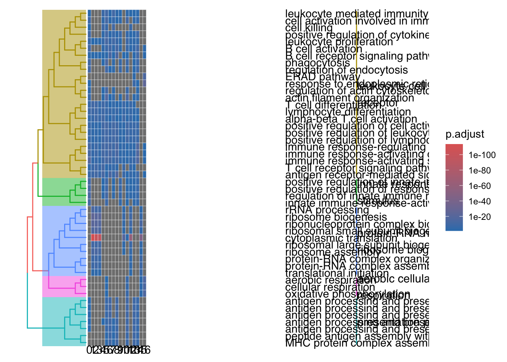

!!! question "Challenge"
    Perform GO enrichment analysis for other two ontologies.
    ??? info "Solution"
        ```r
        # GO enrichment analysis for CC
        go_compare_cc <- compareCluster(geneCluster = cluster_gene_list, 
                                    fun = "enrichGO", 
                                    OrgDb = org.Hs.eg.db, 
                                    ont = "CC",  # "BP"、"MF" or "CC"
                                    pAdjustMethod = "BH",
                                    pvalueCutoff = 0.05,
                                    qvalueCutoff = 0.05)

        # GO enrichment analysis for MF
        go_compare_mf <- compareCluster(geneCluster = cluster_gene_list, 
                                    fun = "enrichGO", 
                                    OrgDb = org.Hs.eg.db, 
                                    ont = "MF",  # "BP"、"MF" or "CC"
                                    pAdjustMethod = "BH",
                                    pvalueCutoff = 0.05,
                                    qvalueCutoff = 0.05)
        ```

### Visualize the GO enrichment results for other two ontology

```r
cluster.p2 <- dotplot(go_compare_cc, showCategory = 1,
              title = "GO Enrichment (Cellular Component)")

cluster.p2 + theme(axis.text.y = element_text(size = 5))
```
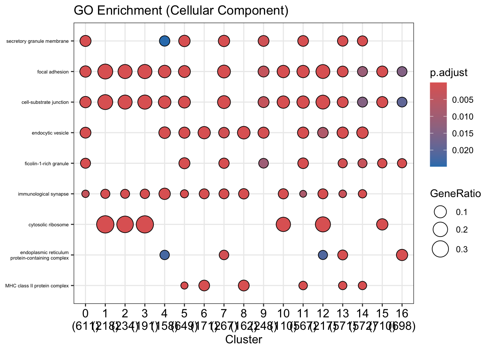

```r
trim_cc <- pairwise_termsim(go_compare_cc, showCategory = 50)
treeplot(trim_cc, showCategory = 5)
```


```r
cluster.p3 <- dotplot(go_compare_mf, showCategory = 1,
              title = "GO Enrichment (Molecular Function)")
cluster.p3 + theme(axis.text.y = element_text(size = 5))
```


```r
trim_mf <- pairwise_termsim(go_compare_mf, showCategory = 50)
treeplot(trim_mf, showCategory = 5)
```
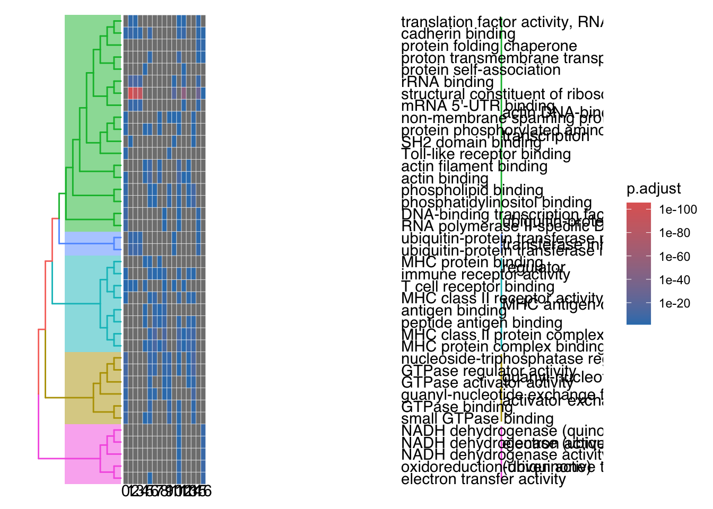

## Integrate ATAC-seq data with single-cell RNA-seq data (N Integration)

From the gene ontology analysis, we found that the three clusters have
different biological functions. But we still don't know why they have
different functions. One possible reason is that they have different
gene activity. We can use the ATAC-seq data to quantify the gene
activity and integrate the ATAC-seq data with the single-cell RNA-seq
data to explain the difference.

### QC for ATAC-seq data (have done and saved in the data set)

As the same as the RNA data, we have done the QC for the ATAC-seq data
and given label "filtered". We just choose cells that are not be
labelled 'filtered'.

```r
pbmc.atac <- subset(pbmc.atac, seurat_annotations != "filtered")
```

### Preprocess ATAC-seq data

We will perform standard Seurat pipeline for single-cell ATAC analysis.
We will normalize the data, find top features, run SVD, and run UMAP.
See `Signac` (also provided by Satija's group) tutorial for more
details.

```r
# ATAC analysis add gene annotation information
annotations <- GetGRangesFromEnsDb(ensdb = EnsDb.Hsapiens.v86)
seqlevelsStyle(annotations) <- "UCSC"
genome(annotations) <- "hg38"
Annotation(pbmc.atac) <- annotations

# We exclude the first dimension as this is typically correlated with sequencing depth
pbmc.atac <- RunTFIDF(pbmc.atac)

## Performing TF-IDF normalization

pbmc.atac <- FindTopFeatures(pbmc.atac, min.cutoff = "q0")
pbmc.atac <- RunSVD(pbmc.atac)

## Running SVD
## Scaling cell embeddings

pbmc.atac <- RunUMAP(pbmc.atac, reduction = "lsi", dims = 2:30, 
                     reduction.name = "umap.atac", reduction.key = "atacUMAP_")

## 11:52:35 UMAP embedding parameters a = 0.9922 b = 1.112
## 11:52:36 Read 10412 rows and found 29 numeric columns
## 11:52:36 Using Annoy for neighbor search, n_neighbors = 30
## 11:52:36 Building Annoy index with metric = cosine, n_trees = 50
## 0%   10   20   30   40   50   60   70   80   90   100%
## [----|----|----|----|----|----|----|----|----|----|
## **************************************************|
## 11:52:36 Writing NN index file to temp file /var/folders/pv/fvynh7953flggrfb49p2lqsc0000gn/T//RtmpuPPPuo/file4dc37680c360
## 11:52:36 Searching Annoy index using 1 thread, search_k = 3000
## 11:52:38 Annoy recall = 100%
## 11:52:39 Commencing smooth kNN distance calibration using 1 thread with target n_neighbors = 30
## 11:52:40 Initializing from normalized Laplacian + noise (using RSpectra)
## 11:52:40 Commencing optimization for 200 epochs, with 414208 positive edges
## 11:52:43 Optimization finished
```

### Visualize the ATAC-seq data with scRNA-seq data

We want to overview the single-cell ATAC-seq and RNA-seq data
visualizing the data.

```r
# Visualize two data sets together
p1 <- DimPlot(pbmc.rna, group.by = "seurat_clusters", label = TRUE) + NoLegend() + ggtitle("RNA")
p2 <- DimPlot(pbmc.atac, group.by = "orig.ident", label = FALSE) + NoLegend() + ggtitle("ATAC")
p1 + p2
```


From the visualization, we get the clustering information from the RNA
data and but we know nothing about the ATAC data.

We can see that the two data sets have different clustering patterns. We
will integrate the two data sets to explain the difference.

### Quantify gene activity

Before we integrate the two data sets, we need to quantify the gene
activity from the ATAC-seq data. We will use the `GeneActivity()`
function from `Signac` package to quantify the gene activity.

```r
# quantify gene activity
gene.activities <- GeneActivity(pbmc.atac, features = VariableFeatures(pbmc.rna))

## Extracting gene coordinates
## Extracting reads overlapping genomic regions

# add gene activities as a new assay
pbmc.atac[["ACTIVITY"]] <- CreateAssayObject(counts = gene.activities)

# normalize gene activities
DefaultAssay(pbmc.atac) <- "ACTIVITY"
pbmc.atac <- NormalizeData(pbmc.atac)
pbmc.atac <- ScaleData(pbmc.atac, features = rownames(pbmc.atac))

## Centering and scaling data matrix
```

### Integrate RNA-seq data with ATAC-seq data

Same as integrate two RNA-seq data, we will use the
`FindTransferAnchors()` function from Seurat package to integrate the
RNA-seq data with the ATAC-seq data. We will use the CCA method to
integrate the two data sets. And then we can transfer the clustering
information from the RNA-seq data to the ATAC-seq data.

```r
# Identify anchors
transfer.anchors <- FindTransferAnchors(reference = pbmc.rna, query = pbmc.atac, features = VariableFeatures(object = pbmc.rna),
                                        reference.assay = "RNA", query.assay = "ACTIVITY", reduction = "cca")

## Warning: 714 features of the features specified were not present in both the reference query assays. 
## Continuing with remaining 1286 features.
## Running CCA
## Merging objects
## Finding neighborhoods
## Finding anchors
##  Found 23956 anchors

cluster.predictions <- TransferData(anchorset = transfer.anchors, refdata = pbmc.rna$seurat_clusters,
                                     weight.reduction = pbmc.atac[["lsi"]], dims = 2:30)

## Finding integration vectors
## Finding integration vector weights
## Predicting cell labels

pbmc.atac <- AddMetaData(pbmc.atac, metadata = cluster.predictions)
```

### Visualize the integrated data

We are now able to visualize the integrated data. We can see the
predicted clusters annotation at the UMAP of scATAC-seq data from the
scRNA-seq data.

```r
# Visualize the integrated data
DimPlot(pbmc.atac, group.by = "predicted.id", label = TRUE) + NoLegend() + ggtitle("Predicted clusters annotation")
```


### Visualize the ATAC-seq regions around a gene of interest

We can also visualize the ATAC-seq regions around a gene of interest. We
will use two marker genes of T cells (CD4 and CD8). We can see the
ATAC-seq regions around the CD4 and CD8A genes for different cell types.

```r
DefaultAssay(pbmc.atac) <- "ATAC"
Idents(pbmc.atac) <- "predicted.id"
CoveragePlot(
  pbmc.atac, region = "CD4", group.by = "predicted.id",
  idents = c("2", "3", "8"),
  extend.downstream = 5000, extend.upstream = 5000)

## Warning: Removed 10 rows containing missing values or values outside the scale range
## (`geom_segment()`).
```


```r
DefaultAssay(pbmc.atac) <- "ATAC"
Idents(pbmc.atac) <- "predicted.id"
CoveragePlot(
  pbmc.atac, region = "CD8A", group.by = "predicted.id",
  idents = c("2", "3", "8"),
  extend.downstream = 5000, extend.upstream = 5000)
```
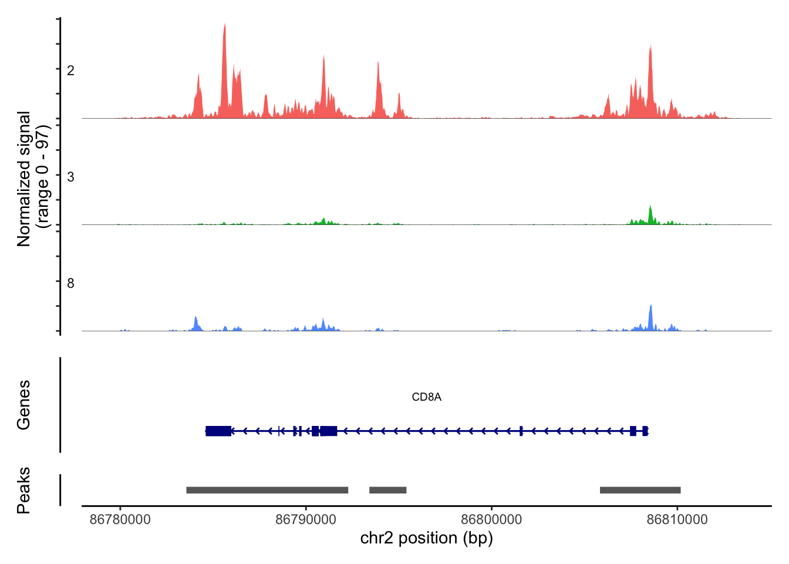

### Additional benchmark study: Evaluate the accuracy of the integrated data

We use statistic to predict the label of scATAC-seq data from the
scRNA-seq data. So, it is useful to know how accurate it is. We can
evaluate the accuracy of the integrated data by comparing the predicted
labels with the ground-truth labels.

```r
celltype.predictions <- TransferData(anchorset = transfer.anchors, refdata = pbmc.rna$seurat_annotations,
                                     weight.reduction = pbmc.atac[["lsi"]], dims = 2:30)

## Finding integration vectors
## Finding integration vector weights
## Predicting cell labels

pbmc.atac <- AddMetaData(pbmc.atac, metadata = celltype.predictions)
```

```r
# Visualize the integrated data
pbmc.atac$annotation_correct <- pbmc.atac$predicted.id == pbmc.atac$seurat_annotations
p1 <- DimPlot(pbmc.atac, group.by = "predicted.id", label = TRUE) + NoLegend() + ggtitle("Predicted annotation")
p2 <- DimPlot(pbmc.atac, group.by = "seurat_annotations", label = TRUE) + NoLegend() + ggtitle("Ground-truth annotation")
p1 | p2
```
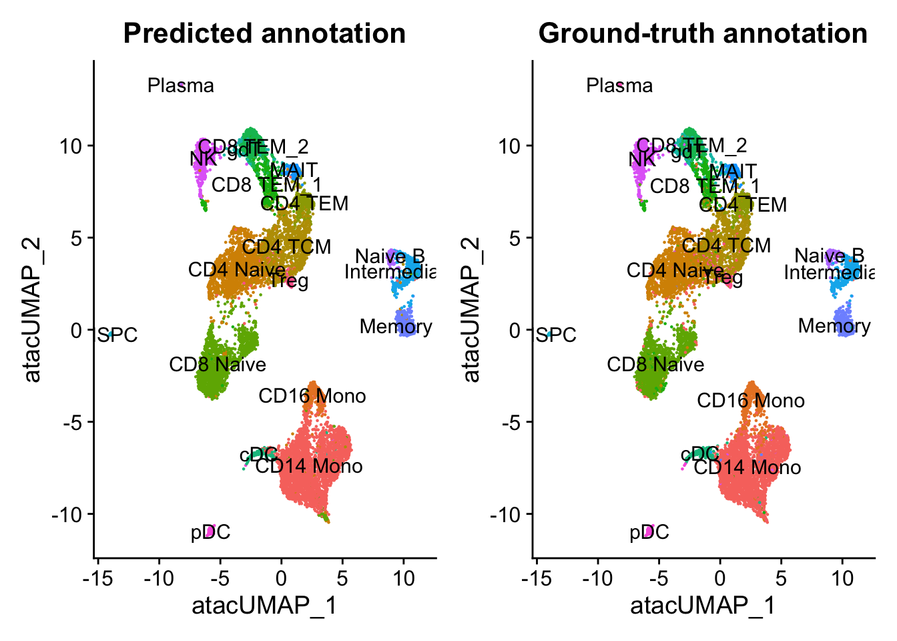


```r
DefaultAssay(pbmc.atac) <- "ATAC"
Idents(pbmc.atac) <- "predicted.id"
CoveragePlot(
  pbmc.atac, region = "CD4", group.by = "predicted.id",
  idents = c("CD8 Naive", "CD8 TEM_1", "CD8 TEM_2", "CD4 Naive", "CD4 TCM", "CD4 TEM"),
  extend.downstream = 5000, extend.upstream = 5000)

## Warning: Removed 10 rows containing missing values or values outside the scale range
## (`geom_segment()`).
```


```r
CoveragePlot(
  pbmc.atac, region = "CD8A", group.by = "predicted.id",
  idents = c("CD8 Naive", "CD8 TEM_1", "CD8 TEM_2", "CD4 Naive", "CD4 TCM", "CD4 TEM"),
  extend.downstream = 5000, extend.upstream = 5000)
```


Overall, the visualization of the integrated data shows that the
predicted labels are consistent with the ground-truth labels. The
coverage plots also show that the ATAC-seq regions around the CD4 and
CD8A genes are different for different cell types.

We can also use some quantitative metrics to evaluate the accuracy of
the integrated data. We can calculate the accuracy of the predicted
labels by comparing the predicted labels with the ground-truth labels.

```r
# Evaluate the accuracy of the integrated data
predictions <- table(pbmc.atac$seurat_annotations, pbmc.atac$predicted.id)
predictions <- predictions/rowSums(predictions)  # normalize for number of cells in each cell type
predictions <- as.data.frame(predictions)
p1 <- ggplot(predictions, aes(Var1, Var2, fill = Freq)) + geom_tile() + scale_fill_gradient(name = "Fraction of cells",
                                                                                            low = "#ffffc8", high = "#7d0025") + xlab("Cell type annotation (RNA)") + ylab("Predicted cell type label (ATAC)") +
  theme_cowplot() + theme(axis.text.x = element_text(angle = 90, vjust = 0.5, hjust = 1))

correct <- length(which(pbmc.atac$seurat_annotations == pbmc.atac$predicted.id))
incorrect <- length(which(pbmc.atac$seurat_annotations != pbmc.atac$predicted.id))
data <- FetchData(pbmc.atac, vars = c("prediction.score.max", "annotation_correct"))
p1
```
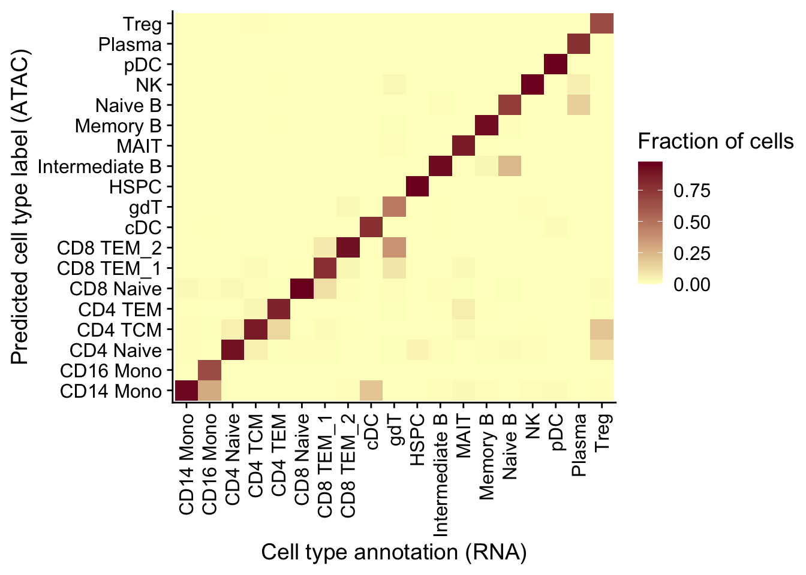

```r
p2 <- ggplot(data, aes(prediction.score.max, fill = annotation_correct, colour = annotation_correct)) +
  geom_density(alpha = 0.5) + theme_cowplot() + scale_fill_discrete(name = "Annotation Correct",
                                                                    labels = c(paste0("FALSE (n = ", incorrect, ")"), paste0("TRUE (n = ", correct, ")"))) + scale_color_discrete(name = "Annotation Correct",
                                                                                                                                                                                  labels = c(paste0("FALSE (n = ", incorrect, ")"), paste0("TRUE (n = ", correct, ")"))) + xlab("Prediction Score")

p2
```


In this example, the annotation for an scATAC-seq profile is correctly
predicted via scRNA-seq integration \~90% of the time. In addition, the
prediction.score.max field quantifies the uncertainty associated with
our predicted annotations. We can see that cells that are correctly
annotated are typically associated with high prediction scores (\>90%),
while cells that are incorrectly annotated are associated with sharply
lower prediction scores (<50%). Incorrect assignments also tend to
reflect closely related cell types (i.e. Intermediate vs. Naive B
cells).

<!--
## Glossary

A glossary at the end of the page is always helpful. This way you can refer to [terms](./template.md#glossary) throughout the lesson.

**Terms:** are written in bold in the glossary.
-->