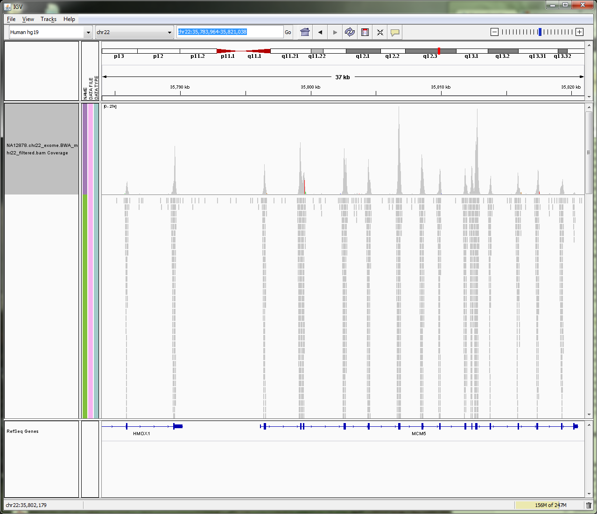

# Introduction to Variant detection

## Background

A variant is something that is different from a standard or type.

The aim of variation detection is to detect how many bases out of the total are different to a reference genome.

In Craig Venter’s genome 4.1 million DNA variants were reported.

What sort of variation could we find in the DNA sequencing?

- Single nucleotide variations (SNVs)
- Single nucleotide polymorphisms (SNPs)
- Small insertions and deletions (INDELs)
- Large Chromosome rearrangements-Structural variations (SV)
- Copy number variations (CNV)

### Variant Calling vs genotyping

Variant calling is concerned with whether there is evidence of variant in a particular locus whereas genotyping talks about what the sets of alleles in that locus are and their frequencies. In haploid organisms variant calling and genotyping are equivalent whereas the same rule does not apply to other organisms.

Variant callers estimate the probability of a particular genotype given the observed data.

The question one would be asking is what possible genotypes would be possible for a sample. The remaining question is, given that our variant calling process calls a variant, does that mean that there is truly a variant in this locus and also given that the variant caller doesn’t detect a variant in a position does that mean there is no variant in that position.

The result of variant calling is a list of probable variants.

### Process of variant calling

Sample DNA -> Sequencing -> Read alignment -> BAM file of aligned reads against reference genome -> Genotyper -> Variant list

The number of reads that stack up on each other is called *read coverage*. The data is converted into positional information of the reference with the read counts that have piled up under each position. Variant calling will look at how many bases out of the total number of bases is different to the reference at any position.

### Homozygous or Heterozygous mutations:

What should be noted about variants is that they are rare events and homozygous variants are even rarer than heterozygous events.

## Variant Calling Software:

There a number of software available for variant calling some of which are as follows:

1. SAMtools (mpileup and bcftools): Li 2009 Bioinformatics
2. GATK: McKenna et al. 2010 Genome Res
3. FreeBayes: MIT
4. DiBayes: SOLiD software http://www.lifetechnologies.com
5. InGAP: Qi J, Zhao F, Buboltz A, Schuster SC.. 2009. *Bioinformatics*
6. MAQGene: Bigelow H, Doitsidou M, Sarin S, Hobert O. 2009. *Nature Methods*

### Variant Calling using Samtools (Mpileup + bcftools)

Samtools calculates the genotype likelihoods. We then pipe the output to bcftools, which does our SNP calling based on those likelihoods.

Mpileup: Input: BAM file Output: Pileuped up reads under the reference

bcftools: Input: Pileup output from Mpileup Output: VCF file with sites and genotypes

[Further information](http://samtools.sourceforge.net/mpileup.shtml)

### Variant Calling using GATK-Unified Genotyper

GATK is a programming framework based on the philosophy of MapReduce for developing NGS tools in a distributed or shared memory parallelized form.

GATK unified genotyper uses a Bayesian probabilistic model to calculate genotype likelihoods.

Inputs: BAM file

Output: VCF file with sites and genotypes.

The probability of a variant genotype for a given sequence of data is calculated using the [Bayes Theorem](http://en.wikipedia.org/wiki/Bayes%27_theorem) as follows:

```
P(Genotype | Data) =  (P(Data | Genotype) * P(Genotype)) / P(Data)
```

P(Genotype) is the overall probability of that genotype being present in a sequence. This is called the prior probability of a Genotype.

P(Data | Genotype) is the probability of the data (the reads) given the genotype

P(Data) is the probability of seeing the reads.

GATK unified genotyper is not very good in dealing with INDELs and thus we would only calculate SNPs throughout this tutorial. GATK is setup to work with diploid genomes but can be used on haploids as well.

[Further information](http://www.broadinstitute.org/gatk/gatkdocs/org_broadinstitute_sting_gatk_walkers_genotyper_UnifiedGenotyper.html)

### Variant Calling using FreeBayes

FreeBayes is a high performance, flexible variant caller which uses the open source Freebayes tool to detect genetic variations based high throughput sequencing data (BAM files).

[Further information](http://bioinformatics.bc.edu/marthlab/FreeBayes)

### Evaluation of detected variants using Variant Eval

The identified variation can further be evaluated against known variations such as common dbSNPs. The result can be checked for high concordance to the common SNPs or a known set of SNPs, the truth set.

The results will have:

- True Positives (TP): The variants called by the software which are also a known variant in the known variants file.
- False Positives (FP): The Variants called by the software which are not known to be variants in the known variants file.
- True Negatives (TN): The variants not called by the software which are not known to be variants in the known variants file.
- False Negatives (FN): The variants not called by the software which are known as variants in the known variants file.

### Quality Matrix:

```
TP | FP
---|----
TN | FN
```

Sensitivity: TP/(TP+FN)

Specificity: TN/(TN+FP)

*Note:*

Although software methods available can find variants in unique regions reliably, the short NGS read length prevent them from detecting variations in repetitive regions with comparable sensitivity.

DNA substitution mutations are of two types: Transitions and Transversions. The Ti/Tv ratio (Transitions/Transversions) is also an indicator of how well the model has performed for genotyping.

- Transition: a point mutation in which a purine nucleotide is changed to another purine nucleotide. (A\<-\>G) or a pyrimidine nucleotide to another pyrimidine. Approximately 2 out of 3 SNPs are Transitions.

- Transversion: a substitute of a purine for a pyrimidine.

Although there are twice as many Transversions as there are Transitions because of the molecular mechanisms by which they are generated, Transition mutations occur at the higher rate than the Transversion mutations.

For more details on variant eval visit: [http://www.broadinstitute.org/gatk/gatkdocs/org\_broadinstitute\_sting\_gatk\_walkers\_varianteval\_VariantEval.html](http://www.broadinstitute.org/gatk/gatkdocs/org_broadinstitute_sting_gatk_walkers_varianteval_VariantEval.html)

**Notes:**

An important thing worth noting is the more data the better the variant calling. In addition multisampling improves performance.

### Local realignment

In order to call SNPs close by INDELs correctly, local realignment is strongly recommended before variant calling when using both UnifiedGenotyper and FreeBayes. Samtools mpileup output would not however be affected since it works around this by introducing Base Alignment Quality (BAC). For more information on BAC refer to: [http://samtools.sourceforge.net/mpileup.shtml](http://samtools.sourceforge.net/mpileup.shtml)

## The Galaxy workflow platform

Galaxy is an online bioinformatics workflow management system. Essentially, you upload your files, create various analysis pipelines and run them, then visualise your results.

Galaxy is really an interface to the various tools that do the data processing; each of these tools could be run from the command line, outside of Galaxy. Galaxy makes it easier to link up the tools together and visualise the entire analysis pipeline.

Galaxy uses the concept of 'histories'. Histories are sets of data and workflows that act on that data. The data for this workshop is available in a shared history, which you can import into your own Galaxy account

[Learn more about Galaxy here](http://wiki.g2.bx.psu.edu/)

**The Galaxy interface. Tools on the left, data in the middle, analysis workflow on the right.**


Data Format used in the tutorial
--------------------------------

#### **Sequence Alignment Map format**

**SAM format**

Sequence Alignment/Map format records all information relevant to how a set of reads aligns to a reference genome. A SAM file has an optional set of header lines describing the context of the alignment, then one line per read, with the following format:

- 11 mandatory fields (+ variable number of optional fields)
- 1 QNAME: Query name of the read
- 2 FLAG
- 3 RNAME: Reference sequence name
- 4 POS: Position of alignment in reference sequence
- 5 MAPQ: Mapping quality (Phred-scaled)
- 6 CIGAR: String that describes the specifics of the alignment against the reference
- 7 MRNM
- 8 MPOS
- 9 ISIZE
- 10 SEQQuery: Sequence on the same strand as the reference
- 11 QUAL: Query quality (ASCII-33=Phred base quality)

**SAM example**

```
    SRR017937.312 16 chr20 43108717 37 76M * 0 0
    TGAGCCTCCGGGCTATGTGTGCTCACTGACAGAAGACCTGGTCACCAAAGCCCGGGAAGAGCTGCAGGAAAAGCCG
    ?,@A=A\<5=,@==A:BB@=B9(.;A@B;\>@ABBB@@9BB@:@5\<BBBB9)\>BBB2\<BBB@BBB?;;BABBBBBBB@
```

For this example:

- **QNAME = SRR017937.312** - this is the name of this read
- **FLAG = 16** - see the format description below
- **RNAME = chr20** - this read aligns to chromosome 20
- **POS = 43108717** - this read aligns the sequence on chr20 at position 43108717
- **MAPQ = 37** - this is quite a high quality score for the alignment (b/w 0 and 90)
- **CIGAR = 76M** - this read aligns to the reference segment across all bases (76 Matches means no deletions or insertions. Note that 'aligns' can mean 'aligns with mismatches' - mismatches that don't affect the alignment are not recorded in this field)
- **MRNM = \*** - see the format description below
- **MPOS = 0** as there is no mate for this read - the sequenced DNA library was single ended, not mate paired\*.
- **ISIZE = 0** as there is no mate for this read
- **SEQQuery =** the 76bp sequence of the reference segment
- **QUAL =** per-base quality scores for each position on the alignment. This is just a copy of what is in the FASTQ file


**SAM** format is described more fully [*here*](http://samtools.sourceforge.net/SAM1.pdf)

NOTE: reads are shown mapped to the "sense" strand of the reference, and bases are listed in 5' -\> 3' order. This is important because an actual read might be from the other strand of DNA. The alignment tool will try to map the read as it is, and also the reverse compliment. If it was on the other strand then the reverse compliment is shown in the SAM file, rather than the original read itself

See[http://www.illumina.com/technology/paired\_end\_sequencing\_assay.ilmn](http://www.illumina.com/technology/paired_end_sequencing_assay.ilmn) for an overview of paired-end sequencing.

**SAM file in Galaxy**


#### Binary Sequence Alignment Map format

**BAM format**

SAM is a text format which is not space efficient. Binary Sequence Alignment is a compressed version of SAM.

Data in a BAM file is binary and therefore can't be visualised as text. If you try and visualise in Galaxy, it will default to downloading the file

**BAM file in IGV**



#### VCF file format

**What is VCF file:**

The [*Variant Call Format*](http://vcftools.sourceforge.net/specs.html) (VCF) is the emerging standard for storing variant data. Originally designed for SNPs and short INDELs, it also works for structural variations.

VCF consists of a header section and a data section. The header must contain a line starting with one '\#', showing the name of each field, and then the sample names starting at the 10th column. The data section is TAB delimited with each line consisting of at least 8 mandatory fields (the first 8 fields in the table below). The FORMAT field and sample information are allowed to be absent. We refer to the official [*VCF spec*](http://vcftools.sourceforge.net/specs.html) for a more rigorous description of the format.

Col      | Field     | Description
---------|-----------|-------------------------------------------------------------------------------------
1        |CHROM      |Chromosome name
2        |POS        |1-based position. For an indel, this is the position preceding the indel.
3        |ID         |Variant identifier. Usually the dbSNP rsID.
4        |REF        |Reference sequence at POS involved in the variant. For a SNP, it is a single base.
5        |ALT        |Comma delimited list of alternative sequence(s).
6        |QUAL       |Phred-scaled probability of all samples being homozygous reference.
7        |FILTER     |Semicolon delimited list of filters that the variant fails to pass.
8        |INFO       |Semicolon delimited list of variant information.
9        |FORMAT     |Colon delimited list of the format of individual genotypes in the following fields.
10+      |Sample(s)  |Individual genotype information defined by FORMAT.


#### VCF format in Galaxy:


#### Bcf file format:

###

**BCF format:**

BCF, or the binary variant call format, is the binary version of VCF. It keeps the same information in VCF, while much more efficient to process especially for many samples. The relationship between BCF and VCF is similar to that between BAM and SAM.
