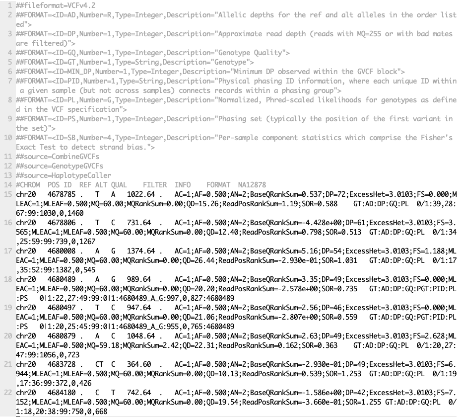

summarise{: style="width:350px; padding-right:50px"}       {: style="width:150px"}

<!---
//{: style="width:350px; padding-right:50px"}       {: style="width:150px"}
-->

# Variant calling using GATK4

<!-- <mark>This workshop is under development and testing and may contain bugs.</mark> -->
{​==**This workshop is under development and testing and may contain bugs.**==}

Anticipated workshop duration when delivered to a group of participants is **4 hours**.

For queries relating to this workshop, contact Melbourne Bioinformatics (bioinformatics-training@unimelb.edu.au).

Written by: Khalid Mahmood (Melbourne Bioinformatics)
Developed: July 2021
Reviewed: August 2021

## Overview

### Topic

* [x] Genomics
* [ ] Transcriptomics
* [ ] Proteomics
* [ ] Metabolomics
* [ ] Statistics and visualisation
* [ ] Structural Modelling
* [ ] Basic skills


### Skill level

* [ ] Beginner  
* [x] Intermediate  
* [ ] Advanced  

<br>
This workshop is designed for participants with some command-line knowledge. You will need to be able to `ssh` into a remote machine, navigate the directory structure and `scp` files from a remote computer to your local computer.

### Description

This tutorial runs through the GATK4 best practices workflow for variant calling. The workflow starts and a pair of sequencing reads and performs a series of steps to determine a set to genetic variants.

**Data:** Illumina HiSeq paired-end (2 × 100 bp) reads (FASTQ).

**Tools:** GATK4, picard, bcftools, jigv

**Reference data:** GATK4 hg38 reference bundle and hg38 refGene annotation (hg38.refGene.gtf.gz)

**Pipeline:**  

*Section 1:* Map raw mapped reads to reference genome
*Section 2:* Prepare analysis ready reads
*Section 3:* Variant calling
*Section 4:* Filter and prepare analysis ready variants
*Section 5:* Exporting variant data and visualisation


-------------------------------

## Learning Objectives

At the end of this workshop, you will be able to:

* Take raw reads from a sequencing facility and perform variant calling to produce a variant list using GATK4.
* Perform basic exploration of variants.

-------------------------------

## Requirements and preparation

!!! attention "Important"
    **Attendees are required to use their own laptop computers.**  

    At least one week before the workshop, if required, participants should install the software below.  This should provide sufficient time for participants to liaise with their own IT support should they encounter any IT problems.  


----------------------------

### Required Software

**Mac Users:** No additional software needs to be installed for this workshop.

**Windows Users:**  
1. A terminal emulator such as [PuTTY](https://www.chiark.greenend.org.uk/~sgtatham/putty/latest.html)(free and open-source) will need to be downloaded.  
2. Software for file transfers between a local computer and remote server such as [WinSCP](https://winscp.net/eng/index.php) or [FileZilla](https://filezilla-project.org/).


--------------------------------
### Required Data

* All required data will be made available on the workshop virtual machines (hosted at the Melbourne Research Cloud). Login details will be provided closer to the tutorial data.

<!-- * If you wish to analyse the data independently at a later stage, it can be downloaded from [here](https://github.com/melbournebioinformatics/MelBioInf_docs/blob/29266406cb16cf376ef5f3d48e9bf8ac3578f1b0/docs/tutorials/qiime2/raw_data.zip). This zipped folder contains both the FASTQs and associated metadata file.     -->


--------------------------------
### Mode of Delivery

This workshop will be run on a [Nectar](https://cloud.nectar.org.au/) Instance. An “Instance” is Nectar terminology for a virtual machine running on the Nectar Cloud OpenStack infrastructure. An “Instance” runs on a “compute node”; i.e. a physical computer populated with processor chips, memory chips and so on.

You will be given an individual username, IP address and password to log on to using the SSH client tool on your computer (Terminal on Mac or PuTTY on Windows).

```bash
ssh username@ip-address
```

<!-- <br>
Should you wish to do this tutorial at a later stage independently, it is possible to apply for your own instance directly through a [Nectar allocation](https://support.ehelp.edu.au/support/solutions/articles/6000068044-managing-an-allocation). There are also many helpful [Nectar Research Cloud tutorials](https://tutorials.rc.nectar.org.au/). -->


-------------------------------

## Tutorial setting

The setting for this tutorial is as follows: you receive some germline sequencing data from an individual [NA12878](https://www.internationalgenome.org/data-portal/sample/NA12878) (chr20 from sample NA12878 is sourced from the International Genome Sample Resource). Your aim is to identify small genetic variants from this data.

### The Genome Analysis Toolkit (GATK)

GATK is the industry standard toolkit for analysis of germline DNA to identify SNVs and indels. The GATK tool is mainly designed fo the human whole genome and exome analysis. The current version (GATK4) has expanded scope now and includes more complex analysis such copy number (CNV), structural variant (SV) and somatic variants. The current version of GATK also includes several utility functions for processing alignment files, VCF files and other complex processing workflows. The Picard toolkit is also now incorporated with GATK4.

Van der Auwera GA & O'Connor BD. (2020). Genomics in the Cloud: Using Docker, GATK, and WDL in Terra (1st Edition). O'Reilly Media.


**Mac Users**

The syntax to do this depends on whether you are running the copying command on your local computer, or on the remote computer (Nectar cloud).

1. When running the command from your local computer, the syntax for copying a file *from* Nectar is:

    ```bash
    scp username@nectar_IP_address:FILENAME /PATH/TO/TARGET/FOLDER/
    ```

2. Running the command on the remote computer, the syntax for copying a file *to* your local computer is:
    ```bash
    scp FILENAME username@your_IP_address:/PATH/TO/TARGET/FOLDER/
    ```


**Windows Users**

Using WinSCP or FileZilla

1. Host: The IP address of the Nectar instance

2. Username:

3. Port:

### How this tutorial works

```
These grey coloured boxes are code blocks. The rectangular boxes in the top
right hand corner of this code block/grey box can be used to copy the code to
the clipboard.
```

??? example "**Click here** "
    REVEALED!
    Coloured boxes like these when clicked will reveal their content.


------------------------------

## Section 1: Map raw mapped reads to reference genome

### Preparation and data import
Lets start by setting up the directory structure for this analysis.
The `#!bash data` directory is where the raw sequencing reads will be. All output files will be directed to the `#!bash output` directory. All reference files will be pointed to the `#!bash reference` directory. The command-line scripts are stored in simple bash script format in the `#!bash scripts` directory. For those interested, equivalent slurm scripts to run on Spartan are available in the `#!bash slurm_scripts` directory. Although all tools are installed on the server, we will create a `#!bash tools` directory.    

Create the directories as follows:

```Bash
cd
mkdir -p data
mkdir -p output
mkdir -p reference
mkdir -p reference/hg38
mkdir -p scripts
mkdir -p slurm_scripts
mkdir -p temp
mkdir -p tools
```

!!! note
    All analysis is being carried out in the home directory (the directory you log in to).

The data for this tutorial is sourced from the [International Genome Sample Resources](https://www.internationalgenome.org/data-portal/sample/NA12878). Raw sequencing reads from chromosome 20 are used in this tutorial. We have prepared the files which can be copied as follows:

```Bash
cp -p /mnt/shared_data/NA12878.chr20.region_1.fastq.gz data/.
cp -p /mnt/shared_data/NA12878.chr20.region_2.fastq.gz data/.
```

!!! note
    To perform quality control checks on the raw fastq data use the tool [FastQC](https://www.bioinformatics.babraham.ac.uk/projects/fastqc/). Another useful QC tool output aggregator is the [MultiQC](https://multiqc.info/) tool. MultiQC aggregates the output from several tools and outputs a single QC report for all samples. We will have a look at some of the QC data later in this section.

Next, we need to prepare the reference data. Luckily, we have downloaded the data and all we need to do is to create a [symbolic link](https://kb.iu.edu/d/abbe) to the data folder as follows:

```Bash
ln -s /mnt/shared_data/* reference/hg38/.
```

There are several files in the reference directory. **insert some description of the reference data here**

<!-- INSERT DESCRIPTION OF THE REFERENCE DATA _ BWA INDEX -->

### Align genome
Run the command below to map the raw sequencing data to the Homo sapiens (human) genome assembly GRCh38 (hg38). We are using the [BWA-MEM](https://github.com/lh3/bwa) algorithms for mapping DNA sequences against large reference genomes. Note that we have already run the created the BWA index files by running the command `#!bash bwa index reference/hg38/Homo_sapiens_assembly38.fasta`.

Run BWA as follows, but first navigate to the scripts folder:

```bash

bwa mem -M -t 2 \
-R "@RG\tID:SRR622461.7\tSM:NA12878\tLB:ERR194147\tPL:ILLUMINA" \
reference/hg38/Homo_sapiens_assembly38.fasta \
data/NA12878.chr20.region_1.fastq.gz \
data/NA12878.chr20.region_2.fastq.gz | \
samtools view -b -h -o output/NA12878.bam -

```

There are two parts to the command here. The first part uses BWA to perform the alignment and the second part take the output from BWA and uses Samtools to convert the output to the BAM format.

At the end of this step you should have a file called `#!bash NA12878.bam` in the `#!bash output` directory.

------------
## Section 2: Prepare analysis ready reads

### Sort SAM/BAM
The alignment file `#!bash NA12878.bam` is not sorted. Before proceeding, we should sort the BAM file using the [Picard](https://broadinstitute.github.io/picard/) tools.

```bash

picard -Xmx7g SortSam \
    I=output/NA12878.bam \
    O=output/NA12878.sort.bam \
    VALIDATION_STRINGENCY=LENIENT \
    SORT_ORDER=coordinate \
    MAX_RECORDS_IN_RAM=3000000 \
    CREATE_INDEX=True    
```

The above command will create a coordinate sorted BAM file and an index (`#!bash .bai`) file.

!!! Alignment statistics
    Given we now have a sorted BAM file, we can now generate some useful statistics. To do so we can use the `#!bash samtools flagstat` command. More details are available [here](http://www.htslib.org/doc/samtools-flagstat.html).

```bash
# lets go to the home directory
cd

samtools flagstat output/NA12878.sort.bam

```

```bash
# output

2032568 + 0 in total (QC-passed reads + QC-failed reads)
2030516 + 0 primary
2052 + 0 secondary
0 + 0 supplementary
0 + 0 duplicates
0 + 0 primary duplicates
2032563 + 0 mapped (100.00% : N/A)
2030511 + 0 primary mapped (100.00% : N/A)
2030516 + 0 paired in sequencing
1015258 + 0 read1
1015258 + 0 read2
2030298 + 0 properly paired (99.99% : N/A)
2030510 + 0 with itself and mate mapped
1 + 0 singletons (0.00% : N/A)
182 + 0 with mate mapped to a different chr
124 + 0 with mate mapped to a different chr (mapQ>=5)
```


### Mark duplicate reads
The aim of this step is to locate and tag duplicate reads in the BAM file. Duplicate reads can arise due to several reasons, for more details go to [MarkDuplicates](https://gatk.broadinstitute.org/hc/en-us/articles/360037052812-MarkDuplicates-Picard-).

```bash
picard -Xmx7g MarkDuplicates \
    I=output/NA12878.sort.bam \
    O=output/NA12878.sort.dup.bam \
    METRICS_FILE=output/marked_dup_metrics.txt
```

!!! question "Question: How many duplicate reads are in the duplicate marked BAM file?"

    ??? answer
        ```bash
        samtools flagstat output/NA12878.sort.dup.bam

        2032568 + 0 in total (QC-passed reads + QC-failed reads)
        2030516 + 0 primary
        2052 + 0 secondary
        0 + 0 supplementary
        7207 + 0 duplicates
        7207 + 0 primary duplicates
        2032563 + 0 mapped (100.00% : N/A)
        2030511 + 0 primary mapped (100.00% : N/A)
        2030516 + 0 paired in sequencing
        1015258 + 0 read1
        1015258 + 0 read2
        2030298 + 0 properly paired (99.99% : N/A)
        2030510 + 0 with itself and mate mapped
        1 + 0 singletons (0.00% : N/A)
        182 + 0 with mate mapped to a different chr
        124 + 0 with mate mapped to a different chr (mapQ>=5)
        ```
        Looks like there are **7207** duplicate reads.


###  Base quality recalibration
The last step of pre-processing mapped reads is the base quality score recalibration (BQSR) stage. The GATK tools detects systematic errors made by the sequencing machine while estimating the accuracy of each base. The systematic errors can be have various sources ranging from technical machine errors to the variability in the sequencing chemical reactions. The two step BQSR process applies machine learning to model the possible errors and adjust the base quality scores accordingly. More details [here](https://gatk.broadinstitute.org/hc/en-us/articles/360035890531-Base-Quality-Score-Recalibration-BQSR-).

```bash
# lets go to the home directory again
cd

# step 1  - Build the model
gatk --java-options "-Xmx7g" BaseRecalibrator \
    -I output/NA12878.sort.dup.bam \
    -R reference/hg38/Homo_sapiens_assembly38.fasta \
    --known-sites reference/hg38/dbsnp_146.hg38.vcf.gz \
    -O output/recal_data.table
```

```bash
# step 2: Apply the model to adjust the base quality scores
gatk --java-options "-Xmx7g" ApplyBQSR \
    -I output/NA12878.sort.dup.bam \
    -R reference/hg38/Homo_sapiens_assembly38.fasta \
    --bqsr-recal-file output/recal_data.table \
    -O output/NA12878.sort.dup.bqsr.bam
```

!!! note
    In a workflow such as this it is a good practice to given output files an appropriate name. In this case, we are append the workflow step metadata to the filenames.

We now have a pre-processed BAM file (`#!bash NA12878.sort.dup.bqsr.bam`) ready for variant calling.

But before we proceed, let's take a detour and run some summary statistics of the alignment data and QC.

??? example "**BAM statistics and QC** "
    The commands below uses FastQC and Picard to generate QC metrics followed by multiQC tools then aggregating the data to produce an HTML report.    

    ```bash
    # FastQC
    fastqc data/NA12878.chr20.region_1.fastq.gz data/NA12878.chr20.region_2.fastq.gz -o output/

    # CollectInsertSizeMetrics
    picard CollectMultipleMetrics R=reference/hg38/Homo_sapiens_assembly38.fasta I=output/NA12878.sort.dup.bqsr.bam O=output/NA12878.sort.dup.bqsr.CollectMultipleMetrics

    # MultiQC
    multiqc output/. -o output/.    
    ```
    View the MultiQC report [here](files/multiqc_report.html){:target="_blank"}.

------------
## Section 3: Variant calling
The next step in the GATK best practices workflow is to proceed with the variant calling.

There are a couple of workflows to call variants using GATK4. Here we will follow the Genomic Variant Call Format (GVCF) workflow which is more suited for scalable variant calling i.e. allows incremental addition of samples for joint genotyping.


### Apply HaplotypeCaller
HaplotypeCaller is the focal tool within GATK4 to simultaneously call germline SNVs and small Indels using local de-novo assembly of haplotype regions.

!!! Algorithm
    Briefly, the HaplotypeCaller works by:
    1. Identify active regions or regions with evidence of variations.
    2. Re-asssemble the active regions.
    3. Re-align active region reads to the assembled regions to identify allele.
    More details about the HaplotypeCaller can be found [here](https://gatk.broadinstitute.org/hc/en-us/articles/360037225632-HaplotypeCaller).


```bash
gatk --java-options "-Xmx7g" HaplotypeCaller \
    -I output/NA12878.sort.dup.bqsr.bam \
    -R reference/hg38/Homo_sapiens_assembly38.fasta \
    -ERC GVCF \
    -L chr20 \
    -O output/NA12878.g.vcf.gz
```
The output of this step is a GVCF file. The format for the GVCF file is similar to a VCF file. The key difference is that the GVCF file contains records for each sequenced genomic coordinate. The `#!bash --emit-ref-confidence` or `#!bash -ERC` parameter let you select a method to summarise confidence in the genomic site being homozygous-reference. The option `#!bash -ERC GVCF` is more efficient and recommended for large samples and therefore more scalable.


### Apply CombineGVCFs
The CombineGVCFs tool is applied to combine per-sample GVCF files. In this case there is a single GVCF file, but in the case of multiple samples in a study (many GVCF files), this tool can be applied to merge these in to a single multi-sample GVCF file.

```bash
gatk --java-options "-Xmx7g" CombineGVCFs \
    -R reference/hg38/Homo_sapiens_assembly38.fasta \
    -V output/NA12878.g.vcf.gz \
    -L chr20 \
    -O output/cohort.g.vcf.gz
```

Now that we have a merged GVCF file, we are ready to perform genotyping.


### Apply GenotypeGVCFs
GenotypeGVCFs

```bash
gatk --java-options "-Xmx7g" GenotypeGVCFs \
    -R reference/hg38/Homo_sapiens_assembly38.fasta \
    -V output/cohort.g.vcf.gz \
    -L chr20 \
    -O output/output.vcf.gz
```

??? Information
    An alternative to CombineGVCFs is [GenomicsDBImport](https://gatk.broadinstitute.org/hc/en-us/articles/360057439331-GenomicsDBImport), which is more efficient for sample numbers and stores the content in a a GenomicsDB data store. Therefore, CombineGVCFs could be slow and inefficient for more than a few samples. A possible work around is to split up the tasks per interval regions such as chromosomes.


??? example "Visualisations: VCF file"
    Screenshot from output.vcf.gz
    


---------------------------------------
## Section 4: Filter and prepare analysis ready variants

The raw VCF file from the previous step (`#!bash output.vcf.gz`) contains 1895 variants. Not all of these are real or there is insufficient evidence. Therefore, the aim here is to filter likely artifactual variants. Here we will go through the Convolutional Neural Net based protocol to annotate and filter the VCF file.

!!! CountVariants
    There are number of ways to count the variants in a VCF file. A very straigt forward way using the GATK4 tools is as follows:
    ```bash
    gatk CountVariants -V output/output.vcf.gz
    ```

    ```
    Tool returned:
    7520
    ```

This is a two step process:

(i) CNNScoreVariants will annotate the variant with pre-computed single-sample derived model scores in the INFO field CNN_1D (the neural network performs convolutions over the reference sequence surrounding the variant and combines those features with a multilayer perceptron on the variant annotations).

```bash
gatk --java-options "-Xmx7g" CNNScoreVariants  \
   -R reference/hg38/Homo_sapiens_assembly38.fasta \
   -V output/output.vcf.gz \
   -O output/output.cnns.vcf
```

(ii) FilterVariantTranches takes as input the percent sensitivities (0-100) to known sites to apply the filter. Variants with scores higher than for e.g. 99th percentile of variants in the resources pass through the filter and will have `PASS` in the filter. Others will have a filter values like 'CNN_1D_INDEL_Tranche_99.40_100.00' or 'CNN_1D_SNP_Tranche_99.95_100.00'.

```bash
gatk --java-options "-Xmx7g" FilterVariantTranches \
    -V output/output.cnns.vcf \
    --resource reference/hg38/hapmap_3.3.hg38.vcf.gz \
    --resource reference/hg38/Mills_and_1000G_gold_standard.indels.hg38.vcf.gz \
    --info-key CNN_1D \
    --snp-tranche 99.95 \
    --indel-tranche 99.4 \
    -O output/output.cnns.cnnfilter.vcf
```

!!! Hint
    BCFtools is a useful tool to manipulate, filter and query VCF files. More details from [BCFtools](https://samtools.github.io/bcftools/). BCFtools can be combined with linux command line tools as well to summarise data. For example, the command below can used extract and print the 'FILTER' column from the VCF file.

    ```bash
        bcftools query -f'%FILTER\n' output/output.cnns.cnnfilter.vcf
    ```

### Additional filtering
The VariantFiltration tools is designed for hard-filtering variant calls based on custom quality criteria such as sequencing depth, mapping quality etc. The two parameters are the filter-name and filter-expression. The parameter filter-name is the name of the filter to be used in the FILTER column if the expression in filter-expression is true. In the example below, if the sequencing depth at the variant site (VCF field DP) is less than 10, the FILTER field will be populated with the value 'Low_depth10'. Users can add multiple filter expression/name combinations.

```bash
gatk --java-options "-Xmx7g" VariantFiltration \
-R reference/hg38/Homo_sapiens_assembly38.fasta \
-V output/output.cnns.cnnfilter.vcf \
-O output/output.cnns.cnnfilter.varfilter.vcf \
--filter-name "Low_depth10" \
--filter-expression "DP < 10"
```

!!! question "Question: How many variants have a low sequencing depth (DP<10) in the file output.cnns.cnnfilter.varfilter.vcf."

    ??? answer
        ```bash
            bcftools query -f'%FILTER\n' output/output.cnns.cnnfilter.varfilter.vcf | sort | uniq -c
        ```

        ```
            76 CNN_1D_INDEL_Tranche_99.40_100.00
            4 CNN_1D_INDEL_Tranche_99.40_100.00;Low_depth10
            132 CNN_1D_SNP_Tranche_99.95_100.00
            3 CNN_1D_SNP_Tranche_99.95_100.00;Low_depth10
            51 Low_depth10
            7254 PASS
        ```

------------------------------------------
## Section 5: Exporting variant data and visualisation
VCF files, although in tabular format, are not user friendly. We will go through a couple of ways to share share and visualise variant data. This is important for downstream analysis as well as sharing data. First, we will convert the VCF file in to a TSV file (ready for Excel for example) in a manner where we extract data fields of interest.

### VariantsToTable
This GATK4 tool extracts fields of interest from each record in a VCF file. [VariantsToTable](https://gatk.broadinstitute.org/hc/en-us/articles/360056968292-VariantsToTable) can extract field from both the INFO and FORMAT columns in the VCF file.

!!! note
    VariantsToTable, by default, only extracts PASS or . (no filtering applied) variants. Use the `#!bash --show-filtered` parameter to show all variants.

```bash
    gatk VariantsToTable
    -R reference/hg38/Homo_sapiens_assembly38.fasta \
    -V output/output.cnns.cnnfilter.varfilter.vcf \
    -F CHROM -F POS -F FILTER -F TYPE -GF AD -GF DP \
    --show-filtered \
    -O output/output.cnns.cnnfilter.varfilter.tsv
```

### HTML report
Generate HTML report from the VCF file. Copy across the VCF to you local computer using the `#!bash scp` command. This is useful way to visualise variant for review or sharing with colleagues and collaborators.


Link to the variant [HTML](files/NA12878.html){:target="_blank"} report.

TODO...

Concluding remarks.
